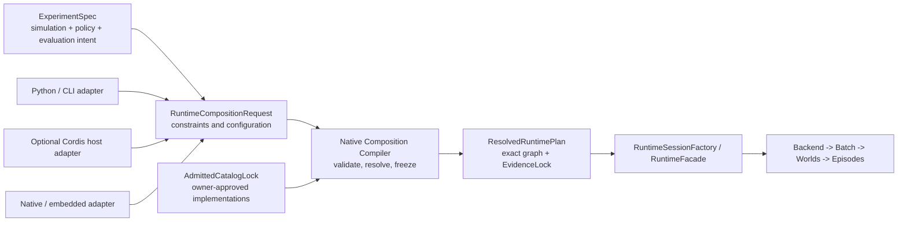

# Cordis Simulation Composition Program Architecture Review — 2026-08-17

Language:

- English canonical: `cordis_simulation_composition_program_review_20260817.md`
- Chinese companion:
  [cordis_simulation_composition_program_review_20260817.zh.md](cordis_simulation_composition_program_review_20260817.zh.md)

Document kind: `review`
Lifecycle: `maintained`
Canonical: `docs/architecture/reviews/cordis_simulation_composition_program_review_20260817.md`
Owner: `architecture/reviews`
Last verified: `2026-08-17`
Review basis: `b9f289c81fd4` on
`codex/cordis-simulation-composition-kernel`, verified on `2026-08-17`
Reviewer role: architecture plan reviewer; no authorship of the inspected implementation
Decision state: `advisory; architecture revision required before disputed downstream phases`
Authority: independent architecture review snapshot; it does not amend the
current standard, authorize implementation, or replace the active-work package.

## 1. Executive Verdict

The program contains a necessary architecture investment: a native composition
kernel that validates a host-neutral request, constructs admitted providers,
owns resource lifetime, freezes an executable runtime plan, and records
composition identity. The completed P1 and P2-A work is useful foundation and
should not be discarded.

The program is not architecturally ready to remain one mandatory P0-P9 closure
path in its current form. It combines three separable concerns:

1. native runtime composition and ownership;
2. executable system/profile composition;
3. an optional Cordis/Node host and external plugin ecosystem.

The main architecture defect is not an implementation detail. The plan assigns
Cordis the long-term composition-control-plane role while the maintained
simulation architecture assigns experiment-level composition authority to the
Experiment Face. Without an explicit projection boundary, the repository gains
two plausible owners of composition intent.

The recommended decision is therefore:

| Surface | Review decision |
| --- | --- |
| Native composition kernel | retain and continue |
| Host-neutral deterministic contract | retain |
| P2-B bounded default-provider migration | may continue if it does not freeze the disputed Cordis or universal-plugin authority |
| Cordis as the mandatory long-term control plane | not accepted on the evidence inspected |
| One universal plugin plane for models, systems, backends, diagnostics, hosts, and external code | revise into typed owner-specific admission categories |
| P0-P9 as one closure dependency chain | split into independently closable programs |
| P7 Cordis and P8 Node ecosystem | hold behind an explicit go/no-go decision |

This is a request to revise the program boundary, not a rejection of the native
implementation already underway.

## 2. Scope And Independence

This review evaluates the active plan's overall architecture, authority model,
program shape, and closure logic. Existing implementation was inspected only to
understand which decisions are already materialized and to avoid reporting
completed or repaired implementation details as plan defects.

The implementation and documents changed while the review was in progress.
The final review was reconciled to clean worktree revision `b9f289c81fd4`. The
review does not reopen the detailed lifecycle findings already repaired and
recorded by the active package.

The review did not:

- approve or reject individual C++ changes;
- run a performance, security, or third-party plugin audit;
- validate a production Cordis/Node use case;
- redefine stage semantics, domain maturity, backend parity, or experiment
  policy owned by maintained standards.

## 3. Evidence Inspected

Primary architecture and work surfaces:

- [Simulation system architecture design](../standards/simulation_system_architecture_design.md),
  especially the Experiment Face, target layering, architecture laws, and
  capability-composition direction;
- [Cordis simulation composition kernel](../work/archive/cordis_simulation_composition_kernel/README.md);
- [Cordis simulation composition architecture](../work/archive/cordis_simulation_composition_kernel/cordis_simulation_composition_kernel_architecture.md);
- [P1-B composition contract](../work/archive/cordis_simulation_composition_kernel/cordis_simulation_composition_contract_20260817.md);
- [System modularization issue](../work/issues/modularization_plan.md);
- [Runtime facade contract plan](../work/issues/runtime_facade_contract_plan.md);
- [Runtime workflow and contract baseline](../standards/runtime_workflow_and_contract_baseline.md);
- [Document lifecycle policy](../../engineering/documentation/standards/document_lifecycle_policy.md).

Implementation context:

- the active package reports P1-A, P1-B, and P2-A passed, with P2-B as the next
  bounded migration;
- `ef_composition` exists as an isolated native contract/lifecycle foundation;
- no maintained Cordis, Node-API, or Node package surface exists at the
  reviewed revision;
- the default compatibility fixture currently freezes 82 component
  contributions and 34 system contributions, including explicit compatibility
  gaps that P3 must resolve.

External technical references were used only to understand the proposed host
model, not as repository authority:

- [Cordis repository](https://github.com/cordiverse/cordis);
- [Cordis primer](https://deepseek-harness.github.io/deepseek-harness/reference/cordis-primer).

## 4. Architectural Context

The active work addresses a real missing layer. Today, composition choices are
spread across engine construction, default model creation, system registration,
backend setup, facade paths, and bindings. A native composition owner can
remove unsafe replacement paths, make lifetime explicit, and generate stable
evidence.

That layer should be understood as a compiler and realization boundary:

- upstream owners express experiment or runtime intent;
- repository owners admit implementations and capabilities;
- native composition resolves the exact executable plan;
- runtime owners execute that frozen plan;
- adapters expose the same request/result contract without becoming hidden
  simulation owners.

This interpretation is compatible with the maintained architecture. Treating a
particular host framework as the architecture's top-level control plane is not.

## 5. Findings

### F-01 — Composition authority is ambiguous

Severity: `high`

The maintained architecture says that the Experiment Face owns composition
across simulation, policy, and evaluation dimensions. The active plan says
Cordis owns declarative plugin composition and is the long-term composition
control plane.

These statements can coexist only if the boundary is explicit:

- the Experiment Face owns user-visible experiment intent;
- a runtime projection converts that intent into a typed composition request;
- the native composition compiler owns deterministic resolution and
  realization;
- Cordis, Python, CLI, or another host may produce the same request but cannot
  supersede experiment or native admission authority.

Without this split, configuration, replay identity, compatibility behavior, and
future policy composition can acquire competing sources of truth.

### F-02 — Cordis is positioned as an architecture prerequisite before its unique value is established

Severity: `high`

The reviewed repository has no maintained Cordis/Node runtime surface, and the
active package correctly describes that integration as a new cross-runtime
boundary. The plan nevertheless makes Cordis the named long-term control plane
and includes it in the mandatory path to program closure.

The inspected evidence establishes that a host-neutral request producer is
useful. It does not establish that the repository specifically requires Cordis,
or that Cordis should outrank Python, CLI, native profiles, or a future service
adapter in the architecture.

Cordis should therefore remain an optional host-side adapter until a decision
record demonstrates:

- concrete use cases that cannot be met economically by existing adapters;
- unique benefits of Cordis's context/service/plugin model;
- acceptable offline, provenance, security, packaging, and maintenance costs;
- no new authority or hot-path dependency.

### F-03 — One work package conflates three architecture programs

Severity: `high`

Native provider lifetime, system graph modularization, backend/profile
selection, evidence, Cordis dependency resolution, Node hosting, and external
plugin distribution do not share one natural owner, risk class, or closure
condition.

Making P9 depend on all P1-P8 evidence means a useful native composition
refactor cannot close unless an optional host ecosystem also succeeds. It also
means host-framework uncertainty can keep core runtime ownership work
permanently active.

The plan should be split into independently authorized and independently
closable programs. Section 7 defines the proposed boundaries.

### F-04 — The universal plugin plane obscures owner-specific admission

Severity: `high`

The manifest spans model providers, services, components, systems, stages,
backends, diagnostics, evidence, hosts, compatibility, and future external
artifacts. A common envelope and identity format are useful, but a common
envelope does not make all contribution types one safe extension category.

These categories require different admission:

| Extension category | Required authority |
| --- | --- |
| Model provider | model interface and semantic contract owner |
| Backend profile | backend capability, parity, and performance owner |
| System package | stage, packet, read/write, clock, domain, and graph owners |
| Diagnostics extension | information-boundary and evidence owner |
| Host adapter | facade/binding owner; no simulation-state authority |
| External native artifact | separate ABI, provenance, authenticity, deployment, and support policy |

The native kernel may share lifecycle mechanics across these categories, but it
should not become a God registry that grants semantic admission by itself.

### F-05 — System modularization should compile admitted packages, not create arbitrary runtime system plugins

Severity: `high`

Removing the central all-domain registration list is a reasonable target. The
replacement should preserve the maintained rule that the engine owns world
lifecycle and composition while stage and domain owners govern behavior.

The safe target is:

`capability/profile request -> repository-admitted system packages -> native graph compiler -> frozen stage graph`

System contributions should be admitted before execution and should declare
stage joins, packet contracts, read/write sets, clocks, barriers, capabilities,
and conflicts. They must not become an open mechanism for private pipelines,
direct `ecs.progress()` calls, or discovery-order scheduling.

The current 82-component/34-system fixture is valuable parity evidence. It
should remain a compatibility lock and resolved-plan fixture, not become the
primary long-term authoring interface.

### F-06 — Domain profiles risk replacing the capability-composition target

Severity: `medium-high`

The active architecture names air, naval, ground, and combined-domain profiles.
Those profiles are useful migration fixtures and acceptance cases, but the
maintained architecture aims to converge platform definitions toward typed
capability composition.

Long-term authoring should select required capabilities and policies. Domain
labels may lower into admitted capability bundles, but they should not become
the permanent ontology that determines which systems and models can compose.
Otherwise the new composition layer will preserve the current domain taxonomy
as a new global switchboard.

### F-07 — Requested and resolved artifacts are separated, but catalog authority remains under-modeled

Severity: `medium`

P1-B correctly separates the requested manifest from the resolved envelope.
However, the requested manifest already carries exact plugins, providers,
bindings, component contributions, system contributions, and implementation
identity. It is therefore close to a low-level plan rather than a minimal
authoring request.

The durable conceptual model should distinguish:

1. `CompositionRequest` — user or experiment intent, constraints, requested
   capabilities, policies, and configuration;
2. `AdmittedCatalogLock` — repository-approved implementations, versions,
   capabilities, provenance, and trust decisions;
3. `ResolvedRuntimePlan` — exact providers, bindings, system order, stage
   graph, scope generations, and hashes.

The existing requested manifest may remain a valid low-level API and
compatibility artifact. It should not be the only abstraction exposed to future
experiment authors.

### F-08 — Ownership containment, dependency ordering, and evidence timing must remain distinct

Severity: `medium`

The `Application -> Backend -> Batch -> World -> Episode` hierarchy is useful
for ownership containment and rebuild policy. It is not the complete dependency
topology. Disposal and rollback must continue to follow the realized resource
DAG inside each scope rather than infer order from the scope tree alone.

The architecture also states that evidence is required by construction. Phase
sequencing must preserve that rule: the first production provider migrated in
P2-B should emit composition identity and resolved-plan evidence. Evidence
cannot be deferred to a late phase and then retrofitted after multiple
production paths exist.

## 6. Recommended Authority Flow

The authority split should be:

| Concern | Owner |
| --- | --- |
| Experiment intent | Experiment Face |
| Adapter syntax and transport | Python, CLI, Cordis, native, or future service adapter |
| Implementation admission | applicable model, system, backend, domain, evidence, and security owners |
| Deterministic resolution and resource realization | native composition compiler/root |
| Public runtime session API | RuntimeFacade/session factory |
| World lifecycle and executable semantics | engine, batch runtime, episode controller, scheduler, and backend owners |

## 7. Recommended Program Restructuring

### Program A — Native Runtime Composition

Purpose:

- realize admitted native providers;
- own transactional lifecycle, handles, rollback, replacement, and disposal;
- select admitted backend profiles;
- preserve default behavior and offline C++/Python operation;
- emit composition and replay identity from the first production migration.

Independent closure:

- default model/service/backend construction flows through the native owner;
- unsafe parallel construction and setter paths are retired or explicitly
  retained as compatibility routes;
- default behavior, lifecycle failure, replay identity, and performance gates
  pass;
- closure does not require Cordis, Node, or external plugin packaging.

Current P2-B belongs here and may proceed within this boundary.

### Program B — Executable Profile And Stage Composition

Purpose:

- define repository-admitted system packages;
- lower capability/profile requests into exact model, component, system, and
  stage contributions;
- compile and validate the frozen stage graph;
- preserve default graph parity while removing the central registration list.

Independent authorization prerequisites:

- exact stage, packet, read/write, clock, barrier, and domain admission rules;
- explicit relationship to capability composition;
- compatibility and rollback plan for the current default graph;
- owner-specific acceptance evidence.

This program should be coordinated with the system-modularization owner rather
than hidden inside a generic plugin phase.

### Program C — Optional Host Plugin Ecosystem

Purpose, only if approved:

- provide a Cordis request producer and host-side administrative services;
- add Node-API hosting without entering the simulation hot path;
- govern external packaging, provenance, compatibility, and support.

Go/no-go gate:

- named production or developer use cases;
- comparison with Python/CLI/native alternatives;
- security and artifact-authenticity model;
- offline and failure behavior;
- ownership and maintenance commitment;
- measurable benefit that justifies the new runtime and distribution boundary.

P7 and P8 should move here. A no-go decision must not block Program A or B
closure.

## 8. Decisions Worth Preserving

The following active-plan decisions are architecturally sound and should remain
unless replaced by stronger evidence:

- native C++ remains authoritative for deterministic realization and execution;
- no Node, JavaScript, IPC, or dynamic service lookup enters the per-step path;
- C++ and Python remain usable without Node;
- manifests and resolved plans are host-neutral, canonical, versioned, and
  fail-closed;
- provider construction is transactional and scopes own lifetime explicitly;
- reconfiguration creates a new frozen generation instead of mutating
  truth-affecting providers in place;
- plugin discovery never bypasses stage, content, backend, domain, information,
  or evidence admission;
- migration is strangler-style and preserves an exact default compatibility
  path until replacement evidence exists;
- replay identity includes provider, backend, stage-graph, content, seed, and
  composition identity.

## 9. Follow-up Routes

The review records judgment only. Proposed changes must be transferred to the
applicable owner:

| Follow-up | Owner route | Required result |
| --- | --- | --- |
| Clarify composition authority | [active composition package](../work/archive/cordis_simulation_composition_kernel/README.md) and [simulation architecture standard](../standards/simulation_system_architecture_design.md) | Experiment intent, runtime projection, native resolution, and adapter roles are unambiguous |
| Split closure dependencies | active composition package or new owner-local work issues | Programs A, B, and C have independent authorization and closure |
| Govern system packages | [system modularization issue](../work/issues/modularization_plan.md) | stage/capability admission is frozen before central registration removal |
| Align session construction | [runtime facade contract](../work/issues/runtime_facade_contract_plan.md) | facade consumes resolved native plans without becoming the engine |
| Decide Cordis/Node adoption | separate owner-local issue or decision record | explicit go/no-go evidence before P7/P8 implementation |
| Move evidence earlier | Program A acceptance and status surfaces | first production migration emits stable composition identity |

## 10. Re-review Triggers

Re-review is required before any of the following:

- Cordis is made mandatory for a maintained runtime path;
- P7 or P8 implementation starts;
- the central system-registration list begins retirement;
- external native artifacts are admitted;
- a public authoring API exposes the full low-level manifest as the only
  composition abstraction;
- the active package claims closure without splitting or explicitly resolving
  the program-boundary findings above.

## 11. Final Decision State

Decision state: `advisory with required architecture revision`.

The native composition direction is accepted as a valuable architectural
foundation. The current claim that Cordis is the long-term control plane, the
universal plugin-plane framing, and the single P0-P9 closure chain are not
accepted on the evidence inspected. Bounded native migration may continue, but
later system/plugin/host phases should not inherit authority merely because
their schemas and lifecycle mechanics share one implementation library.
