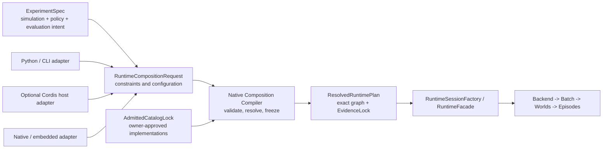

# Cordis 仿真组合计划架构审阅 — 2026-08-17

语言：

- [英文规范页](cordis_simulation_composition_program_review_20260817.md)
- 中文配套：`cordis_simulation_composition_program_review_20260817.zh.md`

Document kind: `review`
Lifecycle: `maintained`
Canonical: `docs/architecture/reviews/cordis_simulation_composition_program_review_20260817.md`
Owner: `architecture/reviews`
Last verified: `2026-08-17`
Review basis: `codex/cordis-simulation-composition-kernel` 分支上的
`b9f289c81fd4`，于 `2026-08-17` 核验
Reviewer role: 架构计划审阅者；未参与受审实现的编写
Decision state: `advisory; disputed downstream phases require architecture revision`
Authority: 独立架构审阅快照；不修改当前 standard，不授权实现，也不替代
active-work package。

## 1. 总体结论

该计划包含一项必要的架构投入：建立原生组合内核，校验 host-neutral request，
构造已准入 provider，持有资源生命周期，冻结可执行 runtime plan，并记录
composition identity。已经完成的 P1 与 P2-A 是有价值的基础，不应废弃。

但当前计划尚不适合继续作为一条必须整体闭合的 P0-P9 路径。它把三类可以分离的
问题绑在了一起：

1. 原生 runtime composition 与 ownership；
2. 可执行 system/profile composition；
3. 可选的 Cordis/Node host 与外部 plugin ecosystem。

主要问题不是实现细节。计划把 Cordis 定义为长期 composition control plane，
而维护中的仿真架构把 experiment 级组合权威归于 Experiment Face。若没有明确的
projection boundary，仓库会同时出现两个合理但相互竞争的 composition intent owner。

建议决策如下：

| Surface | 审阅决策 |
| --- | --- |
| 原生 composition kernel | 保留并继续 |
| Host-neutral deterministic contract | 保留 |
| P2-B 有界 default-provider migration | 可以继续，但不得借此冻结有争议的 Cordis 或 universal-plugin 权威 |
| Cordis 作为强制性的长期 control plane | 现有证据不足，不接受 |
| 用一个 universal plugin plane 覆盖 model、system、backend、diagnostics、host 与外部代码 | 改为有类型、按 owner 分别准入的扩展类别 |
| P0-P9 作为单一 closure dependency chain | 拆成可独立闭合的计划 |
| P7 Cordis 与 P8 Node ecosystem | 置于明确的 go/no-go 决策之后 |

这要求调整计划边界，并不否定已经展开的原生实现。

## 2. 范围与独立性

本审阅针对 active plan 的总体架构、权威模型、计划形态与 closure logic。现有实现
只用于判断哪些决策已经落地，并避免把已完成或已修复的实现细节错误报告成计划缺陷。

审阅期间实现与文档持续变化。最终结论已按干净 worktree revision
`b9f289c81fd4` 重新核对。本审阅不重新打开 active package 已修复并记录的详细
lifecycle findings。

本审阅没有：

- 接受或拒绝单个 C++ 改动；
- 执行性能、安全或第三方 plugin 审计；
- 验证生产级 Cordis/Node use case；
- 重定义由 maintained standards 持有的 stage semantics、domain maturity、
  backend parity 或 experiment policy。

## 3. 已检查证据

主要架构与工作面：

- [仿真系统架构设计](../standards/simulation_system_architecture_design.zh.md)，
  尤其是 Experiment Face、目标分层、架构规则与 capability-composition 方向；
- [Cordis 仿真组合内核](../work/archive/cordis_simulation_composition_kernel/README.zh.md)；
- [Cordis 仿真组合架构](../work/archive/cordis_simulation_composition_kernel/cordis_simulation_composition_kernel_architecture.zh.md)；
- [P1-B 组合 contract](../work/archive/cordis_simulation_composition_kernel/cordis_simulation_composition_contract_20260817.zh.md)；
- [系统模块化 issue](../work/issues/modularization_plan.zh.md)；
- [Runtime facade contract 计划](../work/issues/runtime_facade_contract_plan.zh.md)；
- [Runtime workflow 与 contract 基线](../standards/runtime_workflow_and_contract_baseline.zh.md)；
- [文档生命周期策略](../../engineering/documentation/standards/document_lifecycle_policy.zh.md)。

实现上下文：

- active package 报告 P1-A、P1-B、P2-A 已通过，P2-B 是下一个有界 migration；
- `ef_composition` 已作为隔离的原生 contract/lifecycle 基础存在；
- 在受审 revision 中没有维护中的 Cordis、Node-API 或 Node package surface；
- 默认 compatibility fixture 当前冻结 82 个 component contribution 与 34 个
  system contribution，其中包含必须由 P3 处理的显式 compatibility gap。

外部技术资料只用于理解拟议 host model，不构成仓库权威：

- [Cordis repository](https://github.com/cordiverse/cordis)；
- [Cordis primer](https://deepseek-harness.github.io/deepseek-harness/reference/cordis-primer)。

## 4. 架构上下文

active work 针对的缺失层确实存在。当前 composition choice 分散在 engine
construction、默认 model 构造、system registration、backend setup、facade path
与 binding 中。原生 composition owner 可以淘汰不安全的 replacement path，
明确 lifetime，并生成稳定 evidence。

这一层应理解为 compiler 与 realization boundary：

- 上游 owner 表达 experiment 或 runtime intent；
- 仓库 owner 准入 implementation 与 capability；
- 原生 composition 解析精确的 executable plan；
- runtime owner 执行冻结后的 plan；
- adapter 暴露相同的 request/result contract，但不成为隐藏的 simulation owner。

这种解释与维护中的架构兼容。把特定 host framework 作为架构顶层 control plane
则不兼容。

## 5. Findings

### F-01 — Composition authority 含混

Severity: `high`

维护中的架构规定 Experiment Face 持有 simulation、policy 与 evaluation 维度的
composition。active plan 则规定 Cordis 持有 declarative plugin composition，
并作为长期 composition control plane。

两者只有在以下边界被明确写出后才能共存：

- Experiment Face 持有用户可见的 experiment intent；
- runtime projection 把该 intent 转换成 typed composition request；
- native composition compiler 持有 deterministic resolution 与 realization；
- Cordis、Python、CLI 或其他 host 可以生成相同 request，但不能取代 experiment
  authority 或 native admission authority。

如果不作此拆分，configuration、replay identity、compatibility behavior 与未来的
policy composition 会出现相互竞争的 truth source。

### F-02 — Cordis 的独特价值尚未成立，却已被放在架构前提位置

Severity: `high`

受审仓库没有维护中的 Cordis/Node runtime surface，active package 也明确把该集成
描述为新的 cross-runtime boundary。然而计划仍将 Cordis 设为长期 control plane，
并把它纳入整个计划的强制 closure path。

已检查证据能够说明 host-neutral request producer 有价值，但不能说明仓库必须使用
Cordis，也不能说明 Cordis 在架构上应高于 Python、CLI、native profile 或未来的
service adapter。

在 decision record 证明以下事项前，Cordis 应保持为可选 host-side adapter：

- 存在无法由现有 adapter 以合理成本满足的具体 use case；
- Cordis context/service/plugin model 提供了独特收益；
- offline、provenance、security、packaging 与 maintenance 成本可接受；
- 不产生新的权威或 hot-path 依赖。

### F-03 — 一个 work package 混合了三个架构计划

Severity: `high`

原生 provider lifetime、system graph modularization、backend/profile selection、
evidence、Cordis dependency resolution、Node hosting 与 external plugin
distribution 并不具有同一个自然 owner、风险等级或 closure condition。

让 P9 依赖 P1-P8 的全部 evidence，意味着有价值的原生 composition refactor
必须等到可选 host ecosystem 也成功后才能关闭；host framework 的不确定性也会使
核心 runtime ownership 工作长期保持 active。

计划应拆为分别授权、分别闭合的计划。第 7 节给出建议边界。

### F-04 — Universal plugin plane 掩盖了按 owner 分别准入的需求

Severity: `high`

manifest 同时覆盖 model provider、service、component、system、stage、backend、
diagnostics、evidence、host、compatibility 与未来的 external artifact。共享
envelope 与 identity format 有价值，但共享 envelope 不会自动把这些 contribution
变成同一种安全扩展类别。

这些类别需要不同的准入权威：

| 扩展类别 | 所需权威 |
| --- | --- |
| Model provider | model interface 与 semantic contract owner |
| Backend profile | backend capability、parity 与 performance owner |
| System package | stage、packet、read/write、clock、domain 与 graph owner |
| Diagnostics extension | information-boundary 与 evidence owner |
| Host adapter | facade/binding owner；没有 simulation-state authority |
| External native artifact | 独立的 ABI、provenance、authenticity、deployment 与 support policy |

原生内核可以在这些类别之间共享 lifecycle mechanics，但不能演变成自行授予
semantic admission 的 God registry。

### F-05 — System modularization 应编译已准入 package，而不是创建任意 runtime system plugin

Severity: `high`

淘汰集中式全 domain registration list 是合理目标。替代方案必须保留维护中的规则：
engine 持有 world lifecycle 与 composition，stage/domain owner 治理 behavior。

安全的目标流程是：

`capability/profile request -> repository-admitted system packages -> native graph compiler -> frozen stage graph`

system contribution 必须在执行前完成准入，并声明 stage join、packet contract、
read/write set、clock、barrier、capability 与 conflict。它们不能成为 private
pipeline、直接 `ecs.progress()` 或按 discovery order 调度的开放机制。

当前 82-component/34-system fixture 是有价值的 parity evidence。它应保留为
compatibility lock 与 resolved-plan fixture，而不是成为主要的长期 authoring
interface。

### F-06 — Domain profile 可能取代 capability-composition 目标

Severity: `medium-high`

active architecture 列出了 air、naval、ground 与 combined-domain profile。这些
profile 适合作为 migration fixture 与 acceptance case，但维护中的架构目标是让
platform definition 收敛到 typed capability composition。

长期 authoring 应选择所需 capability 与 policy。domain label 可以 lower 成已准入
capability bundle，但不应成为永久 ontology，并据此决定哪些 system 与 model 可以
组合。否则，新 composition layer 只是把当前 domain taxonomy 固化成新的全局
switchboard。

### F-07 — Requested 与 resolved artifact 已分离，但 catalog authority 仍建模不足

Severity: `medium`

P1-B 已正确区分 requested manifest 与 resolved envelope。但 requested manifest
本身已经携带精确的 plugin、provider、binding、component contribution、system
contribution 与 implementation identity，因此它更接近 low-level plan，而不是
最小 authoring request。

长期概念模型应区分：

1. `CompositionRequest` —— 用户或 experiment intent、constraint、requested
   capability、policy 与 configuration；
2. `AdmittedCatalogLock` —— 仓库批准的 implementation、version、capability、
   provenance 与 trust decision；
3. `ResolvedRuntimePlan` —— 精确 provider、binding、system order、stage graph、
   scope generation 与 hash。

现有 requested manifest 可以继续作为有效的 low-level API 与 compatibility
artifact，但不应成为未来 experiment author 唯一可见的 abstraction。

### F-08 — Ownership containment、dependency ordering 与 evidence timing 必须分开

Severity: `medium`

`Application -> Backend -> Batch -> World -> Episode` hierarchy 适合表达 ownership
containment 与 rebuild policy，但不是完整 dependency topology。dispose 与 rollback
仍必须遵循各 scope 内已 realization 的 resource DAG，不能只从 scope tree 推导顺序。

架构还规定 evidence 必须 by construction。阶段顺序必须保持这一点：P2-B 迁移的
第一个 production provider 就应输出 composition identity 与 resolved-plan evidence。
不能把 evidence 延后到后期，再在多个 production path 已存在后补装。

## 6. 建议权威流

建议权威划分如下：

| Concern | Owner |
| --- | --- |
| Experiment intent | Experiment Face |
| Adapter syntax 与 transport | Python、CLI、Cordis、native 或未来 service adapter |
| Implementation admission | 对应 model、system、backend、domain、evidence 与 security owner |
| Deterministic resolution 与 resource realization | native composition compiler/root |
| Public runtime session API | RuntimeFacade/session factory |
| World lifecycle 与 executable semantics | engine、batch runtime、episode controller、scheduler 与 backend owner |

## 7. 建议的计划重构

### Program A — Native Runtime Composition

目的：

- realization 已准入的 native provider；
- 持有 transactional lifecycle、handle、rollback、replacement 与 disposal；
- 选择已准入 backend profile；
- 保持默认 behavior 与 offline C++/Python operation；
- 从首个 production migration 起输出 composition 与 replay identity。

独立 closure：

- 默认 model/service/backend construction 经过 native owner；
- 不安全的并行 construction 与 setter path 被淘汰，或明确保留为 compatibility route；
- 默认 behavior、lifecycle failure、replay identity 与 performance gate 通过；
- closure 不依赖 Cordis、Node 或 external plugin packaging。

当前 P2-B 属于该计划，可以在这一边界内继续。

### Program B — Executable Profile And Stage Composition

目的：

- 定义 repository-admitted system package；
- 把 capability/profile request lower 成精确的 model、component、system 与 stage
  contribution；
- 编译并校验冻结的 stage graph；
- 在移除集中 registration list 时保持 default graph parity。

独立授权前提：

- 精确的 stage、packet、read/write、clock、barrier 与 domain admission rule；
- 与 capability composition 的关系明确；
- 针对当前 default graph 的 compatibility 与 rollback plan；
- 按 owner 提供 acceptance evidence。

该计划应与 system-modularization owner 协调，而不应隐藏在通用 plugin phase 中。

### Program C — Optional Host Plugin Ecosystem

仅在批准后具有以下目的：

- 提供 Cordis request producer 与 host-side administrative service；
- 增加 Node-API hosting，但不进入 simulation hot path；
- 治理 external packaging、provenance、compatibility 与 support。

Go/no-go gate：

- 已命名的 production 或 developer use case；
- 与 Python/CLI/native alternative 的比较；
- security 与 artifact-authenticity model；
- offline 与 failure behavior；
- ownership 与 maintenance commitment；
- 能证明新增 runtime/distribution boundary 合理的可测收益。

P7 与 P8 应移入该计划。no-go 决策不能阻塞 Program A 或 B 的 closure。

## 8. 应保留的决策

以下 active-plan 决策在架构上成立，除非出现更强证据，否则应保留：

- native C++ 对 deterministic realization 与 execution 保持权威；
- Node、JavaScript、IPC 或 dynamic service lookup 不进入 per-step path；
- C++ 与 Python 在没有 Node 时仍可使用；
- manifest 与 resolved plan 是 host-neutral、canonical、versioned 且 fail-closed；
- provider construction 是 transactional，scope 明确持有 lifetime；
- reconfiguration 创建新的 frozen generation，不原地修改 truth-affecting provider；
- plugin discovery 不能绕过 stage、content、backend、domain、information 或
  evidence admission；
- migration 使用 strangler 方式，在 replacement evidence 成立前保持精确的默认
  compatibility path；
- replay identity 包含 provider、backend、stage graph、content、seed 与
  composition identity。

## 9. 后续路由

本审阅只记录判断。拟议变更必须转移到对应 owner：

| Follow-up | Owner route | 所需结果 |
| --- | --- | --- |
| 澄清 composition authority | [active composition package](../work/archive/cordis_simulation_composition_kernel/README.zh.md) 与 [仿真架构 standard](../standards/simulation_system_architecture_design.zh.md) | Experiment intent、runtime projection、native resolution 与 adapter role 无歧义 |
| 拆分 closure dependency | active composition package 或新的 owner-local work issue | Program A、B、C 分别授权并分别闭合 |
| 治理 system package | [系统模块化 issue](../work/issues/modularization_plan.zh.md) | 在淘汰集中 system registration 前冻结 stage/capability admission |
| 对齐 session construction | [runtime facade contract](../work/issues/runtime_facade_contract_plan.zh.md) | facade 消费 resolved native plan，但不成为 engine |
| 决定是否采用 Cordis/Node | 独立 owner-local issue 或 decision record | P7/P8 实现前形成明确 go/no-go evidence |
| 提前 evidence | Program A acceptance 与 status surface | 首个 production migration 输出稳定 composition identity |

## 10. 重新审阅触发条件

以下任一事项发生前必须重新审阅：

- Cordis 被设为 maintained runtime path 的强制依赖；
- P7 或 P8 开始实现；
- 开始淘汰集中 system-registration list；
- external native artifact 开始准入；
- public authoring API 把完整 low-level manifest 作为唯一 composition
  abstraction；
- active package 在没有拆分或显式解决上述 program-boundary finding 时声明
  closure。

## 11. 最终决策状态

Decision state: `advisory with required architecture revision`。

原生 composition 方向被接受为有价值的架构基础。现有证据不足以接受 Cordis 作为
长期 control plane、universal plugin-plane framing，以及单一 P0-P9 closure chain。
有界 native migration 可以继续，但后续 system/plugin/host phase 不能仅因为共享
schema 与 lifecycle mechanics，就自动继承同一实现库的权威。
