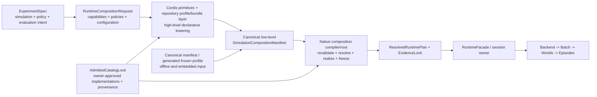

# Response to the Cordis Simulation Composition Program Architecture Review — 2026-08-17

Language:

- English canonical: `cordis_simulation_composition_program_review_response_20260817.md`
- Chinese companion:
  [cordis_simulation_composition_program_review_response_20260817.zh.md](cordis_simulation_composition_program_review_response_20260817.zh.md)

Document kind: `review`
Lifecycle: `maintained`
Canonical: `docs/architecture/reviews/cordis_simulation_composition_program_review_response_20260817.md`
Owner: `architecture/runtime-composition`
Last verified: `2026-08-17`
Review answered:
[Cordis simulation composition program architecture review](cordis_simulation_composition_program_review_20260817.md)
Review basis: `b9f289c81fd4`
Response plan revision: `153d5f4e`
First re-review repair: `89eca276`
First re-review basis: `0d8635794b9052b92034adab7df6afd2fe2f987f`
Decision state: `review findings incorporated; independent re-review approved with no P1/P2 blockers`
Authority: owner response to an advisory review. The review remains an immutable
independent judgment snapshot; this response changes the active program only
through the cited active-work documents and commits.

## 1. Response Outcome

The review identified real authority, admission, abstraction, evidence-timing,
and closure defects in the previous plan. Those defects are accepted and the
active plan has been revised.

The review's further conclusion that Cordis should remain an optional adapter
is not adopted. The program objective is specifically to introduce Cordis
plugin/context/service/injection/event/effect primitives together with a
repository-owned, DeepSeek-Harness-style profile/bundle layer into the
simulation runtime architecture. Treating Cordis as indefinitely optional
would turn the project into a generic native manifest/lifecycle refactor and
would not satisfy that objective.

The corrected decision is:

| Question | Owner decision |
| --- | --- |
| Who owns experiment intent? | The Experiment Face. |
| Who owns maintained high-level declarative lowering? | Cordis primitives plus the repository-owned profile/bundle layer, after an explicit runtime-composition projection. |
| Who admits implementations? | The applicable model, system, backend, domain, evidence, and security owners through an `AdmittedCatalogLock`. |
| Who deterministically validates, resolves, realizes, freezes, and disposes the plan? | The native composition compiler/root. |
| Who owns executable simulation semantics? | Flecs, the native scheduler, backend, batch/runtime, episode, and engine owners. |
| Is Cordis required for overall program closure? | Yes: at least one repository-owned Cordis producer/native realization vertical path is required. |
| Is Node required? | No. Node hosting remains conditional on an approved host use case. |
| Are external plugins required? | No. External distribution, authenticity, ABI, sandbox, and marketplace work remains a separately governed residual. |

## 2. Relationship To Cordis And DeepSeek Harness

The native composition kernel is not a substitute for Cordis. It is the
deterministic realization substrate required to introduce Cordis without
placing host-runtime semantics in the simulation truth path.

The intended mapping is:

| Cordis concept | Simulation composition role |
| --- | --- |
| Context hierarchy | application, backend, batch, world, and episode administrative ownership boundaries |
| Services and injection | typed runtime provider requirements and bindings |
| Effects | reversible administrative registrations and staged host-side actions |
| Plugins and administrative events | declarative extension and host-lifecycle coordination primitives |
| Repository-owned, DeepSeek-Harness-style profile/bundle layer | capability/profile/package authoring and ordered configuration over Cordis primitives |
| Cordis resolution | construction of the canonical requested composition from admitted declarations |
| Native composition compiler/root | independent revalidation, exact implementation binding, transactional realization, generation handover, and deterministic disposal |

DeepSeek Harness is relevant because it demonstrates the larger architectural
pattern in which Cordis supplies a compositional harness/control layer rather
than numerical execution. Echelon Forge is not embedding DeepSeek Harness as
its simulation runtime. It is applying Cordis primitives to simulation
providers and administrative lifecycle, then supplying a repository-owned,
DeepSeek-Harness-style profile/bundle layer for package/profile authoring, while
keeping the existing native engine authoritative for deterministic execution.

## 3. Amended Authority Flow

This resolves the apparent conflict between the Experiment Face and Cordis:
the Experiment Face owns intent; Cordis is the only maintained high-level
lowering path for that projected intent; owner-specific authorities admit
implementations; the native path owns deterministic realization. Offline
native/Python paths consume canonical low-level artifacts and do not implement
a second capability/profile resolver.

## 4. Finding Disposition

| Finding | Disposition | Incorporated change |
| --- | --- | --- |
| `F-01` composition authority ambiguity | accepted | Added the explicit Experiment intent -> runtime projection -> Cordis declaration -> owner admission -> native realization chain to the README, architecture, status, task, and acceptance surfaces. |
| `F-02` Cordis prerequisite before unique value is established | premise rejected; evidence concern accepted | Cordis remains the strategic target. P2-C0/P2-C1 move technical feasibility and authority conformance immediately after production migration. They do not by themselves claim that broad ecosystem ROI or every operational advantage is proven. |
| `F-03` one package conflates three programs | partially accepted | Native, system/profile, Cordis, backend/evidence, and Node work now have bounded acceptance. The proposed optional Program C is split into a required Cordis producer path and a conditional Node/external-ecosystem path. |
| `F-04` universal plugin plane obscures owner admission | accepted | Added `AdmittedCatalogLock` and explicit category owners. Shared lifecycle mechanics do not grant model/system/backend/domain/evidence/security admission. |
| `F-05` systems should compile admitted packages | accepted | `P3-A` now targets repository-admitted system packages compiled by the existing native graph/scheduler owners; discovery order and private pipelines remain forbidden. |
| `F-06` domain profiles risk replacing capability composition | accepted | `P3-B` is renamed `Capability And Profile Projection`; capabilities and policies are primary, while named domain profiles are compatibility bundles. |
| `F-07` authoring request/catalog/resolved distinction | accepted without reopening P1-B | Added the conceptual `RuntimeCompositionRequest`, `AdmittedCatalogLock`, and `ResolvedRuntimePlan` layers. The existing P1-B requested manifest remains the canonical low-level interchange and compatibility artifact, not the sole future authoring API. |
| `F-08` scope/DAG/evidence concerns | accepted | Scope containment remains separate from the realized dependency DAG. Production composition identity moves into `P2-B`; `P5-A` becomes evidence expansion rather than first evidence introduction. |

## 5. Response To The Proposed Program Split

The review's independent-closure concern is valid, but the proposed optional
Cordis program boundary is too broad. The amended delivery streams are:

### Stream A — Native Runtime Composition

- P1-B and P2-A remain accepted foundations.
- P2-B migrates production default providers and publishes the first production
  composition identity.
- This stream may receive bounded native acceptance without claiming Cordis
  completion.

### Stream B — Executable Package And Capability Composition

- P3-A compiles repository-admitted system packages into the native stage graph.
- P3-B projects capabilities, policies, and compatibility profiles into those
  packages.
- Stage/domain owners retain admission and execution authority.

### Stream C1 — Required Cordis Composition Path

- P2-C0 freezes the high-level request and owner-derived catalog-lock artifacts.
- P2-C1 is the minimum default-profile vertical slice and uses Cordis
  primitives plus the repository-owned profile/bundle layer.
- P6-A matures the repository profile/bundle layer, overlays, diagnostics,
  provenance, dependency resolution, and package ergonomics over Cordis
  primitives after the vertical path is proven.
- Overall program closure requires C1; otherwise Cordis has not actually been
  introduced.

### Stream C2 — Conditional Host And External Ecosystem

- P6-B Node hosting requires a separate approved host use case.
- External packages, authenticity, ABI, sandboxing, remote catalogs, and a
  marketplace remain separately governed.
- C2 may be held or rejected without invalidating A, B, or the C1 Cordis/native
  composition objective.

## 6. Amended Sequence And Closure

The maintained sequence is now:

1. `P2-B Default Provider Migration`;
2. `P2-C0 Projection And Catalog-Lock Contract`;
3. `P2-C1 Cordis Default-Profile Vertical Slice`;
4. `P3-A System Contribution Migration`;
5. `P3-B Capability And Profile Projection`;
6. `P4-A Backend Provider Migration`;
7. `P5-A Composition Evidence Expansion`;
8. `P6-A Cordis Package Maturation`;
9. conditional/held `P6-B Node Host Adapter`;
10. `P7-A Host And Batch Parity` with Node rows only if admitted;
11. `P8-A Migration Closure` and residual routing.

The active documents amended by `153d5f4e` are:

- [program README](../work/active/cordis_simulation_composition_kernel/README.md);
- [target architecture](../work/active/cordis_simulation_composition_kernel/cordis_simulation_composition_kernel_architecture.md);
- [task clusters](../work/active/cordis_simulation_composition_kernel/cordis_simulation_composition_kernel_task_clusters_20260817.md);
- [dispatch queue](../work/active/cordis_simulation_composition_kernel/cordis_simulation_composition_kernel_dispatch_queue_20260817.md);
- [current status](../work/active/cordis_simulation_composition_kernel/cordis_simulation_composition_kernel_current_status_20260817.md);
- [acceptance contract](../work/active/cordis_simulation_composition_kernel/cordis_simulation_composition_kernel_acceptance_20260817.md).

## 7. Immediate Dispatch Decision

`P2-B` remains the next eligible implementation cluster. It must not implement
the Cordis package in the same write set. It must, however:

- construct the production default profile through admitted native providers;
- remove the unsafe raw provider capture;
- preserve behavior and replay parity;
- export stable requested/resolved production identity;
- leave stable production identity/evidence seams that P2-C0 can consume.

After P2-B is accepted, P2-C0 becomes the next strategic cluster and P2-C1
follows it. P2-C1 must prove Cordis primitives plus the repository profile/
bundle layer against the production default path, not merely against a
synthetic schema fixture. No later implementation cluster is released first
without a separate architecture-owner amendment.

## 8. First Re-review Amendments

An independent `gpt-5.6-sol` / `max` re-review of `abe9b619` requested three
P2 corrections and two P3 clarifications. This response and the active plan now:

- make Cordis the sole maintained high-level lowering path while restricting
  offline native/Python operation to canonical low-level artifacts;
- split the former P2-C into P2-C0 request/catalog-lock contract work and P2-C1
  end-to-end Cordis production realization;
- encode P2-C0/P2-C1 ahead of later implementation work in the phase table,
  task dependencies, queue, acceptance contract, and P1-B follow-on wording;
- mark P6-B as conditional/held and require Node tests only if it is admitted;
- distinguish Cordis primitives from the repository-owned,
  DeepSeek-Harness-style profile/bundle layer.

The independent re-review of `0d863579` returned `APPROVE` with no P1 or P2
blockers and confirmed that the three P2 findings and the Cordis terminology P3
were closed. It identified one non-blocking P3 wording residual where the scope
and target-boundary narrative still made Node look like a default deliverable;
that wording is now conditional on an independent P6-B host decision.

## 9. Re-review Disposition

The reviewer confirmed that:

1. the Experiment Face/Cordis/admission/native authority chain is unambiguous;
2. P2-C0/P2-C1 require a real Cordis relationship early enough to justify later
   package maturation and cannot pass on serializer-only evidence;
3. owner-specific system/backend/domain/evidence admission boundaries remain
   preserved;
4. independent slice acceptance avoids Node/external-ecosystem blockage without
   making Cordis optional; and
5. closure requires Cordis producer/native conformance while Node and external
   distribution remain conditional.

The release boundary is therefore P2-B now, P2-C0 after P2-B acceptance, P2-C1
after P2-C0 acceptance, and later implementation work only after P2-C1 and its
owner dependencies. P6-B remains separately held pending a host decision.

## 10. Final Response State

Response state: `architecture findings incorporated and independently reviewed`.

The review's authority, typed-admission, capability-composition, abstraction,
evidence-timing, and independent-slice concerns have materially changed the
plan. Its recommendation to make Cordis an optional adapter has not been
adopted because it conflicts with the program's strategic objective. The
revised plan now requires earlier executable evidence of Cordis rather than
deferring it behind a long native-only sequence.
