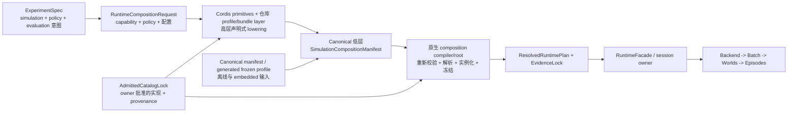

# Cordis 仿真组合计划架构审阅回复 — 2026-08-17

语言：

- [英文规范页](cordis_simulation_composition_program_review_response_20260817.md)
- 中文配套：`cordis_simulation_composition_program_review_response_20260817.zh.md`

Document kind: `review`
Lifecycle: `maintained`
Canonical: `docs/architecture/reviews/cordis_simulation_composition_program_review_response_20260817.md`
Owner: `architecture/runtime-composition`
Last verified: `2026-08-17`
Review answered:
[Cordis 仿真组合计划架构审阅](cordis_simulation_composition_program_review_20260817.zh.md)
Review basis: `b9f289c81fd4`
Response plan revision: `153d5f4e`
First re-review repair: `89eca276`
First re-review basis: `0d8635794b9052b92034adab7df6afd2fe2f987f`
Decision state: `review findings incorporated; independent re-review approved with no P1/P2 blockers`
Authority: 对咨询性审阅的 owner 回复。原 review 继续作为不可变的独立判断快照；本回复
仅通过引用的 active-work 文档与 commit 修改当前计划。

## 1. 回复结论

审阅指出了旧计划中真实存在的权威、准入、抽象、证据时机与 closure 缺陷。这些问题已
接受，并已修订 active plan。

审阅进一步建议让 Cordis 保持可选 adapter；该结论未被采纳。本计划的目标就是把 Cordis
plugin/context/service/injection/event/effect primitives 与仓库自有的
DeepSeek-Harness-style profile/bundle layer 引入仿真 runtime 架构。如果让 Cordis 永久
保持可选，项目会退化为通用原生 manifest/lifecycle
重构，无法满足该目标。

修正后的决定是：

| 问题 | Owner 决定 |
| --- | --- |
| 谁拥有实验意图？ | Experiment Face。 |
| 谁拥有维护中的高层声明式 lowering？ | 显式 runtime-composition projection 之后，由 Cordis primitives 加仓库自有 profile/bundle layer 拥有。 |
| 谁准入 implementation？ | 相应 model、system、backend、domain、evidence 与 security owner，通过 `AdmittedCatalogLock`。 |
| 谁确定性校验、解析、实例化、冻结和销毁 plan？ | 原生 composition compiler/root。 |
| 谁拥有可执行仿真语义？ | Flecs、原生 scheduler、backend、batch/runtime、episode 与 engine owner。 |
| Cordis 是否是整体计划 closure 必需条件？ | 是；至少需要一条仓库自有 Cordis producer/native realization 纵向路径。 |
| Node 是否必需？ | 否；Node hosting 取决于获批 host 用例。 |
| 外部 plugin 是否必需？ | 否；外部分发、真实性、ABI、sandbox 与 marketplace 属于另行治理的残余。 |

## 2. 与 Cordis 和 DeepSeek Harness 的关系

原生 composition kernel 不是 Cordis 的替代品。它是安全引入 Cordis 所必需的确定性
realization substrate，用来避免 host-runtime 语义进入仿真 truth path。

预期映射如下：

| Cordis 概念 | 仿真 composition 角色 |
| --- | --- |
| Context hierarchy | application、backend、batch、world 与 episode 的管理 ownership boundary |
| Service/injection | typed runtime provider requirement 与 binding |
| Effect | 可逆管理 registration 与 staged host-side action |
| Plugin 与 administrative event | 声明式扩展与 host-lifecycle coordination primitive |
| 仓库自有的 DeepSeek-Harness-style profile/bundle layer | 在 Cordis primitives 上进行 capability/profile/package authoring 与 ordered configuration |
| Cordis resolution | 从已准入 declaration 构造 canonical requested composition |
| 原生 composition compiler/root | 独立重新校验、精确实现 binding、事务化 realization、generation handover 与确定性 disposal |

DeepSeek Harness 的相关性在于它展示了 Cordis 作为可组合 harness/control layer、而不是
数值 executor 的整体架构模式。Echelon Forge 不会把 DeepSeek Harness 嵌入为仿真 runtime；
这里是把 Cordis primitives 应用到 simulation provider 与管理生命周期，再由仓库自有的
DeepSeek-Harness-style profile/bundle layer 负责 package/profile authoring，同时继续让
既有原生 engine 掌握确定性执行权威。

## 3. 修订后的权威流

这消除了 Experiment Face 与 Cordis 的表面冲突：Experiment Face 拥有意图；Cordis 是
该投影意图唯一维护中的高层 lowering path；按 owner 分类的权威准入实现；原生路径拥有
确定性 realization。原生/Python 离线路径消费 canonical 低层 artifact，不实现第二套
capability/profile resolver。

## 4. Finding 处置

| Finding | 处置 | 已纳入修改 |
| --- | --- | --- |
| `F-01` composition 权威歧义 | 接受 | 在 README、architecture、status、task 与 acceptance 中增加显式 Experiment intent -> runtime projection -> Cordis declaration -> owner admission -> native realization 权威链。 |
| `F-02` Cordis 独特价值未证明却成为 prerequisite | 不接受其前提；接受 evidence concern | Cordis 保持战略目标。P2-C0/P2-C1 把技术可行性与权威 conformance 前移到 production 迁移之后；它们本身不宣称已经证明广义生态 ROI 或全部 operational advantage。 |
| `F-03` 一个 package 混合三类计划 | 部分接受 | native、system/profile、Cordis、backend/evidence 与 Node 工作现在可以有界验收。建议中的可选 Program C 被拆成必需 Cordis producer 路径和 conditional Node/外部生态路径。 |
| `F-04` 通用 plugin plane 掩盖 owner admission | 接受 | 增加 `AdmittedCatalogLock` 和显式 category owner。共享 lifecycle mechanics 不授予 model/system/backend/domain/evidence/security admission。 |
| `F-05` system 应编译准入 package | 接受 | `P3-A` 改为由既有原生 graph/scheduler owner 编译仓库准入 system package；继续禁止 discovery order 和私有 pipeline。 |
| `F-06` domain profile 可能取代 capability composition | 接受 | `P3-B` 改名 `Capability And Profile Projection`；capability/policy 为主，具名 domain profile 仅是 compatibility bundle。 |
| `F-07` authoring request/catalog/resolved 区分不足 | 接受，但不重开 P1-B | 增加概念层 `RuntimeCompositionRequest`、`AdmittedCatalogLock` 和 `ResolvedRuntimePlan`。既有 P1-B requested manifest 继续作为 canonical 低层 interchange/compatibility artifact，而不是未来唯一 authoring API。 |
| `F-08` scope/DAG/evidence 时机 | 接受 | scope containment 与 realized dependency DAG 继续分离。production composition identity 前移到 `P2-B`；`P5-A` 改为 evidence expansion，而不是首次引入 evidence。 |

## 5. 对建议 Program 拆分的回复

审阅提出的独立 closure concern 成立，但把 Cordis 整体放入可选 Program C 的边界过宽。
修订后的 delivery stream 为：

### Stream A — Native Runtime Composition

- P1-B 与 P2-A 保持已接受基础。
- P2-B 迁移 production 默认 provider，并发布首份 production composition identity。
- 本 stream 可以获得有界原生验收，但不能据此声明 Cordis 完成。

### Stream B — Executable Package And Capability Composition

- P3-A 把仓库准入 system package 编译进原生 stage graph。
- P3-B 把 capability、policy 与 compatibility profile 投影到这些 package。
- stage/domain owner 保留准入和执行权威。

### Stream C1 — Required Cordis Composition Path

- P2-C0 冻结高层 request 与 owner-derived catalog-lock artifact。
- P2-C1 是最小默认 profile 纵向切片，使用 Cordis primitives 加仓库 profile/bundle layer。
- P6-A 在纵向路径被证明后，在 Cordis primitives 上成熟化仓库 profile/bundle layer、
  overlay、diagnostics、provenance、dependency resolution 与 package ergonomics。
- 整体计划 closure 要求 C1；否则不能声称 Cordis 已实际引入。

### Stream C2 — Conditional Host And External Ecosystem

- P6-B Node hosting 需要另行批准的 host 用例。
- 外部 package、真实性、ABI、sandbox、remote catalog 与 marketplace 继续另行治理。
- C2 可以 held 或 rejected，而不否定 A、B 或 C1 Cordis/native composition 目标。

## 6. 修订后的顺序与 closure

维护中的顺序现在是：

1. `P2-B Default Provider Migration`；
2. `P2-C0 Projection And Catalog-Lock Contract`；
3. `P2-C1 Cordis Default-Profile Vertical Slice`；
4. `P3-A System Contribution Migration`；
5. `P3-B Capability And Profile Projection`；
6. `P4-A Backend Provider Migration`；
7. `P5-A Composition Evidence Expansion`；
8. `P6-A Cordis Package Maturation`；
9. conditional/held `P6-B Node Host Adapter`；
10. `P7-A Host And Batch Parity`，仅在 Node 获准时加入 Node 行；
11. `P8-A Migration Closure` 与 residual routing。

`153d5f4e` 修订的 active 文档包括：

- [计划 README](../work/active/cordis_simulation_composition_kernel/README.zh.md)；
- [目标架构](../work/active/cordis_simulation_composition_kernel/cordis_simulation_composition_kernel_architecture.zh.md)；
- [任务簇](../work/active/cordis_simulation_composition_kernel/cordis_simulation_composition_kernel_task_clusters_20260817.zh.md)；
- [派发队列](../work/active/cordis_simulation_composition_kernel/cordis_simulation_composition_kernel_dispatch_queue_20260817.zh.md)；
- [当前状态](../work/active/cordis_simulation_composition_kernel/cordis_simulation_composition_kernel_current_status_20260817.zh.md)；
- [验收合同](../work/active/cordis_simulation_composition_kernel/cordis_simulation_composition_kernel_acceptance_20260817.zh.md)。

## 7. 立即派发决定

`P2-B` 仍是下一 eligible implementation cluster。它不得在同一 write set 实现 Cordis
package，但必须：

- 通过准入原生 provider 构造 production 默认 profile；
- 移除不安全 raw provider capture；
- 保持 behavior/replay parity；
- 输出稳定 requested/resolved production identity；
- 留下 P2-C0 可消费的稳定 production identity/evidence seam。

P2-B 获得验收后，P2-C0 成为下一战略 cluster，随后执行 P2-C1。P2-C1 必须针对
production 默认路径证明 Cordis primitives 加仓库 profile/bundle layer，而不是仅针对
synthetic schema fixture。没有单独的 architecture-owner amendment，不得先 release 后续
implementation cluster。

## 8. 首次重新审阅修订

独立 `gpt-5.6-sol` / `max` reviewer 对 `abe9b619` 提出 3 个 P2 修正与 2 个 P3
clarification。本回复与 active plan 现已：

- 把 Cordis 设为唯一维护中的高层 lowering path，并把原生/Python 离线运行限制为
  canonical 低层 artifact；
- 把原 P2-C 拆成 P2-C0 request/catalog-lock contract 与 P2-C1 端到端 Cordis production
  realization；
- 在 phase table、task dependency、queue、acceptance contract 与 P1-B follow-on wording
  中统一把 P2-C0/P2-C1 放在后续 implementation work 前；
- 把 P6-B 标为 conditional/held，并仅在获准时要求 Node test；
- 区分 Cordis primitives 与仓库自有的 DeepSeek-Harness-style profile/bundle layer。

对 `0d863579` 的独立重新审阅给出 `APPROVE`，未发现 P1/P2 blocker，并确认 3 个 P2
问题与 Cordis 术语 P3 已关闭。审阅另发现 1 个非阻断 P3：scope 与目标目录叙述仍让
Node 看起来像默认交付物；现已把这些措辞统一改为只有 P6-B 经独立 host decision 获准
时才成立。

## 9. 重新审阅结论

reviewer 已确认：

1. Experiment Face/Cordis/admission/native 权威链无歧义；
2. P2-C0/P2-C1 足够早地要求真实 Cordis 关系，且不能只靠 serializer evidence 通过；
3. 按 owner 分类的 system/backend/domain/evidence admission 边界得到保留；
4. 独立切片验收避免 Node/外部生态阻塞，同时没有把 Cordis 变为可选；
5. closure 要求 Cordis producer/native conformance，而 Node 与外部分发保持 conditional。

因此 release 边界为：当前推进 P2-B；P2-B 验收后推进 P2-C0；P2-C0 验收后推进 P2-C1；
P2-C1 与相应 owner dependency 通过后才推进后续 implementation work。P6-B 继续单独
held，等待 host decision。

## 10. 最终回复状态

回复状态：`architecture findings incorporated and independently reviewed`。

review 提出的权威、typed admission、capability composition、抽象、evidence timing 与
independent-slice concern 已实质改变计划。让 Cordis 成为可选 adapter 的建议未采纳，
因为它与计划战略目标冲突。修订后的计划不再把 Cordis 推迟到很长的 native-only 序列
之后，而是要求更早提供可执行的 Cordis 证据。
