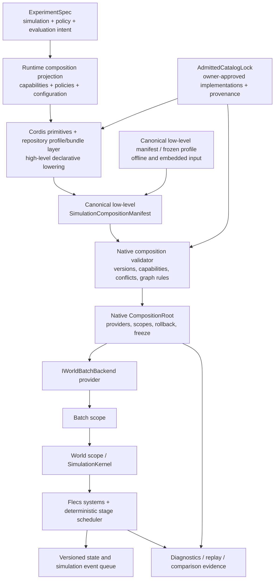

# Cordis Simulation Composition Kernel Architecture

Status: `2026-08-17` maintained target architecture; the P1 contract and P2-A
isolated native lifecycle baseline are implemented and validated. Production
provider, system, backend, Cordis, and host migrations remain planned.

Language:

- English canonical: `cordis_simulation_composition_kernel_architecture.md`
- Chinese companion: [cordis_simulation_composition_kernel_architecture.zh.md](cordis_simulation_composition_kernel_architecture.zh.md)

Document kind: `plan`
Lifecycle: `maintained`
Canonical: `docs/architecture/work/active/cordis_simulation_composition_kernel/cordis_simulation_composition_kernel_architecture.md`
Owner: `architecture/runtime-composition`
Last verified: `2026-08-17`

Parent: [Cordis Simulation Composition Kernel](README.md)

Implemented contract baseline:
[P1-B manifest and resolution contract](cordis_simulation_composition_contract_20260817.md).

## 1. Authority And Design Position

This plan is subordinate to the maintained
[simulation system architecture](../../../standards/simulation_system_architecture_design.md)
and [runtime workflow baseline](../../../standards/runtime_workflow_and_contract_baseline.md).
It does not redefine simulation state, event ordering, stage semantics, backend
parity, experiment authority, or domain maturity.

The durable target is not merely a C++ factory and not a JavaScript-driven
simulation loop. It is a four-layer authority chain:

- the Experiment Face owns user-visible experiment intent;
- a runtime projection expresses that intent as typed capabilities, policies,
  profiles, and configuration;
- Cordis primitives plus a repository-owned, DeepSeek-Harness-style
  profile/bundle layer exclusively own maintained high-level declarative
  lowering over owner-admitted categories and emit the canonical low-level
  request;
- a native composition compiler/root owns deterministic revalidation,
  resolution, realization, resource lifetime, graph freeze, rollback, and
  handoff to the simulation engine.

Cordis is therefore introduced as the required declarative composition control
plane for this program, not as the owner of experiment policy, implementation
admission, numerical execution, or causal-temporal semantics. Native and Python
offline paths preserve embedded operation by consuming canonical low-level
manifests or generated frozen profiles. They do not independently lower an
arbitrary `RuntimeCompositionRequest` and therefore do not create a second
high-level resolver.

## 2. Evidence Baseline

### 2.1 Construction ownership

`SimulationKernel` currently constructs concrete default models, event stores,
bridges, and release services before registering systems. The constructor is
therefore both the world runtime and the composition root.

### 2.2 Lifetime inconsistency

Model setters replace owning pointers and update selected Flecs singleton refs.
At least one system captures the environment model pointer during registration,
so provider replacement is not a complete or uniformly safe transition.

### 2.3 Static system installation

The current registration function installs a central ordered list spanning
shared physics, air, naval, ground, sensing, combat, electronic warfare, and
logistics behavior. This is an executable baseline, but not a declarative
composition profile or dependency graph.

### 2.4 Partial backend and stage abstractions

`IWorldBatchBackend`, runtime capability contracts, exact-stage inventory, and
stage-node manifests already provide important semantic seams. The missing
layer is the owner that selects implementations, validates their compatibility,
binds their lifetimes, and records the selected graph as evidence.

## 3. Non-Negotiable Principles

1. **One simulation truth path.** Cordis, Python, Node, diagnostics, and domain
   packages may request a composition, but only the admitted native runtime may
   realize authoritative state transitions.
2. **No cross-language hot path.** A maintained stage node must not call Node,
   JavaScript, Python, IPC, or a dynamic Cordis service during a step.
3. **Deterministic composition.** Identical admitted inputs must produce the
   same resolved provider set, stage graph, canonical bytes, and composition
   hash independent of discovery order.
4. **Frozen executable graph.** Truth-affecting providers, systems, clocks, and
   barriers are immutable during an episode unless a maintained reconfiguration
   barrier explicitly ends and reconstructs the affected scope.
5. **Explicit ownership.** Every resource has one owning scope and every
   borrowed reference is invalidated before its owner is destroyed.
6. **Contract before implementation.** Cordis packages and native code consume
   the same versioned schema; neither side may rely on the other's private
   object layout.
7. **Offline native operation.** C++ and Python deployments remain fully usable
   without Node or downloaded plugins.
8. **Evidence by construction.** Composition identity, provider versions,
   contract versions, and graph identity are part of every replayable run.
9. **Governed extensibility.** A plugin contribution is an admission request,
   not permission to bypass domain, stage, backend, information, or evidence
   rules.
10. **Failure atomicity.** Partial composition never becomes runnable. Failed
    construction rolls back the complete affected scope.

## 4. Target Topology



Cordis is the sole maintained high-level lowering path for declarative runtime
composition. Native/Python offline operation consumes an already canonical
low-level manifest or a generated frozen profile and may expose the P1-B
low-level expert API, but it does not interpret arbitrary capabilities,
policies, or profile bundles. All inputs cross the same owner-admission and
native revalidation boundary; none may bypass it or become a second execution
truth.

Before P2-C1, the frozen P1-B default fixture is a migration input only. After
P2-C1, every maintained frozen profile derived from a high-level request must
be generated by the accepted Cordis lowering path and retained as a canonical
artifact; native/Python code may load it but may not hand-lower an equivalent
high-level profile.

## 5. Authority Matrix

| Concern | Authority | Cordis role | Native composition role | Simulation role |
| --- | --- | --- | --- | --- |
| Experiment intent | Experiment Face | Consume projected runtime requirements; do not redefine policy/evaluation intent | none | execute the accepted runtime portion |
| Runtime composition projection | Experiment/runtime contract owners | Consume the typed request; do not reinterpret experiment intent | Validate request/catalog-lock versions and required identities | none |
| High-level declarative lowering | Cordis primitives plus repository profile/bundle layer | Exclusively lower maintained capability, policy, package, and configuration requests into the canonical low-level request | Revalidate the exact low-level result; do not run a second high-level resolver | none |
| Implementation admission | applicable model, system, backend, domain, evidence, and security owners | Select only from the locked admitted catalog | Verify exact descriptor, implementation, service type, capability, and provenance match | none |
| Offline compatibility input | canonical manifest/frozen-profile artifact | none | Consume the low-level expert contract without interpreting arbitrary high-level requests | none |
| Plugin discovery | Cordis control plane or native static catalog | Discover descriptors and configuration | Reject unknown or unadmitted descriptors | none |
| Dependency resolution | Canonical composition contract | Produce requested graph | Re-resolve/verify deterministically | none |
| Provider instances | Native composition root | Name provider and config | Construct, own, expose typed handle, dispose | Consume frozen handle |
| ECS components and entities | Flecs world | none | Install admitted component/system contributions | Own state and queries |
| Stage ordering | Stage contracts and native scheduler | Contribute declared nodes only | Validate complete graph | Execute deterministic graph |
| Simulation events | Native event queue | none | Bind event-family providers if admitted | Timestamp, order, deliver, replay |
| Lifecycle events | Composition root | Publish administrative intent | Perform state transition and record outcome | pause/stop only at governed barriers |
| Backend selection | Backend capability contracts | Request a backend profile | Admit and construct provider | Execute backend semantics |
| Replay identity | Evidence contracts | Include requested plugin/config identity | Record realized identity and hashes | Record state/event evidence |
| Public API | RuntimeFacade and bindings | Optional host adapter | Provide stable native contract | No plugin-specific public bypass |

## 6. Composition Contract

### 6.1 `SimulationCompositionManifest`

The manifest is a versioned, canonical, host-neutral contract. P1-B freezes the
following requested-manifest surface:

```text
schema_version
composition_id
contract_versions
requested_profile
plugins[]
providers[]
service_bindings[]
component_contributions[]
system_contributions[]
backend_request
scope_policies
reconfiguration_policy
evidence_policy
compatibility_claims[]
```

Resolution produces a separate versioned envelope containing the normalized
requested manifest, provider/system orders, requested-manifest SHA-256, and a
self-excluding resolved-manifest SHA-256. The executable specification, generated
schema, pure C++ value contract, and fixtures are owned by the linked P1-B
contract document; this architecture page retains the durable boundary rather
than duplicating every schema field.

The schema must not serialize C++ pointers, Cordis object identities, Flecs
entity IDs, filesystem discovery order, or host-specific absolute paths.

The durable conceptual split is:

1. `RuntimeCompositionRequest`: projected experiment intent, required
   capabilities/policies, profile constraints, and configuration;
2. `AdmittedCatalogLock`: owner-approved implementations, versions,
   capabilities, provenance, and trust decisions;
3. `ResolvedRuntimePlan`: exact providers, bindings, system/stage graph, scope
   generations, and evidence hashes.

`P2-C0` must make the first two items executable artifacts before Cordis
integration begins: a versioned producer-neutral request DTO, and a
deterministically generated owner-derived catalog lock containing category
authority, descriptor/version/capability/provenance entries, canonical bytes,
and its own stable identity. Cordis consumes both; native code verifies the
catalog-lock identity and every selected implementation against it.

The frozen P1-B requested manifest remains the canonical low-level interchange
and compatibility artifact between producers and the native compiler. It may
carry exact descriptors by design, but it must not become the only public
authoring abstraction exposed to experiment authors.

### 6.2 Plugin descriptor

Every plugin descriptor must declare:

- stable plugin and implementation IDs;
- semantic version and composition-contract compatibility range;
- provider services offered and required;
- applicable scope and instance cardinality;
- capability requirements and conflicts;
- stage-node and component contributions;
- configuration schema and defaults;
- determinism class;
- host support (`native`, `cordis`, or both);
- artifact provenance and future authenticity metadata;
- teardown and restart policy;
- evidence fields contributed.

Plugin order in a configuration file must not imply stage order, service
priority, or event priority.

### 6.3 Stable service keys

Service keys are semantic names defined by maintained contracts, for example:

```text
simulation.environment.model
simulation.effects.model
simulation.sensor.model
simulation.acoustic.model
simulation.control.model
simulation.guidance.model
simulation.unit_factory
runtime.world_batch_backend
runtime.engagement_event_recorder
runtime.composition_evidence_sink
```

These examples are planning vocabulary, not yet authorized production strings.
P1 must review naming against existing owner contracts before code lands.

Each required service resolves to exactly one admitted binding unless the
service contract explicitly defines a collection, chain, reducer, or fallback.
Implicit last-registration-wins behavior is forbidden.

## 7. Scope And Lifetime Model

The native composition kernel must support an explicit hierarchy:

```text
ApplicationScope
  BackendScope
    BatchScope
      WorldScope
        EpisodeScope
```

| Scope | Typical owners | Rebuild trigger |
| --- | --- | --- |
| Application | plugin catalog, schema registry, logging, immutable host configuration | process shutdown or host reconfiguration |
| Backend | CPU/CUDA provider, device allocation policy, backend capability set | backend switch or backend failure |
| Batch | world collection, worker policy, shared immutable model data | batch resize or batch reconfiguration |
| World | Flecs world, kernel services, system instances, world-local event stores | world replacement or composition change |
| Episode | seed, episode-local caches, reset state, episode diagnostics | reset or episode completion |

Rules:

- a child may borrow a parent service but a parent may not retain an unowned
  child reference;
- resource creation is recorded immediately in the owning scope;
- failed scope construction disposes successfully created resources in a
  deterministic dependency-safe order;
- a scope cannot be disposed while a maintained executor is inside one of its
  stages;
- reconfiguration produces a new frozen scope generation rather than mutating
  truth-affecting providers in place;
- diagnostic-only resources may use weaker restart rules only when they cannot
  affect state, scheduling, observations, rewards, or exported evidence truth.

## 8. Native Composition Kernel

The native implementation should converge on semantic types comparable to:

```text
CompositionCatalog
CompositionResolver
CompositionValidator
CompositionPlan
CompositionRoot
CompositionScope
ServiceDescriptor
ServiceHandle<T>
ProviderFactory
SystemContribution
StageContribution
RegistrationEffect
CompositionEvidence
```

These are semantic roles, not frozen C++ class names.

### 8.1 Resolution algorithm

The maintained resolver must:

1. normalize and schema-validate the requested manifest;
2. resolve plugin and provider versions from an admitted catalog;
3. reject missing services, ambiguous bindings, conflicts, unsupported scopes,
   and capability mismatches;
4. build service and lifecycle dependency graphs;
5. merge component and stage contributions;
6. validate stage read/write, clock, latency, synchronization, barrier, and
   event-family rules using maintained contracts;
7. sort equivalent graph nodes by stable semantic identifiers, never discovery
   order;
8. produce canonical bytes and a resolved composition hash;
9. construct scopes transactionally;
10. freeze the executable composition before exposing a runnable facade.

### 8.2 Provider access

Stage execution should use frozen native handles or stable Flecs refs populated
by the composition root. It must not perform string-based registry lookup in
the hot path.

Provider replacement requires one of:

- construction before the world becomes runnable;
- episode or world reconstruction at an admitted barrier;
- a provider-specific state migration contract that is independently accepted.

The current pattern of replacing an owning pointer while previously registered
systems may retain the old address is forbidden in the target architecture.

### 8.3 Registration effects

Every system, observer, singleton ref, event subscriber, device allocation, and
external resource installed by a plugin must return an owned registration
effect or equivalent RAII token. Disposal reverses the realized dependency
graph, not an incidental asynchronous completion order.

## 9. Stage And Domain Composition

A system plugin does not own scheduling. It contributes declarations:

- components and data contracts it requires;
- stage nodes and stable node IDs;
- read/write state shards;
- clocks and trigger conditions;
- same-window and cross-window relationships;
- event families produced or consumed;
- barriers and synchronization policy;
- backend capability requirements;
- diagnostics and evidence hooks;
- extension points implemented or consumed.

The native scheduler compiles accepted contributions into the maintained
causal-temporal graph. A plugin must not call `ecs.progress()` or directly run
an undeclared system as a private pipeline.

Compatibility and acceptance profiles should include at least:

- minimal contract-test runtime;
- common CPU exact runtime;
- air, naval, ground, and combined-domain profiles;
- CUDA-resident admitted profiles;
- diagnostics and replay profiles;
- compatibility profile reproducing the current default kernel during
  migration.

Long-term authoring selects typed capabilities and policies. Domain labels may
lower into owner-admitted capability bundles for migration and usability, but
they do not become the permanent ontology or a second semantic lifecycle.

## 10. Cordis Control Plane

After `P2-C0`, the first Cordis vertical slice must use Cordis plugin/context,
service/injection, event, and effect primitives together with the repository's
profile/bundle layer to lower the default request and emit canonical P1-B bytes
plus the catalog-lock identity for native revalidation. The mature package
should then model:

- one host/application context for plugin catalogs and configuration;
- child contexts for backend or independently managed runtime instances;
- services representing manifest builders, profile resolvers, host adapters,
  evidence exporters, and development tooling;
- reversible effects for host-side registrations;
- typed administrative events for load, validate, instantiate, stop, and
  dispose operations.

It must not expose simulation entities or mutable state as general Cordis
services. It also must not use Cordis event ordering as simulation event
ordering.

The Cordis producer emits a complete low-level manifest from an explicit
runtime-composition projection and an admitted catalog. The native side must
validate it again and may reject it. Successful Cordis resolution is not
sufficient runtime admission evidence.

## 11. Host And Binding Model

### 11.1 Native and Python mode

```text
Python / C++ caller
  -> RuntimeFacade
  -> native profile or manifest
  -> native composition root
  -> backend and simulation kernel
```

This remains the default training and embedded path and carries no Node
dependency.

### 11.2 Cordis/Node mode

```text
Node application
  -> Cordis plugins and configuration
  -> canonical manifest
  -> Node-API host adapter
  -> native composition root
  -> RuntimeFacade/backend/kernel
```

The Node adapter should expose coarse operations equivalent to facade use cases:
configure, load content, reset/setup, inject, advance, evaluate, export, and
diagnostics. It should not mirror every ECS or kernel method.

### 11.3 Common native ABI direction

The project should evaluate a narrow native host ABI beneath both nanobind and
Node-API adapters so that bindings do not become independent runtime owners.
This is a P1/P2 design question; it must not force an early C ABI if the typed
C++ facade can remain the shared owner safely.

## 12. Evidence, Replay, And Comparability

Every maintained run must be able to export:

- requested and resolved composition IDs;
- canonical manifest hash;
- plugin and provider implementation versions;
- backend profile and admitted capabilities;
- stage graph hash and stage contract version;
- content and scenario identity;
- seed and deterministic configuration;
- host mode and binding version;
- compatibility or migration flags;
- reconfiguration generations and reasons.

A replay request must reject a composition mismatch unless an explicit
comparison or migration protocol defines how the mismatch is handled. Human
readable plugin names are not sufficient identity.

## 13. Determinism And Concurrency

- Catalog discovery may be parallel; resolution output must be deterministic.
- Scope construction may be parallel only for nodes proven independent by the
  lifecycle graph.
- Teardown must respect dependency order even if individual resource cleanup is
  asynchronous at the Cordis host layer.
- World stepping remains governed by existing native worker and backend rules.
- Per-world Cordis contexts are not the default. A resolved batch composition
  should instantiate lightweight native world scopes.
- Garbage collection, promise scheduling, or Node worker scheduling must not
  affect simulation time, event priority, stage order, or random streams.

## 14. Failure Model

The architecture must distinguish:

| Failure | Required outcome |
| --- | --- |
| Invalid schema or unsupported version | reject before dependency resolution |
| Missing or ambiguous provider | reject with stable diagnostic code |
| Capability or stage conflict | reject before resource construction |
| Provider construction failure | rollback the affected scope completely |
| Backend initialization failure | no runnable facade is published |
| Episode resource failure | fail/reset the episode without corrupting sibling worlds |
| Cordis host disconnect after native freeze | native policy decides continue or controlled stop; step semantics do not depend on the host |
| Teardown failure | record all failures, continue safe dependent teardown, and mark scope unusable |
| Evidence export failure | follow explicit strict or best-effort policy; never silently claim replay completeness |

Diagnostics must name plugin ID, provider key, scope generation, dependency
edge, and stable error category without exposing private host object addresses.

## 15. Security And Plugin Admission

Long-term external plugins require a separate accepted policy covering:

- artifact origin, integrity, signature, and revocation;
- native-code trust and process isolation;
- configuration permissions and filesystem/network access;
- compatibility ranges and deprecation;
- provenance retention;
- denial of unreviewed truth-affecting plugins in maintained profiles;
- reproducible offline resolution from a locked catalog.

Until that policy exists, Cordis plugins are repository-owned or explicitly
admitted development assets. Dynamic discovery does not imply arbitrary native
code execution is acceptable.

## 16. Performance Requirements

The project is accepted for architecture and correctness, not presumed speed.
Nevertheless the target must enforce:

- zero cross-language calls in maintained stage execution;
- no string-key service lookup in inner loops;
- composition cost paid before run or at explicit reconfiguration barriers;
- bounded per-world lifecycle metadata;
- no mandatory per-world Node context;
- representative memory and startup measurements for large world batches;
- default-profile step throughput within a separately frozen regression budget;
- profile specialization benefits measured rather than assumed.

## 17. Target Repository Boundaries

Final paths remain subject to P1 dependency review, but responsibility should
converge approximately as follows:

```text
src/runtime/composition/        native contracts, resolver, validator, scopes
src/runtime/providers/          backend and runtime provider implementations
src/runtime/contracts/          host-neutral DTOs and generated schema surfaces
src/core/engine/                deterministic world and stage execution
src/interfaces/python/          nanobind adapter only
src/interfaces/node/            Node-API adapter only
packages/cordis-runtime/        Cordis control-plane package and plugin SDK
tests/architecture/composition/ ownership, determinism, and dependency guards
tests/runtime/composition/      lifecycle, parity, replay, and failure tests
```

No empty directory tree should be created before its first accepted slice.

## 18. Migration Strategy

The migration must be strangler-style and preserve one default behavior path:

1. record the current default construction and stage-order baseline;
2. introduce the low-level manifest and native validator without changing
   construction;
3. construct existing defaults through providers behind a compatibility
   profile and emit the first production composition identity;
4. freeze `RuntimeCompositionRequest` and the owner-derived
   `AdmittedCatalogLock`, including their versions, canonical bytes, hashes,
   positive cases, and negative admission cases;
5. add the repository-owned Cordis default-profile producer as an end-to-end
   vertical slice over those artifacts and the production native path;
6. eliminate unsafe replacement and bind service lifetime to scopes;
7. split system registration into owner-admitted packages while preserving the
   exact default graph;
8. lower capabilities/policies and compatibility profile names into those
   packages;
9. move backend selection behind admitted providers;
10. expand composition evidence across graph, backend, host, replay, and
   comparison surfaces;
11. mature Cordis packages, overlays, diagnostics, provenance, and tooling;
12. add a Node host only after a separate host use case is approved;
13. retire superseded constructors, setters, and static composition truth only
    after caller and parity evidence is accepted.

Compatibility wrappers must carry removal criteria. They must not become a
second permanent composition mechanism.

Implementation checkpoint: migration steps 1 and 2 are complete. The P2-A
library also proves the scoped transaction and handle-generation mechanisms
needed by steps 3 and 4, but it has not yet moved production defaults; step 3
is the next migration slice.

## 19. Rejected Alternatives

### Cordis directly drives each simulation stage

Rejected because asynchronous host scheduling would become part of simulation
semantics and would add cross-language overhead and replay risk.

### Embed one Node/Cordis runtime per world

Rejected as the default because world batches require lightweight, parallel,
native instances. It may only be reconsidered for a separately isolated tool or
interactive development use case.

### Reimplement all of Cordis in C++ and omit Cordis itself permanently

Rejected as the long-term target because it would lose the intended Cordis
plugin/control-plane relationship. Native lifecycle semantics remain necessary,
but the admitted Cordis producer is still a planned deliverable.

### Keep Cordis indefinitely optional after the native substrate exists

Rejected for this program because the objective is to introduce Cordis
plugin/context/service/injection/event/effect primitives together with the
repository-owned, DeepSeek-Harness-style profile/bundle layer, not merely to
build a generic manifest reader. Bounded native and system slices may be accepted
independently, and Node/external packaging may remain conditional, but overall
program closure requires an admitted Cordis producer/native vertical path.

### Make Cordis the only way to run the simulator

Rejected because Python training, standalone C++, offline deployment, and
native validation must not depend on Node availability.

### Keep the current setters and add a service locator beside them

Rejected because two mutation paths would preserve dangling-reference and
dual-truth risks.

## 20. Review Triggers

This architecture requires explicit review before changing any of the
following:

- allowing cross-language calls during a maintained stage;
- permitting truth-affecting hot replacement inside an episode;
- making Node mandatory for native/Python deployments;
- allowing Cordis to supersede Experiment Face intent or owner-specific
  admission, or allowing it to bypass native revalidation;
- removing the required Cordis producer/native closure gate without an explicit
  replacement architecture decision;
- allowing plugin order to determine stage or event order;
- introducing an additional composition truth source;
- exposing raw ECS state through general Cordis services;
- admitting unsigned or externally downloaded native plugins;
- changing canonical manifest or composition hash semantics;
- creating a new lifecycle scope or public host ABI.

## 21. External Technical References

- [Cordis repository](https://github.com/cordiverse/cordis)
- [DeepSeek Harness repository](https://github.com/deepseek-ai/DeepSeek-Harness)
- [Cordis primer used by DeepSeek Harness](https://deepseek-harness.github.io/deepseek-harness/reference/cordis-primer)
- [Node-API documentation](https://nodejs.org/api/n-api.html)

These sources inform the Cordis and Node integration model. Repository
standards, contracts, code, and executable evidence remain authoritative for
Echelon Forge simulation semantics.
