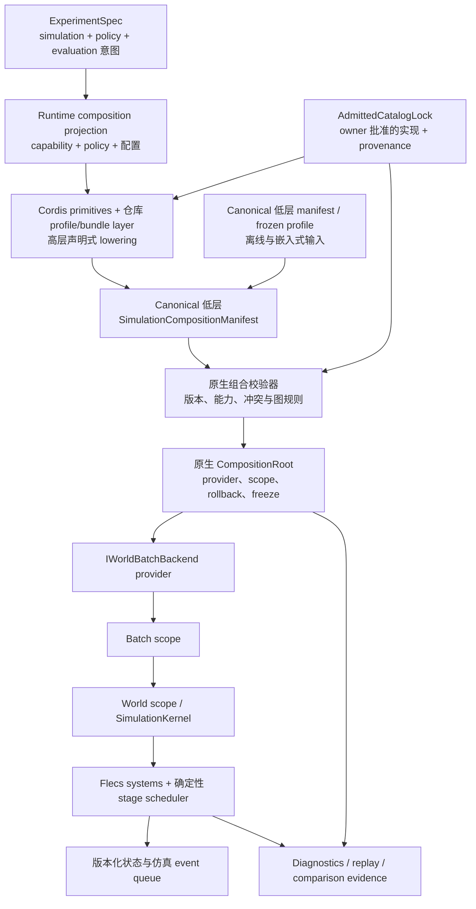

# Cordis 仿真组合内核架构

状态：`2026-08-23` 维护中的目标架构；P1 contract、P2-A 隔离原生 lifecycle baseline，
以及 P2-B/P2-C0/P2-C1/P3-A/P3-B、P4-A 默认 provider、P5-A 默认 CPU-exact
composition-evidence、P6-A 默认 profile Cordis package-maturation、P7-A 默认 CPU-exact
host/batch parity 与 P8-A migration closure 均已实现并验证。本 plan 在稳定规则提升到
维护中的 runtime composition baseline 后归档；更广 profile/package/backend、完整 replay、
CUDA、外部 plugin 与 Node host 工作继续由分别具名 owner held。

语言：

- 英文规范页：[cordis_simulation_composition_kernel_architecture.md](cordis_simulation_composition_kernel_architecture.md)
- 中文配套页：`cordis_simulation_composition_kernel_architecture.zh.md`

Document kind: `plan`
Lifecycle: `archived`
Canonical: `docs/architecture/work/archive/cordis_simulation_composition_kernel/cordis_simulation_composition_kernel_architecture.md`
Owner: `architecture/runtime-composition`
Last verified: `2026-08-23`

父项目：[Cordis 仿真组合内核](README.zh.md)

已实现 contract baseline：
[P1-B manifest 与 resolution contract](cordis_simulation_composition_contract_20260817.zh.md)。

## 1. 权威与设计定位

本方案服从维护中的
[仿真系统架构](../../../standards/simulation_system_architecture_design.zh.md)和
[Runtime workflow 基线](../../../standards/runtime_workflow_and_contract_baseline.zh.md)。
它不重新定义仿真状态、事件排序、stage 语义、backend parity、experiment authority
或领域成熟度。

长期目标既不是一个简单 C++ factory，也不是 JavaScript 驱动的仿真循环，而是四层
权威链：

- Experiment Face 拥有用户可见实验意图；
- runtime projection 把该意图表达为 typed capability、policy、profile 与配置；
- Cordis primitives 加仓库自有的 DeepSeek-Harness-style profile/bundle layer，在按
  owner 准入的类别之上独占维护中高层声明式 lowering，并输出 canonical 低层 request；
- 原生 composition compiler/root 拥有确定性重新校验、解析、实例化、资源生命周期、
  执行图冻结、rollback，以及向仿真引擎的交接。

因此 Cordis 是本计划必需的声明式 composition control plane，而不是 experiment policy、
实现准入、数值执行或因果-时序语义 owner。原生与 Python 离线路径通过消费 canonical
低层 manifest 或生成的 frozen profile 保留 embedded 运行；它们不独立 lower 任意
`RuntimeCompositionRequest`，因此不会形成第二个高层 resolver。

## 2. 证据基线

### 2.1 构造所有权

`SimulationKernel` 当前构造具体默认 model、event store、bridge 和 release service，
随后注册系统。因此该构造函数同时承担 world runtime 与 composition root。

### 2.2 生命周期不一致

model setter 替换 owning pointer 并更新部分 Flecs singleton ref。至少一个系统在注册
时捕获 environment model 指针，因此 provider 替换不是完整且一致安全的迁移。

### 2.3 Owner 准入的系统安装

P3-A 有界切片已将原先中央 component/system call list 替换为
`src/core/engine/system_contribution_registry.cpp`（systems layer declaration 在
`src/systems/system_contribution_registry.h`）。owner-derived registry 在安装前校验自身
owner row、metadata、dependency edge 与 stage order，然后安装 83 个 component、34 个
manifest system contribution 与 2 个显式 kernel-owned pre-update reset system。native
conformance 另行在 production realization 前把 registry 与冻结 resolved artifact join；
其 stage label 与 dependency edge 保持已接受默认图；
profile-specific omission 与完整 semantic read/write join 仍属于后续 projection 工作。该
registry 是可执行的 owner boundary，不是 Cordis package pipeline，也不是第二套 resolver。

### 2.4 部分后端与 stage 抽象

`IWorldBatchBackend`、runtime capability contract、exact-stage inventory 和
stage-node manifest 已经提供重要语义接缝。缺失的是选择实现、校验兼容性、绑定
生命周期，并把最终图记录为证据的 owner。

## 3. 不可妥协原则

1. **单一仿真 truth path。** Cordis、Python、Node、diagnostics 和 domain package
   可以请求 composition，但只有准入后的原生 runtime 可以实现权威状态转移。
2. **热路径无跨语言。** 维护中的 stage node 不得在 step 内调用 Node、JavaScript、
   Python、IPC 或动态 Cordis service。
3. **确定性组合。** 相同的准入输入必须生成相同 provider 集、stage graph、canonical
   bytes 和 composition hash，不受发现顺序影响。
4. **冻结可执行图。** 影响 truth 的 provider、system、clock 和 barrier 在 episode 内
   不可变，除非维护中的重配置 barrier 显式结束并重建受影响 scope。
5. **显式所有权。** 每个资源只有一个 owning scope；owner 销毁前必须失效所有借用引用。
6. **合同先于实现。** Cordis package 与原生代码消费同一版本化 schema，双方不得依赖
   对方私有对象布局。
7. **原生离线运行。** C++ 和 Python 部署在没有 Node 或下载插件时仍完整可用。
8. **按构造提供证据。** composition identity、provider version、contract version 和
   graph identity 属于每个可回放 run。
9. **受治理扩展。** plugin contribution 是准入请求，不是绕开 domain、stage、backend、
   information 或 evidence 规则的许可。
10. **失败原子性。** 部分 composition 不得变为 runnable；构造失败必须回滚完整受影响 scope。

## 4. 目标拓扑



Cordis 是维护中的唯一高层声明式 runtime composition lowering 路径。原生/Python
离线运行消费已有 canonical 低层 manifest 或生成的 frozen profile，并可暴露 P1-B
低层 expert API，但不解释任意 capability、policy 或 profile bundle。所有输入都必须
经过相同的 owner admission 与原生重新校验边界；任何输入都不得绕过该边界或成为第二
执行真值。

P2-C1 前，冻结的 P1-B 默认 fixture 仅是 migration input。P2-C1 后，任何从高层 request
派生的 maintained frozen profile 都必须由已接受的 Cordis lowering path 生成，并保留为
canonical artifact；原生/Python 可以加载该 artifact，但不得手工 lower 等价高层 profile。

## 5. 权威矩阵

| 事项 | 权威 | Cordis 角色 | 原生组合角色 | 仿真角色 |
| --- | --- | --- | --- | --- |
| 实验意图 | Experiment Face | 消费投影后的 runtime requirement，不重新定义 policy/evaluation 意图 | 无 | 执行已接受的 runtime 部分 |
| Runtime composition projection | experiment/runtime contract owner | 消费 typed request，不重新解释 experiment intent | 校验 request/catalog-lock version 与必需 identity | 无 |
| 高层声明式 lowering | Cordis primitives 加仓库 profile/bundle layer | 独占维护中 capability、policy、package 与配置到 canonical 低层 request 的 lowering | 重新校验精确低层结果，不运行第二高层 resolver | 无 |
| 实现准入 | 相应 model、system、backend、domain、evidence、security owner | 仅从锁定的 admitted catalog 选择 | 核验精确 descriptor、implementation、service type、capability 与 provenance | 无 |
| 离线 compatibility input | canonical manifest/frozen-profile artifact | 无 | 消费低层 expert contract，不解释任意高层 request | 无 |
| 插件发现 | Cordis 控制面或原生静态 catalog | 发现 descriptor 与配置 | 拒绝未知或未准入 descriptor | 无 |
| 依赖解析 | canonical composition contract | 生成请求图 | 确定性重新解析/核验 | 无 |
| Provider 实例 | 原生 composition root | 命名 provider 与配置 | 构造、拥有、暴露 typed handle、销毁 | 消费冻结 handle |
| ECS component/entity | Flecs world | 无 | 安装准入的 component/system contribution | 拥有状态与查询 |
| Stage 顺序 | stage contract 与原生 scheduler | 只贡献声明节点 | 校验完整图 | 执行确定性图 |
| 仿真 event | 原生 event queue | 无 | 如获准则绑定 event-family provider | 时间戳、排序、投递、回放 |
| 生命周期 event | composition root | 发布管理意图 | 执行状态迁移并记录结果 | 只在受治理 barrier 暂停/停止 |
| Backend 选择 | backend capability contract | 请求 backend profile | 准入并构造 provider | 执行 backend 语义 |
| Replay 身份 | evidence contract | 包含请求插件/配置身份 | 记录 realized identity 与 hash | 记录 state/event evidence |
| 公共 API | RuntimeFacade 与 binding | 可选 host adapter | 提供稳定原生 contract | 不提供 plugin-specific bypass |

## 6. 组合合同

### 6.1 `SimulationCompositionManifest`

manifest 是版本化、canonical、与宿主无关的 contract。P1-B 冻结以下 requested-manifest
表面：

```text
schema_version
composition_id
contract_versions
requested_profile
plugins[]
providers[]
service_bindings[]
component_contributions[]
system_contributions[]
backend_request
scope_policies
reconfiguration_policy
evidence_policy
compatibility_claims[]
```

resolution 生成独立的版本化 envelope，其中包含 normalized requested manifest、
provider/system order、requested-manifest SHA-256 与排除自身 hash 字段后计算的
resolved-manifest SHA-256。executable specification、generated schema、纯 C++ value
contract 与 fixture 由上方 P1-B contract 文档管理；本架构页保留长期边界，不复制每个
schema 字段。

schema 不得序列化 C++ pointer、Cordis object identity、Flecs entity ID、文件系统发现
顺序或宿主绝对路径。

长期概念模型分为：

1. `RuntimeCompositionRequest`：投影后的实验意图、所需 capability/policy、profile
   constraint 与配置；
2. `AdmittedCatalogLock`：owner 批准的 implementation、version、capability、provenance
   与 trust decision；
3. `ResolvedRuntimePlan`：精确 provider、binding、system/stage graph、scope generation
   与 evidence hash。

Cordis 集成前，`P2-C0` 必须把前两项落实成 executable artifact：版本化 producer-neutral
request DTO，以及确定生成的 owner-derived catalog lock；后者包含 category authority、
descriptor/version/capability/provenance entry、canonical bytes 与稳定 identity。Cordis
消费两者；原生侧核验 catalog-lock identity 与每个被选实现。

已冻结的 P1-B requested manifest 继续作为 producer 与原生 compiler 之间的 canonical
低层交换和 compatibility artifact。它可以按设计携带精确 descriptor，但不得成为未来
experiment author 唯一可见的 public authoring abstraction。

### 6.2 Plugin descriptor

每个 plugin descriptor 必须声明：

- 稳定 plugin/implementation ID；
- semantic version 和 composition-contract compatibility range；
- 提供与要求的 provider service；
- 适用 scope 和 instance cardinality；
- capability requirement 与 conflict；
- stage-node 与 component contribution；
- 配置 schema 与默认值；
- determinism class；
- host support（`native`、`cordis` 或二者）；
- artifact provenance 和未来真实性元数据；
- teardown/restart policy；
- 贡献的 evidence field。

配置文件中的插件顺序不得隐式决定 stage 顺序、service priority 或 event priority。

### 6.3 稳定 service key

service key 是由维护中 contract 定义的语义名，例如：

```text
simulation.environment.model
simulation.effects.model
simulation.sensor.model
simulation.acoustic.model
simulation.control.model
simulation.guidance.model
simulation.unit_factory
runtime.world_batch_backend
runtime.engagement_event_recorder
runtime.composition_evidence_sink
```

这些只是规划词汇，不是已授权生产字符串。P1 必须在代码落地前依据既有 owner contract
审查命名。

每个 required service 必须精确解析到一个准入 binding，除非 service contract 显式
定义 collection、chain、reducer 或 fallback。禁止隐式 last-registration-wins。

## 7. Scope 与生命周期模型

原生组合内核必须支持显式层级：

```text
ApplicationScope
  BackendScope
    BatchScope
      WorldScope
        EpisodeScope
```

| Scope | 典型 owner | 重建触发 |
| --- | --- | --- |
| Application | plugin catalog、schema registry、logging、不可变 host 配置 | 进程退出或 host 重配置 |
| Backend | CPU/CUDA provider、device allocation policy、backend capability set | backend 切换或失败 |
| Batch | world collection、worker policy、共享不可变 model data | batch resize 或重配置 |
| World | Flecs world、kernel service、system instance、world-local event store | world 替换或 composition 变化 |
| Episode | seed、episode-local cache、reset state、episode diagnostics | reset 或 episode 结束 |

规则：

- child 可以借用 parent service，但 parent 不得保留未拥有的 child reference；
- 资源创建后立即登记到 owning scope；
- scope 构造失败时，按确定且依赖安全的顺序销毁已成功创建资源；
- executor 正处于任一 stage 时不得销毁 scope；
- 重配置创建新的冻结 scope generation，不原地修改影响 truth 的 provider；
- diagnostics-only 资源只有在不影响状态、调度、observation、reward 或证据真值时才可
  使用较弱 restart 规则。

## 8. 原生组合内核

原生实现应收敛到如下语义角色：

```text
CompositionCatalog
CompositionResolver
CompositionValidator
CompositionPlan
CompositionRoot
CompositionScope
ServiceDescriptor
ServiceHandle<T>
ProviderFactory
SystemContribution
StageContribution
RegistrationEffect
CompositionEvidence
```

这些是语义角色，不是已冻结 C++ 类名。

### 8.1 解析算法

维护中的 resolver 必须：

1. 规范化并进行 schema 校验；
2. 从准入 catalog 解析 plugin/provider version；
3. 拒绝缺失 service、歧义 binding、冲突、不支持 scope 和 capability mismatch；
4. 建立 service 与 lifecycle dependency graph；
5. 合并 component 与 stage contribution；
6. 使用维护中的 contract 校验 stage read/write、clock、latency、sync、barrier 和
   event-family 规则；
7. 使用稳定语义 ID 排序等价节点，而不是发现顺序；
8. 生成 canonical bytes 与 resolved composition hash；
9. 事务式构造 scope；
10. 暴露 runnable facade 前冻结 executable composition。

### 8.2 Provider 访问

stage 执行应使用冻结的原生 handle 或由 composition root 填充的稳定 Flecs ref，
不得在热路径执行 string-based registry lookup。

provider 替换只允许：

- world 进入 runnable 前构造；
- 在准入 barrier 处重建 episode/world；
- 具备独立验收的 provider state migration contract。

目标架构禁止“替换 owning pointer，但已注册系统可能保留旧地址”的现有模式。

### 8.3 Registration effect

plugin 安装的每个 system、observer、singleton ref、event subscriber、device allocation
和外部资源都必须返回 owned registration effect 或等价 RAII token。销毁必须逆转
realized dependency graph，而不是偶然的异步完成顺序。

## 9. Stage 与领域组合

system plugin 不拥有调度，只贡献声明：

- 所需 component 与 data contract；
- stage node 与稳定 node ID；
- read/write state shard；
- clock 与 trigger condition；
- same-window/cross-window 关系；
- 生产或消费的 event family；
- barrier 与 synchronization policy；
- backend capability requirement；
- diagnostics/evidence hook；
- 实现或消费的 extension point。

原生 scheduler 把获准 contribution 编译为维护中的 causal-temporal graph。plugin 不得
调用 `ecs.progress()` 或直接运行未声明系统形成私有 pipeline。

Compatibility 与 acceptance profile 至少应包含：

- minimal contract-test runtime；
- common CPU exact runtime；
- air、naval、ground、combined-domain profile；
- 准入的 CUDA-resident profile；
- diagnostics/replay profile；
- 迁移期间复现当前默认 kernel 的 compatibility profile。

长期 authoring 选择 typed capability 与 policy。domain label 可以为迁移和易用性下沉为
owner 准入的 capability bundle，但不能成为永久 ontology，也不能定义第二套语义生命周期。

## 10. Cordis 控制面

`P2-C0` 后，首个 Cordis 纵向切片必须使用 Cordis plugin/context、service/injection、
event/effect primitives 加仓库 profile/bundle layer lower 默认 request，并为原生重新校验
输出 canonical P1-B bytes 与 catalog-lock identity。成熟 package 随后应表达：

- 一个用于 plugin catalog 与配置的 host/application context；
- backend 或独立 runtime instance 的 child context；
- manifest builder、profile resolver、host adapter、evidence exporter 和开发工具 service；
- host-side registration 的可逆 effect；
- load、validate、instantiate、stop、dispose 的 typed administrative event。

不得把仿真 entity 或 mutable state 作为通用 Cordis service 暴露，也不得以 Cordis
event ordering 作为仿真 event ordering。

Cordis producer 从显式 runtime-composition projection 与 admitted catalog 输出完整低层
manifest；原生侧必须再次校验并可拒绝。Cordis resolution 成功不等于 runtime admission
证据。

## 11. 宿主与 binding 模型

### 11.1 原生与 Python 模式

```text
Python / C++ caller
  -> RuntimeFacade
  -> native profile 或 manifest
  -> native composition root
  -> backend 与 simulation kernel
```

这是默认训练和嵌入路径，不携带 Node 依赖。

### 11.2 条件式 Cordis/Node 模式

这不是默认目标模式。只有原生组合合同稳定后，P6-B 又经独立 host decision 获准时，
才存在该模式。

```text
Node application
  -> Cordis plugins 与配置
  -> canonical manifest
  -> Node-API host adapter
  -> native composition root
  -> RuntimeFacade/backend/kernel
```

如果 P6-B 获准，Node adapter 应暴露与 facade 用例等价的粗粒度操作：configure、load
content、reset/setup、inject、advance、evaluate、export、diagnostics，而不是镜像每个
ECS 或 kernel 方法。

### 11.3 共同原生 ABI 方向

项目应先保持 nanobind 下方的 typed native owner。只有 P6-B 获准时，才应评估 nanobind
与 Node-API adapter 下方的窄 native host ABI，避免 binding 成为独立 runtime owner；
如果 typed C++ facade 能安全作为共同 owner，则该评估不应过早强制引入 C ABI。

## 12. Evidence、replay 与可比较性

每个维护中的 run 必须能导出：

- requested/resolved composition ID；
- canonical manifest hash；
- plugin/provider implementation version；
- backend profile 与准入 capability；
- stage graph hash 与 stage contract version；
- content/scenario identity；
- seed 与确定性配置；
- host mode 与 binding version；
- compatibility/migration flag；
- reconfiguration generation 与原因。

replay request 必须拒绝 composition mismatch，除非显式 comparison/migration protocol
定义处理方式。人类可读插件名不足以作为身份。

## 13. 确定性与并发

- catalog discovery 可以并行，但 resolution 输出必须确定；
- 只有 lifecycle graph 证明独立的节点才能并行构造；
- 即使 Cordis host 的单项清理是异步的，teardown 也必须遵守依赖顺序；
- world stepping 继续遵守既有原生 worker/backend 规则；
- 默认不为每个 world 创建 Cordis context，resolved batch composition 应实例化轻量原生
  world scope；
- GC、promise scheduling 或 Node worker scheduling 不得影响仿真时间、event priority、
  stage order 或随机流。

## 14. 失败模型

| 失败 | 必须结果 |
| --- | --- |
| schema 无效或版本不支持 | 依赖解析前拒绝 |
| provider 缺失或歧义 | 以稳定诊断码拒绝 |
| capability 或 stage 冲突 | 资源构造前拒绝 |
| provider 构造失败 | 完整回滚受影响 scope |
| backend 初始化失败 | 不发布 runnable facade |
| episode 资源失败 | 失败/重置该 episode，不破坏 sibling world |
| native freeze 后 Cordis host 断开 | 原生 policy 决定继续或受控停止；step 语义不依赖 host |
| teardown 失败 | 记录全部失败，继续安全的依赖销毁，并把 scope 标为不可用 |
| evidence 导出失败 | 遵循显式 strict/best-effort policy，不得静默宣称 replay 完整 |

diagnostics 必须命名 plugin ID、provider key、scope generation、dependency edge 和稳定
错误类别，不暴露私有 host object address。

## 15. 安全与插件准入

长期外部插件需要独立验收的政策，覆盖：

- artifact 来源、完整性、签名和撤销；
- native code 信任与进程隔离；
- 配置权限与 filesystem/network access；
- compatibility range 与 deprecation；
- provenance 保留；
- 在 maintained profile 中拒绝未评审的 truth-affecting plugin；
- 从锁定 catalog 可复现离线解析。

在该政策建立前，Cordis plugin 只能是仓库拥有或显式准入的开发资产。动态发现不代表
允许任意原生代码执行。

## 16. 性能要求

本项目以架构与正确性验收，不预设速度收益，但目标必须保证：

- 维护中的 stage execution 无跨语言调用；
- inner loop 无 string-key service lookup；
- composition 成本在运行前或显式重配置 barrier 支付；
- per-world lifecycle metadata 有界；
- 不强制每 world Node context；
- 对大 world batch 测量内存与启动成本；
- 默认 profile step throughput 保持在另行冻结的回归预算内；
- profile specialization 收益必须实测。

## 17. 目标仓库边界

最终路径仍需 P1 dependency review，但职责应大致收敛为：

```text
src/runtime/composition/        原生 contract、resolver、validator、scope
src/runtime/providers/          backend 与 runtime provider 实现
src/runtime/contracts/          host-neutral DTO 与生成 schema 表面
src/core/engine/                确定性 world 与 stage execution
src/interfaces/python/          仅 nanobind adapter
src/interfaces/node/            条件式 Node-API adapter；仅在 P6-B 获准时存在
packages/cordis-runtime/        Cordis 控制面 package 与 plugin SDK
tests/architecture/composition/ ownership、determinism 与 dependency guard
tests/runtime/composition/      lifecycle、parity、replay 与 failure test
```

首个 accepted slice 之前不得预建空目录树。

## 18. 迁移策略

迁移采用 strangler 方式并保留单一默认行为路径：

1. 记录当前默认构造与 stage-order 基线；
2. 引入低层 manifest 与原生 validator，但暂不改变构造；
3. 通过 compatibility profile 的 provider 构造既有默认实现，并输出首份 production
   composition identity；
4. 冻结 `RuntimeCompositionRequest` 与 owner-derived `AdmittedCatalogLock`，包括 version、
   canonical bytes、hash、正向 case 与负向 admission case；
5. 在这些 artifact 与 production native path 上加入仓库自有 Cordis 默认 profile producer
   端到端纵向切片；
6. 消除不安全替换并把 service 生命周期绑定到 scope；
7. 把系统注册拆为 owner 准入 package，同时保持精确默认图；P3-A 有界 registry 切片现已接受；
8. 把 capability/policy 与 compatibility profile 名称下沉到这些 package（P3-B）；
9. 把 backend 选择迁入准入 provider；
10. 把 composition evidence 扩展到 graph、backend、原生执行 owner、replay 与 comparison 表面；
11. 成熟化 Cordis package、overlay、diagnostics、provenance 与 tooling；
12. 对 Cordis-produced artifact 与冻结 semantic reference 证明有界 native-direct/本地
    `ef_py` caller 和 batch parity；
13. 仅在独立 host 用例获批后加入 Node host；
14. 只有 caller/parity 证据获验收后，才删除被取代的 constructor、setter 和静态组合真值。

compatibility wrapper 必须带移除条件，不得成为永久第二组合机制。

实现 checkpoint：迁移步骤 1 至 12 均已有有界且已接受的实现。步骤 9，即 P4-A 默认
backend-provider 有界迁移，在独立 `gpt-5.6-sol` / `max` 审阅返回 P0/P1/P2 = 0/0/0
后已接受。步骤 10，即 P5-A，接受维护中默认 CPU-exact realization 的精确 evidence：
request/manifest/lock/profile identity、全部 11 个 provider、83+2+34 executable graph、
精确 backend identity、原生执行 owner、每个 world/五类 scope、commit sealing，以及
replay/comparison mismatch rejection。其 host 字段不证明调用语言或物理模块来源。
步骤 11，即 P6-A，增加严格仓库自有 package/overlay SDK、确定性四节点依赖解析、跨平台
稳定原始字节 pin、精确 producer/package-lock identity、与实际 request/lock/profile
projection 绑定的封存 provenance，以及不包含本机路径的 diagnostics，同时不拥有
provider/backend/graph truth。独立 `gpt-5.6-sol` / `max` 审阅返回 P0/P1/P2 = 0/0/0。
这些结果使 P7-A eligible，并保持 P6-B conditional。步骤 12，即 P7-A，把 Cordis-produced
artifact identity 绑定到 native-direct/本地 `ef_py` 行与冻结的非零 action/state/event/
reward/termination/replay reference，并接受保守的 32-world cold/warm/reset/RSS/teardown
回归 envelope。独立 `gpt-5.6-sol` / `max` 审阅返回 P0/P1/P2 = 0/0/0。P8-A 随后闭合
有界默认 CPU-exact 计划；这些结果不准入更广 profile/package/backend、完整 replay、CUDA、
外部 plugin 或 Node hosting。

## 19. 被否决方案

### Cordis 直接驱动每个仿真 stage

否决，因为异步 host scheduling 会进入仿真语义，并增加跨语言开销和 replay 风险。

### 每个 world 嵌入一个 Node/Cordis runtime

否决为默认方案，因为 world batch 需要轻量、并行、原生实例。只有独立隔离的工具或开发
用例才可重新评审。

### 在 C++ 重写全部 Cordis 并永久不接入 Cordis 本体

否决为长期目标，因为这会丢失预期的 Cordis plugin/control-plane 关系。原生生命周期
语义仍然必要；准入的 Cordis producer 默认 profile 切片已接受，但更广 profile/package
扩展仍开放。

### 原生 substrate 存在后仍让 Cordis 永久保持可选

否决，因为本计划的目标是引入 Cordis plugin/context/service/injection/event/effect
primitives，加仓库自有的 DeepSeek-Harness-style profile/bundle layer，而不只是建设通用
manifest reader。原生和 system 切片可以独立获得有界验收，Node/外部
打包也可保持 conditional，但整体计划关闭必须包含准入的 Cordis producer/native 纵向路径。

### 让 Cordis 成为运行仿真的唯一方式

否决，因为 Python training、standalone C++、离线部署和原生校验不能依赖 Node 可用性。

### 保留当前 setter 并在旁边增加 service locator

否决，因为两个 mutation path 会保留悬垂引用和双重真值风险。

## 20. 重新评审触发

以下任一变化必须显式评审：

- 允许维护中的 stage 发生跨语言调用；
- 允许 episode 内热替换影响 truth 的插件；
- 让 Node 成为 native/Python 部署必需依赖；
- 让 Cordis 取代 Experiment Face 意图或按 owner 分类的准入，或绕过原生重新校验；
- 在没有显式替代架构决定时移除必需的 Cordis producer/native closure gate；
- 让 plugin order 决定 stage/event order；
- 引入新的 composition truth source；
- 通过通用 Cordis service 暴露 raw ECS state；
- 准入未签名或外部下载的 native plugin；
- 改变 canonical manifest 或 composition hash 语义；
- 新增 lifecycle scope 或 public host ABI。

## 21. 外部技术参考

- [Cordis 仓库](https://github.com/cordiverse/cordis)
- [DeepSeek Harness 仓库](https://github.com/deepseek-ai/DeepSeek-Harness)
- [DeepSeek Harness 使用的 Cordis primer](https://deepseek-harness.github.io/deepseek-harness/reference/cordis-primer)
- [Node-API 文档](https://nodejs.org/api/n-api.html)

这些来源只用于 Cordis/Node 集成模型。Echelon Forge 仿真语义仍以仓库 standards、
contracts、code 和 executable evidence 为权威。
