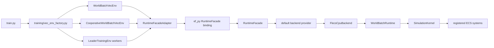

# Runtime infrastructure activation and cost audit

Issue: #126
Owner: architecture / runtime maintainers
Source snapshot: `55752527a` (the #125 branch head; this audit changes no C++ source)

## Reproducible census

Run `python -m tools.maintenance.runtime_infrastructure_census --output report.json`.
The tool uses Git-tracked `src/` files with `.h/.hpp/.cpp/.cc/.cxx` extensions.
Physical lines include blanks/comments. The inclusive view matches the issue's
convention; the maintenance view excludes test/vendor/generated directories and
`*.generated.h/*.gen.h`. No logical LOC, full Python, vendored dependency or
complete-domain capability claim is made. The output contains every file row;
the committed compact report keeps totals, groups and target edges.

| Folder | Files | Inclusive physical LOC | Excluding generated/test/vendor LOC |
|---|---:|---:|---:|
| `src/runtime/host` | 14 | 17,424 | 17,424 |
| `src/runtime/contracts` | 35 | 10,940 | 9,102 |
| `src/runtime/facade` | 35 | 7,825 | 7,825 |
| `src/runtime/composition` | 12 | 4,878 | 4,878 |
| Four runtime folders | 96 | 41,067 | 39,229 |
| `src/systems/physics` | 8 | 1,778 | 1,778 |
| `src/systems/domains/air` | 5 | 905 | 905 |

All tracked C++ in this scope totals 463 files/125,243 lines; after exclusions,
408 files/99,114 lines remain (24,291 test lines, 1,838 generated lines, no vendor
files in this tracked scope). Air-owned component/model/system folders add
1,449/910/905 lines; common physics, weapons, engine, content and other models
also serve air behavior. The two narrow system folders are not the whole physics
engine. These ratios do not establish overengineering or runtime overhead.

## Caller and target graph

`train.py` selects execution/cooperative/leader builders. Execution and
cooperative builders use the maintained world-batch path. Leader defaults to
multi-process vectorization, with its environment's facade mixin; the old
single-process batched leader inference requires explicit experimental opt-in.
Sources: `python/training/vec_env_factory.py`,
`python/rl/runtime/world_batch/vec_env.py`, its cooperative implementation,
`gym_envs/leader_env.py`, `python/rl/runtime/world_batch/adapter.py`, and
`src/runtime/facade/internal/world_batch_backend_provider.cpp`. The provider
factory constructs `FlecsCpuBackend`, whose owner is `WorldBatchRuntime`.

The compact census reuses #60's CMake target scanner: `ef_py -> ef_facade ->
ef_core -> {ef_content, ef_composition, ef_runtime_authority_contracts}` is
reachable, while candidate host/kernel/adapters/recorder targets are not
reachable from facade/Python roots. This graph is a syntactic union of branches,
not configured linker evidence. `EF_PRODUCTION_FACADE_ONLY=ON` selects production
facade-only bindings; the local acceptance build uses OFF for compatibility and
diagnostic tests. Conditional GPU links in the source graph do not prove CUDA
activation. Actual generated target-property manifests and four CTest boundary
verifiers complement the source graph; the existing caller inventory reports no
maintained P4-C caller violations or unclassified references.

## Code-to-value ownership and retention

| Feature / owner | Classification and current value | Validation authority | Activation or retirement decision |
|---|---|---|---|
| Facade, CPU provider, batch adapter / runtime facade + RL runtime | Production exercised: explicit batch inputs/observations, isolated backend ownership and one maintained training path | Native backend contract, live facade tests, P7 native/Python/Cordis parity, wheel gate | Retain. Consolidate only duplicate transport/projection code with behavior parity |
| Composition lifecycle/catalog / runtime composition | Production exercised at construction/reset: immutable admitted defaults, provider order and reproducible evidence | Composition contract/lifecycle probes and #127 installed-scheduler diagnostics | Retain. Declarative evidence is distinct from installed ECS schedule evidence |
| Canonical authority validation / runtime contracts | Production exercised through kernel construction and rollout admission; format/digest version validation | Exact vectors, authority CTest boundary, producer/native/wheel tests | Retain one format owner. Generated fixtures count as derived cost, not independent authority |
| Raw kernel diagnostics and legacy world shell / compatibility owners | Supported compatibility/test profile; production wheel restricts binding surface | Facade-only package tests and escape-hatch guards | Keep bounded tests; retire individual aliases only after zero maintained callers and a successor API |
| Host lifecycle + transfer + owner adapters + kernel seam / runtime host | Qualification/shadow: 12,735 C++ lines, generation fencing, transactional state transfer, fault isolation; no maintained facade caller | P4-C caller inventory, generated host target manifest, native candidate/parity suites and fault vectors | Retain at candidate scope. Wider publication requires its separate topology/state completeness and cutover gates; no production promotion from this audit |
| Native RunRecorder + file ledger / runtime host | Qualification/shadow: 4,689 lines, durable admission-before-mutation and recovery experiments; no ef_py/facade link | Recorder/authority boundaries, native recorder and ledger fault tests | Retain bounded qualification seam pending a concrete admitted native host consumer; reassess if the owning topology is abandoned |
| Python ArtifactLedger rollout controller / RL rollout authority | Production exercised by admission-bound adapter when required; separate from the native candidate ledger | Existing P5-D production binding, SQLite controller and rollback drill gates | Retain existing writer ownership. Do not infer that native RunRecorder is active from this Python controller |
| Python candidate adapter / runtime host | Qualification/shadow: epoch/receipt parity against the candidate, not production stepping authority | Candidate caller inventory and receipt replay/forgery tests | Keep excluded from maintained training imports; explicit promotion must update callers and authorities together |
| In-kernel production rebuild / kernel composition | No maintained caller; retired production authority, retained test/fault-injection seam | Existing rebuild retirement and zero-caller inventories | Keep test seam without restoring production authority; obsolete public aliases are separate retirement PRs |
| External/remote provider, broader host topologies / architecture program | Planned/held beyond bounded supported row | Long-horizon governance owner acceptance and topology-specific qualification | Deferred until an owned consumer and independent activation evidence exist |

The large host implementation is entirely on the qualification side of the
current source target graph. Its value is fault/state-transfer evidence, not
rollout throughput. Retention carries build, fault-test and documentation costs;
the active facade/composition code carries actual maintained runtime obligations.
Neither group should be deleted based on line count. Four current configured
boundary checks complete in about one second locally; full builds and durable
fault qualification cost materially more and remain in their existing lanes.

## Small follow-up decisions

1. Require a named consumer and activation receipt before promoting any native
   host/recorder candidate. Revisit candidate retention at the next owning
   topology decision; wider activation remains deferred.
2. Inventory duplicate Python/native ledger protocol projections before any
   consolidation. Preserve distinct writer/authority boundaries and negative
   recovery tests; do not unify based on similar DTO names.
3. Retire raw compatibility aliases one at a time after zero-caller evidence,
   retaining diagnostic/test entry points. The existing production rebuild
   retirement is already authoritative and should not be reopened here.
4. Profile the real training path before any infrastructure optimization. #136's
   head-only CPU report and pending CUDA gate do not measure facade or host cost.

No candidate is promoted and no runtime implementation is deleted in this audit.
Source scans and historical owner packets describe retention conditions; current
tests support only their bounded exercised paths.

## Current acceptance evidence

The source audit found no maintained P4-C candidate caller violations. Four
configured CTest boundary verifiers passed (host candidate, native recorder,
authority and contracts). The rebuild retirement fixture was stale because
earlier fixes moved the kernel declaration/implementation and smoke-test lines;
this audit refreshes the exact line inventory and digest. Its zero-production-
caller, zero-binding and facade-only package checks remain unchanged. Historical
owner acceptance packets retain their original snapshot and digest.
The facade core, candidate contract, rebuild reachability and retirement tests
passed together: 33 tests. This does not replace CUDA, production wheel or
wider host topology qualification.
