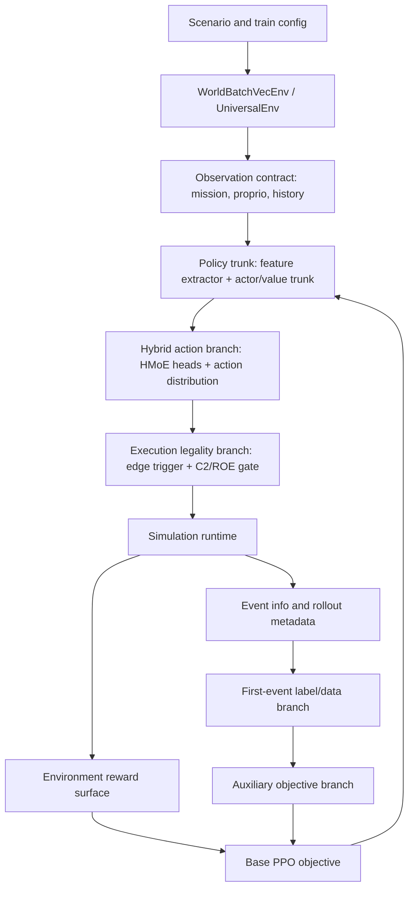

# M3-S1 Model Architecture Boundary Map

Status: `2026-06-05` initial boundary map for
[M3-S1 Censored Optimal-Stopping Timing Contract](README.md).

## Boundary Decision

The current training stack already has enough local mechanisms to hide the
root problem. M3-S1 therefore starts by separating model ownership before
changing code. Reward terms, C2/ROE gates, action transport, PPO losses, and
first-event timing objectives are related, but they are not the same object.

The next implementation slice should make every change land on one named
branch below. Any change that touches multiple branches must add an adapter or
contract note explaining the handoff.

## Architecture Spine

## Trunk And Branch Ownership

| Layer | Current code surface | Owns | Must not own |
| --- | --- | --- | --- |
| Scenario/config | `examples/config/training/**`, `scenarios/**`, `train.py` | Selects runtime, policy, reward knobs, and model flags. | Hidden training semantics that are not represented in docs/tests. |
| Runtime env | `python/rl/runtime/world_batch_vec_env.py`, `gym_envs/universal_env.py` | Rollout stepping, action handoff, info collection, terminal handling. | Timing labels or policy gradients. |
| Observation contract | `python/mission_obs_taxonomy.py`, `gym_envs/scenario_loader/mission_observation.py` | Observable C2/ROE state, masks, launch-window state, history fields. | Reward bonuses or loss targets. |
| Policy trunk | `python/rl/policy_algo/policies.py` feature extractor and actor/value trunk | Shared representation and PPO action/value outputs. | Environment reward shaping or label construction. |
| Hybrid action branch | `HierarchicalMoEExecutionPolicy`, `_HybridActionDistribution` | Hybrid action parameters, fire-event logits, optional event-credit values. | Censoring reconstruction or post-hoc reward accounting. |
| Execution legality branch | `gym_envs/universal_env_parts/actions.py`, `air_combat_event_action.py` | Thresholds, edge-trigger conversion, C2/ROE fire acceptance/suppression. | Training the policy by weakening masks. |
| Reward branch | `gym_envs/scenario_loader/reward_runtime/air_combat.py` | Scalar environment reward and reward breakdown. | One-shot timing supervision or stop-boundary acceptance. |
| Rollout metadata branch | `ppo_adaptive_kl.py::collect_rollouts`, env `infos` | Carries accepted/rejected events, masks, episode/window IDs, censoring metadata. | Loss formulas or action execution. |
| Label/data branch | `first_event_hazard.py`, `first_event_rollout_buffer.py` | Builds timing evidence and preserves grouping metadata. | Policy-head implementation or environment reward. |
| Auxiliary objective branch | `ppo_adaptive_kl.py`, first-event loss helpers | Computes training losses and diagnostics for timing heads. | Runtime legality, reward shaping, or scenario truth mutation. |

## Loss And Reward Separation

| Signal | Mathematical object | Implementation owner | M3-S1 rule |
| --- | --- | --- | --- |
| Environment reward | Scalar return for PPO advantage estimation. | Reward runtime and scenario config. | May encourage behavior, but must not be the only source of first-event timing supervision. |
| Base PPO loss | Policy/value optimization over sampled actions and returns. | `ppo_adaptive_kl.py` inherited PPO path. | Remains the trunk objective; timing additions must be explicitly auxiliary. |
| A6 hazard loss | Per-row first-event target over event-logit delta. | A6/A7 first-event helpers. | Treated as legacy/support; cannot be the final grouped stopping contract by itself. |
| A7 credit loss | `Q_fire_once - Q_hold` supervision and optional delta alignment. | A7 event-credit path. | May support diagnostics or ranking, but does not replace grouped event-time mass. |
| M3-S1 grouped stopping loss | Window-level likelihood, early-mass budget, censor-aware survival. | New or refactored first-event objective path. | Must preserve episode/window grouping until loss computation. |
| Deterministic stop boundary | `stop iff legal and Delta_t >= threshold`. | Policy-head contract plus diagnostics. | Acceptance depends on boundary behavior, not stochastic release anecdotes alone. |

## First Implementation Cut Points

| Cut point | File surface | Why it matters | First action |
| --- | --- | --- | --- |
| Data/censoring handoff | `AdaptiveKLPPO.collect_rollouts()` and `_attach_a6_first_event_labels_to_rollout_buffer()` | Current rollouts know masks/accepted events but do not yet expose a complete wait-preserving timing contract. | Define metadata fields before changing losses. |
| Group preservation | `first_event_rollout_buffer.py` and rollout samplers | PPO minibatches can flatten and shuffle rows, which can collapse window objectives back into per-row classification. | Decide whether grouped loss needs a side buffer or grouped minibatch view. |
| Label construction | `first_event_hazard.py::build_first_event_hazard_labels()` | Current labels contain window IDs and sources but still feed mostly row-wise losses. | Separate evidence construction from loss target policy. |
| Grouped objective | `first_event_hazard.py` loss helpers or new sibling module | This is where censored survival / optimal-stopping math belongs. | Add a contract before code. |
| Policy boundary | new independent stopping head plus existing `_HybridActionDistribution` adapter | P3 selects an independent stop score; event delta remains action-branch diagnostic/adapter surface. | Add the stopping head only after P4 opens. |
| Reward boundary | `reward_runtime/air_combat.py` | Release bonuses/penalties are useful environment signals but cannot define legality or event-time labels. | Audit reward knobs only after data/loss contract exists. |

## Forbidden Couplings

- Do not make an illegal fire event valid by modifying reward magnitude.
- Do not train executable event logits from closed-mask shadow rows unless they
  are projected into legal-open observations by an explicit contract.
- Do not allow grouped timing objectives to pass through a sampler that destroys
  episode/window grouping without reconstructing that grouping.
- Do not claim deterministic learned behavior from stochastic release samples.
- Do not release M2 only because the current A7 branch is blocked.

## Open Questions For P1

- Which wait-preserving data route is cheapest: forced-hold probes,
  counterfactual replay branches, or low-hazard exploratory rollouts?
- Can the current rollout buffer carry grouped windows without fighting PPO
  minibatch shuffling?
- Should the first grouped loss be a survival hazard likelihood, an ordinal
  margin fallback, or an offline direct stopping-distribution probe?
- Which focused tests prove the independent stopping head does not collapse back
  into executable event logits?
