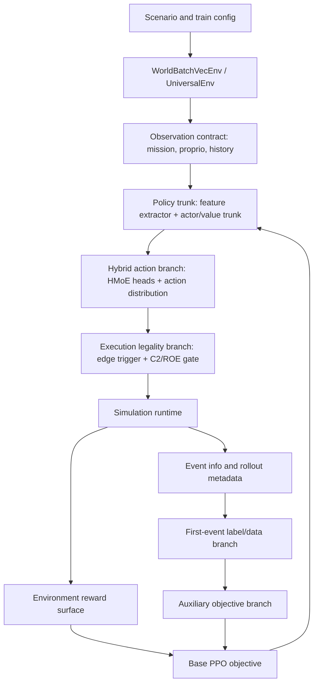

# M3-S1 模型架构边界图

状态：`2026-06-05`，用于
[M3-S1 Censored Optimal-Stopping Timing Contract](README.zh.md) 的初始边界图。

## 边界决策

当前训练栈已经有足够多局部机制，容易把根因藏起来。因此 M3-S1 先整理模型归属，再改代码。
reward terms、C2/ROE gates、action transport、PPO losses 与 first-event timing
objectives 相互关联，但不是同一个对象。

下一实现切片的每个改动都必须落到下面某个命名分支。若一个改动触碰多个分支，需要增加
adapter 或 contract note 解释 handoff。

## 架构主干

## 主干与分支归属

| Layer | 当前代码表面 | 拥有 | 不应拥有 |
| --- | --- | --- | --- |
| Scenario/config | `examples/config/training/**`, `scenarios/**`, `train.py` | 选择 runtime、policy、reward knobs 与 model flags。 | 未在文档/测试中表达的隐藏训练语义。 |
| Runtime env | `python/rl/runtime/world_batch_vec_env.py`, `gym_envs/universal_env.py` | rollout stepping、action handoff、info collection、terminal handling。 | timing labels 或 policy gradients。 |
| Observation contract | `python/mission_obs_taxonomy.py`, `gym_envs/scenario_loader/mission_observation.py` | 可观测 C2/ROE state、masks、launch-window state、history fields。 | reward bonuses 或 loss targets。 |
| Policy trunk | `python/rl/policy_algo/policies.py` feature extractor 与 actor/value trunk | shared representation 与 PPO action/value outputs。 | environment reward shaping 或 label construction。 |
| Hybrid action branch | `HierarchicalMoEExecutionPolicy`, `_HybridActionDistribution` | hybrid action parameters、fire-event logits、optional event-credit values。 | censoring reconstruction 或 post-hoc reward accounting。 |
| Execution legality branch | `gym_envs/universal_env_parts/actions.py`, `air_combat_event_action.py` | thresholds、edge-trigger conversion、C2/ROE fire acceptance/suppression。 | 通过削弱 masks 来训练 policy。 |
| Reward branch | `gym_envs/scenario_loader/reward_runtime/air_combat.py` | scalar environment reward 与 reward breakdown。 | one-shot timing supervision 或 stop-boundary acceptance。 |
| Rollout metadata branch | `ppo_adaptive_kl.py::collect_rollouts`, env `infos` | 携带 accepted/rejected events、masks、episode/window IDs、censoring metadata。 | loss formulas 或 action execution。 |
| Label/data branch | `first_event_hazard.py`, `first_event_rollout_buffer.py` | 构建 timing evidence 并保留 grouping metadata。 | policy-head implementation 或 environment reward。 |
| Auxiliary objective branch | `ppo_adaptive_kl.py`, first-event loss helpers | 计算 timing heads 的 training losses 与 diagnostics。 | runtime legality、reward shaping 或 scenario truth mutation。 |

## 损失与奖励分离

| Signal | 数学对象 | 实现归属 | M3-S1 规则 |
| --- | --- | --- | --- |
| Environment reward | PPO advantage estimation 使用的 scalar return。 | reward runtime 与 scenario config。 | 可以鼓励行为，但不能作为 first-event timing supervision 的唯一来源。 |
| Base PPO loss | 基于 sampled actions 与 returns 的 policy/value optimization。 | `ppo_adaptive_kl.py` 继承 PPO 路径。 | 保持为主干目标；timing additions 必须明确为 auxiliary。 |
| A6 hazard loss | event-logit delta 上的 per-row first-event target。 | A6/A7 first-event helpers。 | 作为 legacy/support；不能单独成为最终 grouped stopping contract。 |
| A7 credit loss | `Q_fire_once - Q_hold` supervision 与可选 delta alignment。 | A7 event-credit path。 | 可作为 diagnostics 或 ranking 支撑，但不能替代 grouped event-time mass。 |
| M3-S1 grouped stopping loss | window-level likelihood、early-mass budget、censor-aware survival。 | 新增或重构 first-event objective path。 | 必须保留 episode/window grouping 直到 loss computation。 |
| Deterministic stop boundary | `stop iff legal and Delta_t >= threshold`。 | policy-head contract 与 diagnostics。 | 验收依赖 boundary behavior，而不是 stochastic release anecdotes。 |

## 第一批切入点

| Cut point | File surface | 重要性 | 第一动作 |
| --- | --- | --- | --- |
| Data/censoring handoff | `AdaptiveKLPPO.collect_rollouts()` 与 `_attach_a6_first_event_labels_to_rollout_buffer()` | 当前 rollout 知道 masks/accepted events，但还没有完整 wait-preserving timing contract。 | 改 loss 前先定义 metadata fields。 |
| Group preservation | `first_event_rollout_buffer.py` 与 rollout samplers | PPO minibatches 会展平并打乱 rows，可能把 window objective 退化为 per-row classification。 | 判断 grouped loss 是否需要 side buffer 或 grouped minibatch view。 |
| Label construction | `first_event_hazard.py::build_first_event_hazard_labels()` | 当前 labels 有 window IDs 与 sources，但主要仍进入 row-wise losses。 | 将 evidence construction 与 loss target policy 分离。 |
| Grouped objective | `first_event_hazard.py` loss helpers 或新 sibling module | censored survival / optimal-stopping 数学应在这里落地。 | 先写 contract，再写代码。 |
| Policy boundary | 新增独立 stopping head 加现有 `_HybridActionDistribution` adapter | P3 选择独立 stop score；event delta 保持为 action-branch diagnostic/adapter surface。 | 只有 P4 打开后才增加 stopping head。 |
| Reward boundary | `reward_runtime/air_combat.py` | release bonus/penalty 是环境信号，但不能定义 legality 或 event-time labels。 | data/loss contract 存在后再审 reward knobs。 |

## 禁止耦合

- 不通过修改 reward magnitude 让非法 fire event 变成合法。
- 不从 closed-mask shadow rows 训练 executable event logits，除非它们通过显式合同投影到 legal-open observations。
- 不让 grouped timing objective 经过破坏 episode/window grouping 的 sampler，除非显式重构 grouping。
- 不用 stochastic release samples 宣称 deterministic learned behavior。
- 不因为 A7 当前堵塞就直接释放 M2。

## P1 开放问题

- 最便宜的 wait-preserving data route 是 forced-hold probes、counterfactual replay branches，还是 low-hazard exploratory rollouts？
- 当前 rollout buffer 是否能承载 grouped windows，而不与 PPO minibatch shuffling 冲突？
- 第一个 grouped loss 应该选 survival hazard likelihood、ordinal margin fallback，还是 offline direct stopping-distribution probe？
- 哪些 focused tests 能证明独立 stopping head 没有重新坍缩回 executable event logits？
