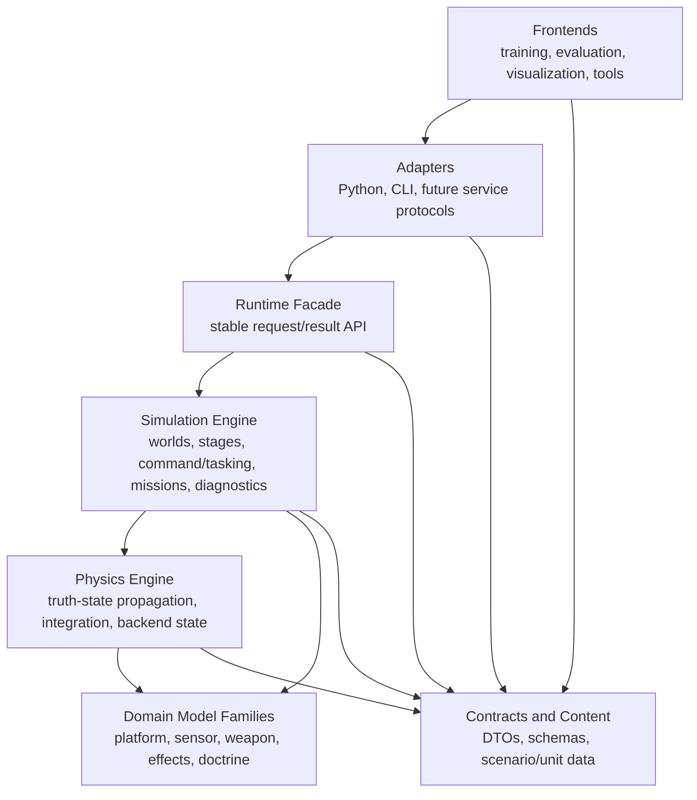
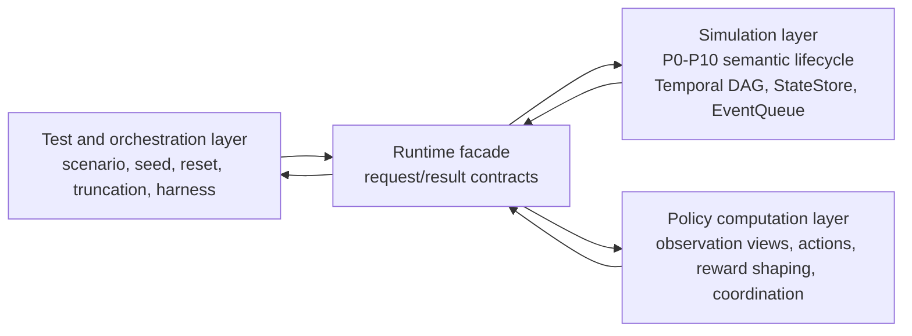

# Simulation System Architecture Design

Navigation:

- Architecture index: [README.md](README.md)
- Chinese companion: [simulation_system_architecture_design.zh.md](simulation_system_architecture_design.zh.md)
- Prior layering plan: [system_layering_and_engine_encapsulation_plan.md](system_layering_and_engine_encapsulation_plan.md)
- Performance follow-up: [architecture_and_performance_research_followup.md](architecture_and_performance_research_followup.md)
- Task execution entry: [../../task/simulation_architecture/README.md](../../task/simulation_architecture/README.md)

Status: `2026-05-19` strict architecture baseline.

This document is the architecture authority for the maintained simulation
system shape. It turns the earlier layering and performance research documents
into stricter ownership rules, a canonical semantic lifecycle, a multi-rate
execution graph model, and the domain extension model that future task sheets
should follow.

It is not an implementation freeze. Concrete code work still needs a scoped
task plan with acceptance criteria.

## 1. Design Thesis

Echelon Forge should be organized around one canonical simulation lifecycle and
a clocked execution graph, not around vertical service branches such as
`air stack`, `naval stack`, or `weapon stack`.

Domain-specific behavior should enter the lifecycle through explicit model
families and stage contracts:

- platform families
- tasking and doctrine families
- sensor, track, and data-link families
- launcher and mount families
- munition, seeker, guidance, fuze, effects, and damage families
- backend families for CPU, GPU, reduced-fidelity, or external FDM execution

The project ceiling is set by how stable these contracts and scheduling rules
are. A local weapon, naval, or air feature may be useful, but it should not
create a private end-to-end runtime path.

## 2. Architecture Laws

These rules are normative for new architecture work:

1. The maintained frontend depends on `runtime/facade`, not on raw
   `WorldBatchRuntime`, `SimulationKernel`, Flecs entities, or implementation
   ordering.
2. Authoritative state lives in the compiled simulation or physics backend.
   Python and other frontends may keep mirrors, but mirrors are partial,
   delayed, and non-authoritative.
3. `components/` and `runtime/contracts/` define data contracts. They do not
   own per-tick behavior.
4. `systems/` mutates ECS state during scheduled stages. It does not define new
   DTOs, own world lifecycle, or expose external APIs.
5. `models/` owns replaceable behavior implementations. It does not register
   ECS systems, bind Python, or parse mission JSON.
6. `content/` describes static scenario, unit, and configuration content. It
   does not own runtime behavior.
7. `runtime/facade` exposes use-case request and result APIs. It must not copy
   every low-level kernel method upward.
8. `interfaces/` and Python adapters translate formats. They do not own
   simulation semantics.
9. GPU and device-resident paths are backend capabilities, not alternate public
   truth paths. CPU exact semantics remain the baseline until a backend parity
   plan says otherwise.
10. Any domain extension must declare which pipeline stages it participates in,
    what packets it consumes and produces, and which validation proves it did
    not bypass the canonical lifecycle.
11. The `P0-P10` table is semantic, not a forced equal-step linear executor.
    Runtime execution should be modeled as a multi-rate temporal DAG whose
    feedback crosses explicit state or event boundaries.
12. Coupling between simulation, policy computation, and test/orchestration
    layers must be explicit. Policy and test code may request views, actions,
    rewards, truncation, or resets through facade contracts, but they must not
    become hidden owners of authoritative simulation state or episode truth.

## 3. Target Layer Model



The model refines the earlier
`frontend adapters -> runtime facade -> simulation engine -> physics engine -> model backends`
plan. The important addition is that domain behavior is a set of model families
attached to the shared lifecycle, not separate runtime stacks.

## 4. Canonical Semantic Lifecycle

Every maintained scenario step should be explainable through these semantic
stages. Some scenarios can skip stages with empty packets, but they should not
invent a parallel lifecycle.

This table does not require all stages to execute once per outer step, nor does
it require identical `dt`. It defines ownership, packet vocabulary, and
explainability order. The actual runtime schedule is defined by the temporal
DAG in the next section.

| Stage | Owner | Inputs | Outputs | Must not own |
|-------|-------|--------|---------|--------------|
| `P0 ContentCompile` | `content/`, adapters, facade setup | scenario files, unit data, backend capability requests | typed setup packets, content ids | per-tick behavior |
| `P1 WorldSetup` | `runtime/facade`, `core/engine` | setup packets, seeds, terrain/environment refs | world batch, entity refs, initial state | frontend cache policy |
| `P2 TaskingIntent` | `components/tasking`, `core/mission` | task orders, leader intents, doctrine content | tasking state, authority state | low-level actuation |
| `P3 CommandDelivery` | `components/command`, command-link systems | command packets, link QoS, latency/drop state | delivered commands, pending queues | physics or sensor behavior |
| `P4 PlatformControl` | control models, platform systems | commands, platform state, autopilot/control laws | force/torque intents, actuator state | world lifecycle |
| `P5 PhysicsStep` | physics systems/backends | physical state, environment, force/torque inputs | updated truth state, physics traces | mission JSON, reward, gym API |
| `P6 SenseTrackLink` | sensor, track, EW, data-link systems/models | truth state, emissions, environment, link state | tracks, detections, comm packets | weapon effects or damage |
| `P7 FireControlLaunch` | simulation engine and weapon launch models | tracks, ROE, authority, launcher state | launch events, munition entities | closed-loop munition guidance |
| `P8 MunitionLifecycle` | guidance, seeker, fuze models, combat systems | munition state, target tracks/truth, environment | terminal events, misses, fuze events | platform mission ownership |
| `P9 EffectsDamage` | effects models and damage systems | hit/fuze events, warhead/effects content | damage reports, kill state, subsystem effects | observation packing |
| `P10 ObservationExport` | facade, observation systems, diagnostics | state snapshots, reports, traces | observation packets, debug traces, exports | authoritative state mutation |

The stage names are architecture vocabulary. The repository may continue to use
existing function and file names while it migrates, but new docs and tests
should map local behavior back to this table.

## 5. Temporal DAG Execution Model

The execution model is a temporal directed acyclic graph for each scheduling
window, with feedback carried through versioned state and timestamped events.

In a single scheduling window:

```text
State[t] + EventQueue[t]
  -> stage-node DAG
  -> writes, emitted events, diagnostics
  -> State[t + dt] + EventQueue[t + dt...]
```

The graph inside the window must be acyclic. Feedback such as
`damage -> platform capability -> sensor quality -> fire control` is legal only
when it crosses a state-store version, event queue timestamp, or explicit
barrier.

Edges inside a scheduling window are derived from data dependencies, not drawn
by preference. A same-window edge `A -> B` is legal when `B.read_set` intersects
`A.write_set` and `A` publishes that write inside the same window. If `B` reads
only a committed `StateStore` snapshot from a previous window, that is
cross-window feedback, not a same-window DAG edge. This rule keeps the temporal
DAG from becoming a disguised linear pipeline.

Execution graph concepts:

| Concept | Meaning |
|---------|---------|
| `StageNode` | A scheduled unit of work, such as command delivery, control law, sensor scan, fire-control, guidance update, damage apply, or observation export. |
| `StateStore` | Authoritative state with versioning. It may be host-owned, backend-owned, or partially synchronized. |
| `EventQueue` | Delayed or timestamped events such as command arrival, launch, fuze trigger, damage application, and report export. |
| `ClockDomain` | Cadence rule for a node, such as fixed-rate physics, sensor scan interval, command-link tick, event-driven damage, or facade-requested export. |
| `Barrier` | Consistency boundary where writes become visible to later nodes or later windows. |

State versioning starts coarse but must leave room for shards. A single global
state version is acceptable for early CPU-only smoke and diagnostics, but any
resident-state or partial-sync backend must support domain-sharded versions,
for example physics state, tasking state, track state, damage state, and
observation export state. Stage nodes should therefore name the state shard they
read or write whenever that is known.

Events are ordered deterministically by `(timestamp, priority, event_id)`.
`timestamp` decides simulated time, `priority` is fixed by event family, and
`event_id` is generated deterministically from the producing node and local
sequence. Insert order must not be the only tie-breaker for maintained
simulation behavior because parallel stage nodes and mixed CPU/GPU producers
would make replay fragile.

Clock domains use nested triggering by default. The base tick owns the outer
deterministic schedule, and lower-rate nodes run on declared multiples or
declared schedule slots. Independent clock domains are allowed only when a
freeze plan specifies their deterministic merge policy and event ordering at
barriers.

Every maintained stage node should declare:

| Field | Requirement |
|-------|-------------|
| `semantic_stage` | Which `P0-P10` stage or stages this node belongs to. |
| `read_set` | State, packets, snapshots, or events the node reads. |
| `write_set` | State, packets, events, or diagnostics the node writes. |
| `clock_domain` | How often or under which event condition the node runs. |
| `latency_policy` | Whether outputs are same-window, next-window, delayed, or link-latency controlled. |
| `sync_policy` | Host-owned, backend-owned, partial sync, observation-only sync, or explicit export. |

Typical clock domains:

| Stage family | Expected cadence |
|--------------|------------------|
| Physics integration | Fixed high-rate inner loop or backend substep. |
| Platform control | Control-rate update, often slower than physics but faster than tasking. |
| Sensor and track | Sensor-specific scan intervals plus track-fusion cadence. |
| Command and data link | Link tick plus latency/drop event scheduling. |
| Fire control | Track/ROE/authority-driven, usually lower rate than physics. |
| Munition lifecycle | Guidance-rate and fuze/event-driven hybrid. |
| Effects and damage | Event-driven, with delayed reports when needed. |
| Observation export | Facade request, episode boundary, diagnostic trigger, or batch collector cadence. |

The design rule is:

```text
P0-P10 = semantic lifecycle
Temporal DAG = execution scheduler
StateStore/EventQueue = feedback boundary
Contracts = packet/state/event vocabulary
```

## 6. System Layer Coupling Model

The `P0-P10` lifecycle and temporal DAG define the simulation layer. The whole
system, however, has three coupled layers:

| Layer | Owns | Must not own |
|-------|------|--------------|
| Simulation layer | Authoritative world state, state evolution, temporal DAG scheduling, event ordering, facade-visible snapshots, simulation-semantic termination, and compiled mission runtime products. | Training-loop policy state, experiment curriculum, frontend-only observation encoders, or test harness scheduling. |
| Policy computation layer | Learned, scripted, or human-directed policy logic; observation view selection; action generation; coordination intent generation; and experimental reward shaping. | Raw ECS mutation, authoritative episode phase, physics truth, or private command injection that bypasses facade contracts. |
| Test and orchestration layer | Scenario selection, seeds, reset requests, curriculum scheduling, max-step truncation, replay, CI smoke, and validation harnesses. | Simulation-semantic termination, hidden state mutation, or a second implementation of the runtime lifecycle. |

The layers should interact through facade-shaped request/result contracts, not
through shared assumptions about Python helper call order or C++ internal owner
layout.



Cross-layer coupling is not a weakness by itself. It becomes a structural risk
only when ownership is implicit. The target design therefore treats the policy
layer and orchestration layer as external stage-node producers and consumers
with their own clock domains and versioned requests.

Cross-layer contracts:

| Contract | Primary owner | Simulation-layer responsibility | Policy/orchestration responsibility |
|----------|---------------|---------------------------------|-------------------------------------|
| `ObservationViewSpec` | Policy or test layer | Expose queryable state shards, committed snapshot versions, facade packet builders, and diagnostics. | Select fields, encoding, normalization, stacking, masking, required/optional fields, and schema version for a consumer. |
| `ObservationPacket` | Runtime facade | Return data sampled at a declared barrier or snapshot version, with source time and schema metadata. | Consume the packet without assuming raw ECS layout or unversioned Python-side field order. |
| `ActionIntentPacket` | Policy layer | Accept action intent through facade and translate it into command/control inputs at `P3/P4` boundaries. | Declare action source, effective time, target entity, action family, `merge_policy`, and whether it is direct control, mission command, or coordination intent. |
| `ActionHoldPolicy` | Policy layer, enforced by facade/simulation | Apply hold-last, interpolation, expiry, or drop semantics deterministically across control-rate and physics-rate ticks. | Declare action validity duration, refresh cadence, expiry behavior, and credit-assignment latency assumptions. |
| `CoordinationIntentPacket` | Policy layer | Admit scripted, learned, or human director output only through tasking/command facade paths, then schedule it into `P2/P3`. | Declare source type, source id, target roster, update clock, `merge_policy`, and produced tasking or leader-intent fields. |
| `RewardSpec` / `RewardReport` | Split ownership | Provide semantic facts, compiled mission products, damage/kill reports, and versioned state snapshots. | Compose experiment reward, shaping weights, curriculum-dependent terms, and consumer-specific reward breakdowns. |
| `TerminationSpec` / `EpisodeStatus` | Split ownership | Own simulation-semantic `terminated` reasons such as crash, kill, mission success, out-of-bounds, or fuel exhaustion. | Own experiment `truncated` reasons such as max steps, curriculum cutoff, early stopping, or benchmark wall-clock policy. |
| `EpisodeLifecycleContract` | Simulation layer for authoritative phase; orchestration for reset requests | Own authoritative episode phase, transition result, reset application, and facade-exported mirrored status. | Request reset/truncation, mirror status for Gymnasium or test APIs, and never advance a private authoritative state machine. |

Contract detail rules:

| Area | Rule | Examples |
|------|------|----------|
| `RewardSpec` fact boundary | A quantity is a simulation fact if and only if it depends only on authoritative simulation state plus static mission/content data, and does not depend on training configuration such as weights, curriculum phase, RL algorithm, or benchmark policy. Everything else is a shaping term or experiment composition. | Crash state is a fact. Cross-track distance from a mission route is a fact. Cross-track distance squared times weight `0.5` is shaping. Curriculum phase 1-3 doubling a route reward is shaping. |
| `ObservationViewSpec` version format | Use `<major>.<minor>` schema versions. Minor changes are compatible additions or layout changes that preserve field semantics. Major changes are incompatible deletions or semantic/encoding changes. | `v1.0 -> v1.1` may add optional `radar_altitude`; old consumers ignore it. `v1.1 -> v2.0` may remove `legacy_heading_raw` or change `heading` from `[0,360)` degrees to `[-pi, pi)` radians; old consumers must reject it. |
| `ObservationViewSpec` fields | Every view spec declares `schema_version`, `required_fields`, and `optional_fields`. Checkpoint loading must reject major-version mismatches and report incompatible required fields. Minor-version differences may load when unknown optional fields can be ignored and missing optional fields can be default-filled. | A policy checkpoint trained on `1.x` may load against `1.2` if all required fields exist. A checkpoint trained on `1.x` must not silently load against `2.0`. |

`merge_policy` is a required cross-layer request field for
`ActionIntentPacket` and `CoordinationIntentPacket`. Legal values are:

| Value | Semantics | Typical use |
|-------|-----------|-------------|
| `last_write_wins` | Sort by `effective_time`; the latest write wins. Same-timestamp ties use source priority. | Single-producer or conflict-free scenes. This is the default. |
| `priority_override` | Source priority overrides lower-priority producers: `human` > `policy` > `scripted` > `diagnostic`. | Safety-critical human override or supervised AI operation. |
| `reject_on_conflict` | Multiple same-window writes to the same entity/field are rejected and surfaced as an error. | Deterministic validation and contract tests. |
| `merge_by_field` | Different fields on the same entity may merge; same-field conflicts fall back to `last_write_wins`. | Multi-role coordination where one producer writes formation metadata and another writes local control intent. |
| `append_only` | Writes append to a queue and are consumed downstream in deterministic queue order. | Ordered task or command sequences consumed by `P3 CommandDelivery`. |

Design consequences:

1. Observation assembly is a policy-facing view contract. The simulation layer
   should expose stable state snapshots and facade packet builders; the policy
   layer may define feature subsets, encodings, and normalization. Adding a
   policy feature should require simulation work only when the requested truth
   state or diagnostic export does not yet exist.
2. Reward is split into simulation facts and experiment composition.
   Simulation-semantic rewards or mission products may be compiled, but shaping
   weights and training-specific reward mixes should remain configurable
   without recompiling the simulation. If Python computes reward from mirrors,
   the mirror snapshot version and latency must be explicit.
3. `terminated` and `truncated` are not one owner. Simulation owns semantic
   termination; policy/test/orchestration may request truncation. Facade
   results should report reason, source layer, and snapshot time for both.
4. Coordination directors belong outside the simulation layer unless they are
   explicitly promoted to a simulation model. A scripted, learned, or human
   director may produce `TaskingPacket`, `MissionCommand`, or `LeaderIntent`
   content only through facade-compatible assignment paths.
5. Policy inference cadence is a first-class clock domain. A policy running at
   10 Hz, platform control at 20 Hz, and physics at 60 Hz is legal only when
   `ActionHoldPolicy` declares how one policy output is consumed by multiple
   control ticks and how observation sample time aligns with reward.
6. `P4 PlatformControl` consumes resolved command/control inputs. `P5
   PhysicsStep` consumes physical force/torque or backend integration inputs;
   it must not consume raw policy vectors.
7. `ScenarioLoader` and Gymnasium wrappers are target-state adapters and
   mirrors, not authoritative runtime owners. They can satisfy API shape such
   as `(obs, reward, terminated, truncated, info)`, but the transition truth
   should be recoverable from compiled episode/facade results.
8. Hierarchical RL should model sub-episodes as explicit lifecycle annotations
   or orchestration scopes. It should not duplicate the core episode state
   machine in Python and C++.
9. External graph inputs are injected before the scheduling-window barrier.
   At the start of a window, the facade collects arrived cross-layer requests,
   translates them into state writes or event enqueues, and then runs the DAG.
   Window nodes read the injected state/events. A policy action emitted for
   step `N` is visible to same-window `P3 CommandDelivery` and `P4
   PlatformControl`; it is visible to `P2 TaskingIntent` only if `P2` has not
   already run in that window. Next-window behavior must be requested by
   setting `effective_time` to a later scheduling window.

For scheduling, cross-layer requests are external graph inputs. Each request
should declare:

| Field | Requirement |
|-------|-------------|
| `source_layer` | `policy`, `orchestration`, `adapter`, `human`, or `diagnostic`. |
| `source_id` | Stable producer id for replay and diagnostics. |
| `input_snapshot_version` | State or observation version the producer used. |
| `effective_time` | Simulated time or scheduling window where the request becomes visible. |
| `valid_until` | Expiry time or condition, especially for actions and tasking intents. |
| `merge_policy` | One of `last_write_wins`, `priority_override`, `reject_on_conflict`, `merge_by_field`, or `append_only`. |

Example timing for policy 10 Hz, platform control 20 Hz, and physics 60 Hz:

```text
Window N at time t, dt = 0.1s
  1. Facade collects cross-layer requests:
     - policy action A_N with effective_time = t
  2. External input injection:
     - A_N is translated into state/event input visible to P3 read_set
  3. DAG execution:
     - P3 consumes A_N and emits delivered command
     - P4 consumes delivered command and emits force/torque intent
     - P5 consumes force/torque over 60 Hz substeps and updates truth state
     - P10 exports observation snapshot_version = t + dt
  4. Facade returns the observation to the policy layer

Window N + 1 at time t + dt
  - policy uses Window N observation to emit A_N+1
  - A_N+1 is injected for this window unless effective_time requests a delay
```

This keeps the simulation layer central without pretending it is isolated. The
simulation layer remains the source of truth; the policy and orchestration
layers become explicit, replayable producers and consumers.

Architecture closure rules:

| Layer of issue | Definition | Closure rule | Routing after closure |
|----------------|------------|--------------|-----------------------|
| `A` architecture framework | System shape: layers, layer relations, owns/must-not-own, and cross-layer channel. | Closed by this document: the simulation/policy/orchestration layers are named, facade + contracts are the channel, and Architecture Law #12 makes coupling explicit. | Do not reopen unless a new layer cannot be modeled as a facade-connected extension. |
| `B` contract semantics | A contract field, boundary criterion, enum, or timing rule is underspecified. | Closed when the relevant contract has a rule or enum plus at least one concrete example that does not depend on current implementation accidents. | Patch this document directly; do not create another temporary review unless two direct patches fail to close it. |
| `C` implementation alignment | Architecture is defined but current code has not migrated to it. | Closed by a scoped task plan, migration phase, architecture test, or implementation PR. | Track under task docs. Escalate to `B` only if implementation cannot proceed without refining a contract. |
| `D` internal design blank | A named layer exists but its internal architecture is not yet designed. | Closed by that layer's own architecture document, using this document as the cross-layer authority. | Create a separate document such as policy-layer, orchestration-layer, scenario-system, or diagnostics architecture. Do not reopen the simulation-layer framework. |

The stop rule for this architecture baseline is: after the `B` rules above are
present, no `temp-04` style review should be opened for the same framework.
New findings should be routed as direct `B` patches, `C` task plans, or `D`
layer-specific architecture documents.

## 7. Contract Taxonomy

The facade and adapters should converge on typed packets with clear ownership:

| Contract family | Purpose | Long-term owner |
|-----------------|---------|-----------------|
| `ScenarioSpec` / `ContentSpec` | Static scenario and content description | `content/` plus adapter schemas |
| `WorldSetupRequest` / `WorldSetupResult` | Batch reset and entity creation | `runtime/contracts` |
| `OrchestrationPlan` | Scenario selection, seed, reset, curriculum, truncation, and validation schedule | test/orchestration layer plus facade contracts |
| `TaskingPacket` | Mission intent, authority, relationships, task state | `components/tasking` and `runtime/contracts` |
| `CommandPacket` | Deliverable execution commands and link behavior | `components/command` and `runtime/contracts` |
| `CoordinationIntentPacket` | Scripted, learned, or human coordination source output | policy layer plus facade tasking/command contracts |
| `ActionIntentPacket` / `ActionHoldPolicy` | Policy action, validity window, hold/interpolation/expiry, and control-rate alignment | policy layer plus facade enforcement |
| `TrackPacket` | Sensor/track/data-link output | `components` or `runtime/contracts` after ownership review |
| `LaunchRequest` / `LaunchEvent` | Fire-control and launcher boundary | `runtime/contracts` plus weapon components |
| `MunitionState` | Munition lifecycle state | combat/weapon components |
| `EffectsEvent` / `DamageReport` | Hit, fuze, damage, and kill reporting | effects model plus combat components |
| `RewardSpec` / `RewardReport` | Semantic facts, experiment shaping, and reward breakdowns | split: simulation facts in compiled runtime, shaping in policy/test config |
| `TerminationSpec` / `EpisodeStatus` | Termination, truncation, reason source, and episode phase export | split: simulation owns semantic phase, orchestration owns truncation requests |
| `ObservationViewSpec` | Consumer-specific observation field selection, encoding, normalization, and schema version | policy/test layer |
| `ObservationPacket` | Frontend-facing state export | `runtime/facade` contracts |
| `DiagnosticsTrace` | Explainability, replay, and validation trace | `core/engine` and facade contracts |

`MissionCommand` remains a compatibility aggregation point, not the preferred
future shape for shared semantics. Future work should move toward narrower
tasking, command, fire-control, and observation packets instead of extending a
flat all-domain command object.

## 8. Domain Extension Model

Domain extensions must be stage-local and contract-driven.

Allowed extension families:

- `PlatformFamily`: aircraft, ship, submarine, future ground or space units.
- `MotionFamily`: aero, ship motion, submarine motion, future ground mobility.
- `SensorFamily`: radar, visual, sonar, EW, passive detection.
- `LinkFamily`: command link, data link, relay, degraded communication.
- `LauncherFamily`: rail, cell, pylon, tube, close-in mount, virtual launcher.
- `MunitionFamily`: missile, shell, torpedo, bomb, decoy, future effectors.
- `GuidanceFamily`: PN, command guidance, active seeker, passive seeker,
  terminal homing, reduced surrogate.
- `EffectsFamily`: blast, fragmentation, penetration, subsystem damage,
  soft-kill, mission kill.
- `DoctrineFamily`: task templates, ROE, authority delegation, engagement
  policy.

Each extension must document:

1. stage coverage,
2. required components and content records,
3. consumed and produced packets,
4. stage-node read/write sets,
5. clock domain and latency policy,
6. facade visibility,
7. parity or regression tests,
8. compatibility behavior for existing Python callers.

An extension that needs a new lifecycle stage should first update this design
or a derived freeze plan.

## 9. Backend And Performance Policy

Performance work must preserve the same semantic lifecycle.

- CPU exact execution is the semantic baseline for maintained behavior.
- CUDA helpers should attach through facade/backend packets, especially for
  visual, observation, broadphase, flight shaping, and future resident-state
  paths.
- Device-resident state is allowed only behind contracts that can describe
  host-owned state, backend-owned state, partial sync, and observation-only
  sync.
- Device-resident nodes must declare when host-visible state is synchronized
  and whether observations are snapshots, partial views, or explicit exports.
- Exact GPU world-step work is not a maintained replacement until parity,
  ownership, and sync rules are frozen.
- Rust remains a possible future service or serialization boundary, not a
  near-term replacement for the C++ simulation backend.

The key performance rule is simple: move ownership and data residency downward
without creating a second semantic path.

## 10. Weapon And Engagement Pilot Slice

The weapon line is the best first architecture pilot because it crosses the
whole semantic lifecycle and exercises temporal feedback:

`tasking -> command delivery -> sensor/track -> fire control -> launcher -> munition -> seeker/guidance/fuze -> effects -> damage -> observation`

The pilot should avoid separate `air weapon` and `naval weapon` runtime stacks.
Instead it should prove that one engagement lifecycle can host different
launcher and munition families while using stage nodes with different clock
domains.

Initial architecture deliverables should be:

1. launcher/mount contract and content shape,
2. launch event and munition lifecycle packet,
3. seeker/guidance/fuze/effects split,
4. damage report contract that can later replace ad hoc HP-only reporting,
5. observation and diagnostics export for launch, intercept, miss, and damage.
6. clock-domain and event-queue rules for command delivery, seeker scan,
   guidance update, fuze trigger, and damage application.
7. cross-layer policy/test contracts for observation view selection, action
   validity windows, reward/termination reports, and episode lifecycle status.

This pilot is useful only if it exercises at least two platform families, for
example aircraft pylon launch and naval mount launch.

## 11. Validation Gates

New architecture work should pass these gates before becoming the maintained
path:

1. Docs name the stage, owner, consumed packets, and produced packets.
2. Docs name the stage-node read/write sets, clock domain, latency policy, and
   sync policy.
3. Public access goes through facade request/result APIs or a documented
   compatibility adapter.
4. Architecture tests prevent frontends from reaching raw runtime owners.
5. Include and build boundaries do not introduce reverse dependencies.
6. CPU semantic behavior remains the reference for any backend acceleration.
7. Cross-domain smoke tests show that domain extensions use the shared
   lifecycle and clocked execution model.
8. Diagnostics can explain where a command, launch, munition, effect, or damage
   report entered and left the pipeline.
9. Cross-layer contracts state which layer owns observation schema, action
   validity, reward composition, termination/truncation source, and episode
   lifecycle authority.
10. Policy/test adapters prove they can use facade-shaped APIs or documented
    compatibility adapters without raw runtime mutation.

Local Windows work may stop at build/import/smoke validation when RL training
dependencies are unavailable, but the contracts should still be shaped for
future batch and training use.

## 12. Relationship To Existing Documents

This document does not delete the earlier plans. It repositions them:

- [system_layering_and_engine_encapsulation_plan.md](system_layering_and_engine_encapsulation_plan.md)
  remains the source for layer motivation and engine encapsulation background.
- [architecture_and_performance_research_followup.md](architecture_and_performance_research_followup.md)
  remains the source for performance route ordering and backend trade-offs.
- [../runtime_facade/runtime_facade_contract_plan.md](../runtime_facade/runtime_facade_contract_plan.md)
  remains the facade contract input.
- [../../task/common_air_naval/README.md](../../task/common_air_naval/README.md)
  remains the historical task line for the `common / air / naval` split.
- [../../task/simulation_architecture/README.md](../../task/simulation_architecture/README.md)
  is the execution subproject for turning this architecture into scoped work.

Future architecture task sheets should cite this document first, then cite the
older documents only for rationale or evidence.
