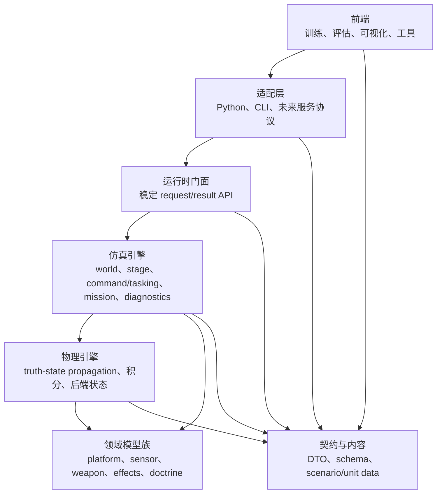
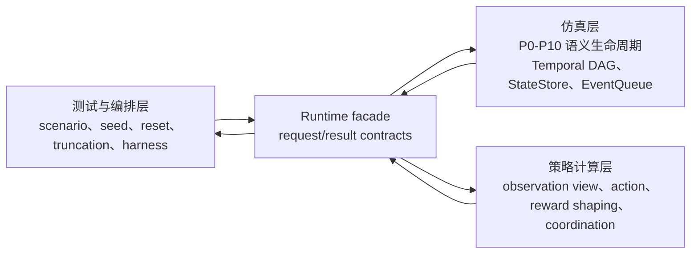

# 仿真系统架构设计

文档导航：

- 架构索引：[README.zh.md](README.zh.md)
- 英文主文：[simulation_system_architecture_design.md](simulation_system_architecture_design.md)
- 既有分层方案：[system_layering_and_engine_encapsulation_plan.zh.md](system_layering_and_engine_encapsulation_plan.zh.md)
- 性能路线调研：[architecture_and_performance_research_followup.zh.md](architecture_and_performance_research_followup.zh.md)
- 任务执行入口：[../../task/simulation_architecture/README.zh.md](../../task/simulation_architecture/README.zh.md)

状态：`2026-05-19` 严格架构基线。

本文档是维护中的仿真系统架构权威入口。它把此前的分层方案和性能路线调研收敛为更严格的所有权规则、规范化语义生命周期、多率执行图模型，以及后续领域扩展应遵循的插件族模型。

本文档不是实施冻结单。具体代码工作仍需下沉到写清范围、验收标准和非目标的任务计划。

## 一、设计主张

Echelon Forge 应围绕一条规范化仿真生命周期和一个带时钟域的执行图组织，而不是围绕 `air stack`、`naval stack`、`weapon stack` 这类纵向军种或功能烟囱组织。

领域特定行为应通过明确的模型族和阶段契约进入生命周期：

- 平台族
- 任务与条令族
- 传感器、航迹和数据链族
- 发射器与挂载族
- 弹药、导引头、制导、引信、效果和毁伤族
- CPU、GPU、降阶保真度或外部 FDM 后端族

项目上限取决于这些契约和调度规则是否稳定。局部武器、海军或空军功能可以很有价值，但不应创建私有的端到端运行时路径。

## 二、架构规则

以下规则对新的架构工作具有规范性：

1. 维护中的前端依赖 `runtime/facade`，不直接依赖 raw `WorldBatchRuntime`、`SimulationKernel`、Flecs entity 或实现调度顺序。
2. 权威状态位于编译侧仿真或物理后端。Python 和其他前端可以保留 mirror，但 mirror 只能是局部、延迟、非权威状态。
3. `components/` 与 `runtime/contracts/` 定义数据契约，不拥有每 tick 行为。
4. `systems/` 在已调度阶段内改变 ECS 状态，不定义新 DTO，不拥有 world 生命周期，不暴露外部 API。
5. `models/` 拥有可替换行为实现，不注册 ECS system，不绑定 Python，不解析 mission JSON。
6. `content/` 描述静态 scenario、unit 和配置内容，不拥有运行时行为。
7. `runtime/facade` 暴露用例级 request/result API，不应把底层 kernel 方法逐个复制到上层。
8. `interfaces/` 与 Python adapter 只做格式转换，不拥有仿真语义。
9. GPU 与 device-resident 路径是后端能力，不是新的公开 truth path。除非有后端对等冻结计划，否则 CPU exact 语义仍是基线。
10. 任何领域扩展都必须声明自己参与哪些管线阶段、消费和产出哪些 packet，以及用什么验证证明它没有绕开规范生命周期。
11. `P0-P10` 表是语义表，不是强制等步长线性执行器。真实 runtime 执行应建模为多率 temporal DAG，反馈必须跨越显式 state 或 event 边界。
12. 仿真层、策略计算层、测试/编排层之间的耦合必须显式化。策略和测试代码可以通过 facade 契约请求 view、action、reward、truncation 或 reset，但不能成为权威仿真状态或 episode truth 的隐藏 owner。

## 三、目标层模型



该模型细化此前的
`frontend adapters -> runtime facade -> simulation engine -> physics engine -> model backends`
方案。关键补充是：领域行为是一组挂接到共享生命周期的模型族，而不是彼此隔离的运行时栈。

## 四、规范化语义生命周期

每个维护中的 scenario step 都应能用以下语义阶段解释。部分场景可以用空 packet 跳过某些阶段，但不应发明平行生命周期。

这张表不要求所有阶段在每个外层 step 中都执行一次，也不要求相同 `dt`。它定义的是所有权、packet 词汇和可解释顺序。真实 runtime schedule 由下一节的 temporal DAG 定义。

| 阶段 | 所有者 | 输入 | 输出 | 不应拥有 |
|------|--------|------|------|----------|
| `P0 ContentCompile` | `content/`、adapter、facade setup | scenario 文件、unit data、后端能力请求 | typed setup packet、content id | 每 tick 行为 |
| `P1 WorldSetup` | `runtime/facade`、`core/engine` | setup packet、seed、terrain/environment ref | world batch、entity ref、初始状态 | 前端 cache 策略 |
| `P2 TaskingIntent` | `components/tasking`、`core/mission` | task order、leader intent、doctrine content | tasking state、authority state | 低层执行动作 |
| `P3 CommandDelivery` | `components/command`、command-link systems | command packet、link QoS、latency/drop state | delivered command、pending queue | 物理或传感器行为 |
| `P4 PlatformControl` | control model、platform system | command、platform state、autopilot/control law | force/torque intent、actuator state | world 生命周期 |
| `P5 PhysicsStep` | physics systems/backends | physical state、environment、force/torque input | 更新后的 truth state、physics trace | mission JSON、reward、gym API |
| `P6 SenseTrackLink` | sensor、track、EW、data-link systems/models | truth state、emission、environment、link state | track、detection、comm packet | 武器效果或毁伤 |
| `P7 FireControlLaunch` | simulation engine 与 weapon launch model | track、ROE、authority、launcher state | launch event、munition entity | 弹药闭环制导 |
| `P8 MunitionLifecycle` | guidance、seeker、fuze model、combat system | munition state、target track/truth、environment | terminal event、miss、fuze event | 平台 mission ownership |
| `P9 EffectsDamage` | effects model 与 damage system | hit/fuze event、warhead/effects content | damage report、kill state、subsystem effect | observation packing |
| `P10 ObservationExport` | facade、observation system、diagnostics | state snapshot、report、trace | observation packet、debug trace、export | 权威状态变更 |

阶段名是架构词汇。仓库迁移期间可以继续使用现有函数和文件名，但新增文档和测试应把本地行为映射回这张表。

## 五、Temporal DAG 执行模型

执行模型是在每个调度窗口内保持无环的 temporal DAG，反馈通过 versioned state 和 timestamped event 传递。

单个调度窗口内：

```text
State[t] + EventQueue[t]
  -> stage-node DAG
  -> writes, emitted events, diagnostics
  -> State[t + dt] + EventQueue[t + dt...]
```

窗口内图必须无环。类似 `damage -> platform capability -> sensor quality -> fire control` 的反馈是合法的，但它必须跨越 state-store 版本、event queue 时间戳或显式 barrier。

调度窗口内的边由数据依赖推导，不由人工偏好绘制。当 `B.read_set` 与 `A.write_set` 有交集，并且 `A` 在同一窗口内发布该写入时，same-window 边 `A -> B` 才是合法的。如果 `B` 只读取上一窗口已经提交的 `StateStore` snapshot，那么这是跨窗口反馈，不是 same-window DAG 边。该规则可以防止 temporal DAG 退化成伪装后的线性管线。

执行图概念：

| 概念 | 含义 |
|------|------|
| `StageNode` | 被调度的工作单元，例如 command delivery、control law、sensor scan、fire-control、guidance update、damage apply 或 observation export。 |
| `StateStore` | 带版本的权威状态。它可以是 host-owned、backend-owned 或 partial synchronized。 |
| `EventQueue` | 延迟或带时间戳的 event，例如 command arrival、launch、fuze trigger、damage application 与 report export。 |
| `ClockDomain` | node 的节奏规则，例如 fixed-rate physics、sensor scan interval、command-link tick、event-driven damage 或 facade-requested export。 |
| `Barrier` | 一致性边界，决定写入何时对后续 node 或后续窗口可见。 |

State versioning 先从粗粒度开始，但必须保留分片空间。早期 CPU-only smoke 与 diagnostics 可以接受单一全局 state version；但任何 resident-state 或 partial-sync 后端都必须支持 domain-sharded versions，例如 physics state、tasking state、track state、damage state 与 observation export state。因此 stage node 应尽量声明自己读取或写入的 state shard。

Event 按 `(timestamp, priority, event_id)` 确定性排序。`timestamp` 决定仿真时间，`priority` 由 event family 固定，`event_id` 由 producing node 和本地 sequence 确定性生成。维护中的仿真行为不应只依赖插入顺序作为同时间戳 tie-breaker，因为并行 stage node 和 CPU/GPU 混合 producer 会让 replay 变脆弱。

Clock domain 默认使用嵌套触发。base tick 拥有外层确定性 schedule，低频 node 按声明的倍数或 schedule slot 运行。独立 clock domain 只有在冻结计划明确 deterministic merge policy 和 barrier 处 event ordering 时才允许进入维护路径。

每个维护中的 stage node 都应声明：

| 字段 | 要求 |
|------|------|
| `semantic_stage` | 该 node 属于哪个或哪些 `P0-P10` 阶段。 |
| `read_set` | 读取的 state、packet、snapshot 或 event。 |
| `write_set` | 写入的 state、packet、event 或 diagnostics。 |
| `clock_domain` | 运行频率或触发条件。 |
| `latency_policy` | 输出是 same-window、next-window、delayed，还是由链路延迟控制。 |
| `sync_policy` | host-owned、backend-owned、partial sync、observation-only sync 或 explicit export。 |

典型 clock domain：

| 阶段族 | 预期节奏 |
|--------|----------|
| Physics integration | 固定高频内循环或后端 substep。 |
| Platform control | control-rate update，通常慢于 physics 但快于 tasking。 |
| Sensor and track | 传感器独立扫描周期加 track-fusion cadence。 |
| Command and data link | link tick 加 latency/drop event scheduling。 |
| Fire control | track/ROE/authority 驱动，通常低于 physics 频率。 |
| Munition lifecycle | guidance-rate 与 fuze/event-driven 混合。 |
| Effects and damage | event-driven，必要时产生 delayed report。 |
| Observation export | facade request、episode boundary、diagnostic trigger 或 batch collector cadence。 |

设计规则是：

```text
P0-P10 = semantic lifecycle
Temporal DAG = execution scheduler
StateStore/EventQueue = feedback boundary
Contracts = packet/state/event vocabulary
```

## 六、系统层耦合模型

`P0-P10` 生命周期和 temporal DAG 定义的是仿真层。但完整系统实际有三个相互耦合的层级：

| 层级 | 拥有 | 不应拥有 |
|------|------|----------|
| 仿真层 | 权威 world state、状态演化、temporal DAG 调度、event ordering、facade 可见 snapshot、仿真语义 termination、编译侧 mission runtime products。 | 训练循环 policy state、实验 curriculum、仅前端使用的 observation encoder，或 test harness scheduling。 |
| 策略计算层 | learned、scripted 或 human-directed policy logic；observation view 选择；action 生成；coordination intent 生成；实验性 reward shaping。 | raw ECS mutation、权威 episode phase、physics truth，或绕开 facade contract 的私有 command injection。 |
| 测试与编排层 | scenario 选择、seed、reset request、curriculum scheduling、max-step truncation、replay、CI smoke 与 validation harness。 | 仿真语义 termination、隐藏状态变更，或第二套 runtime lifecycle 实现。 |

这些层级应通过 facade-shaped request/result contract 交互，而不是共享对 Python helper 调用顺序或 C++ 内部 owner 布局的隐式假设。



跨层耦合本身不是弱点。只有当 ownership 是隐式的，它才会变成结构性风险。因此目标设计把策略层和编排层视为外部 stage-node producer / consumer，它们有自己的 clock domain 和 versioned request。

跨层契约：

| 契约 | 主要 owner | 仿真层职责 | 策略/编排层职责 |
|------|------------|------------|-----------------|
| `ObservationViewSpec` | 策略或测试层 | 暴露可查询 state shard、已提交 snapshot version、facade packet builder 与 diagnostics。 | 选择字段、编码、归一化、stacking、masking 与 consumer schema version。 |
| `ObservationPacket` | Runtime facade | 返回在声明 barrier 或 snapshot version 上采样的数据，并带 source time 与 schema metadata。 | 消费 packet，不假设 raw ECS layout 或未版本化 Python 字段顺序。 |
| `ActionIntentPacket` | 策略层 | 通过 facade 接收 action intent，并在 `P3/P4` 边界翻译为 command/control input。 | 声明 action source、effective time、target entity、action family，以及它是 direct control、mission command 还是 coordination intent。 |
| `ActionHoldPolicy` | 策略层，由 facade/仿真执行 | 在 control-rate 与 physics-rate tick 之间确定性应用 hold-last、interpolation、expiry 或 drop 语义。 | 声明 action validity duration、refresh cadence、expiry behavior 与 credit-assignment latency 假设。 |
| `CoordinationIntentPacket` | 策略层 | 只允许 scripted、learned 或 human director output 通过 tasking/command facade 路径进入，再调度到 `P2/P3`。 | 声明 source type、source id、target roster、update clock，以及产出的 tasking 或 leader-intent 字段。 |
| `RewardSpec` / `RewardReport` | 分裂 ownership | 提供语义事实、编译侧 mission products、damage/kill report 与 versioned state snapshot。 | 组合实验 reward、shaping weight、curriculum-dependent term 与 consumer-specific reward breakdown。 |
| `TerminationSpec` / `EpisodeStatus` | 分裂 ownership | 拥有 crash、kill、mission success、out-of-bounds、fuel exhaustion 等仿真语义 `terminated` reason。 | 拥有 max steps、curriculum cutoff、early stopping、benchmark wall-clock policy 等实验 `truncated` reason。 |
| `EpisodeLifecycleContract` | 仿真层拥有权威 phase；编排层拥有 reset request | 拥有权威 episode phase、transition result、reset application 与 facade-exported mirrored status。 | 请求 reset/truncation，为 Gymnasium 或测试 API mirror status，但不推进私有权威状态机。 |

设计结论：

1. Observation assembly 是策略可见 view contract。仿真层应暴露稳定 state snapshot 与 facade packet builder；策略层可以定义 feature subset、encoding 与 normalization。新增策略特征只有在所需 truth state 或 diagnostic export 尚不存在时，才应要求仿真层改动。
2. Reward 拆为仿真事实与实验组合。仿真语义 reward 或 mission product 可以编译化，但 shaping weight 与训练特定 reward mix 应能在不重新编译仿真的情况下配置。如果 Python 从 mirror 计算 reward，mirror snapshot version 与 latency 必须显式化。
3. `terminated` 与 `truncated` 不是同一个 owner。仿真拥有语义 termination；策略/测试/编排可以请求 truncation。Facade result 应同时报告两者的 reason、source layer 与 snapshot time。
4. Coordination director 默认属于仿真层之外，除非它被明确提升为仿真模型。scripted、learned 或 human director 可以产生 `TaskingPacket`、`MissionCommand` 或 `LeaderIntent` 内容，但只能通过 facade-compatible assignment path。
5. Policy inference cadence 是一等 clock domain。policy 10 Hz、platform control 20 Hz、physics 60 Hz 是合法的，但必须由 `ActionHoldPolicy` 声明一个 policy output 如何被多个 control tick 消费，以及 observation sample time 如何与 reward 对齐。
6. `P4 PlatformControl` 消费 resolved command/control input。`P5 PhysicsStep` 消费物理 force/torque 或 backend integration input；它不应消费 raw policy vector。
7. `ScenarioLoader` 与 Gymnasium wrapper 是目标 API 适配器和 mirror，不是权威 runtime owner。它们可以满足 `(obs, reward, terminated, truncated, info)` 这样的 API shape，但 transition truth 应能从 compiled episode/facade result 恢复。
8. Hierarchical RL 应把 sub-episode 建模为显式 lifecycle annotation 或 orchestration scope，而不是在 Python 和 C++ 中复制核心 episode 状态机。

在调度上，跨层请求是外部图输入。每个 request 应声明：

| 字段 | 要求 |
|------|------|
| `source_layer` | `policy`、`orchestration`、`adapter`、`human` 或 `diagnostic`。 |
| `source_id` | 用于 replay 与 diagnostics 的稳定 producer id。 |
| `input_snapshot_version` | producer 使用的 state 或 observation version。 |
| `effective_time` | 请求开始可见的仿真时间或 scheduling window。 |
| `valid_until` | expiry time 或 condition，尤其用于 action 与 tasking intent。 |
| `merge_policy` | 多个 producer 作用于同一 entity 或字段时的冲突解决方式。 |

这能让仿真层保持中心地位，同时不假装它是孤立的。仿真层仍是 truth source；策略层和编排层则成为显式、可 replay 的 producer 与 consumer。

## 七、契约分类

facade 与 adapter 应逐步收敛到所有权清晰的 typed packet：

| 契约族 | 目的 | 长期所有者 |
|--------|------|------------|
| `ScenarioSpec` / `ContentSpec` | 静态 scenario 与 content 描述 | `content/` 与 adapter schema |
| `WorldSetupRequest` / `WorldSetupResult` | batch reset 与 entity 创建 | `runtime/contracts` |
| `OrchestrationPlan` | scenario 选择、seed、reset、curriculum、truncation 与 validation schedule | 测试/编排层与 facade contracts |
| `TaskingPacket` | mission intent、authority、relationship、task state | `components/tasking` 与 `runtime/contracts` |
| `CommandPacket` | 可投递执行命令与链路行为 | `components/command` 与 `runtime/contracts` |
| `CoordinationIntentPacket` | scripted、learned 或 human coordination source output | 策略层与 facade tasking/command contracts |
| `ActionIntentPacket` / `ActionHoldPolicy` | policy action、validity window、hold/interpolation/expiry 与 control-rate alignment | 策略层与 facade enforcement |
| `TrackPacket` | 传感器、航迹、数据链输出 | ownership review 后进入 `components` 或 `runtime/contracts` |
| `LaunchRequest` / `LaunchEvent` | 火控与发射器边界 | `runtime/contracts` 与 weapon components |
| `MunitionState` | 弹药生命周期状态 | combat/weapon components |
| `EffectsEvent` / `DamageReport` | 命中、引信、毁伤和击杀报告 | effects model 与 combat components |
| `RewardSpec` / `RewardReport` | 语义事实、实验 shaping 与 reward breakdown | 分裂：仿真事实在 compiled runtime，shaping 在策略/测试配置 |
| `TerminationSpec` / `EpisodeStatus` | termination、truncation、reason source 与 episode phase export | 分裂：仿真拥有语义 phase，编排拥有 truncation request |
| `ObservationViewSpec` | 面向 consumer 的 observation 字段选择、编码、归一化与 schema version | 策略/测试层 |
| `ObservationPacket` | 前端可见状态导出 | `runtime/facade` contracts |
| `DiagnosticsTrace` | 可解释性、replay 与验证 trace | `core/engine` 与 facade contracts |

`MissionCommand` 仍是兼容性聚合点，不是未来共享语义的理想形态。后续工作应转向更窄的 tasking、command、fire-control、observation packet，而不是继续扩展一个 flat 的全领域 command 对象。

## 八、领域扩展模型

领域扩展必须局部挂接到阶段，并由契约驱动。

允许的扩展族：

- `PlatformFamily`：飞机、舰艇、潜艇、未来地面或空间单位。
- `MotionFamily`：空气动力、舰艇运动、潜艇运动、未来地面机动。
- `SensorFamily`：雷达、视觉、声纳、电子战、被动探测。
- `LinkFamily`：命令链路、数据链、relay、退化通信。
- `LauncherFamily`：导轨、垂发单元、挂架、鱼雷管、近防挂载、虚拟发射器。
- `MunitionFamily`：导弹、炮弹、鱼雷、炸弹、诱饵、未来效应器。
- `GuidanceFamily`：PN、指令制导、主动导引头、被动导引头、末制导、降阶 surrogate。
- `EffectsFamily`：爆轰、破片、侵彻、子系统毁伤、soft-kill、mission kill。
- `DoctrineFamily`：任务模板、ROE、授权委托、交战策略。

每个扩展都必须记录：

1. 阶段覆盖范围，
2. 所需 component 与 content record，
3. 消费和产出的 packet，
4. stage-node read/write set，
5. clock domain 与 latency policy，
6. facade 可见性，
7. 对等或回归测试，
8. 对现有 Python 调用方的兼容行为。

如果某个扩展需要新增生命周期阶段，应先更新本文档或派生冻结计划。

## 九、后端与性能策略

性能工作必须保持同一条语义生命周期。

- CPU exact execution 是维护行为的语义基线。
- CUDA helper 应通过 facade/backend packet 接入，尤其是 visual、observation、broadphase、flight shaping 和未来 resident-state 路径。
- device-resident state 只能放在能够描述 host-owned state、backend-owned state、partial sync 与 observation-only sync 的契约之后。
- device-resident node 必须声明 host-visible state 何时同步，以及 observation 是 snapshot、partial view 还是 explicit export。
- exact GPU world-step 在 parity、ownership 与 sync 规则冻结前，不是维护中的替代路径。
- Rust 仍是未来 service 或 serialization 边界候选，不是近期 C++ 仿真后端替代方案。

核心性能规则很简单：把 ownership 与 data residency 向下沉，但不要制造第二套语义路径。

## 十、武器与交战试点切片

武器线是最适合作为第一条架构试点的方向，因为它横跨完整语义生命周期，并且会检验 temporal feedback：

`tasking -> command delivery -> sensor/track -> fire control -> launcher -> munition -> seeker/guidance/fuze -> effects -> damage -> observation`

试点应避免创建独立的 `air weapon` 与 `naval weapon` 运行时栈。它应证明同一套交战生命周期可以承载不同 launcher 与 munition 族，同时允许 stage node 使用不同 clock domain。

首批架构交付物应包括：

1. launcher/mount contract 与 content shape，
2. launch event 与 munition lifecycle packet，
3. seeker/guidance/fuze/effects 拆分，
4. 后续可替代临时 HP 报告的 damage report contract，
5. launch、intercept、miss、damage 的 observation 与 diagnostics export，
6. command delivery、seeker scan、guidance update、fuze trigger 与 damage application 的 clock-domain / event-queue 规则。
7. 面向 observation view selection、action validity window、reward/termination report 与 episode lifecycle status 的跨层 policy/test contract。

只有当这条试点至少覆盖两个平台族时，它才真正有架构验证价值，例如航空挂架发射与舰载挂载发射。

## 十一、验证门槛

新的架构工作在进入维护路径前应通过以下门槛：

1. 文档写清 stage、owner、consumed packet 与 produced packet。
2. 文档写清 stage-node read/write set、clock domain、latency policy 与 sync policy。
3. 公开访问走 facade request/result API 或已记录的 compatibility adapter。
4. 架构测试防止前端直接抓取 raw runtime owner。
5. include 与构建边界不引入反向依赖。
6. 任何后端加速都以 CPU 语义行为为参考。
7. 跨领域 smoke test 证明领域扩展使用共享生命周期和带时钟域的执行模型。
8. diagnostics 能解释 command、launch、munition、effect 或 damage report 在管线中的进入和离开位置。
9. 跨层契约写清 observation schema、action validity、reward composition、termination/truncation source 与 episode lifecycle authority 分别由哪一层拥有。
10. 策略/测试 adapter 证明自己可以使用 facade-shaped API 或已记录 compatibility adapter，而不进行 raw runtime mutation。

本地 Windows 工作在缺少 RL 训练依赖时可以止步于 build/import/smoke 验证，但契约形状仍应面向未来 batch 与训练使用。

## 十二、与既有文档的关系

本文档不删除此前计划，而是重新定位它们：

- [system_layering_and_engine_encapsulation_plan.zh.md](system_layering_and_engine_encapsulation_plan.zh.md)
  仍作为分层动机和引擎封装背景。
- [architecture_and_performance_research_followup.zh.md](architecture_and_performance_research_followup.zh.md)
  仍作为性能路线排序和后端取舍依据。
- [../runtime_facade/runtime_facade_contract_plan.zh.md](../runtime_facade/runtime_facade_contract_plan.zh.md)
  仍作为 facade 契约输入。
- [../../task/common_air_naval/README.zh.md](../../task/common_air_naval/README.zh.md)
  仍作为 `common / air / naval` 拆分的历史任务线。
- [../../task/simulation_architecture/README.zh.md](../../task/simulation_architecture/README.zh.md)
  是把本文档转化为分阶段工作的执行子项目。

后续架构任务单应优先引用本文档，再引用旧文档作为论据或证据来源。
