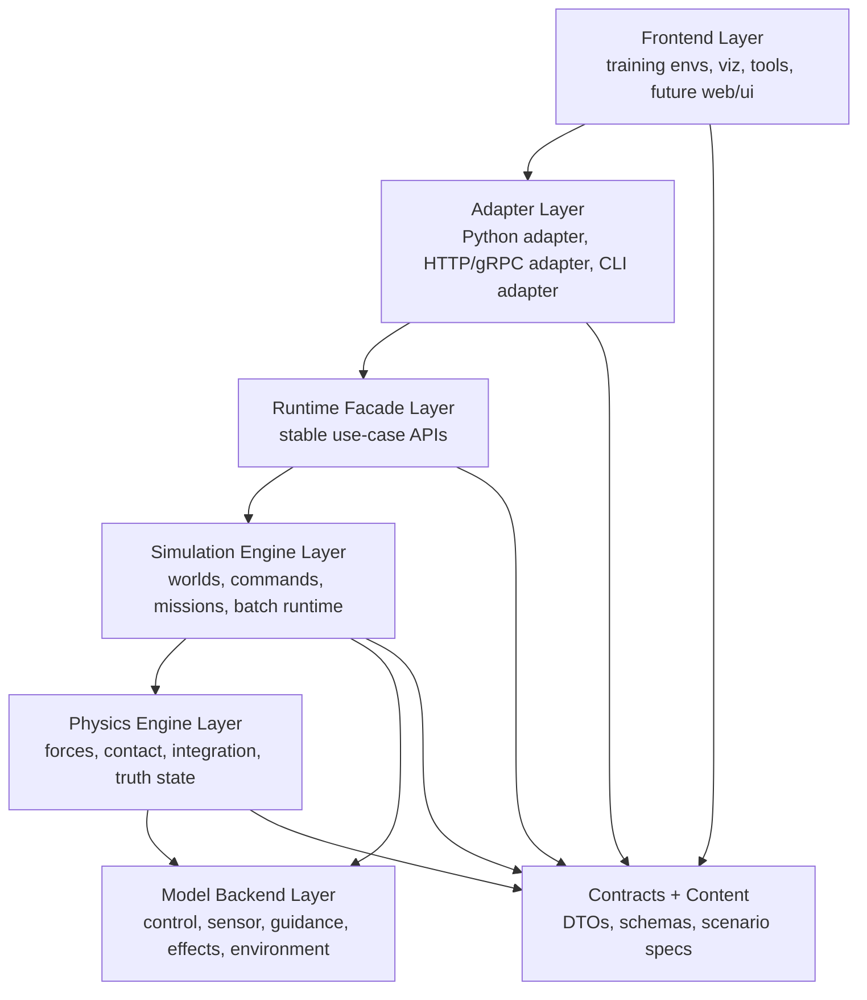

# System Layering And Engine Encapsulation Plan

Navigation:

- [README.md](/home/void0312/Workshop/CMO/docs/plan/README.md)

中文版：
[system_layering_and_engine_encapsulation_plan.zh.md](/home/void0312/Workshop/CMO/docs/plan/architecture/system_layering_and_engine_encapsulation_plan.zh.md)

Further research:
[architecture_and_performance_research_followup.zh.md](/home/void0312/Workshop/CMO/docs/plan/architecture/architecture_and_performance_research_followup.zh.md)

Facade contract:
[runtime_facade_contract_plan.zh.md](/home/void0312/Workshop/CMO/docs/plan/runtime_facade/runtime_facade_contract_plan.zh.md)

Frozen execution record:
[runtime_facade_task_bootstrap_plan.zh.md](/home/void0312/Workshop/CMO/docs/plan/runtime_facade/runtime_facade_task_bootstrap_plan.zh.md)

Status: Architecture draft on 2026-05-10.  
Document role:

- This document defines the target layers, engine boundaries, and dependency direction.
- It is the architecture authority for this track, but it is not a frozen single-run task sheet.
- Concrete implementation work should be derived into contract docs or separately frozen execution plans.

This is the live plan for moving the project from "module cleanup" to a real
layered architecture with explicit engine boundaries.

## Why This Plan Exists

The current codebase already contains many useful subsystems, but they are not
yet packaged behind stable architectural boundaries.

Three structural facts are now clear:

1. Python-side runtime code still owns too much step-time orchestration and
   state mutation.
2. The compiled side already has enough substance to become a true backend, but
   it is still exposed through low-level bindings rather than through a stable
   runtime facade.
3. The current `ef_core` build target still groups physics, simulation,
   mission/runtime, default models, and content loading into one monolith.

If the next phase is meant to deliver:

- frontend/backend decoupling
- a dedicated physics engine boundary
- a dedicated simulation engine boundary
- future backend replaceability such as exact CPU, exact GPU, or external FDM

then the project needs explicit layering and encapsulation rules, not only
incremental module edits.

## Current Structural Problems

### 1. Frontend and backend responsibilities are mixed

Today the Python runtime path still mixes:

- scenario loading
- runtime state ownership
- mission/reward/termination orchestration
- command-chain synchronization
- environment wrapper behavior

Primary hotspots:

- [gym_envs/scenario_loader.py](/home/void0312/Workshop/CMO/gym_envs/scenario_loader/core.py)
- [python/rl/world_batch_vec_env.py](/home/void0312/Workshop/CMO/python/rl/runtime/world_batch_vec_env.py)
- [gym_envs/universal_env.py](/home/void0312/Workshop/CMO/gym_envs/universal_env.py)

That means the current "frontend" does not only consume backend services. It
still partially is the runtime backend.

### 2. Physics and simulation are not separated as engines

The compiled side already contains:

- world lifecycle and ECS scheduling
- mission/execution runtime
- batch runtime
- force/integration/contact systems
- observation and instrument products

But those concerns are still packaged as one broad core instead of two clear
engine layers:

- a physics engine that advances physical state
- a simulation engine that owns worlds, entities, commands, missions, sensors,
  effects, batch stepping, and diagnostics

Primary files:

- [src/core/engine/simulation_kernel.cpp](/home/void0312/Workshop/CMO/src/core/engine/simulation_kernel.cpp)
- [src/core/engine/world_batch_runtime.cpp](/home/void0312/Workshop/CMO/src/core/engine/world_batch_runtime.cpp)
- [src/core/mission/execution_episode_controller.cpp](/home/void0312/Workshop/CMO/src/core/mission/episode/execution_episode_controller.cpp)
- [src/models/air/default_control_model.cpp](/home/void0312/Workshop/CMO/src/models/air/default_control_model.cpp)

### 3. Public API is too low-level

The current nanobind layer exposes many low-level kernel operations directly.
That is useful for probes and tests, but it is not a stable backend contract for
frontends.

Primary file:

- [src/interfaces/python/python_module.cpp](/home/void0312/Workshop/CMO/src/interfaces/python/python_module.cpp)

### 4. Build boundaries do not enforce architectural boundaries

The current CMake layout compiles a single `ef_core` library containing:

- engine runtime
- mission runtime
- physics runtime
- default models
- content loading

Primary file:

- [CMakeLists.txt](/home/void0312/Workshop/CMO/CMakeLists.txt)

That means include graphs and target links are not yet helping enforce
architecture.

## Target Architectural Principle

The project should move to:

`frontend adapters -> runtime facade -> simulation engine -> physics engine -> model backends`

with content/contracts shared across the stack, and with strict one-way
dependencies.

## Target Layer Map



## Layer Definitions

### Layer 0: Contracts and Content

Purpose:

- define stable DTOs and schemas
- define scenario/config/unit content
- define serialization boundary formats

This layer owns:

- `ScenarioSpec`
- `WorldInitRequest`
- `ExecutionEpisodeState`
- `RuntimeStepRequest`
- `RuntimeStepResult`
- `ObservationPacket`
- diagnostics/tracing request and response structs

Rules:

- no physics math
- no Python runtime logic
- no frontend assumptions
- JSON only exists at this layer or adapter edges

### Layer 1: Physics Engine

Purpose:

- advance physical state only
- own deterministic state propagation
- provide replaceable physical backends

This layer should own:

- force accumulation
- aero state update
- propulsion/drag/lift/gravity application
- ground contact
- rotational integration
- translational integration
- truth-state surfaces needed by upper layers

This layer should not own:

- scenario JSON parsing
- RL reward logic
- mission phase logic
- gym wrappers
- Python state mirrors

Recommended public boundary:

- `IPhysicsBackend`
- `PhysicsWorldState`
- `PhysicsStepContext`
- `PhysicsStepResult`
- `PhysicsDebugTrace`

Concrete future backends may include:

- exact CPU backend
- exact GPU backend
- reduced-fidelity backend
- external FDM bridge backend

### Layer 2: Simulation Engine

Purpose:

- own world lifecycle and simulation semantics above pure physics
- orchestrate missions, commands, sensors, effects, guidance, and batch runtime

This layer should own:

- `SimulationKernel`
- `WorldBatchRuntime`
- `ExecutionEpisodeController`
- command delivery
- mission/runtime state machines
- sensor/guidance/effects orchestration
- episode stepping and batch stepping
- stage inventory and diagnostics hooks

This layer should call the physics engine, not embed all physics rules directly
as an inseparable monolith.

This layer should not own:

- gym API behavior
- numpy layout policy
- scenario authoring UI conventions
- Python-side cache/mirror logic

Recommended public boundary:

- `ISimulationRuntime`
- `IBatchSimulationRuntime`
- `IExecutionEpisodeRuntime`
- `ISimulationDiagnostics`

### Layer 3: Runtime Facade

Purpose:

- provide stable use-case APIs to adapters/frontends
- hide low-level kernel/component details
- become the only supported backend contract for maintained frontends

This layer should expose coarse-grained operations such as:

- compile/load scenario
- create/reset world batch
- apply world layout
- prime execution episode state
- submit step batch
- fetch observation batch
- export state snapshot batch
- request diagnostics/traces

This layer should be the point where:

- frontend/backend separation becomes real
- low-level `SimulationKernel` operations stop leaking upward

### Layer 4: Adapter Layer

Purpose:

- translate external clients into runtime facade requests
- isolate Python, CLI, and future service protocols from backend internals

Adapters include:

- nanobind Python adapter
- scenario JSON adapter
- gym adapter
- CLI probe adapter
- future HTTP/gRPC adapter

Important rule:

- adapters convert formats
- adapters do not own simulation semantics

### Layer 5: Frontend Layer

Purpose:

- training
- evaluation
- visualization
- diagnostics dashboards
- scenario authoring and future web UI

Current frontend candidates:

- `train.py`
- `python/rl/*`
- `gym_envs/*`
- `tools/*`
- `examples/viz/*`

Important rule:

- frontend code talks to runtime facade contracts
- frontend code must not depend directly on Flecs entities, low-level ECS
  components, or kernel-internal state mutation order

## Dedicated Engine Boundaries

### Physics Engine Boundary

The physics engine boundary should sit below mission/runtime logic and above raw
model implementations.

It should define:

- physical state inputs
- environment query inputs
- force and torque production surfaces
- integrator step contract
- debug trace surfaces

It should not know:

- `ScenarioLoader`
- `WorldBatchVecEnv`
- `MissionCommand` JSON shape
- reward terms
- truncation semantics

### Simulation Engine Boundary

The simulation engine boundary should sit above the physics engine and below all
frontends/adapters.

It should define:

- world creation/reset
- entity and mission state ownership
- step orchestration
- batch execution
- observation surfaces
- runtime state import/export
- diagnostics and replay hooks

It may know:

- missions
- commands
- execution episodes
- sensors
- effects
- guidance
- reward/termination if the maintained runtime keeps them compiled

It should not know:

- gym API conventions
- Python object caching
- frontend timing presentation
- experiment-specific wrapper behavior

## Frontend/Backend Decoupling Rules

To make frontend/backend separation real, the repo should adopt these rules:

1. Frontends never call `SimulationKernel` directly.
2. Frontends never own authoritative step-time episode state.
3. All scenario JSON parsing must end in typed contracts before entering the
   simulation engine.
4. All backend outputs to frontends must be DTOs or typed views, not internal
   ECS objects.
5. Python bindings may still expose low-level probe APIs, but maintained
   frontends must depend only on the facade-level API set.

## Required Encapsulation Mechanisms

### 1. Facade encapsulation

Introduce a maintained runtime facade instead of binding every kernel primitive
directly.

### 2. DTO encapsulation

All cross-layer data transfer should use typed structs or packets, not free-form
dictionaries once execution begins.

### 3. Adapter encapsulation

Python-side code should split:

- scenario/config adaptation
- runtime request construction
- frontend wrapper behavior

instead of mixing all three inside `ScenarioLoader`.

### 4. Backend encapsulation

Physics backend selection should be hidden behind the simulation engine or
runtime facade. Frontends should not know whether the backend is:

- exact CPU
- exact GPU
- reduced exact CPU
- external bridge backend

### 5. Build encapsulation

CMake targets should enforce boundaries rather than only describe compilation.

## Recommended Target Repository Layout

This is a target structure, not a mandatory one-step rename:

```text
src/
  contracts/
  content/
  physics/
    state/
    pipeline/
    backends/
  simulation/
    world/
    execution/
    batch/
    diagnostics/
  runtime/
    facade/
    services/
  adapters/
    python/
    cli/
python/
  frontend/
  training/
  evaluation/
  viz/
```

## Recommended Target Build Targets

The current `ef_core` monolith should be split toward:

- `ef_contracts`
- `ef_content`
- `ef_physics`
- `ef_simulation`
- `ef_runtime`
- `ef_models_default`
- `ef_adapters_python`

Recommended dependency direction:

- `ef_physics -> ef_contracts`
- `ef_models_default -> ef_contracts`
- `ef_simulation -> ef_contracts + ef_physics + ef_models_default + ef_content`
- `ef_runtime -> ef_contracts + ef_simulation`
- `ef_adapters_python -> ef_runtime`

The important point is not the exact names. The important point is that:

- physics can compile without Python
- simulation can compile without frontend wrappers
- adapters can be replaced without touching core engines

## Mapping From Current Code To Target Ownership

### Current code that should move toward frontend or adapter ownership

- [gym_envs/scenario_loader.py](/home/void0312/Workshop/CMO/gym_envs/scenario_loader/core.py)
  Current mixed role: scenario parsing, runtime state mirror, reward bridge,
  command sync helper.
- [python/rl/world_batch_vec_env.py](/home/void0312/Workshop/CMO/python/rl/runtime/world_batch_vec_env.py)
  Current mixed role: frontend wrapper plus runtime orchestration details.

### Current code that should become simulation engine ownership

- [src/core/engine/simulation_kernel.cpp](/home/void0312/Workshop/CMO/src/core/engine/simulation_kernel.cpp)
- [src/core/engine/world_batch_runtime.cpp](/home/void0312/Workshop/CMO/src/core/engine/world_batch_runtime.cpp)
- [src/core/mission/execution_episode_controller.cpp](/home/void0312/Workshop/CMO/src/core/mission/episode/execution_episode_controller.cpp)
- [src/core/mission/execution_episode_state.cpp](/home/void0312/Workshop/CMO/src/core/mission/episode/execution_episode_state.cpp)

### Current code that should become physics engine ownership

- `src/systems/physics/*`
- `src/components/physics/*`
- control-to-force and integration path in
  [src/models/air/default_control_model.cpp](/home/void0312/Workshop/CMO/src/models/air/default_control_model.cpp)
- environment query contracts in
  [src/core/interfaces/environment_model.h](/home/void0312/Workshop/CMO/src/core/interfaces/environment_model.h)

### Current code that should remain adapter ownership

- [src/interfaces/python/python_module.cpp](/home/void0312/Workshop/CMO/src/interfaces/python/python_module.cpp)

But only as an adapter layer, not as the place where architecture is defined.

## Migration Strategy

### Phase 1: Freeze the architectural direction

Decisions to freeze first:

- Python frontends stop gaining new backend ownership.
- Maintained frontends must move toward facade APIs, not more direct kernel
  mutation helpers.
- Physics backend is a replaceable layer under simulation, not a future side
  experiment.

### Phase 2: Extract stable contracts

Introduce or normalize:

- scenario request DTOs
- runtime step request/result DTOs
- observation DTOs
- debug/trace DTOs

Short-term success criterion:

- frontend/runtime crossings stop using ad-hoc dictionaries as the maintained
  contract.

### Phase 3: Split frontend adapters from runtime ownership

Refactor `ScenarioLoader` responsibilities into:

- scenario-spec adapter
- execution-state adapter
- frontend helper logic

Short-term success criterion:

- `ScenarioLoader` no longer acts as the authoritative runtime backend shell.

### Phase 4: Introduce physics backend abstraction

Create a dedicated physics pipeline/backend interface and make the simulation
engine call it explicitly.

Short-term success criterion:

- `SimulationKernel` can orchestrate a physics backend without hard-wiring all
  physical step behavior as a single inseparable internal path.

### Phase 5: Introduce runtime facade

Add a maintained facade API above `WorldBatchRuntime` and
`ExecutionEpisodeController`.

Short-term success criterion:

- `WorldBatchVecEnv` and other frontends use facade-level requests rather than
  low-level runtime plumbing.

### Phase 6: Split build targets

Refactor CMake targets to mirror the architecture.

Short-term success criterion:

- physics, simulation, runtime, and Python adapter build as separate targets
  with clean dependency direction.

### Phase 7: Optional process or service boundary

If a true external frontend is later required, the runtime facade can then be
exposed through:

- local RPC
- HTTP/gRPC
- shared-memory service

That should come after layer cleanup, not before.

## First Concrete Implementation Target

Note: this section explains an initial landing direction. It does not by itself
freeze an executable task boundary.

The first implementation target should not be a full directory rewrite.

It should be these three concrete steps:

1. Define a maintained runtime facade contract above the current
   `WorldBatchRuntime`.
2. Move execution-state import/export and runtime mirror logic out of
   `ScenarioLoader` into a dedicated adapter/helper boundary.
3. Introduce an explicit physics backend interface so the current exact CPU path
   becomes "the first backend", not "the only hard-wired path".

This gives the project real layering without forcing a one-shot rewrite.

## Non-Goals For This Phase

- no immediate full ECS replacement
- no mandatory process split this round
- no forced web service before internal boundaries are stable
- no renaming campaign without ownership changes behind it

## Final Architectural Rule

From this phase onward, the repo should treat:

- physics as an engine
- simulation as an engine
- Python/gym/training as frontends
- bindings as adapters
- scenario JSON as edge input

not as one mixed runtime blob with many helper files.
