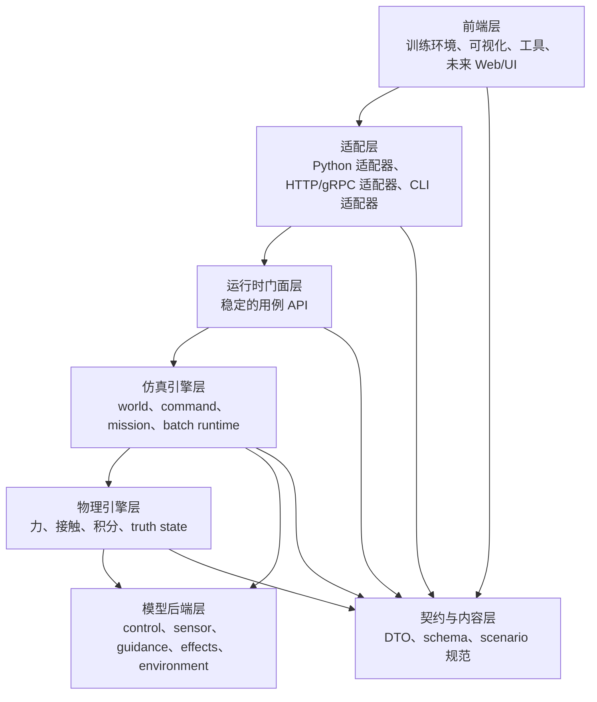

# 系统分层与引擎封装方案

文档导航：

- [README.md](../README.md)

English version:
[system_layering_and_engine_encapsulation_plan.md](system_layering_and_engine_encapsulation_plan.md)

后续调研：
[architecture_and_performance_research_followup.zh.md](architecture_and_performance_research_followup.zh.md)

接口契约：
[runtime_facade_contract_plan.zh.md](../runtime_facade/runtime_facade_contract_plan.zh.md)

冻结执行记录：
[runtime_facade_task_bootstrap_plan.zh.md](../archive/runtime_facade_task_bootstrap_plan.zh.md)

状态：`2026-05-10` 架构主方案草案。  
文档定位：

- 本文档回答“系统应该分成哪些层、每层拥有什么边界、依赖方向如何约束”。
- 本文档是当前架构方向的主说明，但不是单次实现任务的冻结执行单。
- 任何具体实施都应下沉到契约文档或单独冻结的执行计划中。

本文档用于把项目从“模块级清理”推进到“具有明确引擎边界的真实分层架构”。

## 为什么需要这份方案

当前代码库里已经有很多有价值的子系统，但它们还没有被封装在稳定的架构边界之后。

现在已经可以明确三件结构性事实：

1. Python 侧运行时代码仍然承担了过多逐步执行时的编排和状态变更责任。
2. 编译侧已经有足够多的实体，完全可以成为真正的后端，但它当前更多是通过低层绑定暴露，而不是通过稳定的运行时门面暴露。
3. 现在的 `ef_core` 构建目标仍把物理、仿真、mission/runtime、默认模型和内容加载打包成一个大单体。

如果下一阶段的目标是交付：

- 前后端解耦
- 独立的物理引擎边界
- 独立的仿真引擎边界
- 未来可替换的后端，例如 exact CPU、exact GPU、外部 FDM

那么项目需要的是明确的分层和封装规则，而不只是继续做零散的模块修改。

## 当前结构性问题

### 1. 前端与后端职责混杂

现在 Python 运行时路径仍然把这些事情混在一起：

- 场景加载
- 运行时状态持有
- mission/reward/termination 编排
- command-chain 同步
- 环境包装器行为

主要热点文件：

- [gym_envs/scenario_loader.py](../../../gym_envs/scenario_loader/core.py)
- [python/rl/world_batch_vec_env.py](../../../python/rl/runtime/world_batch_vec_env.py)
- [gym_envs/universal_env.py](../../../gym_envs/universal_env.py)

这意味着当前所谓“前端”并不只是消费后端服务，它在相当程度上仍然兼任了运行时后端的一部分。

### 2. 物理与仿真尚未作为独立引擎分离

当前编译侧已经包含：

- world 生命周期与 ECS 调度
- mission/execution runtime
- batch runtime
- 力/积分/接触系统
- 观测与仪表产物

但这些职责现在仍被打包在一个宽泛的 core 中，而不是拆成两个清晰的引擎层：

- 一个推进物理状态的物理引擎
- 一个拥有 worlds、entities、commands、missions、sensors、effects、batch stepping、diagnostics 的仿真引擎

主要文件：

- [src/core/engine/simulation_kernel.cpp](../../../src/core/engine/simulation_kernel.cpp)
- [src/core/engine/world_batch_runtime.cpp](../../../src/core/engine/world_batch_runtime.cpp)
- [src/core/mission/execution_episode_controller.cpp](../../../src/core/mission/episode/execution_episode_controller.cpp)
- [src/models/air/default_control_model.cpp](../../../src/models/air/default_control_model.cpp)

### 3. 公共 API 过于底层

当前 nanobind 绑定层直接暴露了很多低层 kernel 操作。
这对 probe 和测试很有用，但它并不是一个适合前端依赖的稳定后端契约。

主要文件：

- [src/interfaces/python/python_module.cpp](../../../src/interfaces/python/python_module.cpp)

### 4. 构建边界没有帮助约束架构边界

当前 CMake 布局把这些内容都编译进了一个 `ef_core`：

- engine runtime
- mission runtime
- physics runtime
- default models
- content loading

主要文件：

- [CMakeLists.txt](../../../CMakeLists.txt)

这意味着现在的 include 图和 target link 关系还没有帮助项目真正约束架构。

## 目标架构原则

项目应转向：

`frontend adapters -> runtime facade -> simulation engine -> physics engine -> model backends`

同时让内容与契约在各层共享，并严格执行单向依赖。

## 目标分层图



## 各层定义

### 第 0 层：契约与内容层

目的：

- 定义稳定的 DTO 和 schema
- 定义 scenario/config/unit content
- 定义序列化边界格式

这一层拥有：

- `ScenarioSpec`
- `WorldInitRequest`
- `ExecutionEpisodeState`
- `RuntimeStepRequest`
- `RuntimeStepResult`
- `ObservationPacket`
- diagnostics / tracing 的 request / response 结构

规则：

- 不包含物理计算
- 不包含 Python runtime 逻辑
- 不带前端假设
- JSON 只能存在于这一层或适配器边缘

### 第 1 层：物理引擎层

目的：

- 只推进物理状态
- 拥有确定性的状态传播
- 提供可替换的物理后端

这一层应拥有：

- force accumulation
- aero state update
- propulsion / drag / lift / gravity 应用
- ground contact
- rotational integration
- translational integration
- 上层需要使用的 truth-state surfaces

这一层不应拥有：

- scenario JSON 解析
- RL reward 逻辑
- mission phase 逻辑
- gym wrappers
- Python state mirror

规划中的候选公共边界（这些接口 / DTO 目前是架构目标，
并不是仓库里今天已经存在的公开 API）：

- `IPhysicsBackend`
- `PhysicsWorldState`
- `PhysicsStepContext`
- `PhysicsStepResult`
- `PhysicsDebugTrace`

当前仓库代码仍然主要通过具体的 engine / runtime 实现协作，
尚未抽出这一层独立的 physics 边界契约。

未来具体后端可以包括：

- exact CPU backend
- exact GPU backend
- reduced-fidelity backend
- external FDM bridge backend

### 第 2 层：仿真引擎层

目的：

- 在纯物理之上拥有 world 生命周期和仿真语义
- 编排 missions、commands、sensors、effects、guidance 和 batch runtime

这一层应拥有：

- `SimulationKernel`
- `WorldBatchRuntime`
- `ExecutionEpisodeController`
- command delivery
- mission/runtime state machine
- sensor/guidance/effects orchestration
- episode stepping 与 batch stepping
- stage inventory 与 diagnostics hooks

这一层应调用物理引擎，而不是把所有物理规则继续硬编码成一个不可分离的大单体。

这一层不应拥有：

- gym API 行为
- numpy layout 策略
- scenario authoring 的 UI 约定
- Python 侧 cache / mirror 逻辑

规划中的候选公共边界（这些接口目前是候选契约，
并不是仓库里今天已经存在的稳定公开接口）：

- `ISimulationRuntime`
- `IBatchSimulationRuntime`
- `IExecutionEpisodeRuntime`
- `ISimulationDiagnostics`

当前维护中的调用方仍然直接绑定具体 runtime 实现，
尚未切换到这组拟议中的 simulation-engine 接口。

### 第 3 层：运行时门面层

目的：

- 给适配层和前端提供稳定的用例 API
- 隐藏底层 kernel / component 细节
- 成为维护中前端唯一依赖的后端契约

这一层应暴露粗粒度操作，例如：

- compile/load scenario
- create/reset world batch
- apply world layout
- prime execution episode state
- submit step batch
- fetch observation batch
- export state snapshot batch
- request diagnostics / traces

这一层应成为：

- 前后端真正解耦的落点
- `SimulationKernel` 低层操作不再向上泄漏的落点

### 第 4 层：适配层

目的：

- 把外部客户端翻译为 runtime facade 请求
- 把 Python、CLI、未来服务协议与后端内部实现隔离开

适配器包括：

- nanobind Python adapter
- scenario JSON adapter
- gym adapter
- CLI probe adapter
- future HTTP/gRPC adapter

重要规则：

- adapter 负责格式转换
- adapter 不拥有仿真语义

### 第 5 层：前端层

目的：

- 训练
- 评估
- 可视化
- 诊断面板
- scenario authoring 和未来 Web UI

当前前端候选：

- `train.py`
- `python/rl/*`
- `gym_envs/*`
- `tools/*`
- `examples/viz/*`

重要规则：

- 前端代码只与 runtime facade 契约交互
- 前端代码不能直接依赖 Flecs entity、低层 ECS component，或 kernel 内部状态更新顺序

## 独立引擎边界

### 物理引擎边界

物理引擎边界应位于 mission/runtime 逻辑之下、原始模型实现之上。

它应定义：

- physical state inputs
- environment query inputs
- force 与 torque 生成面
- integrator step contract
- debug trace surfaces

它不应知道：

- `ScenarioLoader`
- `WorldBatchVecEnv`
- `MissionCommand` 的 JSON 形状
- reward terms
- truncation 语义

### 仿真引擎边界

仿真引擎边界应位于物理引擎之上、所有前端和适配器之下。

它应定义：

- world creation / reset
- entity 与 mission state ownership
- step orchestration
- batch execution
- observation surfaces
- runtime state import / export
- diagnostics 与 replay hooks

它可以知道：

- missions
- commands
- execution episodes
- sensors
- effects
- guidance
- reward / termination，前提是维护中的 runtime 仍把这些逻辑编译进来

它不应知道：

- gym API 约定
- Python 对象缓存
- 前端 timing 展示方式
- 某个 experiment 专用 wrapper 行为

## 前后端解耦规则

如果要让前后端分离真正成立，仓库应采用以下规则：

1. 前端永远不能直接调用 `SimulationKernel`。
2. 前端永远不能拥有权威的逐步 episode state。
3. 所有 scenario JSON 解析都必须先收束到 typed contracts，再进入仿真引擎。
4. 所有后端输出给前端的数据都必须是 DTO 或 typed view，而不是内部 ECS 对象。
5. Python bindings 仍可保留低层 probe API，但维护中的前端只能依赖 facade-level API 集。

## 所需封装机制

### 1. 门面封装

引入一个维护中的 runtime facade，而不是继续把每个 kernel primitive 直接绑定出去。

### 2. DTO 封装

一旦进入执行期，所有跨层数据传输都应使用 typed struct 或 packet，而不是自由形态的 dictionary。

### 3. 适配层封装

Python 侧代码应拆成：

- scenario/config adaptation
- runtime request construction
- frontend wrapper behavior

而不是继续把三者全堆在 `ScenarioLoader` 里。

### 4. 后端封装

物理后端的选择应被隐藏在 simulation engine 或 runtime facade 之后。前端不应知道底层到底是：

- exact CPU
- exact GPU
- reduced exact CPU
- external bridge backend

### 5. 构建封装

CMake targets 应帮助强制执行架构边界，而不只是描述如何编译。

## 建议的目标仓库布局

这是目标结构，不要求一次性重命名到位：

```text
src/
  contracts/
  content/
  physics/
    state/
    pipeline/
    backends/
  simulation/
    world/
    execution/
    batch/
    diagnostics/
  runtime/
    facade/
    services/
  adapters/
    python/
    cli/
python/
  frontend/
  training/
  evaluation/
  viz/
```

## 建议的目标构建 Target

当前 `ef_core` 单体应朝着这些 target 拆分：

- `ef_contracts`
- `ef_content`
- `ef_physics`
- `ef_simulation`
- `ef_runtime`
- `ef_models_default`
- `ef_adapters_python`

建议的依赖方向：

- `ef_physics -> ef_contracts`
- `ef_models_default -> ef_contracts`
- `ef_simulation -> ef_contracts + ef_physics + ef_models_default + ef_content`
- `ef_runtime -> ef_contracts + ef_simulation`
- `ef_adapters_python -> ef_runtime`

关键点不在于命名必须完全一致，关键点在于：

- physics 可以在没有 Python 的情况下独立编译
- simulation 可以在没有 frontend wrapper 的情况下独立编译
- adapter 可以被替换，而不需要改动 core engines

## 从当前代码到目标归属的映射

### 当前应向前端或适配层归位的代码

- [gym_envs/scenario_loader.py](../../../gym_envs/scenario_loader/core.py)
  当前混合职责：scenario parsing、runtime state mirror、reward bridge、command sync helper。
- [python/rl/world_batch_vec_env.py](../../../python/rl/runtime/world_batch_vec_env.py)
  当前混合职责：frontend wrapper 加 runtime orchestration 细节。

### 当前应归位为仿真引擎所有权的代码

- [src/core/engine/simulation_kernel.cpp](../../../src/core/engine/simulation_kernel.cpp)
- [src/core/engine/world_batch_runtime.cpp](../../../src/core/engine/world_batch_runtime.cpp)
- [src/core/mission/execution_episode_controller.cpp](../../../src/core/mission/episode/execution_episode_controller.cpp)
- [src/core/mission/execution_episode_state.cpp](../../../src/core/mission/episode/execution_episode_state.cpp)

### 当前应归位为物理引擎所有权的代码

- `src/systems/physics/*`
- `src/components/physics/*`
- [src/models/air/default_control_model.cpp](../../../src/models/air/default_control_model.cpp)
  中从 control 到 force、再到 integration 的路径
- [src/core/interfaces/environment_model.h](../../../src/core/interfaces/environment_model.h)
  中的 environment query 契约

### 当前应保留为适配层所有权的代码

- [src/interfaces/python/python_module.cpp](../../../src/interfaces/python/python_module.cpp)

但它只能作为适配层，不应继续成为架构定义本体所在的位置。

## 迁移策略

### Phase 1：冻结架构方向

先冻结这些决定：

- Python frontends 不再继续获得新的 backend ownership。
- 维护中的 frontends 必须逐步改为依赖 facade API，而不是继续新增直接 kernel mutation helper。
- physics backend 是 simulation 之下的可替换层，而不是以后才考虑的旁支实验线。

### Phase 2：抽取稳定契约

引入或规范化：

- scenario request DTO
- runtime step request/result DTO
- observation DTO
- debug/trace DTO

短期成功标准：

- frontend/runtime 之间不再把 ad-hoc dictionary 当作维护中的正式契约。

### Phase 3：拆开前端适配与运行时所有权

把 `ScenarioLoader` 的职责拆成：

- scenario-spec adapter
- execution-state adapter
- frontend helper logic

短期成功标准：

- `ScenarioLoader` 不再充当权威的 runtime backend shell。

### Phase 4：引入物理后端抽象

创建专门的 physics pipeline/backend interface，并让 simulation engine 显式调用它。

短期成功标准：

- `SimulationKernel` 可以编排某个 physics backend，而不是把所有 physical step 行为继续硬编码成一个不可分离的内部路径。

### Phase 5：引入 runtime facade

在 `WorldBatchRuntime` 和 `ExecutionEpisodeController` 之上加入维护中的 facade API。

短期成功标准：

- `WorldBatchVecEnv` 和其他 frontends 开始使用 facade-level request，而不是低层 runtime plumbing。

### Phase 6：拆分构建 target

按架构镜像重构 CMake targets。

短期成功标准：

- physics、simulation、runtime、Python adapter 分别作为独立 target 构建，且依赖方向清晰。

### Phase 7：可选的进程或服务边界

如果未来真的需要外部 frontend，那么 runtime facade 就可以继续通过这些形式暴露：

- local RPC
- HTTP/gRPC
- shared-memory service

但这一步应发生在内部层次理顺之后，而不是之前。

## 第一批具体实现目标

说明：本节用于说明首批切入方向，不构成当前可直接执行的冻结范围；实际实现应以单独冻结的任务文档为准。

第一批实现目标不应是一次性目录大改。

更合适的是以下三步：

1. 在当前 `WorldBatchRuntime` 之上定义一个维护中的 runtime facade contract。
2. 把 execution-state import/export 和 runtime mirror 逻辑从 `ScenarioLoader` 中搬到专门的 adapter/helper 边界。
3. 引入显式的 physics backend interface，让当前 exact CPU path 成为“第一个 backend”，而不是“唯一的硬编码路径”。

这样可以先建立真实分层，而不必强行打一轮一次性重写。

## 本阶段非目标

- 不立即替换整个 ECS
- 本轮不强制切成独立进程
- 在内部边界稳定前，不强制先做 web service
- 不做只有重命名、没有所有权变化的表面调整

## 最终架构规则

从这一阶段开始，仓库应把这些对象看作：

- physics 是一个 engine
- simulation 是一个 engine
- Python / gym / training 是 frontends
- bindings 是 adapters
- scenario JSON 是 edge input

而不是继续把它们视为一个混杂了许多 helper 文件的 runtime blob。
