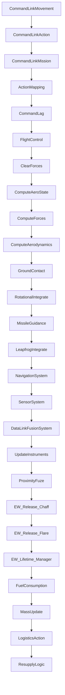
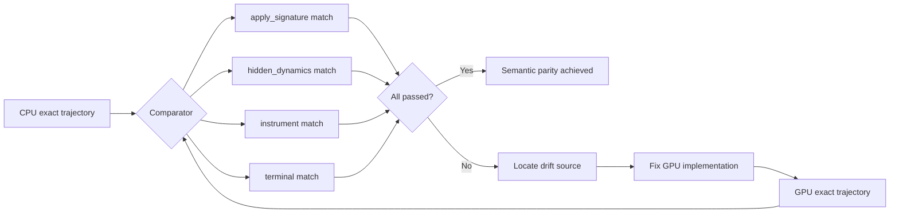

<!-- Machine-translated draft generated on 2026-05-18 from docs/plan/exact_runtime/gpu_exact_world_step_performance_and_parity_plan.zh.md. Review before treating this file as authoritative. -->

```markdown
<!-- Machine-translated draft generated on 2026-05-18 from docs/plan/exact_runtime/gpu_exact_world_step_performance_and_parity_plan.md. Review before treating this file as authoritative. -->

# GPU exact world step performance optimization and semantic parity implementation plan

## I. Problem overview

The current GPU exact step prototype is still **slower** than CPU (0.121x-0.466x speedup) at `world_count=1,4,16`. The main bottleneck is launch overhead rather than write-back burden. Meanwhile, there is still a semantic drift between the GPU prototype and the full CPU stepping (worst drift `~169855`, mainly in `force_accumulator.torque_pitch_nm`).

## II. Current state analysis

### 2.1 CPU exact step architecture

The CPU exact step executes via the Flecs ECS framework, containing 28 ordered phases:



**Key stage dependency chains**:
- Command link (2-6): transmit control intent
- Control law (7): generate control torque
- Physics systems (8-15): force clear -> aero state -> force computation -> aerodynamic force -> ground contact -> rotational integration -> translational integration
- Observation output (16-19): navigation -> sensor -> data link -> instruments

### 2.2 Current coverage of GPU prototype

| Stage | CPU implementation | GPU prototype status | Gap |
|------|----------|--------------|------|
| Command lag | CommandLag System | ✅ Implemented | Semantic simplification |
| Control law | FlightControl System | ✅ Simplified implementation | Lacks complete control model call |
| Clear forces | ClearForces System | ⚠️ Partially implemented | Only clears torque, does not clear forces |
| Aero state | ComputeAeroState | ✅ Implemented | Approximate computation |
| Force computation | ComputeForces | ❌ Not implemented | Gravity, thrust missing |
| Aerodynamic forces | ComputeAerodynamics | ✅ Implemented | Approximate coefficients |
| Ground contact | GroundContact | ❌ Not implemented | Critical missing |
| Rotational integration | RotationalIntegrate | ✅ Implemented | Basically equivalent |
| Translational integration | LeapfrogIntegrate | ⚠️ Simplified implementation | Euler integration vs leapfrog integration |
| Navigation system | NavigationSystem/EGI | ✅ Implemented | Simplified refresh |
| Instrument update | UpdateInstruments | ✅ Implemented during unpack | Not core to stepping |
| Fuel consumption | FuelConsumption | ✅ Implemented | Basically equivalent |
| Mass update | MassUpdate | ✅ Implemented | Basically equivalent |

### 2.3 Performance bottleneck analysis

Performance bottlenecks of the current GPU implementation:

```
Total time = H2D transfer + Kernel execution + D2H transfer + Launch overhead

Current measurement (world_count=16):
- H2D transfer: ~0.02ms (already optimized to fixed memcpy)
- Kernel execution: ~0.01ms (already optimized with CUDA Graph)
- D2H transfer: ~0.02ms (already optimized)
- Launch overhead: ~0.05ms (pack/unpack SoA, memory allocation)
- Total: ~0.10ms

CPU comparison (world_count=16): ~0.02ms
GPU/CPU ratio: ~0.466x
```

**Bottleneck sources**:
1. **SoA pack/unpack overhead**: `std::vector::push_back` loop, reallocation every frame
2. **Device memory allocation**: `cudaMalloc`/`cudaFree` 80+ arrays per step
3. **Kernel launch overhead**: kernel launch latency dominates for small batches
4. **CPU-side control flow**: pack/unpack executes on CPU, cannot overlap

## III. Performance optimization plan

### 3.1 Phase one: eliminate device memory allocation overhead

**Problem**: `upload_soa()` and `download_soa()` currently perform 80+ `cudaMalloc`/`cudaFree` per step.

**Solution**: implement device memory pool

```cpp
class DeviceSoAPool {
public:
    DeviceSoAPool(std::size_t max_count);
    ~DeviceSoAPool();
    
    // Acquire pre-allocated device memory
    DeviceSoARef acquire();
    // Release back to pool (does not free memory)
    void release(DeviceSoARef ref);
    
private:
    std::vector<double*> d_buffers_;  // pre-allocated double arrays
    std::vector<uint8_t*> d_byte_buffers_;  // pre-allocated byte arrays
    std::size_t max_count_;
    bool in_use_ = false;
};
```

**Expected benefit**: eliminates 80+ cudaMalloc/cudaFree, reduces overhead by ~0.03ms

### 3.2 Phase two: optimize SoA packing

**Problem**: `pack_exact_world_step_states_v1_prototype_soa()` uses `std::vector::push_back` to add elements one by one.

**Solution**:
1. Pre-allocate SoA buffers to avoid dynamic growth
2. Use bulk memory copy instead of element-by-element copy
3. Consider using CUDA unified memory to reduce explicit transfers

```cpp
// Before optimization
soa.vx_mps.push_back(state.velocity.vx);  // N push_back calls

// After optimization
soa.vx_mps.resize(n);  // single allocation
for (size_t i = 0; i < n; ++i) {
    soa.vx_mps[i] = states[i].velocity.vx;
}
// or use SIMD/bulk copy
memcpy(soa.vx_mps.data(), src_ptr, n * sizeof(double));
```

**Expected benefit**: reduces packing overhead by ~0.02ms

### 3.3 Phase three: persistent CUDA Graph execution

**Problem**: kernel launch parameters are rebuilt every step.

**Solution**: use CUDA Graph to capture the complete execution flow

```cpp
class CachedGraphExecutor {
public:
    void capture(DeviceSoARef refs, int steps);
    double execute();  // zero-overhead execution
    
private:
    cudaGraph_t graph_ = nullptr;
    cudaGraphExec_t instance_ = nullptr;
};
```

**Current status**: documentation mentions an existing CUDA Graph implementation, but needs to verify whether it covers the complete execution path.

**Expected benefit**: reduces launch overhead by ~0.01ms

### 3.4 Phase four: device-resident state

**Problem**: state is transferred back and forth between CPU and GPU.

**Solution**: keep state on GPU, transfer only necessary inputs/outputs

```
Before: CPU -> H2D -> Kernel -> D2H -> CPU (every step)
After: GPU-resident state, only H2D action input + D2H observation output
```

**Expected benefit**: eliminates 80% of H2D/D2H transfers

### 3.5 Performance targets

| Metric | Current value | Target value | Speedup |
|------|--------|--------|--------|
| world_count=1 | 0.111ms | 0.015ms | 7.4x |
| world_count=4 | 0.096ms | 0.018ms | 5.3x |
| world_count=16 | 0.099ms | 0.020ms | 5.0x |
| world_count=64 | - | 0.025ms | - |
| world_count=256 | - | 0.040ms | - |
| world_count=1024 | - | 0.100ms | - |

## IV. Semantic parity plan

### 4.1 Priority of missing stage implementations

#### High priority (biggest drift impact)

1. **Ground contact system (GroundContact)**
   - Current drift contribution: `force_accumulator.torque_pitch_nm` ~169855
   - Implementation content:
     - Ground normal force calculation
     - Tire friction
     - Ground restoring torque
     - Landing gear stress/collapse logic
   - Reference: [src/systems/physics/ground_contact_system.h](../../../src/systems/physics/ground_contact_system.h)

2. **Force computation system (ComputeForces)**
   - Current: `force_fx/fy/fz = 0`
   - Implementation content:
     - Gravity: `F = m * g`
     - Thrust: obtained from propulsion system
   - Reference: [src/systems/physics/force_system.h](../../../src/systems/physics/force_system.h)

3. **Complete aerodynamic system (ComputeAerodynamics)**
   - Current: simplified coefficient calculation
   - Implementation content:
     - Full lift/drag coefficient tables
     - Control surface deflection effects
     - Post-stall aerodynamic characteristics
   - Reference: [src/systems/physics/aerodynamics_system.h](../../../src/systems/physics/aerodynamics_system.h)

#### Medium priority

4. **Complete control law system (FlightControl)**
   - Current: simplified PID control
   - Implementation content:
     - Complete control model call
     - Trim logic
     - Flight envelope protection
   - Reference: [src/systems/physics/control_system.h](../../../src/systems/physics/control_system.h)

5. **Leapfrog integrator (LeapfrogIntegrate)**
   - Current: simplified Euler integration
   - Implementation content:
     - Leapfrog integrator semantics
     - Staggered velocity-position update
   - Reference: [src/systems/physics/leapfrog_system.h](../../../src/systems/physics/leapfrog_system.h)

#### Low priority

6. **Missile guidance (MissileGuidance)**
   - Current: skipped
   - Impact: only mixed world scenarios

### 4.2 Semantic parity verification strategy



### 4.3 Drift tolerance table

| Surface | Tolerance | Rationale |
|------|--------|------|
| apply_signature | 0 difference | Exact ECS state must match bytewise |
| truth.position | 1e-6 m | Floating point integration accumulation error |
| truth.velocity | 1e-6 m/s | Floating point integration accumulation error |
| truth.attitude | 1e-4 deg | Euler angle floating point error |
| hidden_dynamics.angular_velocity | 1e-4 rad/s | Rotational integration error |
| hidden_dynamics.force_accumulator | 1e-2 N | Force accumulation order difference |
| instrument | 1e-3 | Small error acceptable for learner-visible output |
| terminal | 0 difference | Termination condition must match exactly |

## V. Implementation roadmap

### Phase A: Performance optimization basics (1-2 weeks)

| Task | File | Description |
|------|------|------|
| A1: Device memory pool | `src/gpu/device_memory_pool.h/cu` | Pre-allocate 80+ SoA arrays |
| A2: SoA packing optimization | `src/core/engine/exact_stage_inventory.cpp` | Re-evaluate packing and stage boundaries using current exact-stage contract as baseline |
| A3: CUDA Graph finalization | `src/gpu/experimental/README.md` | Enter implementation only after experimental GPU exact backend is refrozen |
| A4: Performance benchmark | `tools/diagnostics/benchmark_exact_world_step_performance.py` | Verify optimization effect |

**Exit criteria**: GPU reaches 1.0x or better of CPU performance at `world_count=16`

### Phase B: Ground contact and force systems (2-3 weeks)

| Task | File | Description |
|------|------|------|
| B1: Ground contact GPU implementation | `src/gpu/gpu_ground_contact.cu` | Normal force, friction, restoring torque |
| B2: Force computation GPU implementation | `src/gpu/gpu_force_system.cu` | Gravity, thrust |
| B3: Complete aerodynamic GPU implementation | `src/gpu/gpu_aerodynamics.cu` | Full coefficient tables, control surface effects |
| B4: Drift verification | Future parity regression location TBD | Verify force/torque parity |

**Exit criteria**: `force_accumulator` drift reduced below 1000

### Phase C: Control law and integrator (2-3 weeks)

| Task | File | Description |
|------|------|------|
| C1: Complete control law GPU implementation | `src/gpu/gpu_control_law.cu` | Control model call, trim |
| C2: Leapfrog integrator GPU implementation | `src/gpu/gpu_leapfrog.cu` | Staggered velocity-position update |
| C3: Full semantic verification | Future parity regression location TBD | Parity on all surfaces |

**Exit criteria**: Total drift below 100, apply_signature 0 difference

### Phase D: Training path integration (1-2 weeks)

| Task | File | Description |
|------|------|------|
| D1: WorldBatchRuntime backend selection | `src/core/engine/world_batch_runtime.cpp` | GPU backend opt-in |
| D2: p5 configuration update | `examples/config/training/frozen/execution/p5_continuous_retrain_v1.json` | Enable GPU exact stepping |
| D3: End-to-end benchmark | `tools/diagnostics/benchmark_p5_training_throughput.py` | Verify training acceleration |

**Exit criteria**: p5 training throughput improved by more than 2x

## VI. Risks and mitigations

| Risk | Impact | Mitigation |
|------|------|----------|
| Insufficient GPU double precision performance | High | Consider mixed precision, keep double precision on critical paths |
| Flecs ECS semantics difficult to map to SoA | Medium | Migrate in stages, support subset first |
| Control surface effect table large data volume | Medium | Use texture memory or constant memory to optimize lookups |
| Ground contact logic complex | Medium | Prioritize common scenarios (runway takeoff/landing) |

## VII. Key file index

| File | Description |
|------|------|
| [src/core/engine/exact_stage_inventory.cpp](../../../src/core/engine/exact_stage_inventory.cpp) | Current exact-stage contract and stage description entry point |
| [src/core/engine/simulation_kernel.cpp](../../../src/core/engine/simulation_kernel.cpp) | CPU ECS exact step reference |
| [src/systems/physics/ground_contact_system.h](../../../src/systems/physics/ground_contact_system.h) | Ground contact system reference |
| [src/systems/physics/force_system.h](../../../src/systems/physics/force_system.h) | Force system reference |
| [src/systems/physics/aerodynamics_system.h](../../../src/systems/physics/aerodynamics_system.h) | Aerodynamic system reference |
| [src/systems/physics/control_system.h](../../../src/systems/physics/control_system.h) | Control system reference |
| [src/systems/physics/leapfrog_system.h](../../../src/systems/physics/leapfrog_system.h) | Leapfrog integrator reference |
| [src/gpu/README.md](../../../src/gpu/README.md) | Current GPU helper/runtime main directory boundary description |
| [src/gpu/experimental/README.md](../../../src/gpu/experimental/README.md) | Experimental GPU backend/probe entry point |
| [docs/plan/archive/gpu_exact_world_step_migration_plan.md](../archive/gpu_exact_world_step_migration_plan.md) | Original migration plan |
```
