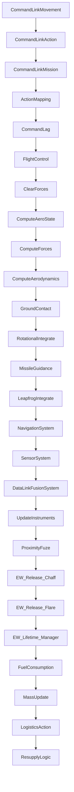
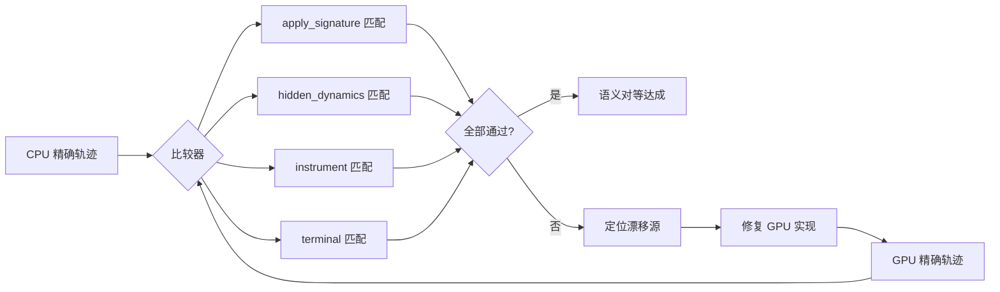

# GPU 精确世界步进性能优化与语义对等实施计划

## 一、问题概述

当前 GPU 精确步进原型在 `world_count=1,4,16` 下仍比 CPU **慢**（0.121x-0.466x 加速比），主要瓶颈是启动开销而非写回负担。同时，GPU 原型与完整 CPU 步进之间仍存在语义漂移（worst drift `~169855`，主要在 `force_accumulator.torque_pitch_nm`）。

## 二、当前状态分析

### 2.1 CPU 精确步进架构

CPU 精确步进通过 Flecs ECS 框架执行，包含 28 个有序阶段：



**关键阶段依赖链**：
- 命令链路 (2-6): 传递控制意图
- 控制律 (7): 生成控制力矩
- 物理系统 (8-15): 力清除 -> 气动状态 -> 力计算 -> 气动力 -> 地面接触 -> 旋转积分 -> 平移积分
- 观测输出 (16-19): 导航 -> 传感器 -> 数据链 -> 仪表

### 2.2 GPU 原型当前覆盖范围

| 阶段 | CPU 实现 | GPU 原型状态 | 差距 |
|------|----------|--------------|------|
| 命令滞后 | CommandLag System | ✅ 已实现 | 语义简化 |
| 控制律 | FlightControl System | ✅ 简化实现 | 缺少完整控制模型调用 |
| 力清除 | ClearForces System | ⚠️ 部分实现 | 仅清除力矩，未清除力 |
| 气动状态 | ComputeAeroState | ✅ 已实现 | 近似计算 |
| 力计算 | ComputeForces | ❌ 未实现 | 重力、推力缺失 |
| 气动力 | ComputeAerodynamics | ✅ 已实现 | 近似系数 |
| 地面接触 | GroundContact | ❌ 未实现 | 关键缺失 |
| 旋转积分 | RotationalIntegrate | ✅ 已实现 | 基本对等 |
| 平移积分 | LeapfrogIntegrate | ⚠️ 简化实现 | 欧拉积分 vs 蛙跳积分 |
| 导航系统 | NavigationSystem/EGI | ✅ 已实现 | 简化刷新 |
| 仪表更新 | UpdateInstruments | ✅ unpack 时实现 | 非步进核心 |
| 燃料消耗 | FuelConsumption | ✅ 已实现 | 基本对等 |
| 质量更新 | MassUpdate | ✅ 已实现 | 基本对等 |

### 2.3 性能瓶颈分析

当前 GPU 实现的性能瓶颈：

```
总时间 = H2D 传输 + Kernel 执行 + D2H 传输 + 启动开销

当前测量 (world_count=16):
- H2D 传输: ~0.02ms (已优化为固定 memcpy)
- Kernel 执行: ~0.01ms (CUDA Graph 已优化)
- D2H 传输: ~0.02ms (已优化)
- 启动开销: ~0.05ms (打包/解包 SoA, 内存分配)
- 总计: ~0.10ms

CPU 对比 (world_count=16): ~0.02ms
GPU/CPU 比: ~0.466x
```

**瓶颈来源**：
1. **SoA 打包/解包开销**: `std::vector::push_back` 循环，每帧重新分配
2. **设备内存分配**: 每步重新 `cudaMalloc`/`cudaFree` 80+ 个数组
3. **内核启动开销**: 小批量下 kernel launch latency 占主导
4. **CPU 侧控制流**: pack/unpack 在 CPU 上执行，无法重叠

## 三、性能优化方案

### 3.1 阶段一：消除设备内存分配开销

**问题**: 当前 `upload_soa()` 和 `download_soa()` 每步执行 80+ 次 `cudaMalloc`/`cudaFree`。

**解决方案**: 实现设备内存池

```cpp
class DeviceSoAPool {
public:
    DeviceSoAPool(std::size_t max_count);
    ~DeviceSoAPool();
    
    // 获取预分配的设备内存
    DeviceSoARef acquire();
    // 释放回池（不释放内存）
    void release(DeviceSoARef ref);
    
private:
    std::vector<double*> d_buffers_;  // 预分配的 double 数组
    std::vector<uint8_t*> d_byte_buffers_;  // 预分配的 byte 数组
    std::size_t max_count_;
    bool in_use_ = false;
};
```

**预期收益**: 消除 80+ 次 cudaMalloc/cudaFree，减少 ~0.03ms 开销

### 3.2 阶段二：SoA 打包优化

**问题**: `pack_exact_world_step_states_v1_prototype_soa()` 使用 `std::vector::push_back` 逐个元素添加。

**解决方案**:
1. 预分配 SoA 缓冲区，避免动态增长
2. 使用批量内存拷贝替代逐元素拷贝
3. 考虑使用 CUDA 统一内存减少显式传输

```cpp
// 优化前
soa.vx_mps.push_back(state.velocity.vx);  // N 次 push_back

// 优化后
soa.vx_mps.resize(n);  // 一次分配
for (size_t i = 0; i < n; ++i) {
    soa.vx_mps[i] = states[i].velocity.vx;
}
// 或使用 SIMD/批量拷贝
memcpy(soa.vx_mps.data(), src_ptr, n * sizeof(double));
```

**预期收益**: 减少 ~0.02ms 打包开销

### 3.3 阶段三：CUDA Graph 常驻执行

**问题**: 当前每步重新构建 kernel launch 参数。

**解决方案**: 使用 CUDA Graph 捕获完整执行流

```cpp
class CachedGraphExecutor {
public:
    void capture(DeviceSoARef refs, int steps);
    double execute();  // 零启动开销执行
    
private:
    cudaGraph_t graph_ = nullptr;
    cudaGraphExec_t instance_ = nullptr;
};
```

**当前状态**: 文档提到已有 CUDA Graph 实现，但需要验证是否覆盖了完整执行路径。

**预期收益**: 减少 ~0.01ms 启动开销

### 3.4 阶段四：设备常驻状态

**问题**: 状态在 CPU 和 GPU 之间来回传输。

**解决方案**: 保持状态在 GPU 上，仅传输必要的输入/输出

```
优化前: CPU -> H2D -> Kernel -> D2H -> CPU (每步)
优化后: GPU 常驻状态，仅 H2D 动作输入 + D2H 观测输出
```

**预期收益**: 消除 80% 的 H2D/D2H 传输

### 3.5 性能目标

| 指标 | 当前值 | 目标值 | 加速比 |
|------|--------|--------|--------|
| world_count=1 | 0.111ms | 0.015ms | 7.4x |
| world_count=4 | 0.096ms | 0.018ms | 5.3x |
| world_count=16 | 0.099ms | 0.020ms | 5.0x |
| world_count=64 | - | 0.025ms | - |
| world_count=256 | - | 0.040ms | - |
| world_count=1024 | - | 0.100ms | - |

## 四、语义对等方案

### 4.1 缺失阶段实现优先级

#### 高优先级（影响最大漂移）

1. **地面接触系统 (GroundContact)**
   - 当前漂移贡献: `force_accumulator.torque_pitch_nm` ~169855
   - 实现内容:
     - 地面法向力计算
     - 轮胎摩擦力
     - 地面恢复力矩
     - 起落架应力/坍塌逻辑
   - 参考: [`src/systems/physics/ground_contact_system.h`](src/systems/physics/ground_contact_system.h)

2. **力计算系统 (ComputeForces)**
   - 当前: `force_fx/fy/fz = 0`
   - 实现内容:
     - 重力: `F = m * g`
     - 推力: 从推进系统获取
   - 参考: [`src/systems/physics/force_system.h`](src/systems/physics/force_system.h)

3. **完整气动力系统 (ComputeAerodynamics)**
   - 当前: 简化系数计算
   - 实现内容:
     - 完整升力/阻力系数表
     - 控制面偏转效应
     - 失速后气动特性
   - 参考: [`src/systems/physics/aerodynamics_system.h`](src/systems/physics/aerodynamics_system.h)

#### 中优先级

4. **完整控制律系统 (FlightControl)**
   - 当前: 简化 PID 控制
   - 实现内容:
     - 完整控制模型调用
     - 配平逻辑
     - 飞行包线保护
   - 参考: [`src/systems/physics/control_system.h`](src/systems/physics/control_system.h)

5. **蛙跳积分器 (LeapfrogIntegrate)**
   - 当前: 简化欧拉积分
   - 实现内容:
     - 蛙跳积分器语义
     - 速度-位置交错更新
   - 参考: [`src/systems/physics/leapfrog_system.h`](src/systems/physics/leapfrog_system.h)

#### 低优先级

6. **导弹制导 (MissileGuidance)**
   - 当前: 跳过
   - 影响: 仅混合世界场景

### 4.2 语义对等验证策略



### 4.3 漂移容忍度表

| 表面 | 容忍度 | 理由 |
|------|--------|------|
| apply_signature | 0 差异 | 精确 ECS 状态必须逐字节匹配 |
| truth.position | 1e-6 m | 浮点积分累积误差 |
| truth.velocity | 1e-6 m/s | 浮点积分累积误差 |
| truth.attitude | 1e-4 deg | 欧拉角浮点误差 |
| hidden_dynamics.angular_velocity | 1e-4 rad/s | 旋转积分误差 |
| hidden_dynamics.force_accumulator | 1e-2 N | 力累积顺序差异 |
| instrument | 1e-3 |  learner 可见输出可接受小误差 |
| terminal | 0 差异 | 终止条件必须精确匹配 |

## 五、实施路线图

### Phase A: 性能优化基础（1-2 周）

| 任务 | 文件 | 说明 |
|------|------|------|
| A1: 设备内存池 | `src/gpu/device_memory_pool.h/cu` | 预分配 80+ 个 SoA 数组 |
| A2: SoA 打包优化 | `src/gpu/gpu_exact_world_step_runtime.cpp` | 批量内存拷贝 |
| A3: CUDA Graph 固化 | `src/gpu/gpu_exact_world_step_runtime_cuda.cu` | 完整执行路径捕获 |
| A4: 性能基准测试 | `tools/diagnostics/benchmark_exact_world_step_performance.py` | 验证优化效果 |

**退出标准**: GPU 在 `world_count=16` 下达到 CPU 性能的 1.0x 或更好

### Phase B: 地面接触与力系统（2-3 周）

| 任务 | 文件 | 说明 |
|------|------|------|
| B1: 地面接触 GPU 实现 | `src/gpu/gpu_ground_contact.cu` | 法向力、摩擦力、恢复力矩 |
| B2: 力计算 GPU 实现 | `src/gpu/gpu_force_system.cu` | 重力、推力 |
| B3: 完整气动力 GPU 实现 | `src/gpu/gpu_aerodynamics.cu` | 完整系数表、控制面效应 |
| B4: 漂移验证 | `tests/diagnostics/test_exact_world_step_force_parity.py` | 验证力/力矩对等 |

**退出标准**: `force_accumulator` 漂移降至 1000 以下

### Phase C: 控制律与积分器（2-3 周）

| 任务 | 文件 | 说明 |
|------|------|------|
| C1: 完整控制律 GPU 实现 | `src/gpu/gpu_control_law.cu` | 控制模型调用、配平 |
| C2: 蛙跳积分器 GPU 实现 | `src/gpu/gpu_leapfrog.cu` | 速度-位置交错更新 |
| C3: 完整语义验证 | `tests/diagnostics/test_exact_world_step_full_parity.py` | 全表面对等 |

**退出标准**: 总漂移降至 100 以下，apply_signature 0 差异

### Phase D: 训练路径集成（1-2 周）

| 任务 | 文件 | 说明 |
|------|------|------|
| D1: WorldBatchRuntime 后端选择 | `src/core/engine/world_batch_runtime.cpp` | GPU 后端 opt-in |
| D2: p5 配置更新 | `examples/config/training/frozen/execution/p5_continuous_retrain_v1.json` | 启用 GPU 精确步进 |
| D3: 端到端基准测试 | `tools/diagnostics/benchmark_p5_training_throughput.py` | 验证训练加速 |

**退出标准**: p5 训练吞吐量提升 2x 以上

## 六、风险与缓解

| 风险 | 影响 | 缓解措施 |
|------|------|----------|
| GPU 双精度性能不足 | 高 | 考虑混合精度，关键路径保持双精度 |
| Flecs ECS 语义难以映射到 SoA | 中 | 分阶段迁移，先支持子集 |
| 控制面效应表数据量大 | 中 | 使用纹理内存或常量内存优化查找 |
| 地面接触逻辑复杂 | 中 | 优先实现常见场景（跑道起降） |

## 七、关键文件索引

| 文件 | 说明 |
|------|------|
| [`src/gpu/gpu_exact_world_step_runtime.h`](src/gpu/gpu_exact_world_step_runtime.h) | GPU 精确步进运行时头文件 |
| [`src/gpu/gpu_exact_world_step_runtime.cpp`](src/gpu/gpu_exact_world_step_runtime.cpp) | CPU 侧打包/解包/参考实现 |
| [`src/gpu/gpu_exact_world_step_runtime_cuda.cu`](src/gpu/gpu_exact_world_step_runtime_cuda.cu) | CUDA 内核实现 |
| [`src/gpu/gpu_exact_world_step_contract.h`](src/gpu/gpu_exact_world_step_contract.h) | 精确状态契约定义 |
| [`src/gpu/gpu_exact_world_step_runtime_types.h`](src/gpu/gpu_exact_world_step_runtime_types.h) | SoA 类型定义 |
| [`src/core/engine/simulation_kernel.cpp`](src/core/engine/simulation_kernel.cpp) | CPU ECS 精确步进参考 |
| [`src/systems/physics/ground_contact_system.h`](src/systems/physics/ground_contact_system.h) | 地面接触系统参考 |
| [`src/systems/physics/force_system.h`](src/systems/physics/force_system.h) | 力系统参考 |
| [`src/systems/physics/aerodynamics_system.h`](src/systems/physics/aerodynamics_system.h) | 气动力系统参考 |
| [`src/systems/physics/control_system.h`](src/systems/physics/control_system.h) | 控制系统参考 |
| [`src/systems/physics/leapfrog_system.h`](src/systems/physics/leapfrog_system.h) | 蛙跳积分器参考 |
| [`docs/plan/gpu_exact_world_step_migration_plan.md`](docs/plan/gpu_exact_world_step_migration_plan.md) | 原始迁移计划 |
