# Policy Execution Architecture Baseline

Language:
- English canonical: `policy_execution_architecture.md`
- Chinese companion: [policy_execution_architecture.zh.md](policy_execution_architecture.zh.md)

Status: `2026-06-07` authoritative baseline for maintained policy execution
architecture and model-component ownership.

This document records the standard model decomposition used by current
PPO/HMoE work. It is not a claim that any active training run has solved
fire timing, memory, or ammunition management. Its purpose is to prevent model
mechanisms, runtime constraints, rewards, losses, and diagnostics from being
treated as interchangeable.

## Architecture Graph

```mermaid
flowchart LR
  Env["Environment observation"] --> Obs["Observation contract"]
  Obs --> Prep["Feature preprocessing"]
  Prep --> Ext["Feature extractor"]
  Ext --> Latent["Actor latent"]

  Latent --> Shared["Shared action net"]
  Latent --> Route["HMoE route selection"]
  Route --> Residual["HMoE residual head bank"]
  Shared --> Mean["Action parameters"]
  Residual --> Mean
  Mean --> Dist["Hybrid action distribution"]
  Obs --> Mask["Policy-visible event support"]
  Mask --> Dist
  Dist --> Action["Policy action sample/mode"]
  Action --> Adapter["Runtime action adapter/state machine"]
  Adapter --> Kernel["Simulation/runtime"]

  Latent --> Aux["Auxiliary model heads"]
  Aux --> AuxLoss["Auxiliary losses"]
  Dist --> PPOLoss["PPO policy loss"]
  Kernel --> Reward["Reward surface"]
  Kernel --> Info["Runtime info/probe fields"]
  Reward --> Rollout["Rollout buffer"]
  Info --> Rollout
  Rollout --> PPOLoss
  Rollout --> AuxLoss
```



## Component Roles

| Role | Owns | Does not own |
| --- | --- | --- |
| Observation contract | Fields visible to the policy and their shape/semantics. | Reward targets hidden from policy, future trajectory facts, or task acceptance. |
| Feature extractor | Conversion from observation tensors to model features. | Runtime legality, reward values, or event labels. |
| Actor latent | Shared representation consumed by action and auxiliary branches. | A standalone claim that behavior is correct. |
| HMoE routing | Semantic route/subexpert selection for action residuals. | A guarantee that computation is fully hierarchical unless the forward graph implements it. |
| Action distribution | Sampling, deterministic mode, log-prob, and entropy for executable actions. | Post-action runtime acceptance or weapon-effect truth. |
| Policy-visible event support mask | Event support visible before sampling, such as hold-only or hold/fire-once. It may be explicit in observation or derived from mission fields. | The final runtime acceptance truth, learned timing quality, or optimal stopping. |
| Runtime action adapter/state machine | Conversion from policy intent to accepted/rejected runtime events. | The policy's probability of choosing an event before it is consumed. |
| Auxiliary head | A model branch trained from side objectives or labels. | Executable behavior unless explicitly wired into the action distribution. |
| PPO loss | Main policy/value optimization from rollout returns and advantages. | Task-specific label construction unless documented as part of the algorithm. |
| Auxiliary loss | Side objectives such as first-event hazard, credit, stopping, or window-prior losses. | Runtime legality or acceptance status. |
| Reward surface | Environment scoring and shaping. | Model architecture ownership or action-support rules. |
| Probe/diagnostic | Measurement of behavior, logits, support, labels, and failure points. | A component that changes runtime behavior. |

## Current Implementation Map

| Standard role | Current implementation surface | Notes |
| --- | --- | --- |
| Observation taxonomy | `python/mission_obs_taxonomy.py` | Names maintained mission fields. `air_combat_c2_roe_v1` exposes base C2/ROE fields; `air_combat_c2_roe_v2` adds `fire_mask_open`, launch/quality-window fields, age fields, range, and track age. |
| Observation assembly | `gym_envs/scenario_loader/mission_observation.py` | Builds policy-visible mission vectors and state-completion fields. Policy-visible fire support can be an estimate and is not identical to the final A5 runtime gate. |
| Feature extraction | `python/models/transformer.py::TransformerExtractor`, `TemporalTransformerExtractor` | Preprocesses mission/proprio/entity observations before policy heads. |
| HMoE policy spine | `python/rl/policy_algo/policies.py::HierarchicalMoEExecutionPolicy` | Owns action net, HMoE residual application, event distribution creation, and auxiliary-head modules. |
| HMoE routing | `python/rl/policy_algo/hmoe_routing.py` | Maintains route families such as `takeoff_ground`, `departure_nav`, `formation_cooperative`, `recovery_landing`, and `combat_weapons`; air-combat C2/ROE routing is the combat-weapons specialization. |
| Hybrid event action distribution | `_HybridActionDistribution` in `policies.py` | Owns event logits, masking, sampling, deterministic argmax, log-prob, and entropy. |
| Hybrid executable event head | `hybrid_event_head` in `policies.py` | Executable event-logit residual: when enabled, it directly changes hold/fire logits before `_HybridActionDistribution`. |
| A5 event-action runtime | `gym_envs/universal_env_parts/air_combat_event_action.py` | Owns final `fire_once` acceptance/rejection when the C2/ROE contract is present, including `FiredAssess`, pending assessment, shot-budget suppression, runtime info names, weapon readiness, ammo, master arm, and authority-holder checks. |
| A6 first-event labels/losses | `python/rl/policy_algo/first_event_hazard.py` | Owns first-event label field/source constants and pure hazard/credit/policy-margin helper losses. |
| A6 rollout storage | `python/rl/policy_algo/first_event_rollout_buffer.py` | Carries event labels outside policy observations. |
| A7 event-credit head | `hybrid_event_credit_head` in `policies.py` | Auxiliary Q-style hold/fire values; executable only through documented action-path coupling. |
| M3-S1 grouped stopping | `m3_stopping_head` in `policies.py` plus `m3s1_grouped_stopping.py` | One-shot timing branch. Evidence must name `route_source` and `censoring_kind`; behavior success requires executable event-action wiring and probes. |
| M3-S2 event-window objective | `m3s2_event_window_*` update path in `ppo_adaptive_kl.py` | Distinct auxiliary objective. By default it trains executable fire-event logit deltas; with `m3s2_event_window_use_stopping_head=true`, it trains `m3_stopping_head`. |
| M3 window-prior classifier | `m3_window_classifier_head` and standardization buffers in `policies.py` | Quality-window evidence branch. Storage mode, balanced replay/calibration population, detach setting, best-restore behavior, and adapter coupling are part of the model contract. |
| M3-S2 support-preserving collect | Collection path in `ppo_adaptive_kl.py` | Rollout-collection intervention that can force event index 9 to hold and recompute log-prob to preserve supervised support; not merely a probe. |
| PPO/update integration | `python/rl/policy_algo/ppo_adaptive_kl.py` | Collects rollout metadata, constructs and attaches first-event labels, owns A6/A7 weighting, cross-rollout context, shadow-quality/projection use, minibatch attachment, update scheduling, and diagnostics. |
| Process/chain probes | `tools/diagnostics/air_combat_stage0_process_probe.py`, `tools/diagnostics/m3s2_chain_breakpoint_probe.py` | Evaluation and localization only unless a task explicitly documents an action-changing collect intervention. |

## Executable Vs Auxiliary Branches

Every branch must be classified before it is used in a task claim:

| Class | Meaning | Acceptance implication |
| --- | --- | --- |
| `executable` | Directly determines sampled/deterministic action distribution. | Behavior probes can evaluate it directly. |
| `adapter-coupled` | Feeds an executable action path through a documented adapter. | The adapter and its gradient/detach behavior must be documented. |
| `auxiliary-only` | Trained or logged but not used by action selection. | It can prove signal/capacity, not behavior. |
| `diagnostic-only` | Exists only in probes, metrics, or offline fitting. | It cannot be used as an acceptance result. |

Current important classifications:

- `hybrid_event_head` is executable because it directly changes hold/fire event
  logits before `_HybridActionDistribution`.
- A5 event-action mask and state machine are executable runtime constraints, not
  learned timing heads. They are active only when the C2/ROE contract is present;
  otherwise `air_combat_hybrid_v1` remains a flat hybrid transport action.
- The policy-side fire support mask is a policy-visible estimate. It may come
  from `event_action_mask`, `fire_mask`, or mission-derived fields; the A5
  adapter still enforces final runtime-only conditions such as master arm,
  weapon readiness, ammo, authority-holder match, local `FiredAssess`, observed
  release count, and reattack policy.
- `hybrid_event_credit_head` is auxiliary unless a documented action adapter uses
  its hold/fire values. In the current path, Q-style values are attached for
  loss/diagnostic access and do not by themselves change sampled/mode actions.
- `m3_stopping_head` is auxiliary unless `hybrid_event_use_m3_stopping_head`
  connects it to the hybrid event logits and probes validate executable pulses.
- `m3_window_classifier_head` can become adapter-coupled when
  `hybrid_event_use_m3_window_classifier_head` is enabled; its detach setting and
  input-standardization support population remain part of the contract. When
  both the M3 window-classifier adapter and M3 stopping adapter are enabled, the
  current event adapter gives the window-classifier path precedence.
- `m3s2_event_window` is a side objective, but it can train an executable
  event-logit residual path when configured to use direct event logits. Its
  optimizer and target-head selection are part of loss ownership.
- Support-preserving collect is a rollout-collection intervention that may
  change collected actions/log-probs. It must be documented separately from
  diagnostic probes.

## One-Shot Timing Standard

For one-shot timing problems, use this decomposition:

```text
legal_t = runtime support says fire_once is available
w_t     = P(window or high-quality opportunity | history/state)
h_t     = P(fire now | history/state, window evidence, not-yet-fired)
lambda_t = executable event hazard after soft combination and legal masking
```

Rules:

- `legal_t` is a support constraint. Distinguish policy-visible support from
  final runtime gate truth. The former shapes the sampled event distribution;
  the latter is enforced by the runtime adapter.
- `w_t` is a prior or evidence signal. It should raise or lower fire propensity,
  not act as an undocumented hard rule unless the task explicitly owns that
  hard-gate contract.
- `h_t` is the conditional stopping/trigger component.
- `lambda_t` is the executable fire-once probability or event-logit boundary
  actually evaluated by deterministic and stochastic probes.
- After an accepted one-shot event, runtime state may force hold-only support;
  this prevents repeated releases but does not choose the first event time.
- For `air_combat_hybrid_v1`, `fire_once_requested` is the effective rising-edge
  pulse after hybrid action normalization, not a held raw policy command. The A5
  state machine consumes that pulse and may clear the transported `fire_weapon`
  value before `PilotAction`.

## Loss And Reward Ownership

The training stack must keep these surfaces separate:

- PPO loss updates the executable policy from rollout returns and advantages.
- Auxiliary losses update declared auxiliary or adapter-coupled branches.
- Reward shaping can make outcomes easier to learn, but it must not be the only
  definition of action legality, first-shot support, or post-launch suppression.
- Label construction must name its censoring behavior: accepted event, censored
  no-event, prewindow, deadline, shadow-quality, or legal-open quality.
- `first_event_hazard.py` owns reusable label/source constants and pure helper
  losses. `ppo_adaptive_kl.py` owns rollout-time label construction, cross-rollout
  context, projection use, minibatch attachment, A6-vs-A7 weighting, and update
  scheduling.
- If auxiliary optimization uses replay, a frozen support batch, or a different
  normalization population than execution, that mismatch must be documented and
  probed.

## Documentation Checklist For New Model Mechanisms

Any new model mechanism must document:

1. Role: executable, adapter-coupled, auxiliary-only, or diagnostic-only.
2. Input support: observation fields, history length, latent source, and any
   normalization population.
3. Output semantics: logits, probabilities, Q values, labels, or masks.
4. Action-path coupling: whether and how it changes sampled/deterministic
   actions.
5. Loss owner: PPO, auxiliary side update, supervised update, replay update, or
   probe-only fit.
6. Reward relation: which rewards value the behavior and which rewards are not
   allowed to define the mechanism.
7. Probe contract: deterministic, stochastic, support-preserving, chain, or
   offline-capacity probes required before claiming behavior improvement.
8. Held boundary: what the mechanism explicitly does not release.

## Non-Goals

This standard does not select M2, M3, or any future architecture as accepted. It
only defines the vocabulary and ownership map that such work must use.

It also does not replace the air action standard. `air_combat_hybrid_v1`,
`event_action_mask`, `fire_once`, and runtime trigger interpretation remain
owned by [Pilot Action Contract](../air/act.md); this document explains how the
model side must interact with that contract.
