# 策略执行架构基线

语言：
- 英文规范页：[policy_execution_architecture.md](policy_execution_architecture.md)
- 中文配套页：`policy_execution_architecture.zh.md`

状态：`2026-06-08`，维护中的策略执行架构与模型组件 ownership 基线。

本文档记录当前 PPO/HMoE 工作使用的标准模型拆解。它不声明任何活跃训练已经解决
开火时机、记忆或弹药管理。它的目标是防止把模型机制、runtime 约束、reward、
loss 和 diagnostics 当成同一种东西。

## 架构图

```mermaid
flowchart LR
  Env["Environment observation"] --> Obs["Observation contract"]
  Obs --> Prep["Feature preprocessing"]
  Prep --> Ext["Feature extractor"]
  Ext --> Latent["Actor latent"]

  Latent --> Shared["Shared action net"]
  Latent --> Route["HMoE route selection"]
  Route --> Residual["HMoE residual head bank"]
  Shared --> Mean["Action parameters"]
  Residual --> Mean
  Mean --> Dist["Hybrid action distribution"]
  Obs --> Mask["Policy-visible event support"]
  Mask --> Dist
  Dist --> Action["Policy action sample/mode"]
  Action --> Adapter["Runtime action adapter/state machine"]
  Adapter --> Kernel["Simulation/runtime"]

  Latent --> Aux["Auxiliary model heads"]
  Aux --> AuxLoss["Auxiliary losses"]
  Dist --> PPOLoss["PPO policy loss"]
  Kernel --> Reward["Reward surface"]
  Kernel --> Info["Runtime info/probe fields"]
  Reward --> Rollout["Rollout buffer"]
  Info --> Rollout
  Rollout --> PPOLoss
  Rollout --> AuxLoss
```



## 组件角色

| 角色 | 负责 | 不负责 |
| --- | --- | --- |
| Observation contract | policy 可见字段及其 shape/语义。 | 对 policy 隐藏的 reward target、未来轨迹事实或任务验收。 |
| Feature extractor | 将 observation tensor 转为模型特征。 | Runtime legality、reward value 或 event label。 |
| Actor latent | 被 action 与 auxiliary branches 共享的表示。 | 单独证明行为正确。 |
| HMoE routing | action residual 的语义 route/subexpert 选择。 | 除非 forward graph 真正实现层级计算，否则不能保证计算本身已层级化。 |
| Action distribution | executable action 的 sampling、deterministic mode、log-prob 与 entropy。 | action 之后的 runtime acceptance 或武器效应真值。 |
| Policy-visible event support mask | 采样前 policy 可见的 event support，例如 hold-only 或 hold/fire-once；它可以直接来自 observation，也可以从 mission fields 推导。 | 最终 runtime acceptance 真值、learned timing quality 或 optimal stopping。 |
| Runtime action adapter/state machine | 将 policy intent 转成 accepted/rejected runtime events。 | event 被消费前 policy 选择 event 的概率。 |
| Auxiliary head | 由 side objective 或 label 训练的模型分支。 | 除非显式接入 action distribution，否则不负责 executable behavior。 |
| PPO loss | 用 rollout return 与 advantage 更新主 policy/value。 | 除非算法文档声明，否则不负责 task-specific label construction。 |
| Auxiliary loss | first-event hazard、credit、stopping 或 window-prior 等 side objective。 | Runtime legality 或验收状态。 |
| Reward surface | 环境评分与 shaping。 | 模型架构 ownership 或 action-support 规则。 |
| Probe/diagnostic | 测量行为、logits、support、labels 与断点。 | 改变 runtime behavior 的组件。 |

## 当前实现地图

| 标准角色 | 当前实现表面 | 说明 |
| --- | --- | --- |
| Observation taxonomy | `python/mission_obs_taxonomy.py` | 命名维护中的 mission 字段。`air_combat_c2_roe_v1` 暴露基础 C2/ROE 字段；`air_combat_c2_roe_v2` 追加 `fire_mask_open`、launch/quality-window fields、age fields、range 与 track age。 |
| Observation assembly | `gym_envs/scenario_loader/mission_observation.py` | 构造 policy-visible mission vectors 与 state-completion fields。Policy-visible fire support 可以是估计值，不等同于最终 A5 runtime gate。 |
| Feature extraction | `python/models/transformer.py::TransformerExtractor`, `TemporalTransformerExtractor` | 在 policy heads 前预处理 mission/proprio/entity observations。 |
| HMoE policy spine | `python/rl/policy_algo/policies.py::HierarchicalMoEExecutionPolicy` | 拥有 action net、HMoE residual application、event distribution creation 与 auxiliary-head modules。 |
| HMoE routing | `python/rl/policy_algo/hmoe_routing.py` | 维护 `takeoff_ground`、`departure_nav`、`formation_cooperative`、`recovery_landing`、`combat_weapons` 等 route families；air-combat C2/ROE routing 是 combat-weapons specialization。 |
| Hybrid event action distribution | `policies.py` 中的 `_HybridActionDistribution` | 拥有 event logits、masking、sampling、deterministic argmax、log-prob 与 entropy。 |
| Hybrid executable event head | `policies.py` 中的 `hybrid_event_head` | Executable event-logit residual；打开后会在 `_HybridActionDistribution` 前直接修改 hold/fire logits。 |
| A5 event-action runtime | `gym_envs/universal_env_parts/air_combat_event_action.py` | 在 C2/ROE contract 存在时拥有最终 `fire_once` acceptance/rejection，包括 `FiredAssess`、pending assessment、shot-budget suppression、runtime info names、weapon readiness、ammo、master arm 与 authority-holder checks。 |
| A6 first-event labels/losses | `python/rl/policy_algo/first_event_hazard.py` | 拥有 first-event label field/source constants 与纯 hazard/credit/policy-margin helper losses。 |
| A6 rollout storage | `python/rl/policy_algo/first_event_rollout_buffer.py` | 在 policy observations 之外携带 event labels。 |
| A7 event-credit head | `policies.py` 中的 `hybrid_event_credit_head` | Q-style hold/fire auxiliary values；只有通过成文 action-path coupling 才能算 executable。 |
| M3-S1 grouped stopping | `policies.py` 中的 `m3_stopping_head` 与 `m3s1_grouped_stopping.py` | 一次性时机分支。Evidence 必须命名 `route_source` 与 `censoring_kind`；行为成功需要 executable event-action wiring 与 probes。 |
| M3-S2 event-window objective | `ppo_adaptive_kl.py` 中的 `m3s2_event_window_*` update path | 独立 auxiliary objective。默认训练 executable fire-event logit deltas；`m3s2_event_window_use_stopping_head=true` 时训练 `m3_stopping_head`。 |
| M3 window-prior classifier | `policies.py` 中的 `m3_window_classifier_head` 与 standardization buffers | 高质量窗口证据分支；storage mode、balanced replay/calibration population、detach setting、best-restore 行为和 adapter coupling 都是 model contract 的一部分。 |
| M3-S2 support-preserving collect | `ppo_adaptive_kl.py` 中的 collection path | Rollout-collection intervention，可以强制 event index 9 为 hold 并重算 log-prob 以保留监督 support；它不只是 probe。 |
| PPO/update integration | `python/rl/policy_algo/ppo_adaptive_kl.py` | 采集 rollout metadata、构造并附加 first-event labels，拥有 A6/A7 weighting、cross-rollout context、shadow-quality/projection use、minibatch attachment、update scheduling 与 diagnostics。 |
| Process/chain probes | `tools/diagnostics/air_combat_weapon_employment_process_probe.py`, `tools/diagnostics/fire_timing_fault_localization_probe.py --mode chain_breakpoint` | 仅用于评估与定位；除非任务明确声明某条会改变 action 的 collection intervention，否则不是模型组件。 |

## Executable 与 Auxiliary Branches

每个 branch 在用于任务结论前必须先分类：

| 类别 | 含义 | 验收含义 |
| --- | --- | --- |
| `executable` | 直接决定 sampled/deterministic action distribution。 | 行为 probe 可以直接评估。 |
| `adapter-coupled` | 通过成文 adapter 进入 executable action path。 | 必须说明 adapter 及其 gradient/detach 行为。 |
| `auxiliary-only` | 被训练或记录，但不参与 action selection。 | 可以证明 signal/capacity，不能证明行为。 |
| `diagnostic-only` | 只存在于 probe、metric 或 offline fitting 中。 | 不能用作验收结果。 |

当前重要分类：

- `hybrid_event_head` 是 executable，因为它会在 `_HybridActionDistribution` 前直接改变
  hold/fire event logits。
- A5 event-action mask 与 state machine 是 executable runtime constraints，不是
  learned timing heads。它们只在 C2/ROE contract 存在时启用；否则
  `air_combat_hybrid_v1` 仍是 flat hybrid transport action。
- Policy-side fire support mask 是 policy-visible estimate。它可以来自
  `event_action_mask`、`fire_mask` 或 mission-derived fields；A5 adapter 仍会执行最终
  runtime-only 条件，例如 master arm、weapon readiness、ammo、authority-holder match、
  local `FiredAssess`、observed release count 与 reattack policy。
- `hybrid_event_credit_head` 是 auxiliary，除非有成文 action adapter 使用它的
  hold/fire values。在当前路径中，Q-style values 只是挂到 loss/diagnostic 访问面，
  本身不会改变 sampled/mode actions。
- `m3_stopping_head` 是 auxiliary，除非 `hybrid_event_use_m3_stopping_head` 把它
  接到 hybrid event logits，并且 probe 验证 executable pulses。
- `m3_window_classifier_head` 在 `hybrid_event_use_m3_window_classifier_head` 打开
  时可以成为 adapter-coupled；它的 detach 设置和 input-standardization support
  population 仍属于合同。当 M3 window-classifier adapter 与 M3 stopping adapter 同时
  打开时，当前 event adapter 让 window-classifier path 优先。
- `m3s2_event_window` 是 side objective，但当它配置为直接使用 event logits 时，可以
  训练 executable event-logit residual path。其 optimizer 与 target-head selection
  属于 loss ownership。
- Support-preserving collect 是 rollout-collection intervention，可能改变已采集的
  actions/log-probs；它必须和 diagnostic probes 分开记录。

## 一次性时机标准

对于 one-shot timing 问题，使用以下拆解：

```text
legal_t = runtime support says fire_once is available
w_t     = P(window or high-quality opportunity | history/state)
h_t     = P(fire now | history/state, window evidence, not-yet-fired)
lambda_t = executable event hazard after soft combination and legal masking
```

规则：

- `legal_t` 是 support constraint。必须区分 policy-visible support 与最终 runtime gate
  truth；前者塑造 sampled event distribution，后者由 runtime adapter 执行。
- `w_t` 是先验或证据信号。它应提高或降低开火倾向；除非任务显式拥有 hard-gate
  contract，否则不应作为未成文硬规则。
- `h_t` 是条件 stopping/trigger 组件。
- `lambda_t` 是实际被 deterministic 与 stochastic probes 评估的 executable
  fire-once probability 或 event-logit boundary。
- 一次 one-shot event 被接受后，runtime state 可以强制 hold-only support；这能防止
  重复发射，但不能选择第一发时间。
- 对 `air_combat_hybrid_v1` 而言，`fire_once_requested` 是 hybrid action normalization
  后的 effective rising-edge pulse，不是持续保持的 raw policy command。A5 state
  machine 消费该 pulse，并可能在进入 `PilotAction` 前清除 transport 中的
  `fire_weapon` value。

## 空战 Learned-Firing 标准

当前空战模型优先级比完整 fire-timing 或 kill-chain closure 更窄：证明 learned
executable policy 能在既有 C2/ROE 与 A5 runtime gate 下发出合法且被接受的
`fire_once` release。

Learned-firing 声明的范围：

- 范围内：executable event path 选择 `fire_once`，A5 adapter 接受该 pulse，并且
  runtime 记录一个保持授权合法性的导弹 release。
- 范围内：release 后的一次性抑制、rejection accounting 与 authority legality。
- 范围外：probability of kill、missile effects realism、miss distance、damage
  reports、health deltas、loss-state transitions 与 target kill acceptance。这些字段
  可以作为 diagnostics 记录，但不能作为 learned-firing 声明的 gate。
- 除非单独声明，否则范围外：timing optimality、quality-window closure、M2
  acceptance 以及 learned damage/effects behavior。

Release-behavior ownership 边界：

- active M3-S2 路线是通过 `m3s2_event_window_*` updates 与 `hybrid_event_head`
  直接拥有 executable event-logit behavior 的 direct fire-boundary owner；
  support-preserving collection 作为会改变 rollout action 的 collection
  intervention 单独记录。
- `m3_stopping_head`、`m3_window_classifier_head` 与
  `hybrid_event_credit_head` 只有在任务启用并记录它们接入 executable event path 的
  adapter coupling 时，才能成为 release behavior 的 authority。
- A3/A5 合法性强于模型学习证据。Learned firing run 不得削弱 masks、authority
  checks、weapon-readiness checks、ammunition checks、one-shot suppression 或
  `FiredAssess` semantics。

最低进展证据：

- learned-policy deterministic probe，而不是 oracle 或 forced-action probe；
- `fire_once_requested_count >= 1` 且 `fire_once_accepted_count >= 1`；
- `release_count >= 1` 且 `authorized_release_count >= 1`；
- `violation_release_count = 0`；
- `repeat_release_before_assessment_count = 0`；
- 记录 `first_release_step`、event-mode/event-probability diagnostics，以及出现
  rejection 时的 rejection counters。

上述最低条件只是进展门槛，不能作为完整验收。Learned firing acceptance 声明还必须
证明 deterministic probes 在任务声明的 seed/episode 集上稳定，stochastic probes
不引入未受控的 rejected requests，并且所有 rejection reasons 都有报告和有界计数。
Timing-window quality 应与 firing gate 并列报告，但除非任务显式声明 learned fire
timing，否则它是单独 closure。

具体 run evidence、checkpoint 名称、release step、rejection reason 与 held/pass
判定归 `docs/task/model/`。标准层只定义 gate 本身，以及任务文档必须报告的字段。

## Loss 与 Reward Ownership

训练栈必须保持以下表面分离：

- PPO loss 用 rollout return 与 advantage 更新 executable policy。
- Auxiliary losses 更新已声明的 auxiliary 或 adapter-coupled branches。
- Reward shaping 可以让行为更容易学习，但不能成为 action legality、first-shot support
  或 post-launch suppression 的唯一表述。
- Label construction 必须命名自身 censoring 行为：accepted event、censored no-event、
  prewindow、deadline、shadow-quality 或 legal-open quality。
- `first_event_hazard.py` 拥有可复用的 label/source constants 与 pure helper losses。
  `ppo_adaptive_kl.py` 拥有 rollout-time label construction、cross-rollout context、
  projection use、minibatch attachment、A6-vs-A7 weighting 与 update scheduling。
- 如果 auxiliary optimization 使用 replay、frozen support batch，或与 execution 不同的
  normalization population，必须记录并 probe 这一 mismatch。

## 新模型机制文档检查表

任何新模型机制都必须记录：

1. 角色：executable、adapter-coupled、auxiliary-only 或 diagnostic-only。
2. 输入 support：observation fields、history length、latent source 与任何 normalization
   population。
3. 输出语义：logits、probabilities、Q values、labels 或 masks。
4. Action-path coupling：是否以及如何改变 sampled/deterministic actions。
5. Loss owner：PPO、auxiliary side update、supervised update、replay update 或
   probe-only fit。
6. Reward relation：哪些 rewards 给行为赋值，哪些 rewards 不允许定义该机制。
7. Probe contract：声称行为改善前需要哪些 deterministic、stochastic、
   support-preserving、chain 或 offline-capacity probes。
8. Held boundary：该机制明确不释放什么能力。

## 非目标

本标准不把 M2、M3 或任何未来架构选为已验收方案。它只定义这些工作必须使用的词汇
和 ownership map。

它也不替代 air action 标准。`air_combat_hybrid_v1`、`event_action_mask`、
`fire_once` 与 runtime trigger interpretation 仍归
[Pilot Action Contract](../../domains/air/standards/pilot_action_contract.md)；本文档只说明模型侧必须如何与该合同交互。
