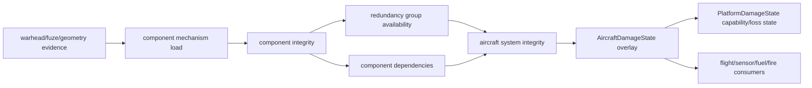

# 冗余/依赖图路线

状态：`2026-05-28` 图模型路线。当前已有 `redundancy_group_id`、`critical`、`redundancy_weight`、组件完整性记忆、冗余组可用性和 `dependencies` 最小传播；后续目标是把它从“组件到系统的尺度传播”推进到“可审计平台依赖图”，但不提前声明真实系统架构。

## 当前模型

当前图节点可以分为四层：

- component node：例如 `left_aileron_actuator`、`tail_hydraulic_pump`、`rotodome_radar_array`、`mission_operator_consoles`。
- redundancy group：例如 `lateral_flight_control_actuators`、`hydraulic_pumps`、`awacs_primary_radar`、`helo_engine_modules`。
- aircraft system：例如 `flight_control`、`hydraulic`、`fuel`、`avionics`、`mission_systems`、`data_link`、`radar`。
- consequence overlay：`AircraftDamageState` 和 `PlatformDamageState` 中的 mobility、mission、sensor、survivability、forced landing 等平台后果字段。

当前传播方向主要是：

## 路线 A：冻结图 schema

建议先把依赖边从当前 `system + scale` 扩展为向后兼容的 typed dependency：

| 字段 | 含义 | 初始建议 |
|---|---|---|
| `target_system` | 被影响的系统 | 保持当前 `system` 兼容别名 |
| `edge_type` | 依赖类型 | `hydraulic_power`、`electrical_power`、`control_signal`、`data_path`、`cooling`、`fuel_feed`、`crew_operated`、`structural_support` |
| `scale` | 影响强度 | 保持 0-1 |
| `threshold` | 源节点完整性低于此值才触发强传播 | 缺省 1.0 表示连续传播 |
| `delay_s` | 后果延迟 | 工程缺省 0 |
| `direction` | 单向或双向 | 缺省单向 |
| `provenance` | 来源说明 | synthetic/engineering/calibrated |

短期不要要求真实平台全量管线，只要求同一 schema 可以承载后续校准图。

### 2026-05-29 最小运行时增量

- 已把 `DamageComponentDependency` 扩展为可保存 `target_system`、`edge_type`、`threshold`、`delay_s`、`direction` 和 `provenance` 的 typed edge；旧 `system + scale` 保持兼容。
- loader 已接受三种写法：字符串依赖、旧对象 `system + scale`、新对象 `target_system + edge_type + scale + threshold/provenance`；缺失 `system` 时会用 `target_system` 回填。
- effects model 已按 `target_system` 投射依赖后果，并用 `edge_type` 做保守工程化方向调制；`threshold=1.0` 保持旧连续传播，低于 1.0 时只在源组件/冗余组可用性跌破门槛后传播。
- `delay_s > 0` 已从单纯事件字段推进为最小 pending queue：命中瞬间记录并排队 dependency 后果，`AircraftDamageStateUpdate` 在后续帧到期后一次性、有界地投射到 `SystemHealth`、`AircraftDamageState` 和 `PlatformDamageState`；`delay_s == 0` 保持旧的立即传播语义。
- typed edge 后果线已开始分化：`electrical_power` 影响航电/指挥导航并可拖累受供电飞控，`data_path` 影响航电/任务/指挥导航但不应制造燃油/液压/推进后果，`crew_operated` 影响机组/任务操作链，`cooling` 增加点火/火灾风险并可拖累受冷却航电，`control_signal` 和 `structural_support` 分别进入控制信号和结构支撑代理。该分化仍是工程化 routing，不是实际电源图、数据总线、冷却回路或人员流程模型。
- `EffectsEvent.component_mechanism_load_rows[]` 已暴露最小依赖传播摘要：传播条数、代表性 `target_system`、`edge_type`、`threshold`、`delay_s`、`direction`、`provenance`、源可用性和有效尺度；该摘要用于审计工程化传播路径，不授予校准/Pk/确定性引信 authority。
- F-16、Su-35S、MQ-9、MH-60R 和 E-3 代表性 aircraft unit JSON 已把现有 dependency objects 迁到 typed metadata，同时保留旧 `system` 字段以兼容现有读取路径；明显链路使用 `hydraulic_power`、`electrical_power`、`data_path`、`fuel_feed`，暧昧链路保持 `generic` 并标注 synthetic engineering / non-authoritative provenance。
- 该增量仍不是完整 graph solve：`delay_s` 目前只是单跳延迟后果队列，不是网络级时序求解；`direction` 当前可被加载与审计，但尚未形成双向图传播。

## 路线 B：统一冗余组语义

当前冗余组已经能表达成员数和组可用性，但需要冻结解释：

- `redundancy_group_id` 是稳定字符串 key，不应依赖浮点 `redundancy_group`。
- `critical=true` 表示该组件接近单点或高权重影响，不表示真实平台绝对不可替代。
- `redundancy_weight` 表示工程化组内贡献，不是校准可靠度。
- group availability 应保持 0-1、有界、连续命中单调不增。
- group failed count 应只在组件完整性跨过 failure threshold 后增加，避免每次轻伤都被当作失败成员。

建议把冗余组分为四类：

| 类型 | 示例 | 传播规则 |
|---|---|---|
| single-point critical | cockpit crew station、engine core、primary radar array | 低完整性可直接强降相关系统 |
| parallel redundant | left/right aileron actuator、dual engine module | 单个失败只降部分 authority |
| load-sharing | hydraulic pumps、power buses、engine fuel feeds | 组可用性影响多个依赖系统 |
| mission-capacity | mission consoles、data link arrays、sensor payloads | 降 mission/sensor capacity，而非直接 mobility kill |

## 路线 C：依赖传播分层

建议把传播拆成三步，便于测试和校准替换：

1. component damage update：根据机制载荷更新组件完整性和组件失败状态。
2. graph solve：根据冗余组、依赖边、critical 标志和 load-sharing 规则求系统可用性。
3. consequence projection：把系统可用性投射到 aircraft overlay 和平台 capability。

这样可以避免 effects model 直接写平台后果，也方便后续把 graph solve 替换为更真实的系统网络。

## 重点依赖链

后续优先补六条链：

| 链路 | 当前已有入口 | 下一步 |
|---|---|---|
| actuator -> hydraulic -> flight_control | F-16/Su-35/MQ-9/MH-60R/E-3 多个控制作动器依赖 hydraulic/flight_control | 增加 hydraulic supply、pressure loss、axis authority 分离 |
| flight-control computer -> avionics/power -> flight_control | fighter/UAV/helo 已有 flight computer/power 组件 | 增加 degraded mode 和 data/control signal 边 |
| fuel cell/feed/control -> fuel/engine/fire | fighter、UAV、AWACS 有 fuel cells/feeds/control unit | 分离 fuel quantity leak、feed starvation、fire risk |
| radar/sensor -> avionics/mission_systems/data_link | F-16/Su-35/MQ-9/MH-60R/E-3 已有 radar/sensor/data-link 依赖 | 增加 sensor mode、track memory、task capacity |
| crew station/mission consoles -> pilot/mission crew/command | fighter/helo cockpit、E-3 mission operator consoles 已有 | 分离 pilot control、mission operator、command/navigation |
| structure/spar/rotor/transmission -> survivability/mobility | wings、spar、rotor、tail rotor、transmission 已有 | 增加 airframe load path、rotor/drive train 特化 |

## 验收建议

- schema 兼容：旧 `dependencies: [{system, scale}]` 仍能加载，新 typed edge 能被忽略或按缺省解释。
- graph identity：每个 component event 至少能反查 component name、system、redundancy group、primary integrity、group availability。
- propagation isolation：命中 data link 不应直接降低 hydraulic；命中 hydraulic pump 应能降低 flight-control authority。
- redundancy monotonic：同组第二个组件受损后 group availability 低于只损伤一个成员。
- family differentiation：fighter、UAV、helo、C2 的同名系统可以共享 schema，但后果投射必须保留平台族差异。

## 非权威边界

当前图是工程化 dependency graph，不是实际飞机系统原理图、线路图、液压图、电源图或任务系统架构图。任何真实架构、失败阈值、隔离逻辑、冗余切换时间和恢复能力都必须等待校准或可引用的 authoritative/validated evidence。
