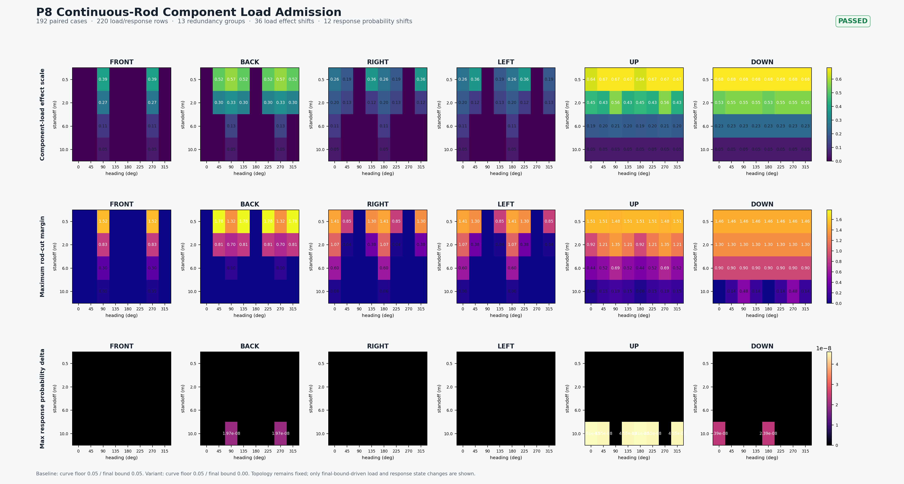

# Continuous-Rod P8: Component-Load Admission (2026-09-14)

## Decision

P8 passes structural admission. The experiment fixes the P7.1 explicit expanding-ring-band semantics and compares the same 192 cases, seeds, target database, and `720 x 5` samples with a baseline curve floor/final bound of `0.05/0.05` and a decoupled variant of `0.05/0.00`.

The admission target is structural closure across `geometry -> component mechanism load -> component response`, not vulnerability calibration or real-weapon Pk authority.

## Gates

- Complete matrix: passed, 192/192.
- Baseline load/response identity: passed, 220/220 rows with zero residuals.
- Decoupled load/response identity: passed, 220/220 rows with zero residuals.
- Component-load and response scalar ranges: passed.
- Primary trace closure: passed, zero residuals.
- Redundancy-group closure: passed, 13 groups with zero residuals.
- Component-load topology: passed, zero key-set changes.
- Response topology: passed, zero key/source/mode changes.
- Dependency topology: passed, zero edge/target/direction/propagated changes.
- Spatial-to-component propagation: passed, 36 load effect changes, all from baseline-clamped events.
- Component-load admission: **passed**.

The decoupled variant releases 24 baseline-clamped events, producing 36 component-load effect changes. The response layer has 12 failure-probability changes and 12 integrity-after changes, with zero failure-mode flips. Dependency source availability changes in 12 rows, but dependency topology remains fixed; this is downstream state propagation, not a topology break.



## Interpretation and boundary

Every load row maps to exactly one response row by `(component_name, component_system, component_redundancy_group_id)`, with `source_row_index` matching load order. The 13 redundancy groups each retain a single system ownership, and the primary component's rod margin closes against its load row.

This proves only the component-load contract and propagation structure. Warhead parameters remain synthetic structural-test values; vulnerability/consequence, default-profile promotion, and integrated guidance/fuze/Pk remain outside admission.

The next gate is P9 Vulnerability / Consequence Admission: hold component-load topology fixed while checking vulnerability evidence rows, failure probability, integrity/consequence conversion, and dependency propagation interpretability.

Reproduce with:

```powershell
$env:CMO_BUILD_DIR = 'D:\workshop\Research\Echelon-Forge\build-warhead-spatial-admission-vs'
$env:PYTHONPATH = '.'
python tools/geometry/continuous_rod_component_load_admission.py
python tools/geometry/render_continuous_rod_component_load_admission.py `
--report artifacts/kill_chain/20260915/raw_review_packets/continuous_rod_component_load_admission_20260914/continuous_rod_component_load_admission_20260914.json `
  --output docs/systems/effects/reviews/continuous_rod_component_load_admission_20260914/continuous-rod-component-load-admission.png
```

The raw machine-readable packet is retained outside the repository under the
artifact retention surface. The tracked conclusion and manifest remain the
review authority.
