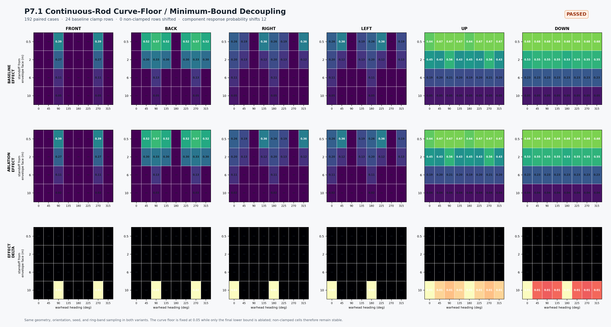

# Continuous-Rod P7.1: Projection Curve-Floor / Final-Bound Decoupling (2026-09-14)

## Decision

P7.1 passes structural admission. The new `projection_curve_floor_effect_scale` separates the projection curve intercept from the final `min_effect_scale` bound. The complete 192-pair matrix compares a baseline with curve floor `0.05` and final bound `0.05` against an ablation with curve floor held at `0.05` and final bound set to `0.00`.

This releases only the final lower bound; non-clamped distance-curve values no longer drift.

## Gates

- Complete matrix: passed, 192/192.
- Geometry/intersection topology: passed, zero residuals.
- Non-clamped effect stability: passed, zero changes.
- Representative trace stability: passed, zero primary component/system/group changes.
- Mechanism-load invariance: passed, zero `rod_cut_margin` residuals.
- Downstream propagation: passed, 36 component-load effect changes and 12 response probability/integrity changes.
- P7.1 curve/minimum separation: **passed**.

There are still 120 geometric intersections. The baseline has 24 clamp rows; all 24 are released by the decoupled ablation. The hit-case effect delta averages `0.0034775` and peaks at `0.0314088`. Every non-clamped hit remains identical.



When the new profile field is absent, the internal curve floor follows the legacy `projection_min_effect_scale`, preserving existing behavior and baseline compatibility. The final-bound-only experiment requires both `projection_curve_floor_effect_scale = 0.05` and `projection_min_effect_scale = 0.00`.

The event trace now uses `preclamp_effect_scale` as a deterministic tie-breaker for equal final effect values. A final-bound change therefore cannot switch the diagnostic representative from one intersecting component to another.

## Boundary and next gate

This remains synthetic structural evidence, not real-weapon calibration. The `0.05` curve floor and `0.00` ablation bound are test parameters. Component-load topology, vulnerability/consequence, and integrated guidance/fuze/Pk remain unevaluated.

The next batch is P8 Component Load Admission: with the projection semantics fixed, inspect per-component `rod_cut_margin`, component loads, redundancy groups, and response topology for continuity and interpretability. Default-profile promotion remains separate.

Reproduce with:

```powershell
$env:CMO_BUILD_DIR = 'D:\workshop\Research\Echelon-Forge\build-warhead-spatial-admission-vs'
python tools/geometry/continuous_rod_projection_curve_floor_decoupling.py
python tools/geometry/render_continuous_rod_projection_floor_ablation.py `
  --report docs/systems/effects/reviews/continuous_rod_projection_curve_floor_decoupling_20260914/review_packets/continuous_rod_projection_curve_floor_decoupling_20260914.json `
  --output docs/systems/effects/reviews/continuous_rod_projection_curve_floor_decoupling_20260914/continuous-rod-projection-curve-floor-decoupling.png
```

The machine-readable packet is `review_packets/continuous_rod_projection_curve_floor_decoupling_20260914.json`.
