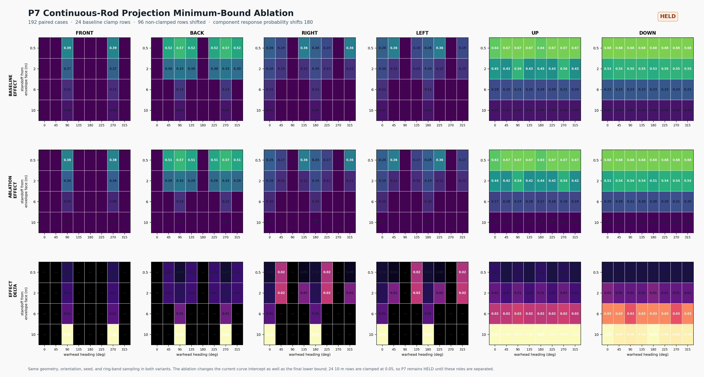

# Continuous-Rod P7: Projection Minimum-Bound Paired Ablation (2026-09-14)

## Decision

P7 paired ablation is complete but **held**. The same 192 explicit continuous-rod ring-band cases, seeds, attitudes, and `720 x 5` samples were run with `projection_min_effect_scale = 0.05` and `0.00`.

The result shows that the current field has two coupled meanings: it is both the intercept of `projected_spatial_effect_scale()` and the final effect lower bound. Lowering it to zero therefore shifts the entire spatial effect curve, not only the tail clamp.

## Gates

- Complete paired matrix: passed, 192/192.
- Geometry intersection topology: passed, zero intersection or component-row-set changes.
- Representative trace stability: passed in the current rerun with the deterministic tie-break, zero residuals; the historical coupled run had 8 switches.
- Floor-only localization: failed, 96 non-clamped hit rows still changed effect.
- Mechanism-load invariance: passed, all 220 `rod_cut_margin` values were unchanged.
- Component-load effect propagation: passed, all 220 load rows changed effect scale.
- Response propagation: passed, 180/220 failure probabilities changed, with zero failure-mode flips.
- P7 projection floor/clamp admission: held pending P7.1.

The baseline-minus-ablated effect delta averages `0.01839` across hit cases and peaks at `0.04782`. The 24 baseline clamp rows average `0.04172`, while the other 96 non-clamped hit rows still average `0.01256`. At 10 m, the 24 surviving intersections leave the uniform baseline `0.05` and resolve to `0.00218–0.01080` in the ablation.



## Propagation

`rod_cut_margin` is driven by ring coverage, rod energy, and component geometry, so it remains invariant. Component load `effect_scale` follows the projection effect, and non-direct vulnerability response changes in turn: 180 response probabilities and 192 integrity-after values move, although no failure mode crosses its discrete threshold in this sample.

The eight representative-trace changes in the historical run were a diagnostic tie-selection issue, not an underlying geometry change. The current implementation uses `preclamp_effect_scale` as a deterministic tie-breaker, and the rerun has zero trace residuals. The coupled ablation still changes 96 non-clamped hit effects, so the P7 floor-only gate remains held.

## Follow-up P7.1

The decoupled experiment is complete in `../continuous_rod_projection_curve_floor_decoupling_20260914/README.md`: the curve floor stayed at `0.05` while only the final minimum bound was ablated, with zero non-clamped effect drift and zero trace residuals. The next gate is P8 Component Load Admission. Do not promote a zero minimum to default profiles or raise overall Warhead Spatial Field/real-weapon Pk admission.

Reproduce with:

```powershell
$env:CMO_BUILD_DIR = 'D:\workshop\Research\Echelon-Forge\build-warhead-spatial-admission-vs'
python tools/geometry/continuous_rod_projection_floor_ablation.py
python tools/geometry/render_continuous_rod_projection_floor_ablation.py
```

The machine-readable packet is `review_packets/continuous_rod_projection_floor_ablation_20260914.json`.
