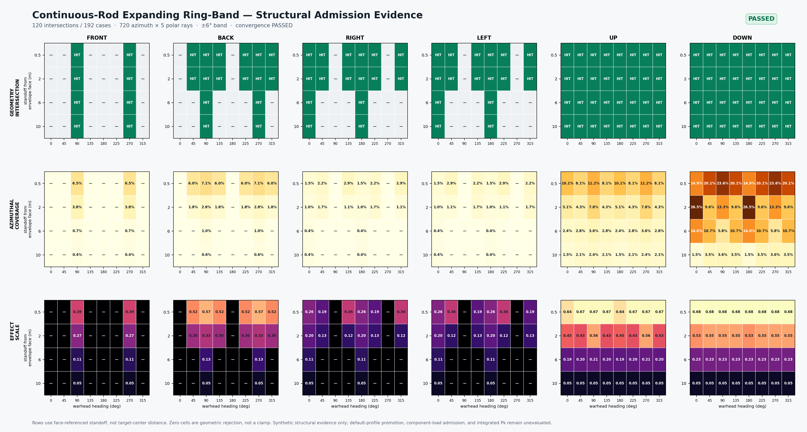

# 连续杆显式膨胀环带几何准入（2026-09-14）

## 结论

连续杆的 P6 **显式 expanding ring/band geometry** 已通过独立几何准入：完整矩阵 192 个案例中，120 个案例发生杆环射线与真实 hitbox/component AABB 的空间相交，72 个案例被几何层明确拒绝。所有命中/未命中判定都与模型自产 trace、采样覆盖率和最终零/非零效应闭合。

这不是完整 Warhead Spatial Field 或杀伤链准入。当前仍有三个明确边界：

- 6° 半带宽是合成结构测试参数，不是任何真实武器的校准值；
- 默认武器数据仍保留 `legacy_side_sweep`，尚未批准切换到 `expanding_ring_band`；
- 24 个仍能在 10 m 相交的案例全部被 projection 最小值钳制到 `0.05`，因此 P7 floor/clamp 准入仍然开放。

## 实现语义

显式模型在战斗部姿态坐标系内构造环带：

1. 用 `forward` 定义杆环法向，用 `right/up` 定义赤道面；
2. 沿 360° 方位角采样，并在 `[-6°, +6°]` 内分层采样极向偏角；
3. 对每条射线执行有限作用半径内的 ray–AABB 相交；
4. 任一极向射线命中时，该方位段记为相交；
5. `angular_coverage = intersecting_azimuthal_samples / azimuthal_samples`，杆命中估计由 `rod_count × angular_coverage` 驱动；
6. 无几何相交时直接拒绝候选，不允许 near-field floor 或最小效应值凭空制造命中；显式模型启用时旧的 `axis_weight × orientation_weight` 标量不再重复叠加。

默认路径不变。只有 profile 明确设置 `continuous_rod_spatial_model = "expanding_ring_band"` 时才启用新模型。

## 测试矩阵

- 目标：维护中的 `F-16C_Block50` hitbox/component 几何；
- 爆点方向：前、后、左、右、上、下；
- standoff：`0.5 / 2 / 6 / 10 m`；
- 战斗部航向：`0 / 45 / 90 / 135 / 180 / 225 / 270 / 315°`；
- standoff 基准：从所选方向的**全体 hitbox 包络面**向外量取，不是从目标中心或翼端量取；
- 正式采样：`720` 个方位角 × `5` 个极向层，半带宽 `±6°`。



图中第一行是二值几何相交，第二行是方位覆盖率，第三行是投影效应。轴向案例（例如前/后方向的 0°/180°）被环带拒绝，而赤道面案例保留命中；第三行 10 m 命中格统一为 `0.05` 是最小值钳制，不代表几何覆盖率不再变化。

## 硬门结果

| 门 | 结果 | 证据 |
| --- | --- | --- |
| 完整矩阵 | 通过 | `192 / 192` |
| 几何相交闭合 | 通过 | `120` 命中、`72` 未命中、`0` 闭合失败 |
| 180° 环带对称 | 通过 | `0` 违规 |
| 左右镜像 | 通过 | `0` 违规 |
| 距离拓扑 | 通过 | `0` 个“近处未命中、远处反而命中” |
| 效应距离单调 | 通过 | `0` 违规 |
| 轴向拒绝 | 通过 | `0` 失败 |
| 288→720 方位收敛 | 通过 | `0` 分类变化；最大覆盖率差 `0.0034722`；最大效应差 `0.0043464` |
| 720 半步相位扰动 | 通过 | `0` 分类变化；最大覆盖率差 `0.0027778`；最大效应差 `0.0037111` |
| 极向 5→9 层 | 通过 | `0` 分类变化；最大覆盖率差 `0.0041667`；最大效应差 `0.0032000` |
| 旧默认路径回归 | 通过 | 与保留基线比较 `192` 行，`0` mismatch；新环带启用数为 `0` |

## 准入边界与下一步

本批只把“杆环是否真的与目标几何相交”从旧的 `side_sweep` surrogate 中拆出，并证明该新路径在当前标准矩阵下稳定。它不提供真实连续杆破裂动力学、杆件数量/材料校准、姿态随时间演化、部件失效概率或真实武器 Pk authority。

下一批应进入 P7：对 projection 最小值钳制做成对消融，确认 10 m 处的覆盖率差异如何传播到 component mechanism load；之后再进入 P8 Component Load Admission。默认 profile promotion 应在这两个 gate 之后单独决策。

## 复现

```powershell
$env:CMO_BUILD_DIR = 'D:\workshop\Research\Echelon-Forge\build-warhead-spatial-admission-vs'
python tools/geometry/continuous_rod_ring_band_admission.py
python tools/geometry/render_continuous_rod_ring_band_evidence.py
```

原始机器可读 packet 留存在仓库外部的 artifact retention surface；仓库内只保留
结论和 manifest 作为审查入口。
