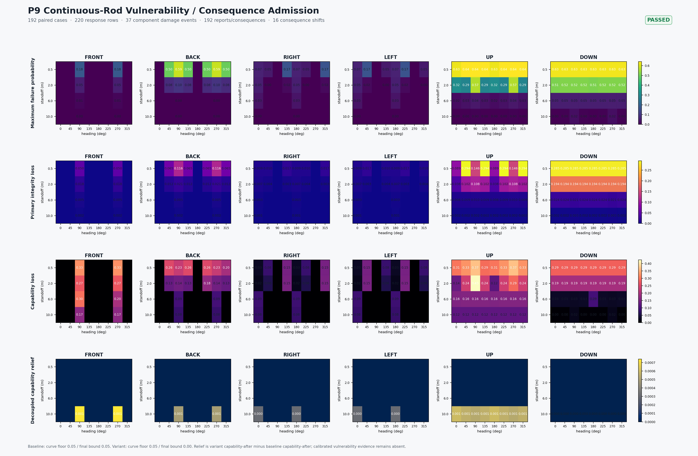

# Continuous-Rod P9: Vulnerability / Consequence Admission (2026-09-14)

## Conclusion

P9 passes structural admission. It keeps the P7.1/P8 explicit `expanding-ring-band` continuous-rod semantics and runs the same `192` cases, seeds, target database, `720 x 5` samples, and one ECS structural-damage update with:

- baseline: curve floor `0.05`, final minimum bound `0.05`;
- decoupled variant: curve floor `0.05`, final minimum bound `0.00`.

The gate closes the evidence chain `geometry -> component mechanism load -> component response -> component damage -> damage report -> platform consequence`. It does not promote the synthetic vulnerability profile into real-weapon Pk, fuze, or integrated kill-chain authority.

## Hard gates

| Gate | Result | Evidence |
| --- | --- | --- |
| Complete continuous-rod matrix | Passed | `192 / 192` in baseline and variant |
| Vulnerability provenance | Passed | `0` residuals in both variants; all `120` events with responses are explicitly synthetic/unvalidated |
| Response probability trace | Passed | `220` response rows per variant, `0` residuals |
| Component damage identity | Passed | `37` damage events per variant, all linked to response rows, `0` residuals |
| Consequence conversion | Passed | `192` damage reports and `192` platform consequence events per variant, `0` residuals |
| Paired consequence topology | Passed | `0` response, damage, report, consequence-key, kill-flag, or loss-state changes |
| Spatial-to-consequence propagation | Passed | `16` consequence events changed, all within baseline-clamped events |
| Variant monotonicity | Passed | variant integrity is not worse, capability-after is not lower, and system health is not worse |
| Vulnerability/consequence admission | **passed** | P9 structural gate closed |
| Calibrated vulnerability evidence | **held** | `0` `vulnerability_evidence_row` responses; all `220` response rows use `synthetic_sigmoid` |

## Quantitative result

- Each variant exports `220` component responses, `37` component-damage events, `192` damage reports, and `192` platform-consequence events.
- `120` events produce component responses and carry synthetic vulnerability provenance. The other `72` events are no-impact/empty-response paths; their trace explicitly records `present=0`.
- The paired ablation changes `12` failure probabilities and `12` integrity-after values. Every consequence change propagates in the weaker-load direction after the final-bound decoupling.
- No failure-mode, component-key, damage-key, kill-flag, or loss-state topology flips.



## Interpretation and boundary

`failure_probability_source=synthetic_sigmoid` and `failure_mode_source=synthetic_inferred_part_failure_modes` are structural fallbacks. P9 proves source marking, bounded values, response-to-damage field identity, damage-report-to-platform-consequence state closure, and monotonic propagation after the spatial-bound ablation. It does not provide calibration, real munition data, deterministic fuze decisions, or Pk authority.

The structural `vulnerability_consequence_admission` can advance, while `calibrated_vulnerability_evidence` remains `held`. The next gate is P10 maneuver/APN coupling admission; integrated guidance-fuze-warhead kill-chain admission remains unevaluated.

## Reproduction

```powershell
$env:CMO_BUILD_DIR = 'D:\workshop\Research\Echelon-Forge\build-warhead-spatial-admission-vs'
$env:PYTHONPATH = '.'
python tools/geometry/continuous_rod_vulnerability_consequence_admission.py
python tools/geometry/render_continuous_rod_vulnerability_consequence_admission.py `
--report artifacts/kill_chain/20260915/raw_review_packets/continuous_rod_vulnerability_consequence_admission_20260914/continuous_rod_vulnerability_consequence_admission_20260914.json `
  --output docs/systems/effects/reviews/continuous_rod_vulnerability_consequence_admission_20260914/continuous-rod-vulnerability-consequence-admission.png
```

The raw machine-readable packet is retained outside the repository under the
artifact retention surface; the tracked conclusion and manifest remain the
review authority.
