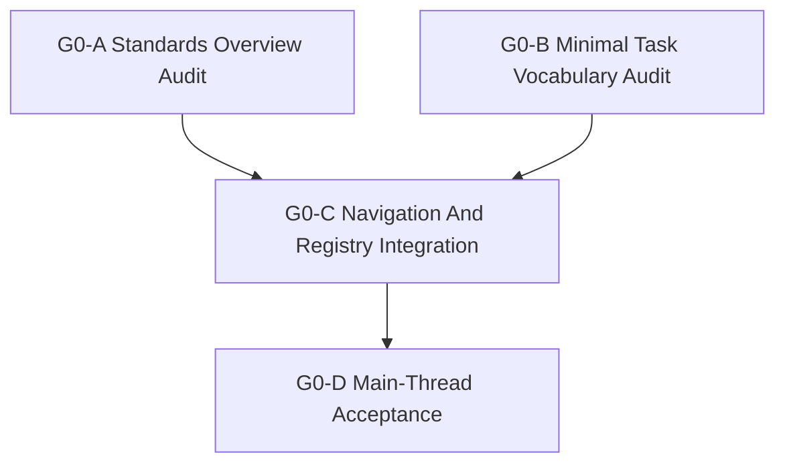

# G0 Subagent Dispatch Packets

Status: `2026-05-21` G0-A/G0-B/G0-C accepted; G0-D main-thread acceptance
complete.

Language:

- English canonical: `g0_subagent_dispatch_packets_20260521.md`
- Chinese companion: not required; this is a high-churn task dispatch record.

Inputs:

- [G0 README](README.md)
- [G0 standards alignment cluster](g0_standards_alignment_cluster_20260521.md)
- [Ground domain bootstrap plan](../ground_domain_bootstrap_plan_20260521.md)
- [Ground domain bootstrap review](../../review/ground_domain_bootstrap_plan_review_20260521.md)
- [Ground standards overview](../../../standards/ground/README.md)
- [Ground minimal task structure](../../../standards/ground/minimal_task_structure.md)
- [Ground subagent dispatch queue](../ground_subagent_dispatch_queue_20260521.md)
- [Subagent Usage Policy](../../../standards/governance/subagent_usage_policy.md)

## Purpose

Prepare G0 for delegated standards closure without letting workers collide on
the same normative surface. G0 remains documentation and standards work only.

The main thread owns final acceptance and the decision to release G1.

Accepted return state:

- `G0-A`: pass; no G1 blocker from standards overview.
- `G0-B`: pass; no G1 blocker from minimal task vocabulary.
- `G0-C`: pass; navigation, dispatch, and bilingual registry synchronized.
- `G0-D`: accepted; G1 may start as `preflight-only`, not implementation.

## Release Order



Parallel rule:

- `G0-A` and `G0-B` may run in parallel only because their write scopes are
  disjoint.
- If either worker believes a frozen default must change, it must stop and
  return `blocked` instead of editing the canonical term.
- `G0-C` is serial and starts only after `G0-A` and `G0-B` return.
- `G0-D` is not delegated; it is the integration owner's acceptance step.

## Global Stop Rules

- Do not edit runtime, Python profile, C++ DTO, fixture, or test behavior.
- Do not split one normative table across multiple workers.
- Do not move shared concepts into `ground/` if they belong in `joint/` or
  `services/army`.
- Do not release G1 implementation from inside a G0 worker packet.
- Stop at `blocked` if a worker finds a naming, layering, or ownership conflict.

## `G0-A` Standards Overview Audit

Suggested agent:

- Type: `worker`
- Model / reasoning: `gpt-5.4-mini`, xhigh

Task:

- Audit and, if needed, tighten the ground standards overview.
- Ensure it declares the layer model, frozen G0 defaults, stage coverage,
  capability-composition path, agency defaults, information-state boundary,
  and out-of-scope runtime claims.

Owned write scope:

- `docs/standards/ground/README.md`
- `docs/standards/ground/README.zh.md`

Read-only references:

- `docs/task/ground/ground_domain_bootstrap_plan_20260521.md`
- `docs/task/review/ground_domain_bootstrap_plan_review_20260521.md`
- `docs/standards/services/army.md`
- `docs/standards/overview/document_alignment_map.md`

Forbidden:

- `docs/standards/ground/minimal_task_structure*.md`
- standards indexes and bilingual registry
- task queue or task README files
- any implementation code

Acceptance:

- `ground`, `army`, and `land` are described with the correct layer ownership.
- `ground`, `platoon`, `move / occupy / support`, and `1 Hz` remain frozen.
- Capability composition is canonical; `spawn_unit(type_name)` remains only a
  compatibility wrapper.
- No private ground runtime path is implied.
- Chinese companion is kept aligned if the English standard changes.

Suggested validation:

```bash
git diff --check
python tools/maintenance/translate_docs_batch.py audit --show-missing none
```

Return packet additions:

- Standards overview changes made or confirmed unchanged.
- Any G1 blocker related to naming, layering, stage coverage, or capability
  ownership.

## `G0-B` Minimal Task Vocabulary Audit

Suggested agent:

- Type: `worker`
- Model / reasoning: `gpt-5.4-mini`, xhigh

Task:

- Audit and, if needed, tighten the minimum ground tasking structure.
- Ensure `TASK_MOVE`, `TASK_OCCUPY`, and `TASK_SUPPORT` are the only G0
  starter task shapes and that deferred task shapes remain deferred.

Owned write scope:

- `docs/standards/ground/minimal_task_structure.md`
- `docs/standards/ground/minimal_task_structure.zh.md`

Read-only references:

- `docs/standards/ground/README.md`
- `docs/standards/services/army.md`
- `docs/task/ground/ground_domain_bootstrap_plan_20260521.md`
- `docs/task/review/ground_domain_bootstrap_plan_review_20260521.md`

Forbidden:

- `docs/standards/ground/README*.md`
- standards indexes and bilingual registry
- task queue or task README files
- any implementation code

Acceptance:

- `TASK_MOVE`, `TASK_OCCUPY`, and `TASK_SUPPORT` each have minimal semantics,
  field expectations, and explicit deferrals.
- `platoon` remains the first tight-loop owner.
- `company`, `battalion`, `brigade`, `division`, and `corps` remain scenario or
  tasking metadata unless a later accepted plan changes this.
- Observation, track, movement, fires, logistics, damage, and terrain realism
  stay deferred.
- Chinese companion is kept aligned if the English standard changes.

Suggested validation:

```bash
git diff --check
python tools/maintenance/translate_docs_batch.py audit --show-missing none
```

Return packet additions:

- Frozen task vocabulary confirmed.
- Any G1 blocker related to task defaults, field ownership, or deferred task
  leakage.

## `G0-C` Navigation And Registry Integration

Suggested agent:

- Type: `worker` or integration worker
- Model / reasoning: `gpt-5.4-mini`, xhigh

Dependency:

- Start after `G0-A` and `G0-B` return.

Task:

- Integrate G0 standards and task navigation after the two normative standards
  are stable.
- Keep task entrypoints, standards indexes, dispatch docs, and the bilingual
  registry synchronized.

Owned write scope:

- `docs/standards/README.md`
- `docs/standards/README.zh.md`
- `docs/standards/overview/document_alignment_map.md`
- `docs/standards/overview/document_alignment_map.zh.md`
- `docs/standards/bilingual_document_clusters.json`
- `docs/task/ground/README.md`
- `docs/task/ground/README.zh.md`
- `docs/task/ground/g0_boundary_freeze/README.md`
- `docs/task/ground/g0_boundary_freeze/g0_standards_alignment_cluster_20260521.md`
- `docs/task/ground/g0_boundary_freeze/g0_subagent_dispatch_packets_20260521.md`
- `docs/task/ground/ground_subagent_dispatch_queue_20260521.md`

Forbidden:

- normative edits to `docs/standards/ground/README*.md` or
  `docs/standards/ground/minimal_task_structure*.md` unless integrating an
  accepted worker return packet
- implementation code
- G1/G2/G3/G4 implementation scope

Acceptance:

- All maintained navigation points route the third domain through
  `services/army` plus `ground/`, not a new `army runtime stack`.
- G0 dispatch packets, G0 cluster, G0 README, and the ground queue agree on
  release order and write scopes.
- Tier A maintained bilingual docs remain synchronized.
- Remaining G1 blockers are explicitly listed or confirmed absent.

Suggested validation:

```bash
git diff --check
python tools/maintenance/translate_docs_batch.py clusters --write
python tools/maintenance/translate_docs_batch.py audit --show-missing none
```

Return packet additions:

- Integrated files.
- Registry/audit result.
- Recommendation: `G1 preflight-only`, `G1 implementation-ready`, or
  `G1 blocked`.

## `G0-D` Main-Thread Acceptance

This step is not a worker packet.

The main thread should:

- review all G0 worker return packets;
- verify no unrelated edits were reverted or reformatted;
- run final validation;
- decide whether G1 may move from planned to preflight or implementation;
- update the dispatch queue status if G1 is released.

G0-D acceptance decision: release G1 as `preflight-only`. The accepted
standards packets do not leave a G1 blocker, but implementation must wait for
the G1 worker to confirm concrete resolver/profile write scope and DTO-shell
need.

Minimum final validation:

```bash
git diff --check
python tools/maintenance/translate_docs_batch.py audit --show-missing none
```

G0 closure evidence:

- maintained name: `ground`
- accepted aliases: `army`, `ground`, `land`
- first tight-loop unit: `platoon`
- first tasks: `TASK_MOVE`, `TASK_OCCUPY`, `TASK_SUPPORT`
- no private ground runtime path
- no unresolved G1 blocker hidden in a worker return packet
