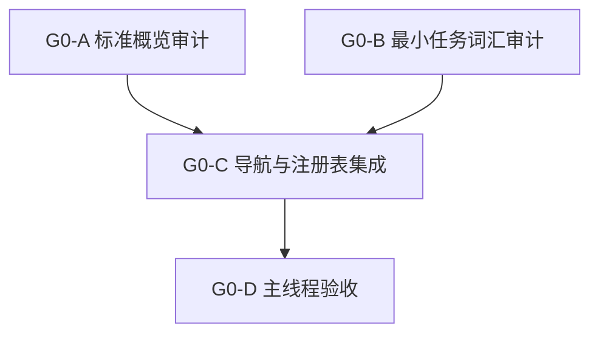

<!-- Machine-translated draft generated on 2026-05-21 from docs/task/ground/g0_boundary_freeze/g0_subagent_dispatch_packets_20260521.md. Review before treating this file as authoritative. -->

# G0 子代理调度包

状态：`2026-05-21` G0-A/G0-B/G0-C 已验收；G0-D 主线程验收完成。

语言：

- 英文原版：`g0_subagent_dispatch_packets_20260521.md`
- 中文伴生：不需要；这是一个高变动任务调度记录。

输入：

- [G0 README](README.md)
- [G0 标准对齐集群](g0_standards_alignment_cluster_20260521.md)
- [地面域引导计划](../ground_domain_bootstrap_plan_20260521.md)
- [地面域引导审查](../../review/ground_domain_bootstrap_plan_review_20260521.md)
- [地面标准概览](../../../standards/ground/README.md)
- [地面最小任务结构](../../../standards/ground/minimal_task_structure.md)
- [地面子代理调度队列](../ground_subagent_dispatch_queue_20260521.md)
- [子代理使用策略](../../../standards/governance/subagent_usage_policy.md)

## 目的

为 G0 做好准备，以便在避免工作器在同一规范性表面上冲突的前提下，进行委托的标准闭合。G0 仅负责文档与标准工作。

主线程拥有最终验收以及是否发布 G1 的决定权。

验收返回状态：

- `G0-A`：通过；标准概览不构成 G1 阻塞。
- `G0-B`：通过；最小任务词汇不构成 G1 阻塞。
- `G0-C`：通过；导航、调度与双语注册表已同步。
- `G0-D`：已验收；G1 可作为“仅预飞”启动，不涉及实现。

## 发布顺序



并行规则：

- `G0-A` 与 `G0-B` 仅在其写入范围**不相交**时可并行运行。
- 若任一工作器认为必须更改冻结的默认值，则必须停止并返回 `blocked`，而非直接编辑规范术语。
- `G0-C` 为串行任务，仅在 `G0-A` 和 `G0-B` 返回后启动。
- `G0-D` 不进行委托；它是集成负责人的验收步骤。

## 全局停止规则

- 不得编辑运行时、Python 配置文件、C++ DTO、fixture 或测试行为。
- 不得将一个规范性表格拆分为多个工作器。
- 若共享性概念属于 `joint/` 或 `services/army`，则不得将其移入 `ground/`。
- 不得在 G0 工作器包内部发布 G1 实现。
- 若工作器发现命名、分层或所有权冲突，则停止于 `blocked`。

## `G0-A` 标准概览审计

建议代理：

- 类型：`worker`
- 模型/推理：`gpt-5.4-mini`，xhigh

任务：

- 审计并在必要时收紧地面标准概览。
- 确保其声明了层次模型、冻结的 G0 默认值、阶段覆盖范围、能力组合路径、代理默认值、信息状态边界以及超出范围的运行时声明。

拥有的写入范围：

- `docs/standards/ground/README.md`
- `docs/standards/ground/README.zh.md`

只读引用：

- `docs/task/ground/ground_domain_bootstrap_plan_20260521.md`
- `docs/task/review/ground_domain_bootstrap_plan_review_20260521.md`
- `docs/standards/services/army.md`
- `docs/standards/overview/document_alignment_map.md`

禁止：

- `docs/standards/ground/minimal_task_structure*.md`
- 标准索引与双语注册表
- 任务队列或任务 README 文件
- 任何实现代码

验收条件：

- `ground`、`army` 和 `land` 以正确的层次所有权进行描述。
- `ground`、`platoon`、`move / occupy / support` 以及 `1 Hz` 保持冻结。
- 能力组合是规范的；`spawn_unit(type_name)` 仅作为兼容性包装器存在。
- 未暗示私有的 ground 运行时路径。
- 中文伴生在英文标准变更时保持对齐。

建议验证：

```bash
git diff --check
python tools/maintenance/translate_docs_batch.py audit --show-missing none
```

返回包新增内容：

- 所作的标准概览变更（或确认未作变更）。
- 任何与命名、分层、阶段覆盖或能力所有权相关的 G1 阻塞项。

## `G0-B` 最小任务词汇审计

建议代理：

- 类型：`worker`
- 模型/推理：`gpt-5.4-mini`，xhigh

任务：

- 审计并在必要时收紧最小地面任务结构。
- 确保 `TASK_MOVE`、`TASK_OCCUPY` 和 `TASK_SUPPORT` 是仅有的 G0 起始任务形状，并且已推迟的任务形状保持推迟。

拥有的写入范围：

- `docs/standards/ground/minimal_task_structure.md`
- `docs/standards/ground/minimal_task_structure.zh.md`

只读引用：

- `docs/standards/ground/README.md`
- `docs/standards/services/army.md`
- `docs/task/ground/ground_domain_bootstrap_plan_20260521.md`
- `docs/task/review/ground_domain_bootstrap_plan_review_20260521.md`

禁止：

- `docs/standards/ground/README*.md`
- 标准索引与双语注册表
- 任务队列或任务 README 文件
- 任何实现代码

验收条件：

- `TASK_MOVE`、`TASK_OCCUPY` 和 `TASK_SUPPORT` 各自拥有最简语义、字段预期以及显式推迟。
- `platoon` 仍然是第一个紧密循环的拥有者。
- 除非后续已接受的计划另有规定，`company`、`battalion`、`brigade`、`division` 和 `corps` 仍保持为场景或任务元数据。
- 观察、轨迹、移动、火力、后勤、损伤和地形现实性保持推迟。
- 中文伴生随英文标准变更保持对齐。

建议验证：

```bash
git diff --check
python tools/maintenance/translate_docs_batch.py audit --show-missing none
```

返回包新增内容：

- 冻结的任务词汇已确认。
- 任何与任务默认值、字段所有权或推迟任务泄漏相关的 G1 阻塞项。

## `G0-C` 导航与注册表集成

建议代理：

- 类型：`worker` 或集成工作器
- 模型/推理：`gpt-5.4-mini`，xhigh

依赖关系：

- 在 `G0-A` 和 `G0-B` 返回后启动。

任务：

- 在两项规范性标准稳定后，集成 G0 标准与任务导航。
- 保持任务入口点、标准索引、调度文档以及双语注册表同步。

拥有的写入范围：

- `docs/standards/README.md`
- `docs/standards/README.zh.md`
- `docs/standards/overview/document_alignment_map.md`
- `docs/standards/overview/document_alignment_map.zh.md`
- `docs/standards/bilingual_document_clusters.json`
- `docs/task/ground/README.md`
- `docs/task/ground/README.zh.md`
- `docs/task/ground/g0_boundary_freeze/README.md`
- `docs/task/ground/g0_boundary_freeze/g0_standards_alignment_cluster_20260521.md`
- `docs/task/ground/g0_boundary_freeze/g0_subagent_dispatch_packets_20260521.md`
- `docs/task/ground/ground_subagent_dispatch_queue_20260521.md`

禁止：

- 对 `docs/standards/ground/README*.md` 或 `docs/standards/ground/minimal_task_structure*.md` 进行规范性编辑，除非是集成已验收的工作器返回包。
- 实现代码
- G1/G2/G3/G4 实现范围

验收条件：

- 所有维护的导航点将第三域路由到 `services/army` 加 `ground/`，而非新的“army 运行时栈”。
- G0 调度包、G0 集群、G0 README 以及地面队列在发布顺序和写入范围上保持一致。
- 层级 A 维护的双语文档保持同步。
- 剩余的 G1 阻塞项被明确列出或被确认为不存在。

建议验证：

```bash
git diff --check
python tools/maintenance/translate_docs_batch.py clusters --write
python tools/maintenance/translate_docs_batch.py audit --show-missing none
```

返回包新增内容：

- 集成后的文件。
- 注册表/审计结果。
- 建议：`G1 仅预飞`、`G1 实现就绪` 或 `G1 阻塞`。

## `G0-D` 主线程验收

此步骤不是工作器包。

主线程应：

- 审查所有 G0 工作器返回包；
- 验证未回滚或重格式化无关编辑；
- 运行最终验证；
- 决定 G1 是否可以从“已规划”转为“预飞”或“实现”；
- 若 G1 已发布，则更新调度队列状态。

G0-D 验收决定：将 G1 发布为“仅预飞”。已验收的标准包未留下 G1 阻塞项，但实现必须等待 G1 工作器确认具体的解析器/配置文件写入范围以及 DTO 外壳需求。

最低最终验证：

```bash
git diff --check
python tools/maintenance/translate_docs_batch.py audit --show-missing none
```

G0 闭合证据：

- 维护名称：`ground`
- 已验收别名：`army`、`ground`、`land`
- 第一个紧密循环单元：`platoon`
- 第一个任务：`TASK_MOVE`、`TASK_OCCUPY`、`TASK_SUPPORT`
- 无私有 ground 运行时路径
- 工作器返回包中未隐藏未解决的 G1 阻塞项
