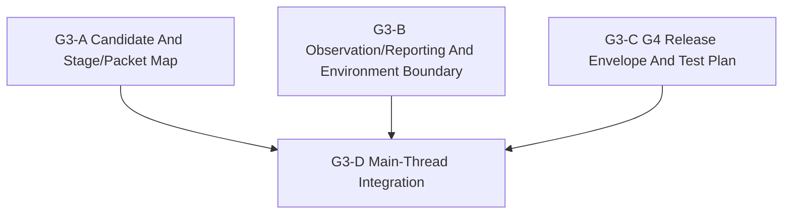

# G3 Subagent Dispatch Packets

Status: `2026-05-22` G3-D accepted; G4 released for the selected
tasking-only lifecycle-proof slice.

Language:

- English canonical: `g3_subagent_dispatch_packets_20260522.md`
- Chinese companion: `g3_subagent_dispatch_packets_20260522.zh.md`

Inputs:

- [G3 README](README.md)
- [G3 execution surface preflight cluster](g3_execution_surface_preflight_cluster_20260521.md)
- [Ground domain bootstrap plan](../ground_domain_bootstrap_plan_20260521.md)
- [Ground subagent dispatch queue](../ground_subagent_dispatch_queue_20260521.md)
- [Ground standards overview](../../../standards/ground/README.md)
- [Ground minimal task structure](../../../standards/ground/minimal_task_structure.md)
- [Subagent Usage Policy](../../../standards/governance/subagent_usage_policy.md)

## Purpose

Prepare G3 for delegated design preflight without letting workers collide on
the same normative surface. G3 remains documentation and source-grounded
analysis only. The main thread owns final integration and the decision to
release G4.

## Release Order



Parallel rule:

- `G3-A`, `G3-B`, and `G3-C` may run in parallel only as read-only diagnostics.
- They must not rewrite the same canonical G3 decision table.
- If a worker needs a standards change to justify its conclusion, it should
  stop and return that need as a residual instead of editing the standards tree
  directly.
- `G3-D` is serial and is owned by the main thread.

## Global Stop Rules

- Do not implement runtime behavior.
- Do not edit G1 Python profile implementation, G2 fixtures, or tests.
- Do not claim maintained movement, sensing, fires, terrain realism, or
  observation export.
- Do not split the same normative table across concurrent authors.
- Stop at `blocked` if a candidate requires widening into full command,
  mobility, or sensor/runtime semantics.

## `G3-A` Candidate And Stage/Packet Map

Suggested agent:

- Type: `explorer`
- Model / reasoning: `gpt-5.4`, high

Task:

- Compare the credible first-slice shapes:
  `tasking-only lifecycle proof`,
  `minimal command-delivery surface`,
  `selected reporting/export over tasking state only`.
- Choose one bounded G4 candidate.
- Freeze exact stage coverage and consumed / produced / deferred packet
  families for that candidate.

Read-only references:

- `docs/task/ground/g3_execution_surface_design/README.md`
- `docs/task/ground/g3_execution_surface_design/g3_execution_surface_preflight_cluster_20260521.md`
- `docs/task/ground/g1_contract_skeleton/README.md`
- `docs/task/ground/g2_content_test_seed/README.md`
- `docs/task/ground/ground_domain_bootstrap_plan_20260521.md`
- `docs/standards/ground/README.md`
- `docs/standards/ground/minimal_task_structure.md`

Acceptance:

- One bounded G4 candidate is selected.
- The candidate does not require movement, terrain, sensing, fires, or broad
  `MissionCommand` expansion.
- Stage coverage and packet participation are explicit enough for later test
  ownership.

Return packet additions:

- candidate ranking
- selected candidate
- stage map
- packet map
- candidate-selection residuals

## `G3-B` Observation/Reporting And Environment Boundary

Suggested agent:

- Type: `explorer`
- Model / reasoning: `gpt-5.4`, high

Task:

- Recommend the first reporting surface that avoids world-truth leakage.
- Classify terrain, line-of-sight, radio, and mobility assumptions as
  implemented, placeholder, or deferred for the likely first slice.
- State which assumptions must stay deferred so the slice remains honest.

Read-only references:

- `docs/task/ground/g3_execution_surface_design/README.md`
- `docs/task/ground/g3_execution_surface_design/g3_execution_surface_preflight_cluster_20260521.md`
- `docs/task/ground/g1_contract_skeleton/README.md`
- `docs/task/ground/g2_content_test_seed/README.md`
- `docs/task/review/ground_domain_bootstrap_plan_review_20260521.md`
- `docs/standards/ground/README.md`

Acceptance:

- The recommended reporting surface does not expose world truth.
- Environment assumptions are marked honestly as implemented, placeholder, or
  deferred.
- No runtime movement, terrain, sensing, fires, or observation-export claim is
  smuggled into the preflight.

Return packet additions:

- reporting-surface recommendation
- environment dependency map
- explicit deferrals
- standards-follow-up residuals if any

## `G3-C` G4 Release Envelope And Test Plan

Suggested agent:

- Type: `explorer`
- Model / reasoning: `gpt-5.4`, high

Task:

- Define the bounded G4 write scope implied by the most credible first-slice
  shapes.
- Name the focused tests, compatibility guards, and no-private-path proof
  required before G4 can claim maintained behavior.
- Highlight what should remain held even if the slice is released.

Read-only references:

- `docs/task/ground/g3_execution_surface_design/README.md`
- `docs/task/ground/g3_execution_surface_design/g3_execution_surface_preflight_cluster_20260521.md`
- `docs/task/ground/g4_runtime_slice/README.md`
- `docs/task/ground/g4_runtime_slice/g4_selected_runtime_slice_cluster_20260521.md`
- `docs/task/ground/g1_contract_skeleton/README.md`
- `docs/task/ground/g2_content_test_seed/README.md`
- `tests/leader/test_ground_profile_semantics.py`
- `tests/contracts/unit/ground/task_order_ground_profile_defaults.json`
- `tests/contracts/unit/ground/task_order_ground_minimal_structures.json`
- `tests/contracts/unit/ground/task_order_ground_support_relationships.json`

Acceptance:

- G4 receives one bounded write scope, not an open-ended runtime license.
- Focused tests are named for maintained entry points and compatibility guards.
- The no-private-ground-path proof is explicit.

Return packet additions:

- proposed G4 write scope
- focused test plan
- compatibility/no-private-path guard plan
- held residuals

## `G3-D` Main-Thread Integration

This step is not delegated.

Main-thread integration is complete. It:

- reviewed the G3-A/B/C return packets;
- selected the authoritative tasking-only G4 candidate;
- updated the canonical G3 cluster and queue;
- released G4 only for one bounded lifecycle-proof write scope.

Minimum final validation:

```bash
git diff --check
```
