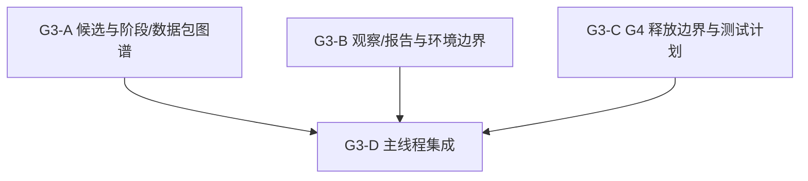

<!-- Machine-translated draft generated on 2026-05-22 from docs/task/ground/g3_execution_surface_design/g3_subagent_dispatch_packets_20260522.md. Review before treating this file as authoritative. -->

# G3 子代理调度包

状态：`2026-05-22` G3-D 已验收；G4 已释放为选定的
tasking-only lifecycle-proof 切片。

语言：

- 英文规范：`g3_subagent_dispatch_packets_20260522.md`
- 中文配套：`g3_subagent_dispatch_packets_20260522.zh.md`

输入：

- [G3 README](README.md)
- [G3 执行面预检集群](g3_execution_surface_preflight_cluster_20260521.md)
- [地面域引导计划](../ground_domain_bootstrap_plan_20260521.md)
- [地面子代理调度队列](../ground_subagent_dispatch_queue_20260521.md)
- [地面标准概览](../../../standards/ground/README.md)
- [地面最小任务结构](../../../standards/ground/minimal_task_structure.md)
- [子代理使用政策](../../../standards/governance/subagent_usage_policy.md)

## 目的

为 G3 做委托式设计预检准备，但不让多个 worker 在同一规范性表面上碰撞。G3
仍然只做文档和基于源码的分析。主线程拥有最终集成权以及是否释放 G4 的决定权。

## 发布顺序



并行规则：

- `G3-A`、`G3-B` 与 `G3-C` 只能作为只读 diagnostics 并行运行。
- 它们不得并发重写同一张 canonical G3 decision table。
- 如果 worker 认为必须修改 standards 才能支撑结论，应停止并把这件事作为
  residual 返回，而不是直接编辑 standards tree。
- `G3-D` 串行执行，由主线程负责。

## 全局停止规则

- 不得实现 runtime behavior。
- 不得编辑 G1 的 Python profile 实现、G2 的 fixtures 或 tests。
- 不得宣称已维护的 movement、sensing、fires、terrain realism 或
  observation export。
- 不得把同一张规范性表格拆给多个并行作者。
- 如果某个候选必须扩大到 full command、mobility 或 sensor/runtime semantics，
  应停在 `blocked`。

## `G3-A` 候选与阶段/数据包图谱

建议代理：

- 类型：`explorer`
- 模型 / 推理：`gpt-5.4`，high

任务：

- 比较可信的第一切片形状：
  `仅任务的生命周期证明`、
  `最小 command-delivery surface`、
  `仅基于 tasking state 的 selected reporting/export`。
- 选择一个有界的 G4 候选。
- 冻结该候选的精确阶段覆盖范围，以及 consumed / produced / deferred packet
  families。

只读参考：

- `docs/task/ground/g3_execution_surface_design/README.md`
- `docs/task/ground/g3_execution_surface_design/g3_execution_surface_preflight_cluster_20260521.md`
- `docs/task/ground/g1_contract_skeleton/README.md`
- `docs/task/ground/g2_content_test_seed/README.md`
- `docs/task/ground/ground_domain_bootstrap_plan_20260521.md`
- `docs/standards/ground/README.md`
- `docs/standards/ground/minimal_task_structure.md`

验收：

- 选出一个有界的 G4 候选。
- 该候选不要求 movement、terrain、sensing、fires 或 broad
  `MissionCommand` expansion。
- 阶段覆盖和数据包参与关系足够明确，便于后续测试归属。

返回包补充：

- candidate ranking
- selected candidate
- stage map
- packet map
- candidate-selection residuals

## `G3-B` 观察/报告与环境边界

建议代理：

- 类型：`explorer`
- 模型 / 推理：`gpt-5.4`，high

任务：

- 推荐第一个不会泄露 world truth 的 reporting surface。
- 将 terrain、line-of-sight、radio 与 mobility 假设标注为 implemented、
  placeholder 或 deferred。
- 说明为了保持切片诚实，哪些假设必须继续 deferred。

只读参考：

- `docs/task/ground/g3_execution_surface_design/README.md`
- `docs/task/ground/g3_execution_surface_design/g3_execution_surface_preflight_cluster_20260521.md`
- `docs/task/ground/g1_contract_skeleton/README.md`
- `docs/task/ground/g2_content_test_seed/README.md`
- `docs/task/review/ground_domain_bootstrap_plan_review_20260521.md`
- `docs/standards/ground/README.md`

验收：

- 推荐的 reporting surface 不暴露 world truth。
- 环境假设被诚实地标注为 implemented、placeholder 或 deferred。
- 预检过程中没有偷带 runtime movement、terrain、sensing、fires 或
  observation-export claims。

返回包补充：

- reporting-surface recommendation
- environment dependency map
- explicit deferrals
- 若需要则返回 standards-follow-up residuals

## `G3-C` G4 释放边界与测试计划

建议代理：

- 类型：`explorer`
- 模型 / 推理：`gpt-5.4`，high

任务：

- 为最可信的第一切片形状定义有界的 G4 写入范围。
- 命名在 G4 宣称 maintained behavior 前必须具备的 focused tests、
  compatibility guards 与 no-private-path proof。
- 明确即便释放该切片，哪些内容也应继续 held。

只读参考：

- `docs/task/ground/g3_execution_surface_design/README.md`
- `docs/task/ground/g3_execution_surface_design/g3_execution_surface_preflight_cluster_20260521.md`
- `docs/task/ground/g4_runtime_slice/README.md`
- `docs/task/ground/g4_runtime_slice/g4_selected_runtime_slice_cluster_20260521.md`
- `docs/task/ground/g1_contract_skeleton/README.md`
- `docs/task/ground/g2_content_test_seed/README.md`
- `tests/leader/test_tasking_profile_contracts.py`
- `tests/contracts/unit/ground/task_order_ground_profile_defaults.json`
- `tests/contracts/unit/ground/task_order_ground_minimal_structures.json`
- `tests/contracts/unit/ground/task_order_ground_support_relationships.json`

验收：

- G4 获得的是一个有界写入范围，而不是开放式 runtime 许可。
- Focused tests 针对 maintained entry points 与 compatibility guards 命名清楚。
- no-private-ground-path proof 是显式的。

返回包补充：

- proposed G4 write scope
- focused test plan
- compatibility/no-private-path guard plan
- held residuals

## `G3-D` 主线程集成

这一步不委托。

主线程集成已完成。它已经：

- 审阅 G3-A/B/C 的返回包；
- 选择 authoritative tasking-only G4 candidate；
- 更新 canonical G3 cluster 与 queue；
- 仅针对一个 bounded lifecycle-proof write scope 释放 G4。

最低最终验证：

```bash
git diff --check
```
