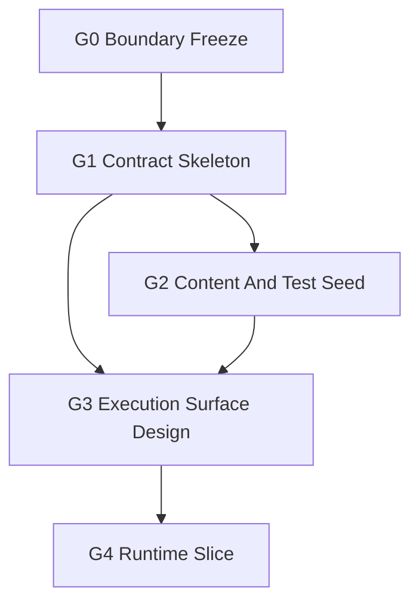

# Ground Subagent Dispatch Queue

Status: `2026-05-21` G0 accepted; G1-A preflight and G1-B narrow
Python-profile implementation accepted by main thread; G2 accepted by
main-thread integration. G3 is ready for design preflight.

Use this queue when launching subagents. The main thread owns integration and
final acceptance.

Detailed G0 worker packets live in
[g0_boundary_freeze/g0_subagent_dispatch_packets_20260521.md](g0_boundary_freeze/g0_subagent_dispatch_packets_20260521.md).

Rules:

- Follow the [Subagent Usage Policy](../../standards/governance/subagent_usage_policy.md).
- Keep write scopes disjoint.
- Do not split the same normative table across concurrent authors.
- The standards tree wins for naming and layering.
- Workers must not revert unrelated edits or edits made by other workers.
- A worker may stop at `preflight-only` if the next slice is not justified.
- G1 implementation is accepted only for G1-B's Python-profile-only slice. C++
  DTO shells, bindings, runtime behavior, and scenario loaders remain held.
- G2 is accepted only for content/test seed scope. Runtime-loadable ground unit
  schemas, movement, terrain, sensing, fires, weapon, damage, and combat
  behavior remain held.

## Phase Map



Parallel rule:

- `G0` is the standards authority and starts first.
- `G1` starts only after G0 standards and task indexes agree. G1-A returned
  `implementation-ready`; G1-B is accepted.
- `G2` is accepted after `G2-A`, `G2-B`, and main-thread `G2-C` integration.
- `G3` may begin design using G1/G2 evidence to choose a realistic first slice.
- `G4` is held until G3 selects one runtime candidate and write scope.

## First Wave

| Stream | Agent type | Model / reasoning | Task | Write scope |
|--------|------------|-------------------|------|-------------|
| `G0-A` | worker | `gpt-5.4-mini`, xhigh | Audit/tighten the ground standards overview. | `docs/standards/ground/README*.md` only. No code. |
| `G0-B` | worker | `gpt-5.4-mini`, xhigh | Audit/tighten the minimal ground task vocabulary. | `docs/standards/ground/minimal_task_structure*.md` only. No code. |
| `G0-C` | worker / integration worker | `gpt-5.4-mini`, xhigh | Integrate G0 navigation, dispatch docs, and bilingual registry after G0-A/G0-B. | Standards indexes, `docs/task/ground/**`, registry. No code. |
| `G1-A` | worker | `gpt-5.4`, high | Preflight profile resolver, ground profile shell, starter defaults, and focused test scope. Implementation requires follow-on approval. | Read/source inventory and focused preflight notes first; code edits only after follow-on approval. |
| `G1-B` | worker | `gpt-5.4`, high | Implement the Python-profile-only ground resolver/profile/adapter slice and focused tests from G1-A. | `python/rl/tasking/bridge.py`, `python/rl/tasking/common_core_profile.py`, `python/rl/tasking/ground_adapter.py`, `python/rl/profile/ground_profile.py`, focused `tests/leader` only. No C++/runtime/bindings. |
| `G2-A` | worker | `gpt-5.4`, high | Accepted: add first ground fixture root and capability note after G1. | `examples/config/database/ground/**` only. |
| `G2-B` | worker | `gpt-5.4`, high | Accepted: add ground contract specs and focused contract-runner coverage after G1. | `tests/contracts/unit/ground/**` and one focused `tests/leader` or `tests/runners` test only. |
| `G2-C` | main-thread integration | current main thread | Accepted: integrate G2 worker results, validation, status docs, and G3 residuals. | `docs/task/ground/g2_content_test_seed/**`, this dispatch queue, validation only. |
| `G3-A` | worker | `gpt-5.4`, xhigh | Design the first execution surface and select one G4 candidate. | `docs/task/ground/g3_execution_surface_design/**` only unless standards follow-up is explicitly needed. |

## Held Streams

| Stream | Release condition |
|--------|-------------------|
| `G4-A` | Release only after G3 selects a single runtime slice, write scope, and focused test plan. |
| `G4-B` | Optional closure/integration stream after G4-A returns mergeable or blocked evidence. |

## Dispatch Details

### `G0-A Standards Overview Audit`

Task:

- Audit/tighten `docs/standards/ground/README*.md`.
- Confirm layer model, G0 defaults, stage coverage, capability path, agency,
  and information-state rules.
- Stop as `blocked` instead of changing frozen defaults.

Return:

- standards overview decisions
- touched files
- audit commands
- G1 blockers: none reported by accepted G0-A return

### `G0-B Minimal Task Vocabulary Audit`

Task:

- Audit/tighten `docs/standards/ground/minimal_task_structure*.md`.
- Confirm `TASK_MOVE`, `TASK_OCCUPY`, and `TASK_SUPPORT` as the only starter
  task shapes.
- Keep movement dynamics, sensing, fires, logistics, terrain, observation, and
  damage deferred.

Return:

- frozen task-vocabulary decisions
- touched files
- audit commands
- G1 blockers: none reported by accepted G0-B return

### `G0-C Navigation And Registry Integration`

Task:

- Start after G0-A and G0-B return.
- Synchronize standards indexes, task navigation, G0 cluster docs, and the
  bilingual registry.
- Recommend whether G1 is `preflight-only`, `implementation-ready`, or
  `blocked`.

Return:

- integration files
- registry/audit result
- G1 release recommendation: `preflight-only`
- residual blockers: none known from G0 standards; implementation scope still
  needs G1 preflight evidence

G0-D acceptance:

- G0 accepted by main thread after G0-A, G0-B, and G0-C returned `pass`.
- G1 release is `preflight-only`.
- G1 implementation remains unreleased until preflight evidence confirms the
  resolver/profile write scope and DTO-shell decision.

Known G1 blockers:

- none from accepted G0-A standards overview return
- none from accepted G0-B minimal task vocabulary return
- none from G0-C navigation/registry integration
- implementation remains unreleased until G1 preflight evidence confirms the
  resolver/profile write scope and DTO-shell decision

### `G1-A Profile And DTO Skeleton`

Task:

- Preflight `army` / `ground` / `land` profile recognition.
- Preflight a narrow ground profile shell and default mapper.
- Decide whether C++ DTO shells are needed before requesting implementation
  release.
- Identify focused tests.

Write-scope caution:

- Do not edit runtime movement, sensor, weapon, damage, or facade behavior.
- Do not rework air/naval defaults beyond resolver compatibility hooks.

Return:

- accepted aliases
- default mapping table
- tests run
- residuals for fixtures and execution design

Preflight result:

- `implementation-ready` for a narrow Python-profile-only slice
- DTO shells: `not needed in G1`
- no G1 blocker for the narrow slice

### `G1-B Python Profile Implementation`

Task:

- Add `army` / `ground` / `land` profile recognition and normalize all aliases
  to `ground`.
- Add a narrow `ground_adapter` and `ground_profile`.
- Implement starter defaults for `TASK_MOVE`, `TASK_OCCUPY`, and
  `TASK_SUPPORT` using common-core fields only.
- Add focused `tests/leader` coverage.

Write-scope caution:

- Do not edit C++ DTO headers, Python bindings, runtime movement, sensor,
  weapon, damage, facade behavior, scenario loaders, or G2/G3/G4 docs.
- Do not change air/naval semantics except compatibility-preserving resolver
  hooks.

Return:

- aliases implemented
- task default mapping table
- tests run
- residuals for G2/G3

Accepted result:

- `army`, `ground`, `land`, and `ServiceProfile.Army` normalize to `ground`.
- `ground_adapter` and `ground_profile` are present.
- `TASK_MOVE`, `TASK_OCCUPY`, and `TASK_SUPPORT` default through common-core
  fields only.
- No C++ DTO shells, bindings, runtime behavior, or scenario-loader behavior
  were added.
- Main-thread validation passed:
  `python -m pytest -q tests/leader/test_ground_profile_semantics.py tests/leader/test_common_core_semantics.py tests/leader/test_naval_profile_semantics.py tests/runtime/mission/test_naval_mission_command_mapping.py`
  and `python -m pytest -q tests/leader`.

### `G2-A Ground Fixture Seed`

Task:

- Add the first source-controlled ground fixture root after G1 stabilizes the
  profile.
- Use a platoon-centered starter fixture and preserve capability-composition
  direction.
- Include a local capability note near the fixture that explains that this is a
  content/contract seed, not a public runtime spawn path.

Write-scope caution:

- Own only `examples/config/database/ground/**`.
- Do not edit tests, task docs, runtime code, public bindings, scenario
  loaders, C++ DTO shells, or other domain fixture roots.
- Do not start a scenario catalog.
- Do not make terrain, movement, or weapon claims.

Return:

- fixture paths
- JSON validity checks or other commands run
- capability residuals
- G3 input evidence

Accepted result:

- added `examples/config/database/ground/units/ground_platoon_starter.seed`
- added `examples/config/database/ground/units/CAPABILITY_NOTE.md`
- main-thread integration kept the seed non-`.json` so current recursive
  runtime database loading does not treat it as a concrete unit definition

### `G2-B Ground Contract Seed`

Task:

- Add ground contract specs that exercise `TASK_MOVE`, `TASK_OCCUPY`, and
  `TASK_SUPPORT` through the G1 ground profile and common-core fields.
- Add only the minimal focused test harness coverage needed to prove the new
  contract specs are runnable.

Write-scope caution:

- Own only `tests/contracts/unit/ground/**` plus one focused `tests/leader` or
  `tests/runners` test if needed.
- Do not edit fixtures under `examples/config/database/ground/**`.
- Do not edit task docs, runtime code, public bindings, scenario loaders, C++
  DTO shells, or air/naval semantics.

Return:

- contract paths
- tests run
- common-core evidence
- G3 input evidence

Accepted result:

- added `tests/contracts/unit/ground/task_order_ground_profile_defaults.json`
- added
  `tests/contracts/unit/ground/task_order_ground_minimal_structures.json`
- added
  `tests/contracts/unit/ground/task_order_ground_support_relationships.json`
- no extra runner or leader test file was needed because existing recursive
  unit-contract discovery covers the new specs

### `G2-C Main-Thread Integration`

Task:

- Start after `G2-A` and `G2-B` return.
- Review worker touched files and validation evidence.
- Synchronize the G2 README, G2 cluster, and this dispatch queue.
- Record blockers or release evidence for G3.

Return:

- accepted or rejected worker slices
- final validation commands
- residuals for G3 execution-surface design

Accepted result:

- accepted `G2-A` and `G2-B` after main-thread review
- validated the ground seed JSON shape, ground contracts, ground profile test,
  and database loading without a ground unknown-type warning
- released `G3-A` for design preflight only; `G4` remains held

### `G3-A Execution Surface Preflight`

Task:

- Choose one G4 candidate.
- Define stage and packet maps.
- Name observation/reporting and environment assumptions.
- Produce test plan and implementation write scope.

Write-scope caution:

- Do not implement runtime behavior.
- Do not broaden into full terrain, mobility, or fires.

Return:

- selected G4 candidate
- write scope
- test plan
- residual map

## Required Worker Return Packet

```md
Stream:
Status: pass | fail | blocked | preflight-only
Touched files:
Commands run:
Evidence:
Residuals:
Integration notes:
Closure impact:
```

Worker reminder:

- You are not alone in the codebase; do not revert unrelated edits.
- Keep write scopes disjoint.
- Stop at a named blocker instead of widening the phase.
