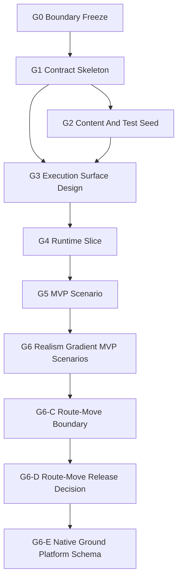

# Ground Subagent Dispatch Queue

Status: `2026-05-25` G0-G4 sealed as the accepted ground baseline. G5 tasking
smoke is accepted, G6-A/B are accepted for the first G1 realism-gradient MVP
scenario fixtures, G6-C is accepted for route-move boundary guardrails, and
G6-D1/D2 returned `preflight-only` with native-schema blockers. G6-E0 opens the
native ground platform schema planning package; implementation remains held.

Use this queue when launching subagents. The main thread owns integration and
final acceptance.

Detailed G0 worker packets live in
[g0_boundary_freeze/g0_subagent_dispatch_packets_20260521.md](g0_boundary_freeze/g0_subagent_dispatch_packets_20260521.md).

Rules:

- Follow the [Subagent Usage Policy](../../standards/governance/subagent_usage_policy.md).
- Keep write scopes disjoint.
- Do not split the same normative table across concurrent authors.
- The standards tree wins for naming and layering.
- Workers must not revert unrelated edits or edits made by other workers.
- A worker may stop at `preflight-only` if the next slice is not justified.
- G1 implementation is accepted only for G1-B's Python-profile-only slice. C++
  DTO shells, bindings, runtime behavior, and scenario loaders remain held.
- G2 is accepted only for content/test seed scope. Runtime-loadable ground unit
  schemas, movement, terrain, sensing, fires, weapon, damage, and combat
  behavior remain held.

## Phase Map



Parallel rule:

- `G0` is the standards authority and starts first.
- `G1` starts only after G0 standards and task indexes agree. G1-A returned
  `implementation-ready`; G1-B is accepted.
- `G2` is accepted after `G2-A`, `G2-B`, and main-thread `G2-C` integration.
- `G3` may begin design using G1/G2 evidence through parallel preflight
  diagnostics with disjoint scopes. `G3-D` is accepted after integrating
  G3-A/B/C.
- `G4` is accepted and sealed for the selected tasking-only lifecycle proof.
- `G5` is released only for the first canonical scenario smoke fixture and
  remains held for command delivery, observation export, movement, terrain,
  sensing, fires, effects, damage, and broad `MissionCommand` scope.
- `G6` releases only the G1 static occupy/support relationship scenario
  fixtures. Movement, terrain, sensing, fires, damage, native ground platform
  schemas, and G2+ realism remain held.
- `G6-C` accepts only route-move boundary guardrails. It does not release a
  movement scenario.
- `G6-D` selects the schema-first route-move release path. D1/D2 preflight
  found that native ground platform schema work must happen before any
  route-move implementation release.
- `G6-E0` records the minimum native ground platform schema package and keeps
  implementation held until source-inventory/design preflight accepts the exact
  identity/materialization path.

Terminology note: this project phase `G6 Realism Gradient MVP Scenarios` is not
the same as the domain-realism grade `G6 effects/damage/termination`; this
phase releases only two `G1` realism fixtures.

## First Wave

| Stream | Agent type | Model / reasoning | Task | Write scope |
|--------|------------|-------------------|------|-------------|
| `G0-A` | worker | `gpt-5.4-mini`, xhigh | Audit/tighten the ground standards overview. | `docs/standards/ground/README*.md` only. No code. |
| `G0-B` | worker | `gpt-5.4-mini`, xhigh | Audit/tighten the minimal ground task vocabulary. | `docs/standards/ground/minimal_task_structure*.md` only. No code. |
| `G0-C` | worker / integration worker | `gpt-5.4-mini`, xhigh | Integrate G0 navigation, dispatch docs, and bilingual registry after G0-A/G0-B. | Standards indexes, `docs/task/ground/**`, registry. No code. |
| `G1-A` | worker | `gpt-5.4`, high | Preflight profile resolver, ground profile shell, starter defaults, and focused test scope. Implementation requires follow-on approval. | Read/source inventory and focused preflight notes first; code edits only after follow-on approval. |
| `G1-B` | worker | `gpt-5.4`, high | Implement the Python-profile-only ground resolver/profile/adapter slice and focused tests from G1-A. | `python/rl/tasking/bridge.py`, `python/rl/tasking/common_core_profile.py`, `python/rl/tasking/ground_adapter.py`, `python/rl/profile/ground_profile.py`, focused `tests/leader` only. No C++/runtime/bindings. |
| `G2-A` | worker | `gpt-5.4`, high | Accepted: add first ground fixture root and capability note after G1. | `examples/config/database/ground/**` only. |
| `G2-B` | worker | `gpt-5.4`, high | Accepted: add ground contract specs and focused contract-runner coverage after G1. | `tests/contracts/unit/ground/**` and one focused `tests/leader` or `tests/runners` test only. |
| `G2-C` | main-thread integration | current main thread | Accepted: integrate G2 worker results, validation, status docs, and G3 residuals. | `docs/task/ground/g2_content_test_seed/**`, this dispatch queue, validation only. |
| `G3-A` | explorer | `gpt-5.4`, high | Preflight candidate selection plus stage/packet map for the first G4 slice. | Read-only diagnostics over G1/G2/G3 docs and current ground profile evidence. No direct edits. Dispatched `2026-05-22`. |
| `G3-B` | explorer | `gpt-5.4`, high | Preflight the first reporting surface and the environment dependency / deferral map. | Read-only diagnostics over G1/G2/G3 docs and standards. No direct edits. Dispatched `2026-05-22`. |
| `G3-C` | explorer | `gpt-5.4`, high | Preflight the G4 write scope, compatibility guards, and focused test plan. | Read-only diagnostics over G1/G2/G3/G4 docs and focused tests. No direct edits. Dispatched `2026-05-22`. |
| `G3-D` | main-thread integration | current main thread | Integrate G3-A/B/C into the authoritative G3 packet and decide whether G4 can be released. | `docs/task/ground/g3_execution_surface_design/**`, `docs/task/ground/README*.md`, and queue sync only. |
| `G5-A` | main-thread integration | current main thread | Add the minimal canonical MVP scenario and focused loader/tasking smoke test. | `scenarios/ground/**`, `tests/runtime/ground/**`, G5 docs, and navigation sync only. |
| `G5-B` | explorer | `gpt-5.4-mini`, high | Audit G0-G4 seal state and G5 documentation requirements. | Read-only diagnostics. Returned `2026-05-22`. |
| `G5-C` | explorer | `gpt-5.4-mini`, high | Audit ScenarioLoader and tasking-shell constraints for the MVP scenario. | Read-only diagnostics. Returned `2026-05-22`. |
| `G6-A` | worker | `gpt-5.4`, medium | Accepted: create the realism-gradient MVP planning surface. | `docs/task/ground/g6_realism_gradient_mvp_scenarios/**` only. |
| `G6-B` | worker | `gpt-5.4`, medium | Accepted: add G1 static occupy/support relationship scenarios and focused validation. | `scenarios/ground/ground_platoon_static_occupy_v1.json`, `scenarios/ground/ground_platoon_support_relationship_v1.json`, `tests/runtime/ground/test_ground_realism_gradient_mvp_scenarios.py` only. |
| `G6-C` | main-thread integration | current main thread | Accepted: route-move boundary guardrails without releasing movement behavior. | `docs/task/ground/g6_route_move_boundary/**`, `python/rl/tasking/bridge.py`, `tests/leader/test_ground_profile_semantics.py`, `tests/architecture/test_ground_realism_gradient_guardrails.py`, and ground README/queue/progress sync only. |
| `G6-D0` | main-thread integration | current main thread | Accepted: open the route-move release decision and select the schema-first path. | `docs/task/ground/g6_route_move_release_decision/**`, ground README/queue/progress/plan sync only. |
| `G6-D1` | main-thread diagnostics | current main thread | Accepted as `preflight-only`: native schema path is blocked by missing runtime-loadable ground platform type/schema. | Read-only diagnostics plus G6-D doc/queue/progress sync. No scenario, runtime, bindings, or C++ implementation edits. |
| `G6-D2` | main-thread diagnostics | current main thread | Accepted as `preflight-only`: movement evidence gates are defined but cannot release route movement before native schema closes. | Read-only diagnostics plus G6-D doc/queue/progress sync. No platform schema implementation, terrain, sensing, fires, damage, or combat edits. |
| `G6-E0` | main-thread integration | current main thread | Opened: plan the minimal native ground platform schema implementation package. | `docs/task/ground/g6_native_ground_platform_schema/**` and ground README/queue/progress/plan sync only. |
| `G6-E1` | explorer or main-thread diagnostics | `gpt-5.4`, high | Next candidate: source-inventory/design preflight for the native ground identity and materialization path. | Read-only diagnostics first; no runtime, bindings, content, tests, route movement, terrain, sensing, fires, damage, or combat edits unless separately released. |
| `G6-E2` | worker | `gpt-5.4`, high | Held: implement one runtime-loadable native ground platform schema after E1 selects the exact path. | Approved source/test/content files from E1 only. No route movement or combat behavior. |
| `G6-E3` | main-thread integration | current main thread | Held: integrate native schema evidence and decide whether a later route-move release vote can be opened. | Ground docs/queue/progress sync only unless a fix is explicitly released. |

## Held Streams

| Stream | Release condition |
|--------|-------------------|
| `G6-E1 native schema design preflight` | Requires accepted G6-E0 planning package. |
| `G6-E2 native schema implementation` | Requires accepted G6-E1 identity/materialization decision and focused validation plan. |
| `G2 route move implementation` | Requires accepted native ground platform schema evidence from G6-E2/E3 plus a later G6-D3/G6-F release vote. |
| `P3/P10 ground work` | Requires a separate accepted work package; G5 does not release formal command delivery or observation export. |

## Dispatch Details

### `G0-A Standards Overview Audit`

Task:

- Audit/tighten `docs/standards/ground/README*.md`.
- Confirm layer model, G0 defaults, stage coverage, capability path, agency,
  and information-state rules.
- Stop as `blocked` instead of changing frozen defaults.

Return:

- standards overview decisions
- touched files
- audit commands
- G1 blockers: none reported by accepted G0-A return

### `G0-B Minimal Task Vocabulary Audit`

Task:

- Audit/tighten `docs/standards/ground/minimal_task_structure*.md`.
- Confirm `TASK_MOVE`, `TASK_OCCUPY`, and `TASK_SUPPORT` as the only starter
  task shapes.
- Keep movement dynamics, sensing, fires, logistics, terrain, observation, and
  damage deferred.

Return:

- frozen task-vocabulary decisions
- touched files
- audit commands
- G1 blockers: none reported by accepted G0-B return

### `G0-C Navigation And Registry Integration`

Task:

- Start after G0-A and G0-B return.
- Synchronize standards indexes, task navigation, G0 cluster docs, and the
  bilingual registry.
- Recommend whether G1 is `preflight-only`, `implementation-ready`, or
  `blocked`.

Return:

- integration files
- registry/audit result
- G1 release recommendation: `preflight-only`
- residual blockers: none known from G0 standards; implementation scope still
  needs G1 preflight evidence

G0-D acceptance:

- G0 accepted by main thread after G0-A, G0-B, and G0-C returned `pass`.
- G1 release is `preflight-only`.
- G1 implementation remains unreleased until preflight evidence confirms the
  resolver/profile write scope and DTO-shell decision.

Known G1 blockers:

- none from accepted G0-A standards overview return
- none from accepted G0-B minimal task vocabulary return
- none from G0-C navigation/registry integration
- implementation remains unreleased until G1 preflight evidence confirms the
  resolver/profile write scope and DTO-shell decision

### `G1-A Profile And DTO Skeleton`

Task:

- Preflight `army` / `ground` / `land` profile recognition.
- Preflight a narrow ground profile shell and default mapper.
- Decide whether C++ DTO shells are needed before requesting implementation
  release.
- Identify focused tests.

Write-scope caution:

- Do not edit runtime movement, sensor, weapon, damage, or facade behavior.
- Do not rework air/naval defaults beyond resolver compatibility hooks.

Return:

- accepted aliases
- default mapping table
- tests run
- residuals for fixtures and execution design

Preflight result:

- `implementation-ready` for a narrow Python-profile-only slice
- DTO shells: `not needed in G1`
- no G1 blocker for the narrow slice

### `G1-B Python Profile Implementation`

Task:

- Add `army` / `ground` / `land` profile recognition and normalize all aliases
  to `ground`.
- Add a narrow `ground_adapter` and `ground_profile`.
- Implement starter defaults for `TASK_MOVE`, `TASK_OCCUPY`, and
  `TASK_SUPPORT` using common-core fields only.
- Add focused `tests/leader` coverage.

Write-scope caution:

- Do not edit C++ DTO headers, Python bindings, runtime movement, sensor,
  weapon, damage, facade behavior, scenario loaders, or G2/G3/G4 docs.
- Do not change air/naval semantics except compatibility-preserving resolver
  hooks.

Return:

- aliases implemented
- task default mapping table
- tests run
- residuals for G2/G3

Accepted result:

- `army`, `ground`, `land`, and `ServiceProfile.Army` normalize to `ground`.
- `ground_adapter` and `ground_profile` are present.
- `TASK_MOVE`, `TASK_OCCUPY`, and `TASK_SUPPORT` default through common-core
  fields only.
- No C++ DTO shells, bindings, runtime behavior, or scenario-loader behavior
  were added.
- Main-thread validation passed:
  `python -m pytest -q tests/leader/test_ground_profile_semantics.py tests/leader/test_common_core_semantics.py tests/leader/test_naval_profile_semantics.py tests/runtime/mission/test_naval_mission_command_mapping.py`
  and `python -m pytest -q tests/leader`.

### `G2-A Ground Fixture Seed`

Task:

- Add the first source-controlled ground fixture root after G1 stabilizes the
  profile.
- Use a platoon-centered starter fixture and preserve capability-composition
  direction.
- Include a local capability note near the fixture that explains that this is a
  content/contract seed, not a public runtime spawn path.

Write-scope caution:

- Own only `examples/config/database/ground/**`.
- Do not edit tests, task docs, runtime code, public bindings, scenario
  loaders, C++ DTO shells, or other domain fixture roots.
- Do not start a scenario catalog.
- Do not make terrain, movement, or weapon claims.

Return:

- fixture paths
- JSON validity checks or other commands run
- capability residuals
- G3 input evidence

Accepted result:

- added `examples/config/database/ground/units/ground_platoon_starter.seed`
- added `examples/config/database/ground/units/CAPABILITY_NOTE.md`
- main-thread integration kept the seed non-`.json` so current recursive
  runtime database loading does not treat it as a concrete unit definition

### `G2-B Ground Contract Seed`

Task:

- Add ground contract specs that exercise `TASK_MOVE`, `TASK_OCCUPY`, and
  `TASK_SUPPORT` through the G1 ground profile and common-core fields.
- Add only the minimal focused test harness coverage needed to prove the new
  contract specs are runnable.

Write-scope caution:

- Own only `tests/contracts/unit/ground/**` plus one focused `tests/leader` or
  `tests/runners` test if needed.
- Do not edit fixtures under `examples/config/database/ground/**`.
- Do not edit task docs, runtime code, public bindings, scenario loaders, C++
  DTO shells, or air/naval semantics.

Return:

- contract paths
- tests run
- common-core evidence
- G3 input evidence

Accepted result:

- added `tests/contracts/unit/ground/task_order_ground_profile_defaults.json`
- added
  `tests/contracts/unit/ground/task_order_ground_minimal_structures.json`
- added
  `tests/contracts/unit/ground/task_order_ground_support_relationships.json`
- no extra runner or leader test file was needed because existing recursive
  unit-contract discovery covers the new specs

### `G2-C Main-Thread Integration`

Task:

- Start after `G2-A` and `G2-B` return.
- Review worker touched files and validation evidence.
- Synchronize the G2 README, G2 cluster, and this dispatch queue.
- Record blockers or release evidence for G3.

Return:

- accepted or rejected worker slices
- final validation commands
- residuals for G3 execution-surface design

Accepted result:

- accepted `G2-A` and `G2-B` after main-thread review
- validated the ground seed JSON shape, ground contracts, ground profile test,
  and database loading without a ground unknown-type warning
- released parallel `G3-A`/`G3-B`/`G3-C` design preflight; `G4` remained held
  until main-thread `G3-D` integration

### `G3-A Candidate And Stage/Packet Map`

Task:

- Compare the credible first-slice shapes and choose one bounded G4 candidate.
- Freeze the exact stage participation beyond accepted G1/G2 scope.
- Freeze consumed, produced, and deferred packet families for the chosen
  candidate.

Write-scope caution:

- Read-only diagnostics only.
- Do not edit runtime behavior or canonical G3 tables directly.

Return:

- selected G4 candidate
- stage map
- packet map
- residuals that block candidate selection

### `G3-B Observation/Reporting And Environment Boundary`

Task:

- Recommend the first reporting surface that avoids world-truth leakage.
- Classify terrain, line-of-sight, radio, and mobility assumptions as
  implemented, placeholder, or deferred.
- Confirm what must stay out of G4 so the first slice remains credible.

Write-scope caution:

- Read-only diagnostics only.
- Do not broaden into movement, fires, sensing, or observation runtime claims.

Return:

- reporting-surface recommendation
- environment dependency map
- deferral map
- residuals that would force standards follow-up

### `G3-C G4 Release Envelope And Test Plan`

Task:

- Define one bounded G4 write scope for the selected class of slice.
- Name the focused tests and compatibility guards required before G4 can claim
  maintained behavior.
- Define the no-private-ground-path proof expectation for the candidate.

Write-scope caution:

- Read-only diagnostics only.
- Do not release G4 or edit implementation code.

Return:

- G4 write scope
- focused test plan
- compatibility/no-private-path guard expectations
- residuals that must stay recorded for G4

### `G3-D Main-Thread Integration`

Completed task:

- Started after G3-A, G3-B, and G3-C returned.
- Integrated the three bounded preflight returns into the canonical G3 packet.
- Synced the G3 README and this queue.
- Released G4 only for one bounded lifecycle-proof write scope.

Return:

- final G3 decision
- selected G4 candidate
- write scope
- focused test plan
- residual map

Accepted result:

- selected G4 candidate:
  `tasking-only lifecycle proof through normalized ground TaskOrder ->
  LeaderIntent -> PilotReport status shell`
- produced report surface:
  `PilotReport` only
- held packet/runtime surfaces:
  `CommandPacket`, `ObservationPacket`, `TrackPacket`, formal `P3`, formal
  `P10`, movement, sensing, terrain, fires, and broad `MissionCommand`
- released G4 write scope:
  shared-entry-point lifecycle proof plus the narrowest runtime plumbing needed
  so ground loaders resolve through the maintained `tasking_profile` bridge
- accepted baseline tests:
  `tests/leader/test_ground_profile_semantics.py`,
  `tests/leader/test_common_core_semantics.py`,
  `tests/leader/test_naval_profile_semantics.py`,
  `tests/runtime/mission/test_leader_tasking_runtime.py`,
  and `tests/contracts/unit/ground/`

## Required Worker Return Packet

```md
Stream:
Status: pass | fail | blocked | preflight-only
Touched files:
Commands run:
Evidence:
Residuals:
Integration notes:
Closure impact:
```

Worker reminder:

- You are not alone in the codebase; do not revert unrelated edits.
- Keep write scopes disjoint.
- Stop at a named blocker instead of widening the phase.
