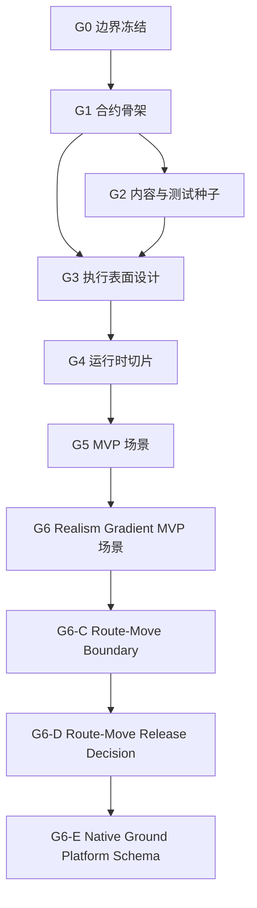

<!-- Chinese companion synchronized on 2026-05-24 from docs/task/ground/ground_subagent_dispatch_queue_20260521.md. Review English canonical file for disputed wording. -->

# 地面子代理调度队列

状态：`2026-05-25` G0-G4 已封存为 accepted ground baseline。G5 tasking
smoke 已接受；G6-A/B 已接受第一批 G1 realism-gradient MVP 场景 fixture；
G6-C 已接受 route-move boundary guardrails；G6-D1/D2 已以
`preflight-only` 返回 native-schema blocker。G6-E0 已开启 native ground
platform schema planning package；implementation 仍 held。

启动子代理时使用此队列。主线程拥有集成和最终验收。

详细的 G0 工作包位于
[g0_boundary_freeze/g0_subagent_dispatch_packets_20260521.md](g0_boundary_freeze/g0_subagent_dispatch_packets_20260521.md)。

规则：

- 遵循[子代理使用策略](../../standards/governance/subagent_usage_policy.md)。
- 保持写入范围不相交。
- 不要将同一规范表分给多个并发作者。
- 标准和层级以标准树为准。
- 工作者不得撤销无关编辑或其他工作者所做的编辑。
- 如果下一个切片不合理，工作者可以在 `preflight-only` 处停止。
- G1 实现仅针对 G1-B 的仅 Python 配置文件切片被接受。C++ DTO 外壳、绑定、运行时行为和场景加载器仍被保留。
- G2 仅针对内容/测试种子范围被接受。runtime-loadable ground unit schema、
  movement、terrain、sensing、fires、weapon、damage 和 combat behavior 仍被保留。

## 阶段图



并行规则：

- `G0` 是标准权威，首先启动。
- `G1` 仅在 G0 标准和任务索引达成一致后启动。G1-A 返回 `implementation-ready`；G1-B 已接受。
- `G2` 在 `G2-A`、`G2-B` 和主线程 `G2-C` 集成后被接受。
- `G3` 可以使用 G1/G2 证据，通过写入范围不相交的并行 preflight diagnostics
  开始设计。`G3-D` 已在整合 G3-A/B/C 后被接受。
- `G4` 已验收并封存为选定的 tasking-only lifecycle proof。
- `G5` 仅针对第一版规范场景 smoke fixture 释放；command delivery、
  observation export、movement、terrain、sensing、fires、effects、damage 和
  宽泛 `MissionCommand` 范围仍保持保留。
- `G6` 仅释放 G1 static occupy/support relationship 场景 fixture。movement、
  terrain、sensing、fires、damage、native ground platform schema 和 G2+
  realism 仍保持保留。
- `G6-C` 只接受 route-move boundary guardrails；它不释放 movement 场景。
- `G6-D` 选择 schema-first route-move release path。D1/D2 预检确认：在任何
  route-move implementation release 前，必须先完成 native ground platform
  schema work。
- `G6-E0` 记录最小 native ground platform schema package，并在
  source-inventory/design preflight 接受准确 identity/materialization path 前
  继续 held implementation。

术语说明：这里的调度阶段 `G6 Realism Gradient MVP 场景` 不是域真实性梯度表中的
`G6 effects/damage/termination`。本阶段只发布两个 `G1` 真实性 fixture。

## 第一波

| 流 | 代理类型 | 模型/推理 | 任务 | 写入范围 |
|--------|------------|-------------------|------|-------------|
| `G0-A` | 工作者 | `gpt-5.4-mini`，极高 | 审计/收紧地面标准概述。 | 仅 `docs/standards/ground/README*.md`。无代码。 |
| `G0-B` | 工作者 | `gpt-5.4-mini`，极高 | 审计/收紧最小地面任务词汇。 | 仅 `docs/standards/ground/minimal_task_structure*.md`。无代码。 |
| `G0-C` | 工作者/集成工作者 | `gpt-5.4-mini`，极高 | 在 G0-A/G0-B 之后集成 G0 导航、调度文档和双语注册表。 | 标准索引、`docs/task/ground/**`、注册表。无代码。 |
| `G1-A` | 工作者 | `gpt-5.4`，高 | 预检配置文件解析器、地面配置文件外壳、起始默认值和聚焦测试范围。实现需要后续批准。 | 首先读取/源清单和聚焦预检说明；仅在后续批准后进行代码编辑。 |
| `G1-B` | 工作者 | `gpt-5.4`，高 | 实现仅 Python 配置文件的地面解析器/配置文件/适配器切片以及来自 G1-A 的聚焦测试。 | `python/rl/tasking/bridge.py`、`python/rl/tasking/common_core_profile.py`、`python/rl/tasking/ground_adapter.py`、`python/rl/profile/ground_profile.py`、仅聚焦 `tests/leader`。无 C++/运行时/绑定。 |
| `G2-A` | 工作者 | `gpt-5.4`，高 | 在 G1 之后添加第一个地面夹具根和能力说明。 | 仅 `examples/config/database/ground/**`。 |
| `G2-B` | 工作者 | `gpt-5.4`，高 | 在 G1 之后添加地面合约规范和聚焦的合约运行器覆盖。 | 仅 `tests/contracts/unit/ground/**` 和一个聚焦的 `tests/leader` 或 `tests/runners` 测试。 |
| `G2-C` | 主线程集成 | 当前主线程 | 集成 G2 工作者结果、验证、状态文档和 G3 剩余物。 | 仅 `docs/task/ground/g2_content_test_seed/**`、此调度队列、验证。 |
| `G3-A` | explorer | `gpt-5.4`，high | 预检第一个 G4 切片候选及其 stage/packet map。 | 对 G1/G2/G3 文档与现有 ground profile 证据做只读 diagnostics。不直接编辑。已于 `2026-05-22` 分发。 |
| `G3-B` | explorer | `gpt-5.4`，high | 预检第一个 reporting surface 及 environment dependency / deferral map。 | 对 G1/G2/G3 文档与 standards 做只读 diagnostics。不直接编辑。已于 `2026-05-22` 分发。 |
| `G3-C` | explorer | `gpt-5.4`，high | 预检 G4 的 write scope、compatibility guards 与 focused test plan。 | 对 G1/G2/G3/G4 文档与 focused tests 做只读 diagnostics。不直接编辑。已于 `2026-05-22` 分发。 |
| `G3-D` | 主线程集成 | 当前主线程 | 整合 G3-A/B/C，形成 authoritative G3 packet，并记录已验收的 G4 写入范围。 | 仅 `docs/task/ground/g3_execution_surface_design/**`、`docs/task/ground/README*.md` 与 queue sync。 |
| `G5-A` | 主线程集成 | 当前主线程 | 添加最小规范 MVP 场景与 focused loader/tasking smoke test。 | 仅 `scenarios/ground/**`、`tests/runtime/ground/**`、G5 docs 与导航同步。 |
| `G5-B` | explorer | `gpt-5.4-mini`，high | 审计 G0-G4 封存状态与 G5 文档验收要求。 | 只读 diagnostics。已于 `2026-05-22` 返回。 |
| `G5-C` | explorer | `gpt-5.4-mini`，high | 审计 ScenarioLoader 与 tasking-shell 对 MVP 场景的约束。 | 只读 diagnostics。已于 `2026-05-22` 返回。 |
| `G6-A` | worker | `gpt-5.4`，medium | 已接受：创建 realism-gradient MVP planning surface。 | 仅 `docs/task/ground/g6_realism_gradient_mvp_scenarios/**`。 |
| `G6-B` | worker | `gpt-5.4`，medium | 已接受：添加 G1 static occupy/support relationship 场景和 focused validation。 | 仅 `scenarios/ground/ground_platoon_static_occupy_v1.json`、`scenarios/ground/ground_platoon_support_relationship_v1.json`、`tests/runtime/ground/test_ground_realism_gradient_mvp_scenarios.py`。 |
| `G6-C` | 主线程集成 | 当前主线程 | 已接受：route-move boundary guardrails，不释放 movement behavior。 | 仅 `docs/task/ground/g6_route_move_boundary/**`、`python/rl/tasking/bridge.py`、`tests/leader/test_ground_profile_semantics.py`、`tests/architecture/test_ground_realism_gradient_guardrails.py` 与 ground README/queue/progress sync。 |
| `G6-D0` | 主线程集成 | 当前主线程 | 已接受：开启 route-move release decision，并选择 schema-first 路径。 | 仅 `docs/task/ground/g6_route_move_release_decision/**` 与 ground README/queue/progress/plan sync。 |
| `G6-D1` | 主线程 diagnostics | 当前主线程 | 已作为 `preflight-only` 接受：native schema path 被缺失的 runtime-loadable ground platform type/schema 阻塞。 | 只读 diagnostics 加 G6-D doc/queue/progress sync。不编辑 scenario、runtime、bindings 或 C++ implementation。 |
| `G6-D2` | 主线程 diagnostics | 当前主线程 | 已作为 `preflight-only` 接受：movement evidence gates 已定义，但在 native schema 关闭前不能释放 route movement。 | 只读 diagnostics 加 G6-D doc/queue/progress sync。不编辑 platform schema implementation、terrain、sensing、fires、damage 或 combat。 |
| `G6-E0` | 主线程集成 | 当前主线程 | 已开启：规划最小 native ground platform schema implementation package。 | 仅 `docs/task/ground/g6_native_ground_platform_schema/**` 与 ground README/queue/progress/plan sync。 |
| `G6-E1` | explorer 或主线程 diagnostics | `gpt-5.4`，high | 下一候选：对 native ground identity 与 materialization path 做 source-inventory/design preflight。 | 首先只读 diagnostics；除非单独释放，不编辑 runtime、bindings、content、tests、route movement、terrain、sensing、fires、damage 或 combat。 |
| `G6-E2` | worker | `gpt-5.4`，high | Held：在 E1 选定准确路径后，实现一个 runtime-loadable native ground platform schema。 | 仅 E1 批准的 source/test/content 文件。不做 route movement 或 combat behavior。 |
| `G6-E3` | 主线程集成 | 当前主线程 | Held：整合 native schema 证据，并决定后续 route-move release vote 是否可开启。 | 除非单独释放修复，否则仅 ground docs/queue/progress sync。 |

## 保留流

| 流 | 释放条件 |
|--------|-------------------|
| `G6-E1 native schema design preflight` | 需要已接受的 G6-E0 planning package。 |
| `G6-E2 native schema implementation` | 需要已接受的 G6-E1 identity/materialization decision 与 focused validation plan。 |
| `G2 route move implementation` | 需要来自 G6-E2/E3 的已接受 native ground platform schema 证据，以及后续 G6-D3/G6-F release vote。 |
| `P3/P10 ground work` | 需要单独 accepted work package；G5 不释放 formal command delivery 或 observation export。 |

## 调度详情

### `G0-A 标准概述审计`

任务：

- 审计/收紧 `docs/standards/ground/README*.md`。
- 确认层级模型、G0 默认值、阶段覆盖、能力路径、代理和信息状态规则。
- 以 `blocked` 停止，而不是更改冻结的默认值。

返回：

- 标准概述决策
- 接触的文件
- 审计命令
- G1 阻塞项：已接受的 G0-A 返回未报告任何阻塞项

### `G0-B 最小任务词汇审计`

任务：

- 审计/收紧 `docs/standards/ground/minimal_task_structure*.md`。
- 确认 `TASK_MOVE`、`TASK_OCCUPY` 和 `TASK_SUPPORT` 作为唯一的起始任务形状。
- 将移动动力学、感知、火力、后勤、地形、观测和伤害保持推迟。

返回：

- 冻结的任务词汇决策
- 接触的文件
- 审计命令
- G1 阻塞项：已接受的 G0-B 返回未报告任何阻塞项

### `G0-C 导航与注册表集成`

任务：

- 在 G0-A 和 G0-B 返回后开始。
- 同步标准索引、任务导航、G0 集群文档和双语注册表。
- 建议 G1 是 `preflight-only`、`implementation-ready` 还是 `blocked`。

返回：

- 集成文件
- 注册表/审计结果
- G1 发布建议：`preflight-only`
- 剩余阻塞项：G0 标准中未知；实现范围仍需 G1 预检证据

G0-D 接受状态：

- 在 G0-A、G0-B 和 G0-C 返回 `pass` 后，G0 由主线程接受。
- G1 发布为 `preflight-only`。
- G1 实现保持未发布状态，直到预检证据确认解析器/配置文件写入范围和 DTO 外壳决策。

已知的 G1 阻塞项：

- 来自已接受的 G0-A 标准概述返回：无
- 来自已接受的 G0-B 最小任务词汇返回：无
- 来自 G0-C 导航/注册表集成：无
- 实现保持未发布状态，直到 G1 预检证据确认解析器/配置文件写入范围和 DTO 外壳决策

### `G1-A 配置文件与 DTO 骨架`

任务：

- 预检 `army` / `ground` / `land` 配置文件识别。
- 预检一个窄范围地面配置文件外壳和默认映射器。
- 决定在请求实现发布之前是否需要 C++ DTO 外壳。
- 识别聚焦测试。

写入范围注意事项：

- 不要编辑运行时移动、传感器、武器、伤害或外观行为。
- 不要重做空军/海军默认值，除了兼容性保留解析器钩子。

返回：

- 已接受的别名
- 默认映射表
- 运行的测试
- 夹具和执行设计的剩余物

预检结果：

- 对于窄范围仅 Python 配置文件切片：`implementation-ready`
- DTO 外壳：`G1 中不需要`
- 窄切片无 G1 阻塞项

### `G1-B Python 配置文件实现`

任务：

- 添加 `army` / `ground` / `land` 配置文件识别，并将所有别名规范化为 `ground`。
- 添加一个窄范围 `ground_adapter` 和 `ground_profile`。
- 仅使用公共核心字段实现 `TASK_MOVE`、`TASK_OCCUPY` 和 `TASK_SUPPORT` 的起始默认值。
- 添加聚焦的 `tests/leader` 覆盖。

写入范围注意事项：

- 不要编辑 C++ DTO 头文件、Python 绑定、运行时移动、传感器、武器、伤害、外观行为、场景加载器或 G2/G3/G4 文档。
- 不要更改空军/海军语义，除非是兼容性保留的解析器钩子。

返回：

- 已实现的别名
- 任务默认映射表
- 运行的测试
- G2/G3 的剩余物

已接受的结果：

- `army`、`ground`、`land` 和 `ServiceProfile.Army` 规范化为 `ground`。
- `ground_adapter` 和 `ground_profile` 已存在。
- `TASK_MOVE`、`TASK_OCCUPY` 和 `TASK_SUPPORT` 仅通过公共核心字段默认。
- 未添加 C++ DTO 外壳、绑定、运行时行为或场景加载器行为。
- 主线程验证通过：
  `python -m pytest -q tests/leader/test_ground_profile_semantics.py tests/leader/test_common_core_semantics.py tests/leader/test_naval_profile_semantics.py tests/runtime/mission/test_naval_mission_command_mapping.py`
  和 `python -m pytest -q tests/leader`。

### `G2-A 地面夹具种子`

任务：

- 在 G1 稳定配置文件后，添加第一个源代码控制的地面夹具根。
- 使用以排为中心的起始夹具，并保留能力组合方向。
- 在夹具附近包含一个本地能力说明，解释这是内容/合约种子，而不是公共运行时生成路径。

写入范围注意事项：

- 仅拥有 `examples/config/database/ground/**`。
- 不要编辑测试、任务文档、运行时代码、公共绑定、场景加载器、C++ DTO 外壳或其他领域夹具根。
- 不要启动场景目录。
- 不要做出地形、移动或武器声明。

返回：

- 夹具路径
- JSON 有效性检查或其他运行的命令
- 能力剩余物
- G3 输入证据

### `G2-B 地面合约种子`

任务：

- 添加地面合约规范，通过 G1 地面配置文件和公共核心字段练习 `TASK_MOVE`、`TASK_OCCUPY` 和 `TASK_SUPPORT`。
- 仅添加证明新合约规范可运行所需的最小聚焦测试工具覆盖。

写入范围注意事项：

- 仅拥有 `tests/contracts/unit/ground/**` 加上一个聚焦的 `tests/leader` 或 `tests/runners` 测试（如果需要）。
- 不要编辑 `examples/config/database/ground/**` 下的夹具。
- 不要编辑任务文档、运行时代码、公共绑定、场景加载器、C++ DTO 外壳或空军/海军语义。

返回：

- 合约路径
- 运行的测试
- 公共核心证据
- G3 输入证据

### `G2-C 主线程集成`

任务：

- 在 `G2-A` 和 `G2-B` 返回后开始。
- 审查工作者接触的文件和验证证据。
- 同步 G2 README、G2 集群和此调度队列。
- 记录 G3 的阻塞项或发布证据。

返回：

- 已接受或已拒绝的工作者切片
- 最终验证命令
- G3 执行表面设计的剩余物

已接受的结果：

- 主线程审查后接受 `G2-A` 和 `G2-B`
- 验证 ground seed JSON 形状、ground contracts、ground profile test，以及
  database loading 未出现 ground unknown-type warning
- 释放并行 `G3-A`/`G3-B`/`G3-C` 设计预检；`G4` 在主线程 `G3-D`
  集成前保持保留

### `G3-A 候选与 Stage/Packet Map`

任务：

- 比较可信的第一切片形态，并选择一个有边界的 G4 候选。
- 冻结超出已接受 G1/G2 范围之外的准确 stage 参与方式。
- 冻结所选候选的 consumed、produced 和 deferred packet family。

写入范围注意事项：

- 仅做只读 diagnostics。
- 不要直接编辑运行时行为或 canonical G3 表。

返回：

- 选定的 G4 候选
- stage map
- packet map
- 阻塞候选选择的剩余物

### `G3-B 观察/报告与环境边界`

任务：

- 推荐第一个不会泄漏 world-truth 的 reporting surface。
- 将 terrain、line-of-sight、radio 和 mobility 假设分类为 implemented、
  placeholder 或 deferred。
- 确认哪些内容必须留在 G4 之外，以保持第一切片可信。

写入范围注意事项：

- 仅做只读 diagnostics。
- 不要扩展到 movement、fires、sensing 或 observation runtime claims。

返回：

- reporting-surface recommendation
- environment dependency map
- deferral map
- 会迫使 standards follow-up 的剩余物

### `G3-C G4 释放包络与测试计划`

任务：

- 为所选切片类型定义一个有边界的 G4 写入范围。
- 命名 G4 能够宣称 maintained behavior 之前需要的 focused tests 和
  compatibility guards。
- 定义候选的 no-private-ground-path proof 期望。

写入范围注意事项：

- 仅做只读 diagnostics。
- 不要释放 G4，也不要编辑实现代码。

返回：

- G4 write scope
- focused test plan
- compatibility/no-private-path guard expectations
- 必须记录给 G4 的剩余物

### `G3-D 主线程集成`

已完成任务：

- 在 G3-A、G3-B 和 G3-C 返回后开始。
- 将三个有边界的预检返回整合进 canonical G3 packet。
- 同步 G3 README 和此队列。
- 仅针对一个 bounded lifecycle-proof write scope 释放 G4。

返回：

- final G3 decision
- selected G4 candidate
- write scope
- focused test plan
- residual map

已接受的结果：

- 选定的 G4 候选：
  `tasking-only lifecycle proof through normalized ground TaskOrder ->
  LeaderIntent -> PilotReport status shell`
- 产出的 reporting surface：
  `PilotReport` only
- 保留的 packet/runtime surfaces：
  `CommandPacket`、`ObservationPacket`、`TrackPacket`、formal `P3`、formal
  `P10`、movement、sensing、terrain、fires 和 broad `MissionCommand`
- 已释放的 G4 写入范围：
  shared-entry-point lifecycle proof，加上让 ground loaders 通过 maintained
  `tasking_profile` bridge 解析所需的最窄 runtime plumbing
- 已接受的 baseline tests：
  `tests/leader/test_ground_profile_semantics.py`、
  `tests/leader/test_common_core_semantics.py`、
  `tests/leader/test_naval_profile_semantics.py`、
  `tests/runtime/mission/test_leader_tasking_runtime.py`、
  `tests/contracts/unit/ground/`

## 必需的工作者返回包

```md
流：
状态：pass | fail | blocked | preflight-only
接触的文件：
运行的命令：
证据：
剩余物：
集成说明：
关闭影响：
```

工作者提醒：

- 你在代码库中并不孤单；不要撤销无关的编辑。
- 保持写入范围不相交。
- 如果遇到命名的阻塞项，请停止，而不是扩大阶段。
