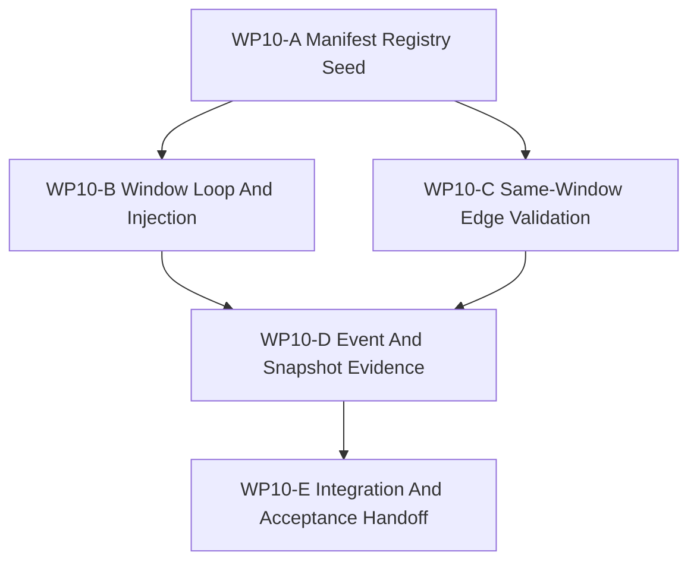

# WP10 Causal Runtime Foundation

Status: `2026-05-20` accepted / implementation mergeable.

Language:

- English canonical: `causal_runtime_foundation_wp10_20260520.md`
- Chinese companion:
  [causal_runtime_foundation_wp10_20260520.zh.md](causal_runtime_foundation_wp10_20260520.zh.md)

Inputs:

- [Post-WP9 architecture route plan](../post_wp9_architecture_route_plan_20260520.md)
- [Post-WP9 gap analysis](../../review/post_wp9_gap_analysis_20260520.md)
- [WP2.5 scheduler semantics freeze](../wp25_scheduler_semantics/scheduler_semantics_wp25_20260519.md)
- [WP2.5 manifest/event cluster](../wp25_scheduler_semantics/wp25_manifest_event_cluster_20260519.md)
- [WP2.5 state/barrier cluster](../wp25_scheduler_semantics/wp25_state_barrier_cluster_20260519.md)
- [WP5 validation harness](../wp5_validation_harness/validation_harness_wp5_20260519.md)
- [WP9 contract and infrastructure closure](../wp9_contract_infrastructure_closure/contract_infrastructure_closure_wp9_20260520.md)
- [WP closure lane policy](../../../standards/governance/wp_closure_lane_policy.md)
- [WP10 acceptance review](../../review/wp10_causal_runtime_foundation_acceptance_review_20260520.md)

Naming note:

- `WP10` is Phase 1 of the post-WP9 route: causal runtime foundation.
- It implements the Track 1 items named in the route plan:
  `POST9-T1-A` through `POST9-T1-E`.
- It is not a broad scheduler rewrite.
- It does not claim strict clock-domain enforcement, Law 14 read-side
  enforcement, Agency Graph runtime enforcement, or counterfactual branching.

## 1. Purpose

`WP10` turns the accepted causal-temporal architecture rules into the first
code-owned runtime seam. The goal is to prove that a small maintained
engagement/observation slice can be described by a `StageNodeManifest` registry,
executed through an explicit scheduling-window skeleton, validated for
same-window legality, and exported with event/snapshot evidence.

`WP10` should answer:

1. Where does the first machine-readable `StageNodeManifest` registry live?
2. How does the minimal window loop connect request collection, input
   injection, manifest-derived execution, commit, and export barriers?
3. How are cross-layer facade-compatible requests admitted, deferred, rejected,
   or expired?
4. How are same-window edges validated before execution?
5. Which facade-visible tests prove deterministic event ordering, snapshot
   metadata, barrier ids, source time, and diagnostics ancestry?

## 2. Scope Boundary

`WP10` can:

1. Add a code-owned manifest registry for a small engagement/observation slice.
2. Add a minimal scheduling-window loop skeleton around the selected slice.
3. Add request injection semantics for facade-compatible graph inputs entering
   the selected window.
4. Validate same-window edges at schedule-construction time.
5. Bind event order, snapshot version, barrier id, source time, and diagnostics
   ancestry to facade-visible or binding-visible evidence.
6. Add focused architecture/runtime tests and an implementation handoff note.

`WP10` cannot:

1. Replace the global scheduler or rewrite every runtime system.
2. Claim full multi-rate scheduling or strict clock-domain enforcement.
3. Add `ActionHoldPolicy` runtime cadence support; the DTO is Phase 2 work.
4. Enforce Architecture Law 14 read-side boundaries.
5. Implement Agency Graph runtime authority, role access, or decision dispatch.
6. Promote backend/fidelity capabilities, capability composition, or
   counterfactual/worldline branching.
7. Let documentation closure block implementation `Mergeable`; closure-lane
   work should follow after code/test gates are mergeable.

Preferred implementation slice:

```text
P7 FireControlLaunch / P9 EffectsDamage / P10 ObservationExport
  -> recent engagement events
  -> diagnostics traces
  -> RuntimeFacade export APIs
  -> Python binding smoke and architecture checks
```

## 3. Work Packages

| Work package | Status | Route item | Goal | Output |
|--------------|--------|------------|------|--------|
| `WP10-A Manifest Registry Seed` | pass | `POST9-T1-A` | Materialize the first code-owned `StageNodeManifest` registry for the selected slice. | [manifest registry task slice](wp10_manifest_registry_cluster_20260520.md) |
| `WP10-B Window Loop And Injection` | pass | `POST9-T1-B`, `POST9-T1-C` | Add the minimal scheduling-window loop skeleton and cross-layer request injection semantics. | [window loop / injection task slice](wp10_window_loop_injection_cluster_20260520.md) |
| `WP10-C Same-Window Edge Validation` | pass | `POST9-T1-D`, `GAP-8` | Validate legal same-window edges at schedule construction. | [same-window validation task slice](wp10_same_window_validation_cluster_20260520.md) |
| `WP10-D Event And Snapshot Evidence` | pass | `POST9-T1-E` | Attach deterministic event ordering, snapshot/barrier/source-time metadata, and diagnostics ancestry to the facade-visible path. | [event/snapshot evidence task slice](wp10_event_snapshot_evidence_cluster_20260520.md) |
| `WP10-E Integration And Acceptance Handoff` | pass | closure lane | Reconcile shared glue, validation commands, residuals, and acceptance handoff without blocking implementation mergeability on index/archive chores. | [integration handoff task slice](wp10_integration_acceptance_cluster_20260520.md) |

## 4. Dependency Map



Parallel rule:

- `WP10-A` is the first seam and should name the registry location, node ids,
  and slice boundary before other streams edit runtime code.
- `WP10-B` and `WP10-C` may run in parallel after `WP10-A` publishes the
  registry API and fixture shape.
- `WP10-D` should wait until the loop and validation surfaces are stable enough
  to emit shared metadata.
- `WP10-E` is serial integration and should own shared binding glue, final
  validation wording, and closure-lane handoff.

## 5. Dispatch Plan

| Stream | Main concern | Write-scope rule | Suggested model / reasoning |
|--------|--------------|------------------|-----------------------------|
| `WP10-A` | Registry location, manifest DTO/struct shape, stable node ids, slice-owned manifest fixtures. | Own manifest registry files and architecture tests. Avoid changing facade export code except for compile-facing includes. | Complex design: `gpt-5.4`, high or xhigh. |
| `WP10-B` | Minimal loop skeleton, request ingress, accepted/deferred/rejected/expired injection states, barrier sequence. | Own loop/injection files and focused runtime tests. Coordinate before touching shared facade types. | Complex implementation: `gpt-5.4`, xhigh. |
| `WP10-C` | Schedule-construction same-window edge validation and failing fixtures. | Own validation helper and tests. Consume the registry API rather than redefining manifest fields. | Medium-complex: `gpt-5.4`, high. |
| `WP10-D` | Event ordering, snapshot version, barrier/source-time metadata, diagnostics ancestry, facade/binding-visible proof. | Own facade evidence tests and minimal metadata propagation. Leave broad binding refactors to `WP10-E`. | Complex cross-layer: `gpt-5.4`, xhigh. |
| `WP10-E` | Shared glue, validation command reconciliation, residual register, acceptance handoff, closure-lane checklist. | Serial owner of shared files after A-D are mergeable. | Integration: `gpt-5.4`, medium-high. |

Worker rule:

- Use the project [Subagent Usage Policy](../../../standards/governance/subagent_usage_policy.md).
- Workers are not alone in the codebase; they must not revert unrelated edits or
  edits from other workers.
- Each worker must return touched files, commands run, blockers, residuals, and
  any integration notes.
- A stream may be reported `Mergeable` with code/test evidence before README,
  archive, or bilingual closure is complete. Those chores belong to the
  closure lane unless they reveal an error-level contradiction.

## 6. Required Acceptance Artifacts

No `WP10` gate may be reported as accepted unless the acceptance packet includes
all required artifacts below.

| Artifact | Required status | Purpose |
|----------|-----------------|---------|
| `docs/task/simulation_architecture/wp10_causal_runtime_foundation/causal_runtime_foundation_wp10_20260520.md` | required | Normative English definition of WP10 scope, streams, and gate rules. |
| `docs/task/simulation_architecture/wp10_causal_runtime_foundation/causal_runtime_foundation_wp10_20260520.zh.md` | required | Chinese companion for the same normative rules. |
| `docs/task/simulation_architecture/wp10_causal_runtime_foundation/wp10_manifest_registry_cluster_20260520.md` | required | English WP10-A manifest registry task slice. |
| `docs/task/simulation_architecture/wp10_causal_runtime_foundation/wp10_manifest_registry_cluster_20260520.zh.md` | required | Chinese WP10-A companion. |
| `docs/task/simulation_architecture/wp10_causal_runtime_foundation/wp10_window_loop_injection_cluster_20260520.md` | required | English WP10-B window loop / injection task slice. |
| `docs/task/simulation_architecture/wp10_causal_runtime_foundation/wp10_window_loop_injection_cluster_20260520.zh.md` | required | Chinese WP10-B companion. |
| `docs/task/simulation_architecture/wp10_causal_runtime_foundation/wp10_same_window_validation_cluster_20260520.md` | required | English WP10-C same-window validation task slice. |
| `docs/task/simulation_architecture/wp10_causal_runtime_foundation/wp10_same_window_validation_cluster_20260520.zh.md` | required | Chinese WP10-C companion. |
| `docs/task/simulation_architecture/wp10_causal_runtime_foundation/wp10_event_snapshot_evidence_cluster_20260520.md` | required | English WP10-D event/snapshot evidence task slice. |
| `docs/task/simulation_architecture/wp10_causal_runtime_foundation/wp10_event_snapshot_evidence_cluster_20260520.zh.md` | required | Chinese WP10-D companion. |
| `docs/task/simulation_architecture/wp10_causal_runtime_foundation/wp10_integration_acceptance_cluster_20260520.md` | required | English WP10-E integration handoff task slice. |
| `docs/task/simulation_architecture/wp10_causal_runtime_foundation/wp10_integration_acceptance_cluster_20260520.zh.md` | required | Chinese WP10-E companion. |
| `docs/task/review/wp10_causal_runtime_foundation_acceptance_review_20260520.md` | required before acceptance | English final acceptance decision record. |
| `docs/task/review/wp10_causal_runtime_foundation_acceptance_review_20260520.zh.md` | required before acceptance | Chinese acceptance companion. |

Artifact rule:

- Missing task artifacts keep WP10 planning incomplete.
- Missing acceptance review keeps WP10 open, not failed, until implementation
  streams request acceptance.
- Code-only changes without the gate evidence below do not count as accepted.
- Documentation-only updates do not pass an implementation gate.

## 7. Strict Gate Rules

| Gate | Required evidence | Pass rule | Fail rule | Blocked-environment downgrade |
|------|-------------------|-----------|-----------|-------------------------------|
| `WP10-A Manifest Registry Seed` | The review names the registry files, selected node ids, manifest fields, and architecture tests that enumerate required fields. | Pass only if a code-owned registry exists and maintained slice nodes cannot omit required manifest fields. | Fail if the registry is doc-only, if node ids are unstable, or if required WP2.5 fields disappear. | If build import is blocked, static tests may be accepted only when the blocker and next environment are named. |
| `WP10-B Window Loop And Injection` | The review names loop/injection files and tests for barrier sequence plus accepted, future-window, rejected, and expired requests. | Pass only if the selected slice crosses explicit `input_injection`, execution, `window_commit`, and `export` boundaries. | Fail if request visibility depends on hidden call order or if future/expired requests are consumed in the current window. | Runtime blockers must preserve the gate as unresolved and include exact command/blocker. |
| `WP10-C Same-Window Edge Validation` | The review names schedule-construction validation code and passing/failing fixtures. | Pass only if same-window edges require producer publish intent, consumer declaration, matching read/write sets, and acyclic order. | Fail if wildcard same-window visibility or per-tick implicit edge discovery is allowed as maintained behavior. | Static validation may pass if runtime scheduling execution is blocked but construction fixtures run. |
| `WP10-D Event And Snapshot Evidence` | The review names facade/binding-visible tests proving event order, snapshot version, barrier id, source time, and diagnostics ancestry. | Pass only if exported evidence can be traced back to the registry and window barriers. | Fail if events rely on insertion order or if facade-visible packets lack source snapshot/barrier ancestry. | If Python bindings cannot import, retain C++/architecture evidence and mark binding proof blocked. |
| `WP10-E Integration And Acceptance Handoff` | The review confirms A-D status, exact validation commands, residual register, and closure-lane handoff. | Pass only after implementation gates are mergeable and the acceptance review records residuals honestly. | Fail if index/README text claims accepted runtime behavior without code/test evidence. | Closure-lane chores may remain warnings, not implementation blockers, unless they expose broken links or contradictory status. |

Decision rule:

- `pass` requires all required evidence for that gate and no contradictory
  evidence in the same review packet.
- `fail` is mandatory when required runtime evidence is missing, contradicted,
  or replaced by intention-only wording.
- `blocked` is allowed only for environment limitations and must preserve the
  gate as unresolved.

## 8. Validation Commands

Expected focused validation set:

```bash
git diff --check
pytest -q tests/architecture/runtime_facade tests/architecture/governance/test_runtime_infrastructure_documentation.py
pytest -q tests/runtime/engagement tests/runtime/facade tests/runtime/bindings
python3 tools/maintenance/wp_doc_closure_audit.py --wp WP10
```

Worker-specific tests should be narrower and named in each cluster handoff.
The final acceptance review should report exact commands as `passed`, `failed`,
or `blocked`; do not convert a blocked runtime import into an implementation
pass.

## 9. Non-Goals

- Full scheduler replacement.
- Strict clock-domain enforcement.
- `ActionHoldPolicy` runtime cadence support.
- Law 14 read-side enforcement.
- Agency Graph authority/runtime dispatch.
- Backend/fidelity promotion.
- Capability bundle migration.
- Counterfactual/worldline branching.
