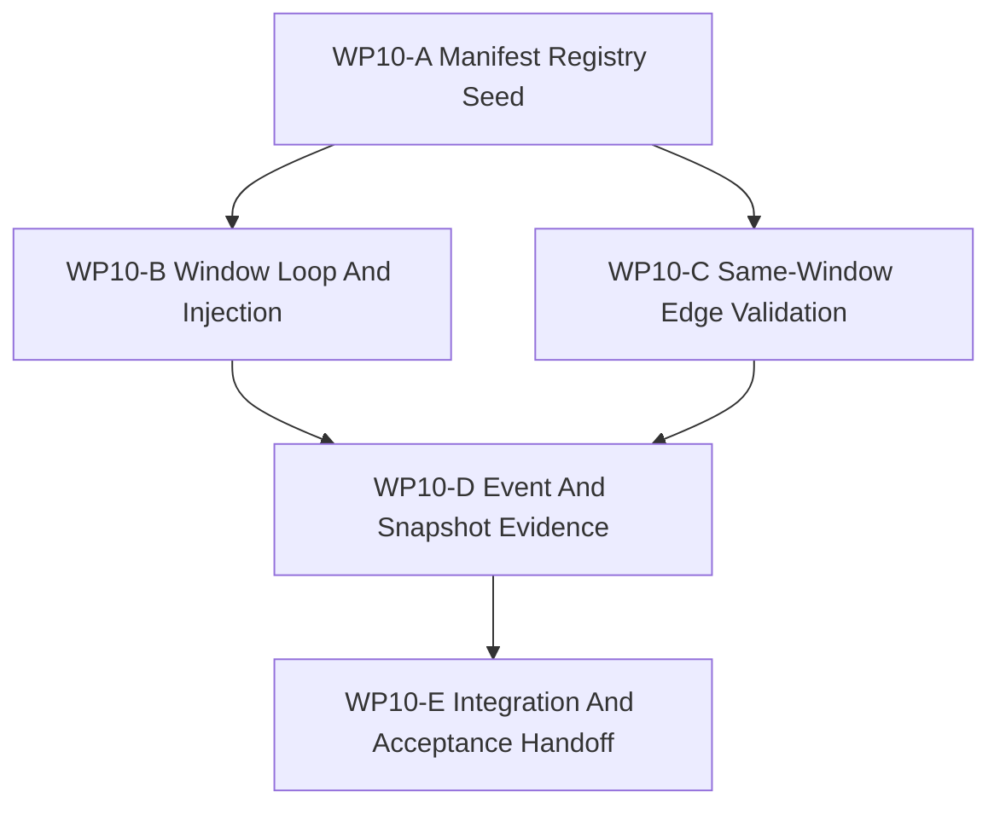

# WP10 Causal Runtime Foundation

状态：`2026-05-20` accepted / implementation mergeable。

语言版本：

- 英文主文：[causal_runtime_foundation_wp10_20260520.md](causal_runtime_foundation_wp10_20260520.md)
- 中文辅文：`causal_runtime_foundation_wp10_20260520.zh.md`

输入：

- [Post-WP9 architecture route plan](../post_wp9_architecture_route_plan_20260520.zh.md)
- [Post-WP9 gap analysis](../../review/post_wp9_gap_analysis_20260520.zh.md)
- [WP2.5 scheduler semantics freeze](../wp25_scheduler_semantics/scheduler_semantics_wp25_20260519.zh.md)
- [WP2.5 manifest/event cluster](../wp25_scheduler_semantics/wp25_manifest_event_cluster_20260519.zh.md)
- [WP2.5 state/barrier cluster](../wp25_scheduler_semantics/wp25_state_barrier_cluster_20260519.zh.md)
- [WP5 validation harness](../wp5_validation_harness/validation_harness_wp5_20260519.zh.md)
- [WP9 contract and infrastructure closure](../wp9_contract_infrastructure_closure/contract_infrastructure_closure_wp9_20260520.zh.md)
- [WP closure lane policy](../../../standards/governance/wp_closure_lane_policy.zh.md)
- [WP10 验收审查](../../review/wp10_causal_runtime_foundation_acceptance_review_20260520.zh.md)

命名说明：

- `WP10` 是 post-WP9 路线的 Phase 1：causal runtime foundation。
- 它实现路线规划中的 Track 1 项目：`POST9-T1-A` 到 `POST9-T1-E`。
- 它不是大范围 scheduler rewrite。
- 它不声明 strict clock-domain enforcement、Law 14 read-side enforcement、
  Agency Graph runtime enforcement 或 counterfactual branching。

## 1. 目的

`WP10` 把已验收的因果-时序架构规则转成第一条 code-owned runtime seam。目标是证明
一条小型 maintained engagement/observation slice 可以由 `StageNodeManifest`
registry 描述，经由显式 scheduling-window skeleton 执行，通过 same-window 合法性
验证，并带着 event/snapshot evidence 导出。

`WP10` 应回答：

1. 第一组机器可读 `StageNodeManifest` registry 放在哪里？
2. 最小 window loop 如何连接 request collection、input injection、manifest-derived
   execution、commit 与 export barriers？
3. facade-compatible cross-layer requests 如何被 admitted、deferred、rejected 或
   expired？
4. same-window edges 如何在执行前被验证？
5. 哪些 facade-visible tests 能证明 deterministic event ordering、snapshot metadata、
   barrier ids、source time 与 diagnostics ancestry？

## 2. 范围边界

`WP10` 可以：

1. 为小型 engagement/observation slice 添加 code-owned manifest registry。
2. 围绕所选 slice 添加最小 scheduling-window loop skeleton。
3. 为进入所选 window 的 facade-compatible graph inputs 添加 request injection 语义。
4. 在 schedule-construction 阶段验证 same-window edges。
5. 把 event order、snapshot version、barrier id、source time 与 diagnostics ancestry
   绑定到 facade-visible 或 binding-visible evidence。
6. 添加 focused architecture/runtime tests 和 implementation handoff note。

`WP10` 不可以：

1. 替换全局 scheduler 或重写每个 runtime system。
2. 声明完整 multi-rate scheduling 或 strict clock-domain enforcement。
3. 添加 `ActionHoldPolicy` runtime cadence support；该 DTO 属于 Phase 2。
4. 执行 Architecture Law 14 read-side boundaries。
5. 实现 Agency Graph runtime authority、role access 或 decision dispatch。
6. 晋升 backend/fidelity capabilities、capability composition 或 counterfactual/worldline
   branching。
7. 让 documentation closure 阻塞 implementation `Mergeable`；closure-lane 工作应在
   code/test gates mergeable 后跟进。

优先实现切片：

```text
P7 FireControlLaunch / P9 EffectsDamage / P10 ObservationExport
  -> recent engagement events
  -> diagnostics traces
  -> RuntimeFacade export APIs
  -> Python binding smoke and architecture checks
```

## 3. 工作包

| 工作包 | 状态 | 路线项目 | 目标 | 产出 |
|--------|------|----------|------|------|
| `WP10-A Manifest Registry Seed` | pass | `POST9-T1-A` | 为所选 slice 物化第一组 code-owned `StageNodeManifest` registry。 | [manifest registry task slice](wp10_manifest_registry_cluster_20260520.zh.md) |
| `WP10-B Window Loop And Injection` | pass | `POST9-T1-B`, `POST9-T1-C` | 添加最小 scheduling-window loop skeleton 与 cross-layer request injection 语义。 | [window loop / injection task slice](wp10_window_loop_injection_cluster_20260520.zh.md) |
| `WP10-C Same-Window Edge Validation` | pass | `POST9-T1-D`, `GAP-8` | 在 schedule construction 阶段验证合法 same-window edges。 | [same-window validation task slice](wp10_same_window_validation_cluster_20260520.zh.md) |
| `WP10-D Event And Snapshot Evidence` | pass | `POST9-T1-E` | 把 deterministic event ordering、snapshot/barrier/source-time metadata 与 diagnostics ancestry 接到 facade-visible path。 | [event/snapshot evidence task slice](wp10_event_snapshot_evidence_cluster_20260520.zh.md) |
| `WP10-E Integration And Acceptance Handoff` | pass | closure lane | 协调 shared glue、validation commands、residuals 与 acceptance handoff，避免 index/archive chores 阻塞 implementation mergeability。 | [integration handoff task slice](wp10_integration_acceptance_cluster_20260520.zh.md) |

## 4. 依赖图



并行规则：

- `WP10-A` 是第一条 seam，应先命名 registry location、node ids 与 slice boundary。
- `WP10-B` 和 `WP10-C` 可在 `WP10-A` 发布 registry API 与 fixture shape 后并行。
- `WP10-D` 应等待 loop 与 validation surfaces 足够稳定，能共享 metadata。
- `WP10-E` 串行执行，负责 shared binding glue、最终验证措辞与 closure-lane handoff。

## 5. 派发计划

| Stream | 关注点 | 写入范围规则 | 建议模型 / 思考预算 |
|--------|--------|--------------|---------------------|
| `WP10-A` | Registry location、manifest DTO/struct shape、stable node ids、slice-owned manifest fixtures。 | 负责 manifest registry files 与 architecture tests。除 compile-facing includes 外避免修改 facade export code。 | 复杂设计：`gpt-5.4`，high 或 xhigh。 |
| `WP10-B` | Minimal loop skeleton、request ingress、accepted/deferred/rejected/expired injection states、barrier sequence。 | 负责 loop/injection files 与 focused runtime tests。触碰 shared facade types 前需要协调。 | 复杂实现：`gpt-5.4`，xhigh。 |
| `WP10-C` | Schedule-construction same-window edge validation 与 failing fixtures。 | 负责 validation helper 与 tests。消费 registry API，不重定义 manifest fields。 | 中等复杂：`gpt-5.4`，high。 |
| `WP10-D` | Event ordering、snapshot version、barrier/source-time metadata、diagnostics ancestry、facade/binding-visible proof。 | 负责 facade evidence tests 与最小 metadata propagation。Broad binding refactor 留给 `WP10-E`。 | 跨层复杂：`gpt-5.4`，xhigh。 |
| `WP10-E` | Shared glue、validation command reconciliation、residual register、acceptance handoff、closure-lane checklist。 | A-D mergeable 后串行负责 shared files。 | 集成：`gpt-5.4`，medium-high。 |

Worker 规则：

- 使用项目 [Subagent 使用规范](../../../standards/governance/subagent_usage_policy.zh.md)。
- Workers 并非独自工作在代码库中；不得 revert 无关编辑或其他 worker 的编辑。
- 每个 worker 必须返回 touched files、commands run、blockers、residuals 与 integration notes。
- stream 可以在 README、archive 或 bilingual closure 完成前以 code/test evidence 报告
  `Mergeable`。这些收尾工作归 closure lane，除非发现 error-level contradiction。

## 6. 必需验收产物

任何 `WP10` gate 要报告 accepted，验收包必须包含下列产物。

| Artifact | 必需状态 | 目的 |
|----------|----------|------|
| `docs/task/simulation_architecture/wp10_causal_runtime_foundation/causal_runtime_foundation_wp10_20260520.md` | required | WP10 范围、streams 与 gate rules 的英文规范定义。 |
| `docs/task/simulation_architecture/wp10_causal_runtime_foundation/causal_runtime_foundation_wp10_20260520.zh.md` | required | 同一规范的中文辅文。 |
| `docs/task/simulation_architecture/wp10_causal_runtime_foundation/wp10_manifest_registry_cluster_20260520.md` | required | 英文 WP10-A manifest registry task slice。 |
| `docs/task/simulation_architecture/wp10_causal_runtime_foundation/wp10_manifest_registry_cluster_20260520.zh.md` | required | 中文 WP10-A companion。 |
| `docs/task/simulation_architecture/wp10_causal_runtime_foundation/wp10_window_loop_injection_cluster_20260520.md` | required | 英文 WP10-B window loop / injection task slice。 |
| `docs/task/simulation_architecture/wp10_causal_runtime_foundation/wp10_window_loop_injection_cluster_20260520.zh.md` | required | 中文 WP10-B companion。 |
| `docs/task/simulation_architecture/wp10_causal_runtime_foundation/wp10_same_window_validation_cluster_20260520.md` | required | 英文 WP10-C same-window validation task slice。 |
| `docs/task/simulation_architecture/wp10_causal_runtime_foundation/wp10_same_window_validation_cluster_20260520.zh.md` | required | 中文 WP10-C companion。 |
| `docs/task/simulation_architecture/wp10_causal_runtime_foundation/wp10_event_snapshot_evidence_cluster_20260520.md` | required | 英文 WP10-D event/snapshot evidence task slice。 |
| `docs/task/simulation_architecture/wp10_causal_runtime_foundation/wp10_event_snapshot_evidence_cluster_20260520.zh.md` | required | 中文 WP10-D companion。 |
| `docs/task/simulation_architecture/wp10_causal_runtime_foundation/wp10_integration_acceptance_cluster_20260520.md` | required | 英文 WP10-E integration handoff task slice。 |
| `docs/task/simulation_architecture/wp10_causal_runtime_foundation/wp10_integration_acceptance_cluster_20260520.zh.md` | required | 中文 WP10-E companion。 |
| `docs/task/review/wp10_causal_runtime_foundation_acceptance_review_20260520.md` | acceptance 前 required | 英文最终验收决策记录。 |
| `docs/task/review/wp10_causal_runtime_foundation_acceptance_review_20260520.zh.md` | acceptance 前 required | 中文验收辅文。 |

Artifact 规则：

- 缺失 task artifacts 时，WP10 planning incomplete。
- 缺失 acceptance review 时，WP10 保持 open，直到 implementation streams 请求验收。
- 只有代码变更但缺少 gate evidence，不能算 accepted。
- documentation-only updates 不通过 implementation gate。

## 7. 严格 Gate 规则

| Gate | 必需证据 | Pass 规则 | Fail 规则 | Blocked-environment 降级 |
|------|----------|-----------|-----------|---------------------------|
| `WP10-A Manifest Registry Seed` | review 命名 registry files、selected node ids、manifest fields 与枚举 required fields 的 architecture tests。 | 只有 code-owned registry 存在，且 maintained slice nodes 不能省略 required manifest fields，才可 pass。 | registry 只有文档、node ids 不稳定或 WP2.5 required fields 消失则 fail。 | 若 build/import blocked，只能在记录 blocker 与 next environment 后接受 static tests。 |
| `WP10-B Window Loop And Injection` | review 命名 loop/injection files，以及 barrier sequence、accepted/future-window/rejected/expired requests 的 tests。 | selected slice 跨过显式 `input_injection`、execution、`window_commit` 与 `export` boundaries 才可 pass。 | request visibility 依赖 hidden call order，或 future/expired requests 被 current window 消费则 fail。 | runtime blockers 必须保持 gate unresolved，并给出 exact command/blocker。 |
| `WP10-C Same-Window Edge Validation` | review 命名 schedule-construction validation code 与 passing/failing fixtures。 | same-window edges 必须要求 producer publish intent、consumer declaration、matching read/write sets 与 acyclic order。 | wildcard same-window visibility 或 per-tick implicit edge discovery 成为 maintained behavior 则 fail。 | 若 runtime scheduling execution blocked，但 construction fixtures 可运行，则 static validation 可 pass。 |
| `WP10-D Event And Snapshot Evidence` | review 命名 facade/binding-visible tests，证明 event order、snapshot version、barrier id、source time 与 diagnostics ancestry。 | exported evidence 可追溯到 registry 与 window barriers 才可 pass。 | events 依赖 insertion order，或 facade-visible packets 缺少 source snapshot/barrier ancestry 则 fail。 | 若 Python bindings 无法 import，保留 C++/architecture evidence，并将 binding proof 标 blocked。 |
| `WP10-E Integration And Acceptance Handoff` | review 确认 A-D 状态、exact validation commands、residual register 与 closure-lane handoff。 | implementation gates mergeable 且 acceptance review 如实记录 residuals 后 pass。 | index/README 声称 accepted runtime behavior 但无 code/test evidence 则 fail。 | closure-lane chores 可作为 warning 保留，除非暴露 broken links 或 contradictory status。 |

决策规则：

- `pass` 需要该 gate 的全部必需证据，且同一 review packet 中没有矛盾证据。
- required runtime evidence 缺失、被矛盾证据推翻或被 intention-only wording 替代时必须 `fail`。
- `blocked` 只允许用于环境限制，且必须保持 gate unresolved。

## 8. 验证命令

预期 focused validation set：

```bash
git diff --check
pytest -q tests/architecture/test_runtime_facade_layering.py tests/architecture/test_wp9_infrastructure_closure_docs.py
pytest -q tests/runtime/engagement tests/runtime/facade tests/runtime/bindings
python3 tools/maintenance/wp_doc_closure_audit.py --wp WP10
```

worker-specific tests 应更窄，并在各 cluster handoff 中命名。最终 acceptance review
应把 exact commands 标为 `passed`、`failed` 或 `blocked`；不要把 blocked runtime
import 转写成 implementation pass。

## 9. 非目标

- Full scheduler replacement。
- Strict clock-domain enforcement。
- `ActionHoldPolicy` runtime cadence support。
- Law 14 read-side enforcement。
- Agency Graph authority/runtime dispatch。
- Backend/fidelity promotion。
- Capability bundle migration。
- Counterfactual/worldline branching。
