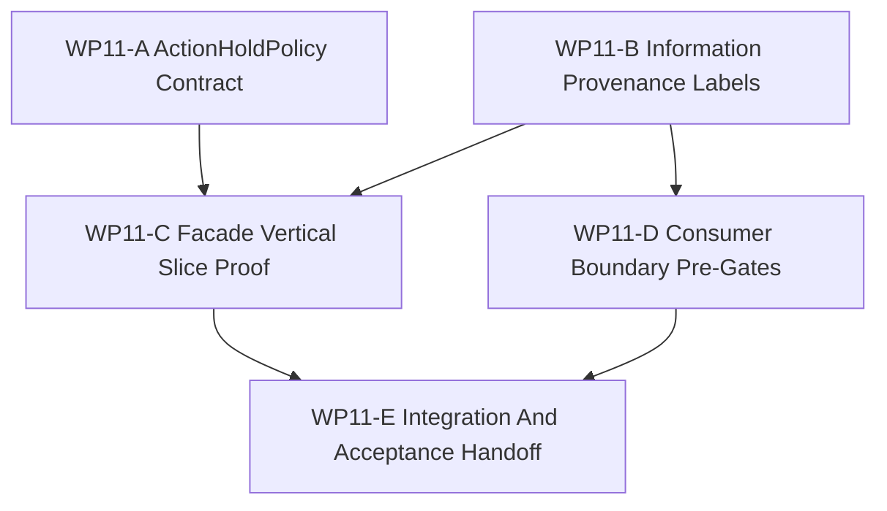

# WP11 Facade Vertical Slice And Provenance

Status: `2026-05-20` accepted / implementation mergeable.

Language:

- English canonical: `facade_vertical_slice_provenance_wp11_20260520.md`
- Chinese companion:
  [facade_vertical_slice_provenance_wp11_20260520.zh.md](facade_vertical_slice_provenance_wp11_20260520.zh.md)

Inputs:

- [Post-WP9 architecture route plan](../post_wp9_architecture_route_plan_20260520.md)
- [Post-WP9 gap analysis](../../review/post_wp9_gap_analysis_20260520.md)
- [WP10 causal runtime foundation acceptance](../../review/wp10_causal_runtime_foundation_acceptance_review_20260520.md)
- [WP10 causal runtime foundation](../wp10_causal_runtime_foundation/causal_runtime_foundation_wp10_20260520.md)
- [WP9 contract and infrastructure closure](../wp9_contract_infrastructure_closure/contract_infrastructure_closure_wp9_20260520.md)
- [WP closure lane policy](../../../standards/governance/wp_closure_lane_policy.md)
- [WP11 acceptance review](../../review/wp11_facade_vertical_slice_provenance_acceptance_review_20260520.md)

Naming note:

- `WP11` is Phase 2 of the post-WP9 route: facade vertical slice and provenance.
- It implements `POST9-T2-A`, `POST9-T2-B`, and `POST9-T2-C`.
- It consumes WP10 node ids, barrier ids, snapshot metadata, and diagnostics
  ancestry as the non-negotiable runtime seam.
- It does not claim broad facade rewrite, policy/control/physics multi-rate
  runtime, full Law 14 read-side enforcement, or Agency Graph runtime authority.

## 1. Purpose

`WP11` turns the accepted WP10 causal seam into a maintained facade-facing
vertical slice. It adds the missing `ActionHoldPolicy` contract, adds stable
information-state provenance labels to facade-visible packets and beliefs, and
proves one end-to-end consumer-visible chain:

```text
StageNodeManifest registry
  -> window/barrier/event evidence
  -> diagnostics trace
  -> facade export
  -> Python binding or maintained consumer smoke
```

The goal is to make later Law 14, Agency Graph, backend/fidelity, and
counterfactual work depend on explicit provenance rather than raw runtime access
or intention-only documentation.

## 2. Scope Boundary

`WP11` can:

1. Add a typed `ActionHoldPolicy` DTO/contract and binding-visible surface.
2. Add information-state provenance labels to maintained observation/facade
   packets and `DecisionBelief` metadata.
3. Prove one facade/binding-visible vertical slice over the WP10 seam.
4. Add pre-gates that distinguish maintained consumer paths from
   diagnostics-only truth/raw-ECS paths.
5. Add focused architecture/runtime/binding tests and an implementation
   handoff.

`WP11` cannot:

1. Implement full policy/control/physics multi-rate cadence.
2. Replace the global scheduler or expand WP10 beyond its selected seam.
3. Claim full Architecture Law 14 runtime enforcement.
4. Implement Agency Graph authority dispatch or role-based access control.
5. Rewrite all facade APIs.
6. Promote backend/fidelity profiles or capability composition.
7. Start counterfactual/worldline branching.

Preferred implementation slice:

```text
WP10 P7/P9/P10 node ids and barriers
  -> ObservationBatchPacket / EngagementEventPacket / DiagnosticsTrace
  -> InformationStateSource / DecisionBelief provenance
  -> ActionHoldPolicy DTO and binding smoke
  -> maintained consumer proof without direct World Truth
```

## 3. Work Packages

| Work package | Status | Route item | Goal | Output |
|--------------|--------|------------|------|--------|
| `WP11-A ActionHoldPolicy Contract` | pass | `POST9-T2-A`, `GAP-1` | Add the typed hold/interpolation/expiry/drop contract without claiming runtime cadence support. | [ActionHoldPolicy task slice](wp11_action_hold_policy_cluster_20260520.md) |
| `WP11-B Information Provenance Labels` | pass | `POST9-T2-B`, `GAP-4` | Add stable information-state provenance labels to maintained facade packets and beliefs. | [information provenance task slice](wp11_information_provenance_labels_cluster_20260520.md) |
| `WP11-C Facade Vertical Slice Proof` | pass | `POST9-T2-C` | Prove the WP10 seam is visible through one maintained facade/binding chain. | [vertical slice proof task slice](wp11_facade_vertical_slice_proof_cluster_20260520.md) |
| `WP11-D Consumer Boundary Pre-Gates` | pass | `GAP-5` precursor | Add pre-enforcement gates that keep maintained consumers on packet/belief inputs and label truth/raw-ECS paths diagnostics-only. | [consumer boundary pre-gates task slice](wp11_consumer_boundary_pregates_cluster_20260520.md) |
| `WP11-E Integration And Acceptance Handoff` | pass | closure lane | Reconcile shared glue, validation commands, residuals, and acceptance handoff without blocking implementation mergeability on index/archive chores. | [integration handoff task slice](wp11_integration_acceptance_cluster_20260520.md) |

## 4. Dependency Map



Parallel rule:

- `WP11-A` and `WP11-B` may run in parallel because their write scopes should be
  contract/binding and packet/provenance focused respectively.
- `WP11-C` waits until the policy contract and provenance vocabulary are stable
  enough to reference.
- `WP11-D` may begin after `WP11-B` publishes the maintained/diagnostics label
  vocabulary.
- `WP11-E` is serial integration after A-D are mergeable.

## 5. Dispatch Plan

| Stream | Main concern | Write-scope rule | Suggested model / reasoning |
|--------|--------------|------------------|-----------------------------|
| `WP11-A` | `ActionHoldPolicy` DTO shape, defaults, binding surface, guard tests. | Own policy/runtime contract files and binding tests. Do not implement cadence execution. | Medium-complex contract work: `gpt-5.4`, high. |
| `WP11-B` | Provenance label vocabulary and propagation on maintained facade packets and beliefs. | Own provenance contract fields/helpers and focused facade/binding tests. Coordinate before touching shared DTOs. | Complex cross-layer design: `gpt-5.4`, xhigh. |
| `WP11-C` | End-to-end chain from WP10 manifest/barrier/event evidence to facade/binding consumer proof. | Own vertical-slice runtime tests and minimal glue. Avoid broad facade rewrite. | Complex integration: `gpt-5.4`, xhigh. |
| `WP11-D` | Pre-gates for maintained consumers vs diagnostics-only truth/raw-ECS access. | Own architecture guard tests and consumer fixtures. Do not claim full Law 14 enforcement. | Medium-complex guard work: `gpt-5.4`, high. |
| `WP11-E` | Shared glue, validation reconciliation, residual register, acceptance handoff. | Serial owner after A-D are mergeable. | Light integration/closure: mini model with xhigh is acceptable, or `gpt-5.4` medium if code conflicts remain. |

Worker rule:

- Use the project [Subagent Usage Policy](../../../standards/governance/subagent_usage_policy.md).
- Workers are not alone in the codebase; they must not revert unrelated edits or
  edits from other workers.
- Each worker must return touched files, commands run, blockers, residuals, and
  integration notes.
- A stream may be reported `Mergeable` with code/test evidence before README,
  archive, or bilingual closure is complete.

## 6. Required Acceptance Artifacts

No `WP11` gate may be reported as accepted unless the acceptance packet includes
all required artifacts below.

| Artifact | Required status | Purpose |
|----------|-----------------|---------|
| `docs/task/simulation_architecture/wp11_facade_vertical_slice_provenance/facade_vertical_slice_provenance_wp11_20260520.md` | required | Normative English definition of WP11 scope, streams, and gate rules. |
| `docs/task/simulation_architecture/wp11_facade_vertical_slice_provenance/facade_vertical_slice_provenance_wp11_20260520.zh.md` | required | Chinese companion for the same normative rules. |
| `docs/task/simulation_architecture/wp11_facade_vertical_slice_provenance/wp11_action_hold_policy_cluster_20260520.md` | required | English WP11-A ActionHoldPolicy task slice. |
| `docs/task/simulation_architecture/wp11_facade_vertical_slice_provenance/wp11_action_hold_policy_cluster_20260520.zh.md` | required | Chinese WP11-A companion. |
| `docs/task/simulation_architecture/wp11_facade_vertical_slice_provenance/wp11_information_provenance_labels_cluster_20260520.md` | required | English WP11-B provenance task slice. |
| `docs/task/simulation_architecture/wp11_facade_vertical_slice_provenance/wp11_information_provenance_labels_cluster_20260520.zh.md` | required | Chinese WP11-B companion. |
| `docs/task/simulation_architecture/wp11_facade_vertical_slice_provenance/wp11_facade_vertical_slice_proof_cluster_20260520.md` | required | English WP11-C vertical slice proof task slice. |
| `docs/task/simulation_architecture/wp11_facade_vertical_slice_provenance/wp11_facade_vertical_slice_proof_cluster_20260520.zh.md` | required | Chinese WP11-C companion. |
| `docs/task/simulation_architecture/wp11_facade_vertical_slice_provenance/wp11_consumer_boundary_pregates_cluster_20260520.md` | required | English WP11-D consumer boundary pre-gates task slice. |
| `docs/task/simulation_architecture/wp11_facade_vertical_slice_provenance/wp11_consumer_boundary_pregates_cluster_20260520.zh.md` | required | Chinese WP11-D companion. |
| `docs/task/simulation_architecture/wp11_facade_vertical_slice_provenance/wp11_integration_acceptance_cluster_20260520.md` | required | English WP11-E integration handoff task slice. |
| `docs/task/simulation_architecture/wp11_facade_vertical_slice_provenance/wp11_integration_acceptance_cluster_20260520.zh.md` | required | Chinese WP11-E companion. |
| `docs/task/review/wp11_facade_vertical_slice_provenance_acceptance_review_20260520.md` | required before acceptance | English final acceptance decision record. |
| `docs/task/review/wp11_facade_vertical_slice_provenance_acceptance_review_20260520.zh.md` | required before acceptance | Chinese acceptance companion. |

Artifact rule:

- Missing task artifacts keep WP11 planning incomplete.
- Missing acceptance review keeps WP11 open, not failed, until implementation
  streams request acceptance.
- Documentation-only updates do not pass an implementation gate.

## 7. Strict Gate Rules

| Gate | Required evidence | Pass rule | Fail rule |
|------|-------------------|-----------|-----------|
| `WP11-A ActionHoldPolicy Contract` | Contract fields, default semantics, binding smoke, and tests. | Pass only if the typed contract exists and cannot be confused with runtime cadence execution. | Fail if the work claims maintained multi-rate policy/control/physics behavior without a runtime cadence slice. |
| `WP11-B Information Provenance Labels` | Stable vocabulary, packet/belief fields, propagation tests, and binding visibility. | Pass only if maintained facade exports and maintained beliefs carry non-empty provenance labels. | Fail if maintained outputs can be unlabeled or if World Truth/raw ECS is marked maintained without a declared transformation. |
| `WP11-C Facade Vertical Slice Proof` | End-to-end test references WP10 node ids, barrier ids, event ancestry, facade exports, and binding/consumer visibility. | Pass only if the same chain is visible across runtime and consumer surfaces. | Fail if the chain depends on hidden insertion order, raw runtime access, or doc-only evidence. |
| `WP11-D Consumer Boundary Pre-Gates` | Static or runtime guard tests for maintained vs diagnostics-only consumers. | Pass only if the gates make truth/raw-ECS consumer paths explicit and diagnostics-only. | Fail if it claims complete Law 14 enforcement or blocks legitimate diagnostics fixtures without labels. |
| `WP11-E Integration And Acceptance Handoff` | A-D status, exact validation commands, residual register, and acceptance review. | Pass only after implementation gates are mergeable and residuals are recorded honestly. | Fail if index/README text claims broader runtime behavior than A-D prove. |

## 8. Validation Commands

Expected focused validation set:

```bash
git diff --check
cmake --build build-workshop -j4
CMO_BUILD_DIR=build-workshop pytest -q tests/runtime/bindings tests/runtime/facade tests/runtime/engagement
CMO_BUILD_DIR=build-workshop pytest -q tests/architecture
python3 tools/maintenance/wp_doc_closure_audit.py --wp WP11
```

Worker-specific tests should be narrower and named in each cluster handoff.
The final acceptance review should report exact commands as `passed`, `failed`,
or `blocked`.

## 9. Non-Goals

- Full scheduler replacement.
- Maintained multi-rate policy/control/physics cadence.
- Full Architecture Law 14 enforcement.
- Agency Graph authority/runtime dispatch.
- Broad facade API rewrite.
- Backend/fidelity promotion.
- Capability bundle migration.
- Counterfactual/worldline branching.
