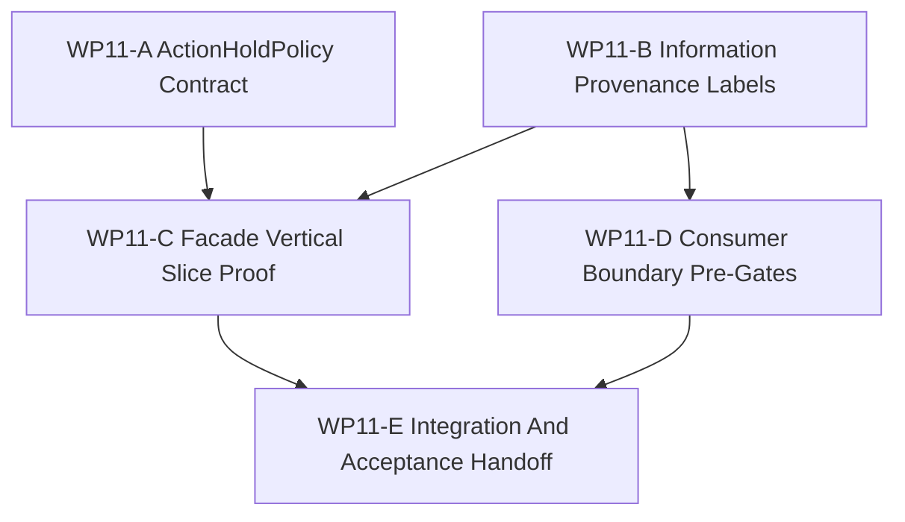

# WP11 Facade Vertical Slice And Provenance

状态：`2026-05-20` accepted / implementation mergeable。

语言：

- 英文主文：[facade_vertical_slice_provenance_wp11_20260520.md](facade_vertical_slice_provenance_wp11_20260520.md)
- 中文辅文：`facade_vertical_slice_provenance_wp11_20260520.zh.md`

输入：

- [Post-WP9 architecture route plan](../post_wp9_architecture_route_plan_20260520.zh.md)
- [Post-WP9 gap analysis](../../review/post_wp9_gap_analysis_20260520.zh.md)
- [WP10 causal runtime foundation acceptance](../../review/wp10_causal_runtime_foundation_acceptance_review_20260520.zh.md)
- [WP10 causal runtime foundation](../wp10_causal_runtime_foundation/causal_runtime_foundation_wp10_20260520.zh.md)
- [WP9 contract and infrastructure closure](../wp9_contract_infrastructure_closure/contract_infrastructure_closure_wp9_20260520.zh.md)
- [WP closure lane policy](../../../standards/governance/wp_closure_lane_policy.zh.md)
- [WP11 验收审查](../../review/wp11_facade_vertical_slice_provenance_acceptance_review_20260520.zh.md)

命名说明：

- `WP11` 是 post-WP9 路线的 Phase 2：facade vertical slice and provenance。
- 它实现 `POST9-T2-A`、`POST9-T2-B` 与 `POST9-T2-C`。
- 它消费 WP10 的 node ids、barrier ids、snapshot metadata 与 diagnostics
  ancestry，并把这些当作不可绕过的 runtime seam。
- 它不宣称 broad facade rewrite、policy/control/physics multi-rate runtime、
  完整 Law 14 read-side enforcement 或 Agency Graph runtime authority。

## 1. 目的

`WP11` 把已验收的 WP10 causal seam 推进为 maintained facade-facing vertical
slice。它补上缺失的 `ActionHoldPolicy` contract，给 facade-visible packets 与
beliefs 添加稳定 information-state provenance labels，并证明一条端到端 consumer-visible
链路：

```text
StageNodeManifest registry
  -> window/barrier/event evidence
  -> diagnostics trace
  -> facade export
  -> Python binding or maintained consumer smoke
```

目标是让后续 Law 14、Agency Graph、backend/fidelity 与 counterfactual 工作依赖显式
provenance，而不是 raw runtime access 或意图式文档。

## 2. 范围边界

`WP11` 可以：

1. 添加 typed `ActionHoldPolicy` DTO/contract 与 binding-visible surface。
2. 给 maintained observation/facade packets 与 `DecisionBelief` metadata 添加
   information-state provenance labels。
3. 在 WP10 seam 上证明一条 facade/binding-visible vertical slice。
4. 添加区分 maintained consumer paths 与 diagnostics-only truth/raw-ECS paths 的
   pre-gates。
5. 添加聚焦 architecture/runtime/binding tests 与 implementation handoff。

`WP11` 不可以：

1. 实现完整 policy/control/physics multi-rate cadence。
2. 替换 global scheduler 或扩展 WP10 选定 seam 之外的运行时。
3. 宣称完整 Architecture Law 14 runtime enforcement。
4. 实现 Agency Graph authority dispatch 或 role-based access control。
5. 重写所有 facade APIs。
6. 晋升 backend/fidelity profiles 或 capability composition。
7. 开始 counterfactual/worldline branching。

首选实现 slice：

```text
WP10 P7/P9/P10 node ids and barriers
  -> ObservationBatchPacket / EngagementEventPacket / DiagnosticsTrace
  -> InformationStateSource / DecisionBelief provenance
  -> ActionHoldPolicy DTO and binding smoke
  -> maintained consumer proof without direct World Truth
```

## 3. 工作包

| 工作包 | 状态 | 路线项目 | 目标 | 产出 |
|--------|------|----------|------|------|
| `WP11-A ActionHoldPolicy Contract` | pass | `POST9-T2-A`, `GAP-1` | 添加 typed hold/interpolation/expiry/drop contract，但不宣称 runtime cadence support。 | [ActionHoldPolicy task slice](wp11_action_hold_policy_cluster_20260520.zh.md) |
| `WP11-B Information Provenance Labels` | pass | `POST9-T2-B`, `GAP-4` | 给 maintained facade packets 与 beliefs 添加稳定 information-state provenance labels。 | [information provenance task slice](wp11_information_provenance_labels_cluster_20260520.zh.md) |
| `WP11-C Facade Vertical Slice Proof` | pass | `POST9-T2-C` | 证明 WP10 seam 可通过一条 maintained facade/binding chain 被看见。 | [vertical slice proof task slice](wp11_facade_vertical_slice_proof_cluster_20260520.zh.md) |
| `WP11-D Consumer Boundary Pre-Gates` | pass | `GAP-5` precursor | 添加 pre-enforcement gates，让 maintained consumers 使用 packet/belief inputs，并把 truth/raw-ECS paths 标记为 diagnostics-only。 | [consumer boundary pre-gates task slice](wp11_consumer_boundary_pregates_cluster_20260520.zh.md) |
| `WP11-E Integration And Acceptance Handoff` | pass | closure lane | 协调 shared glue、validation commands、residuals 与 acceptance handoff，避免 index/archive chores 阻塞 implementation mergeability。 | [integration handoff task slice](wp11_integration_acceptance_cluster_20260520.zh.md) |

## 4. 依赖图



并行规则：

- `WP11-A` 与 `WP11-B` 可以并行，因为它们的写入范围应分别集中于 contract/binding 与
  packet/provenance。
- `WP11-C` 等待 policy contract 与 provenance vocabulary 稳定到可引用。
- `WP11-D` 可在 `WP11-B` 发布 maintained/diagnostics label vocabulary 后开始。
- `WP11-E` 在 A-D mergeable 后串行集成。

## 5. 派发计划

| Stream | 主要关注 | 写入范围规则 | 建议模型 / 思考预算 |
|--------|----------|--------------|---------------------|
| `WP11-A` | `ActionHoldPolicy` DTO shape、defaults、binding surface、guard tests。 | 负责 policy/runtime contract files 与 binding tests。不实现 cadence execution。 | 中等复杂 contract work：`gpt-5.4`，high。 |
| `WP11-B` | Provenance label vocabulary 以及 maintained facade packets/beliefs 上的 propagation。 | 负责 provenance contract fields/helpers 与聚焦 facade/binding tests。触碰 shared DTOs 前需要协调。 | 跨层复杂设计：`gpt-5.4`，xhigh。 |
| `WP11-C` | 从 WP10 manifest/barrier/event evidence 到 facade/binding consumer proof 的端到端链。 | 负责 vertical-slice runtime tests 与最小 glue。避免 broad facade rewrite。 | 复杂集成：`gpt-5.4`，xhigh。 |
| `WP11-D` | Maintained consumers 与 diagnostics-only truth/raw-ECS access 的 pre-gates。 | 负责 architecture guard tests 与 consumer fixtures。不宣称完整 Law 14 enforcement。 | 中等复杂 guard work：`gpt-5.4`，high。 |
| `WP11-E` | Shared glue、validation reconciliation、residual register、acceptance handoff。 | A-D mergeable 后串行负责。 | 轻量集成/closure：mini model with xhigh 可接受；若仍有代码冲突，用 `gpt-5.4` medium。 |

## 6. 必需验收产物

任何 `WP11` gate 要报告 accepted，验收包必须包含下列产物。

| Artifact | Required status | Purpose |
|----------|-----------------|---------|
| `docs/task/simulation_architecture/wp11_facade_vertical_slice_provenance/facade_vertical_slice_provenance_wp11_20260520.md` | required | WP11 范围、streams 与 gate rules 的英文规范定义。 |
| `docs/task/simulation_architecture/wp11_facade_vertical_slice_provenance/facade_vertical_slice_provenance_wp11_20260520.zh.md` | required | 同一规范的中文辅文。 |
| `docs/task/simulation_architecture/wp11_facade_vertical_slice_provenance/wp11_action_hold_policy_cluster_20260520.md` | required | 英文 WP11-A ActionHoldPolicy task slice。 |
| `docs/task/simulation_architecture/wp11_facade_vertical_slice_provenance/wp11_action_hold_policy_cluster_20260520.zh.md` | required | 中文 WP11-A companion。 |
| `docs/task/simulation_architecture/wp11_facade_vertical_slice_provenance/wp11_information_provenance_labels_cluster_20260520.md` | required | 英文 WP11-B provenance task slice。 |
| `docs/task/simulation_architecture/wp11_facade_vertical_slice_provenance/wp11_information_provenance_labels_cluster_20260520.zh.md` | required | 中文 WP11-B companion。 |
| `docs/task/simulation_architecture/wp11_facade_vertical_slice_provenance/wp11_facade_vertical_slice_proof_cluster_20260520.md` | required | 英文 WP11-C vertical slice proof task slice。 |
| `docs/task/simulation_architecture/wp11_facade_vertical_slice_provenance/wp11_facade_vertical_slice_proof_cluster_20260520.zh.md` | required | 中文 WP11-C companion。 |
| `docs/task/simulation_architecture/wp11_facade_vertical_slice_provenance/wp11_consumer_boundary_pregates_cluster_20260520.md` | required | 英文 WP11-D consumer boundary pre-gates task slice。 |
| `docs/task/simulation_architecture/wp11_facade_vertical_slice_provenance/wp11_consumer_boundary_pregates_cluster_20260520.zh.md` | required | 中文 WP11-D companion。 |
| `docs/task/simulation_architecture/wp11_facade_vertical_slice_provenance/wp11_integration_acceptance_cluster_20260520.md` | required | 英文 WP11-E integration handoff task slice。 |
| `docs/task/simulation_architecture/wp11_facade_vertical_slice_provenance/wp11_integration_acceptance_cluster_20260520.zh.md` | required | 中文 WP11-E companion。 |
| `docs/task/review/wp11_facade_vertical_slice_provenance_acceptance_review_20260520.md` | acceptance 前 required | 英文最终验收决策记录。 |
| `docs/task/review/wp11_facade_vertical_slice_provenance_acceptance_review_20260520.zh.md` | acceptance 前 required | 中文验收辅文。 |

## 7. 严格 Gate 规则

| Gate | Required evidence | Pass rule | Fail rule |
|------|-------------------|-----------|-----------|
| `WP11-A ActionHoldPolicy Contract` | Contract fields、default semantics、binding smoke 与 tests。 | typed contract 存在，且不会与 runtime cadence execution 混淆时才可 pass。 | 若未实现 runtime cadence slice 却宣称 maintained multi-rate policy/control/physics behavior，则 fail。 |
| `WP11-B Information Provenance Labels` | Stable vocabulary、packet/belief fields、propagation tests 与 binding visibility。 | maintained facade exports 与 maintained beliefs 携带非空 provenance labels 时才可 pass。 | maintained outputs 可无标签，或 World Truth/raw ECS 未经声明 transformation 就标为 maintained，则 fail。 |
| `WP11-C Facade Vertical Slice Proof` | End-to-end test 引用 WP10 node ids、barrier ids、event ancestry、facade exports 与 binding/consumer visibility。 | 同一链路跨 runtime 与 consumer surfaces 可见时才可 pass。 | 链路依赖 hidden insertion order、raw runtime access 或 doc-only evidence，则 fail。 |
| `WP11-D Consumer Boundary Pre-Gates` | Maintained vs diagnostics-only consumers 的 static/runtime guard tests。 | gates 能让 truth/raw-ECS consumer paths 显式且 diagnostics-only 时才可 pass。 | 宣称完整 Law 14 enforcement，或无标签阻断合法 diagnostics fixtures，则 fail。 |
| `WP11-E Integration And Acceptance Handoff` | A-D 状态、exact validation commands、residual register 与 acceptance review。 | implementation gates mergeable 且 residuals 被诚实记录后才可 pass。 | index/README 声称超出 A-D 证明范围的 runtime behavior，则 fail。 |

## 8. 验证命令

预期聚焦验证集：

```bash
git diff --check
cmake --build build-workshop -j4
CMO_BUILD_DIR=build-workshop pytest -q tests/runtime/bindings tests/runtime/facade tests/runtime/engagement
CMO_BUILD_DIR=build-workshop pytest -q tests/architecture
python3 tools/maintenance/wp_doc_closure_audit.py --wp WP11
```

Worker-specific tests 应更窄，并在各 cluster handoff 中命名。最终验收审查应把命令记录为
`passed`、`failed` 或 `blocked`。
