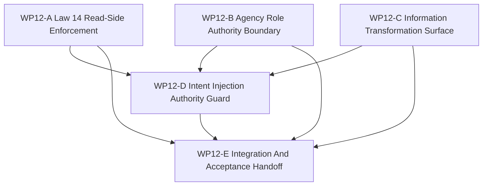

# WP12 Information And Agency Enforcement

Status: `2026-05-20` accepted / implementation mergeable.

Language:

- English canonical: `information_agency_enforcement_wp12_20260520.md`
- Chinese companion:
  [information_agency_enforcement_wp12_20260520.zh.md](information_agency_enforcement_wp12_20260520.zh.md)

Inputs:

- [Post-WP9 architecture route plan](../post_wp9_architecture_route_plan_20260520.md)
- [Post-WP9 gap analysis](../../review/post_wp9_gap_analysis_20260520.md)
- [WP11 facade vertical slice and provenance acceptance](../../review/wp11_facade_vertical_slice_provenance_acceptance_review_20260520.md)
- [WP11 facade vertical slice and provenance](../wp11_facade_vertical_slice_provenance/facade_vertical_slice_provenance_wp11_20260520.md)
- [Simulation system architecture design](../../../plan/architecture/simulation_system_architecture_design.md)
- [WP closure lane policy](../../../standards/governance/wp_closure_lane_policy.md)

Naming note:

- `WP12` is Phase 3 of the post-WP9 route: information and agency enforcement.
- It implements the deferred `GAP-5`, `GAP-6`, and `GAP-7` enforcement
  direction using the WP10 causal seam and WP11 provenance/pre-gate vocabulary.
- It must not jump to backend/fidelity expansion, capability composition, or
  counterfactual/worldline work.

## 1. Purpose

`WP12` turns the accepted information-state vocabulary and consumer pre-gates
into enforceable architecture boundaries. It should make maintained decision
paths prove what they are allowed to read, what role authority they act under,
and which explicit information transformation produced each maintained packet,
belief, or intent.

The target chain is:

```text
InformationStateSource labels
  -> maintained read-side guard
  -> AgentRole authority and information-source check
  -> explicit information transformation registry/evidence
  -> authorized ActionIntentPacket / CoordinationIntentPacket injection
```

`WP12` is an implementation phase. Planning documents alone do not pass a gate.

## 2. Scope Boundary

`WP12` can:

1. Promote the WP11 consumer pre-gates toward maintained Architecture Law 14
   read-side enforcement.
2. Validate `AgentRole` authority scope, information-state source, decision
   model reference, and action interface before maintained actions or
   coordination intents are accepted.
3. Surface the information transformation chain:
   `World Truth -> Sensed State -> Track State -> Shared Tactical Picture ->
   Agent Observation -> Decision Belief -> ActionIntentPacket`.
4. Require maintained decision and intent paths to carry provenance, source ids,
   authority metadata, and facade-compatible injection evidence.
5. Add focused architecture/runtime/Python tests that distinguish maintained,
   diagnostics-only, compatibility-only, and rejected paths.

`WP12` cannot:

1. Implement the full Agency Graph runtime or decision-model dispatcher.
2. Claim role-based access control for every future information producer.
3. Rewrite sensor, track, data-link, or policy systems broadly.
4. Implement backend/fidelity expansion, exact GPU promotion, resident-state
   promotion, or multi-fidelity execution.
5. Start capability composition or counterfactual/worldline branching.
6. Treat diagnostics-only truth access as maintained behavior.

Preferred first enforcement slice:

```text
WP11 ObservationBatchPacket / DecisionBelief provenance
  -> maintained consumer guard
  -> AgentRole role/source/action-interface validator
  -> DecisionBelief -> ActionIntentPacket guard
  -> facade-compatible injection evidence
```

## 3. Work Packages

| Work package | Status | Route item | Goal | Output |
|--------------|--------|------------|------|--------|
| `WP12-A Law 14 Read-Side Enforcement` | pass | `GAP-5` | Move maintained consumers from pre-gates to enforceable packet/belief read-side checks while preserving explicit diagnostics-only truth paths. | [Law 14 read-side task slice](wp12_law14_read_side_enforcement_cluster_20260520.md) |
| `WP12-B Agency Role Authority Boundary` | pass | `GAP-6` | Validate maintained `AgentRole` authority, information source, decision-model reference, and action-interface declarations before they authorize outputs. | [agency authority task slice](wp12_agency_role_authority_cluster_20260520.md) |
| `WP12-C Information Transformation Surface` | pass | `GAP-7` | Add machine-checkable transformation declarations/evidence for the information-state chain without rewriting every producer. | [information transformation task slice](wp12_information_transformation_surface_cluster_20260520.md) |
| `WP12-D Intent Injection Authority Guard` | pass | `GAP-5`, `GAP-6`, `GAP-7` | Ensure maintained `DecisionBelief -> ActionIntentPacket` / `CoordinationIntentPacket` paths carry provenance and authority metadata before facade-compatible injection. | [intent injection guard task slice](wp12_intent_injection_authority_guard_cluster_20260520.md) |
| `WP12-E Integration And Acceptance Handoff` | pass | closure lane | Reconcile shared validators, validation commands, residuals, review/index handoff, and bilingual closure after A-D are mergeable. | [integration handoff task slice](wp12_integration_acceptance_cluster_20260520.md) |

## 4. Dependency Map



Parallel rule:

- `WP12-A`, `WP12-B`, and `WP12-C` may start in parallel if their write scopes
  remain disjoint.
- `WP12-D` should wait until at least the A/B validator vocabulary and the C
  transformation names are stable.
- `WP12-E` is serial integration and should not block A-D implementation
  mergeability on README/archive/bilingual chores.

## 5. Dispatch Plan

| Stream | Main concern | Write-scope rule | Suggested model / reasoning |
|--------|--------------|------------------|-----------------------------|
| `WP12-A` | Maintained read-side enforcement for `ObservationPacket` / `DecisionBelief` consumers, diagnostics-only allowlists, and fail-closed fixtures. | Own focused consumer guard tests, agent-shim/read-side validators, and allowlist updates. Do not block all raw ECS reads globally. | Medium-complex enforcement: `gpt-5.4`, high. |
| `WP12-B` | `AgentRole` authority-scope, information-source, decision-model, and action-interface validation. | Own role/authority contract validators and tests. Do not implement full Agency Graph runtime dispatch. | Complex cross-layer authority design: `gpt-5.4`, xhigh. |
| `WP12-C` | Information transformation declarations and evidence vocabulary for the six-layer chain. | Own transformation registry/helpers and architecture tests. Do not rewrite every sensor/track/data-link producer. | Complex semantic surface design: `gpt-5.4`, xhigh. |
| `WP12-D` | Authorized decision/intent path from `DecisionBelief` to facade-compatible action or coordination injection. | Own intent guard integration tests and minimal glue across A-C. Do not create a second injection path. | Complex integration: `gpt-5.4`, xhigh. |
| `WP12-E` | Shared validation, residual register, acceptance review preparation, README/index sync, and bilingual handoff. | Serial owner after A-D are mergeable. | Light closure: mini model with xhigh, or `gpt-5.4` medium if code conflicts remain. |

Worker rule:

- Use the project [Subagent Usage Policy](../../../standards/governance/subagent_usage_policy.md).
- Workers are not alone in the codebase; they must not revert unrelated edits or
  edits from other workers.
- Each worker must return touched files, commands run, blockers, residuals, and
  integration notes.
- A stream may be reported `Mergeable` with code/test evidence before README,
  archive, acceptance, or bilingual closure is complete.

## 6. Required Acceptance Artifacts

No `WP12` gate may be reported as accepted unless the acceptance packet includes
all required artifacts below.

| Artifact | Required status | Purpose |
|----------|-----------------|---------|
| `docs/task/simulation_architecture/wp12_information_agency_enforcement/information_agency_enforcement_wp12_20260520.md` | required | Normative English definition of WP12 scope, streams, and gate rules. |
| `docs/task/simulation_architecture/wp12_information_agency_enforcement/information_agency_enforcement_wp12_20260520.zh.md` | required | Chinese companion for the same normative rules. |
| `docs/task/simulation_architecture/wp12_information_agency_enforcement/wp12_law14_read_side_enforcement_cluster_20260520.md` | required | English WP12-A Law 14 read-side task slice. |
| `docs/task/simulation_architecture/wp12_information_agency_enforcement/wp12_law14_read_side_enforcement_cluster_20260520.zh.md` | required | Chinese WP12-A companion. |
| `docs/task/simulation_architecture/wp12_information_agency_enforcement/wp12_agency_role_authority_cluster_20260520.md` | required | English WP12-B agency authority task slice. |
| `docs/task/simulation_architecture/wp12_information_agency_enforcement/wp12_agency_role_authority_cluster_20260520.zh.md` | required | Chinese WP12-B companion. |
| `docs/task/simulation_architecture/wp12_information_agency_enforcement/wp12_information_transformation_surface_cluster_20260520.md` | required | English WP12-C information transformation task slice. |
| `docs/task/simulation_architecture/wp12_information_agency_enforcement/wp12_information_transformation_surface_cluster_20260520.zh.md` | required | Chinese WP12-C companion. |
| `docs/task/simulation_architecture/wp12_information_agency_enforcement/wp12_intent_injection_authority_guard_cluster_20260520.md` | required | English WP12-D intent injection guard task slice. |
| `docs/task/simulation_architecture/wp12_information_agency_enforcement/wp12_intent_injection_authority_guard_cluster_20260520.zh.md` | required | Chinese WP12-D companion. |
| `docs/task/simulation_architecture/wp12_information_agency_enforcement/wp12_integration_acceptance_cluster_20260520.md` | required | English WP12-E integration handoff task slice. |
| `docs/task/simulation_architecture/wp12_information_agency_enforcement/wp12_integration_acceptance_cluster_20260520.zh.md` | required | Chinese WP12-E companion. |
| `docs/task/review/wp12_information_agency_enforcement_acceptance_review_20260520.md` | required before acceptance | English final acceptance decision record. |
| `docs/task/review/wp12_information_agency_enforcement_acceptance_review_20260520.zh.md` | required before acceptance | Chinese acceptance companion. |

Artifact rule:

- Missing task artifacts keep WP12 planning incomplete.
- Acceptance review is now published as [WP12 acceptance review](../../review/wp12_information_agency_enforcement_acceptance_review_20260520.md).
- Documentation-only updates do not pass an implementation gate.

## 7. Strict Gate Rules

| Gate | Required evidence | Pass rule | Fail rule |
|------|-------------------|-----------|-----------|
| `WP12-A Law 14 Read-Side Enforcement` | Static or runtime guard tests over maintained consumers, explicit diagnostics allowlists, and provenance-labeled packet/belief fixtures. | Pass only if maintained decision paths cannot silently consume World Truth/raw ECS in the focused slice. | Fail if diagnostics-only truth access is mislabeled maintained or if the gate claims repository-wide Law 14 coverage without evidence. |
| `WP12-B Agency Role Authority Boundary` | `AgentRole` validation helpers, authority/information/action-interface tests, and rejected invalid-role fixtures. | Pass only if maintained actions require a valid role declaration before authorization. | Fail if role fields remain decorative or if full Agency Graph dispatch is claimed without implementation. |
| `WP12-C Information Transformation Surface` | Transformation names, source/target labels, registry or helper surface, and tests proving maintained packets/beliefs name their transformation step. | Pass only if at least the selected slice can machine-check source layer, target layer, and transformation evidence. | Fail if transformations remain prose-only or if World Truth is transformed straight into maintained action intent without intermediate evidence. |
| `WP12-D Intent Injection Authority Guard` | Integration tests for belief-to-intent or coordination paths carrying provenance, source id, role authority, validity/effective-time metadata, and facade-compatible injection. | Pass only if unauthorized or unlabeled intents fail closed in the focused slice. | Fail if a new raw command/control path bypasses the WP10/WP11 facade seam. |
| `WP12-E Integration And Acceptance Handoff` | A-D status, exact validation commands, residual register, acceptance-review draft, and route/README sync. | Pass only after implementation gates are mergeable and residuals are recorded honestly. | Fail if closure text claims backend/fidelity, full Agency Graph runtime, or full repository-wide Law 14 enforcement. |

## 8. Validation Commands

Expected focused validation set:

```bash
git diff --check
cmake --build build-workshop -j4
CMO_BUILD_DIR=build-workshop pytest -q tests/architecture/policy_execution/test_belief_and_read_side_boundaries.py tests/runtime/test_agent_shim.py
CMO_BUILD_DIR=build-workshop pytest -q tests/runtime/mission/test_policy_contract_shape.py tests/runtime/bindings/test_bindings_runtime_dto_surface.py
CMO_BUILD_DIR=build-workshop pytest -q tests/runtime/facade tests/runtime/bindings
python3 tools/maintenance/wp_doc_closure_audit.py --wp WP12
```

Worker-specific tests should be narrower and named in each cluster handoff.
The final acceptance review should report exact commands as `passed`, `failed`,
or `blocked`.

## 9. Non-Goals

- Backend/fidelity expansion or profile promotion.
- Full Agency Graph runtime dispatch.
- Global static ban on all raw ECS reads.
- Sensor/track/data-link rewrite.
- Multi-rate policy/control/physics cadence.
- Capability bundle migration.
- Counterfactual/worldline branching.
