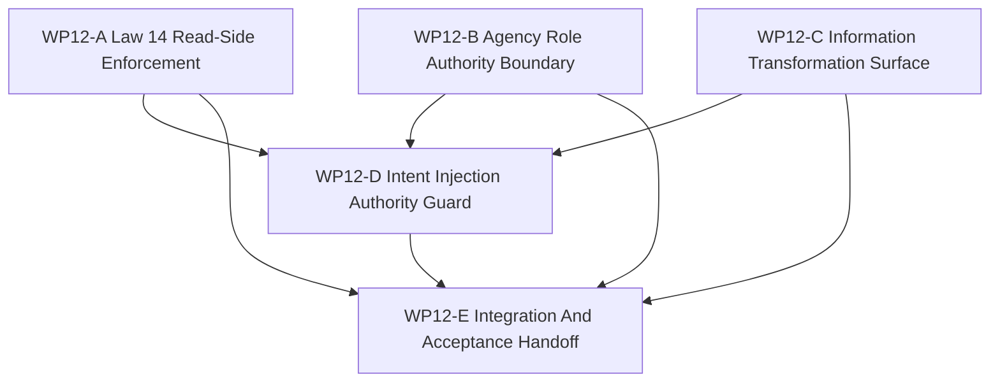

# WP12 Information And Agency Enforcement

状态：`2026-05-20` accepted / implementation mergeable。

语言版本：

- 英文主文：[information_agency_enforcement_wp12_20260520.md](information_agency_enforcement_wp12_20260520.md)
- 中文辅文：`information_agency_enforcement_wp12_20260520.zh.md`

输入：

- [Post-WP9 architecture route plan](../post_wp9_architecture_route_plan_20260520.zh.md)
- [Post-WP9 gap analysis](../../review/post_wp9_gap_analysis_20260520.zh.md)
- [WP11 facade vertical slice and provenance acceptance](../../review/wp11_facade_vertical_slice_provenance_acceptance_review_20260520.zh.md)
- [WP11 facade vertical slice and provenance](../wp11_facade_vertical_slice_provenance/facade_vertical_slice_provenance_wp11_20260520.zh.md)
- [仿真系统架构设计](../../../plan/architecture/simulation_system_architecture_design.zh.md)
- [WP closure lane policy](../../../standards/governance/wp_closure_lane_policy.zh.md)

命名说明：

- `WP12` 是 post-WP9 路线的 Phase 3：information and agency enforcement。
- 它基于 WP10 causal seam 与 WP11 provenance/pre-gate 词汇，推进延期的
  `GAP-5`、`GAP-6` 与 `GAP-7` enforcement 方向。
- 它不得提前跳到 backend/fidelity expansion、capability composition 或
  counterfactual/worldline 工作。

## 1. 目的

`WP12` 把已验收的信息状态词汇和 consumer pre-gates 推进为可执行的架构边界。
它应让 maintained decision paths 证明自己被允许读取什么、以什么角色权限行动，
以及每个 maintained packet、belief 或 intent 由哪条显式 information
transformation 产生。

目标链路是：

```text
InformationStateSource labels
  -> maintained read-side guard
  -> AgentRole authority and information-source check
  -> explicit information transformation registry/evidence
  -> authorized ActionIntentPacket / CoordinationIntentPacket injection
```

`WP12` 是实现阶段。单纯规划文档不能通过 gate。

## 2. 范围边界

`WP12` 可以：

1. 把 WP11 consumer pre-gates 推向 maintained Architecture Law 14 read-side
   enforcement。
2. 在 maintained actions 或 coordination intents 被接受前，校验 `AgentRole`
   的 authority scope、information-state source、decision model reference 与
   action interface。
3. 暴露信息转换链：
   `World Truth -> Sensed State -> Track State -> Shared Tactical Picture ->
   Agent Observation -> Decision Belief -> ActionIntentPacket`。
4. 要求 maintained decision 和 intent paths 携带 provenance、source ids、
   authority metadata 与 facade-compatible injection evidence。
5. 增加 focused architecture/runtime/Python tests，区分 maintained、
   diagnostics-only、compatibility-only 与 rejected paths。

`WP12` 不可以：

1. 实现完整 Agency Graph runtime 或 decision-model dispatcher。
2. 声明覆盖所有未来信息生产者的 role-based access control。
3. 大范围重写 sensor、track、data-link 或 policy systems。
4. 实现 backend/fidelity expansion、exact GPU promotion、resident-state
   promotion 或 multi-fidelity execution。
5. 启动 capability composition 或 counterfactual/worldline branching。
6. 把 diagnostics-only truth access 当成 maintained behavior。

优先 enforcement slice：

```text
WP11 ObservationBatchPacket / DecisionBelief provenance
  -> maintained consumer guard
  -> AgentRole role/source/action-interface validator
  -> DecisionBelief -> ActionIntentPacket guard
  -> facade-compatible injection evidence
```

## 3. 工作包

| Work package | 状态 | 路线项 | 目标 | 输出 |
|--------------|------|--------|------|------|
| `WP12-A Law 14 Read-Side Enforcement` | pass | `GAP-5` | 把 maintained consumers 从 pre-gates 推进为可执行 packet/belief read-side checks，同时保留显式 diagnostics-only truth paths。 | [Law 14 read-side task slice](wp12_law14_read_side_enforcement_cluster_20260520.zh.md) |
| `WP12-B Agency Role Authority Boundary` | pass | `GAP-6` | 校验 maintained `AgentRole` authority、information source、decision-model reference 与 action-interface 声明，再允许其授权输出。 | [agency authority task slice](wp12_agency_role_authority_cluster_20260520.zh.md) |
| `WP12-C Information Transformation Surface` | pass | `GAP-7` | 为 information-state chain 增加可机器检查的 transformation declarations/evidence，而不重写所有 producer。 | [information transformation task slice](wp12_information_transformation_surface_cluster_20260520.zh.md) |
| `WP12-D Intent Injection Authority Guard` | pass | `GAP-5`, `GAP-6`, `GAP-7` | 确保 maintained `DecisionBelief -> ActionIntentPacket` / `CoordinationIntentPacket` 路径在 facade-compatible injection 前携带 provenance 与 authority metadata。 | [intent injection guard task slice](wp12_intent_injection_authority_guard_cluster_20260520.zh.md) |
| `WP12-E Integration And Acceptance Handoff` | pass | closure lane | 在 A-D mergeable 后，整合 shared validators、validation commands、residuals、review/index handoff 与 bilingual closure。 | [integration handoff task slice](wp12_integration_acceptance_cluster_20260520.zh.md) |

## 4. 依赖图



并行规则：

- 若写入范围保持分离，`WP12-A`、`WP12-B` 与 `WP12-C` 可以并行启动。
- `WP12-D` 应等待 A/B validator 词汇和 C transformation names 至少稳定后再开始。
- `WP12-E` 是串行集成，不应让 README/archive/bilingual chores 阻塞 A-D 的实现
  mergeability。

## 5. 派发计划

| Stream | 主要关注 | 写入范围规则 | 建议模型 / 思考预算 |
|--------|----------|--------------|---------------------|
| `WP12-A` | `ObservationPacket` / `DecisionBelief` consumers 的 maintained read-side enforcement、diagnostics-only allowlists 与 fail-closed fixtures。 | 负责 focused consumer guard tests、agent-shim/read-side validators 与 allowlist 更新。不要全局禁止所有 raw ECS reads。 | 中等复杂 enforcement：`gpt-5.4`，high。 |
| `WP12-B` | `AgentRole` authority-scope、information-source、decision-model 与 action-interface validation。 | 负责 role/authority contract validators 与 tests。不要实现完整 Agency Graph runtime dispatch。 | 复杂 cross-layer authority design：`gpt-5.4`，xhigh。 |
| `WP12-C` | 六层信息链的 information transformation declarations 与 evidence vocabulary。 | 负责 transformation registry/helpers 与 architecture tests。不要重写所有 sensor/track/data-link producer。 | 复杂 semantic surface design：`gpt-5.4`，xhigh。 |
| `WP12-D` | 从 `DecisionBelief` 到 facade-compatible action 或 coordination injection 的授权决策/意图路径。 | 负责 intent guard integration tests 与 A-C 之间的最小 glue。不要创建第二条 injection path。 | 复杂 integration：`gpt-5.4`，xhigh。 |
| `WP12-E` | shared validation、residual register、acceptance review 准备、README/index sync 与 bilingual handoff。 | A-D mergeable 后串行负责。 | 轻量 closure：mini model with xhigh；若仍有代码冲突，用 `gpt-5.4` medium。 |

Worker 规则：

- 使用项目 [Subagent Usage Policy](../../../standards/governance/subagent_usage_policy.zh.md)。
- Workers 并不是独自在代码库里工作；不得回滚无关改动或其他 worker 的改动。
- 每个 worker 必须返回 touched files、commands run、blockers、residuals 与
  integration notes。
- 一个 stream 可以在具备 code/test evidence 时报告 `Mergeable`，README、archive、
  acceptance 或 bilingual closure 可作为 closure lane 后续完成。

## 6. 必需验收产物

任何 `WP12` gate 在验收前都必须包含以下产物。

| Artifact | 必需状态 | 用途 |
|----------|----------|------|
| `docs/task/simulation_architecture/wp12_information_agency_enforcement/information_agency_enforcement_wp12_20260520.md` | required | WP12 范围、streams 与 gate rules 的英文规范定义。 |
| `docs/task/simulation_architecture/wp12_information_agency_enforcement/information_agency_enforcement_wp12_20260520.zh.md` | required | 同一规范的中文辅文。 |
| `docs/task/simulation_architecture/wp12_information_agency_enforcement/wp12_law14_read_side_enforcement_cluster_20260520.md` | required | 英文 WP12-A Law 14 read-side task slice。 |
| `docs/task/simulation_architecture/wp12_information_agency_enforcement/wp12_law14_read_side_enforcement_cluster_20260520.zh.md` | required | 中文 WP12-A 辅文。 |
| `docs/task/simulation_architecture/wp12_information_agency_enforcement/wp12_agency_role_authority_cluster_20260520.md` | required | 英文 WP12-B agency authority task slice。 |
| `docs/task/simulation_architecture/wp12_information_agency_enforcement/wp12_agency_role_authority_cluster_20260520.zh.md` | required | 中文 WP12-B 辅文。 |
| `docs/task/simulation_architecture/wp12_information_agency_enforcement/wp12_information_transformation_surface_cluster_20260520.md` | required | 英文 WP12-C information transformation task slice。 |
| `docs/task/simulation_architecture/wp12_information_agency_enforcement/wp12_information_transformation_surface_cluster_20260520.zh.md` | required | 中文 WP12-C 辅文。 |
| `docs/task/simulation_architecture/wp12_information_agency_enforcement/wp12_intent_injection_authority_guard_cluster_20260520.md` | required | 英文 WP12-D intent injection guard task slice。 |
| `docs/task/simulation_architecture/wp12_information_agency_enforcement/wp12_intent_injection_authority_guard_cluster_20260520.zh.md` | required | 中文 WP12-D 辅文。 |
| `docs/task/simulation_architecture/wp12_information_agency_enforcement/wp12_integration_acceptance_cluster_20260520.md` | required | 英文 WP12-E integration handoff task slice。 |
| `docs/task/simulation_architecture/wp12_information_agency_enforcement/wp12_integration_acceptance_cluster_20260520.zh.md` | required | 中文 WP12-E 辅文。 |
| `docs/task/review/wp12_information_agency_enforcement_acceptance_review_20260520.md` | acceptance 前 required | 英文最终验收决策记录。 |
| `docs/task/review/wp12_information_agency_enforcement_acceptance_review_20260520.zh.md` | acceptance 前 required | 中文验收辅文。 |

产物规则：

- 缺少 task artifacts 表示 WP12 planning 未完成。
- Acceptance review 已发布为 [WP12 验收审查](../../review/wp12_information_agency_enforcement_acceptance_review_20260520.zh.md)。
- documentation-only updates 不能通过 implementation gate。

## 7. 严格 Gate 规则

| Gate | 必需证据 | 通过规则 | 失败规则 |
|------|----------|----------|----------|
| `WP12-A Law 14 Read-Side Enforcement` | maintained consumers 的 static 或 runtime guard tests、显式 diagnostics allowlists、provenance-labeled packet/belief fixtures。 | 只有 focused slice 中 maintained decision paths 不能静默消费 World Truth/raw ECS 时通过。 | 若 diagnostics-only truth access 被标为 maintained，或无证据声明 repository-wide Law 14 coverage，则失败。 |
| `WP12-B Agency Role Authority Boundary` | `AgentRole` validation helpers、authority/information/action-interface tests 与 rejected invalid-role fixtures。 | 只有 maintained actions 在授权前要求有效 role declaration 时通过。 | 若 role fields 仍只是装饰，或无实现就声明完整 Agency Graph dispatch，则失败。 |
| `WP12-C Information Transformation Surface` | transformation names、source/target labels、registry 或 helper surface，以及证明 maintained packets/beliefs 命名 transformation step 的 tests。 | 只有 selected slice 至少能机器检查 source layer、target layer 与 transformation evidence 时通过。 | 若 transformations 仍只是 prose-only，或 World Truth 直接转成 maintained action intent 且没有中间 evidence，则失败。 |
| `WP12-D Intent Injection Authority Guard` | belief-to-intent 或 coordination paths 的 integration tests，覆盖 provenance、source id、role authority、validity/effective-time metadata 与 facade-compatible injection。 | 只有 unauthorized 或 unlabeled intents 在 focused slice fail closed 时通过。 | 若新增 raw command/control path 绕过 WP10/WP11 facade seam，则失败。 |
| `WP12-E Integration And Acceptance Handoff` | A-D status、精确 validation commands、residual register、acceptance-review draft 与 route/README sync。 | 只有 implementation gates mergeable 且 residuals 诚实记录后通过。 | 若 closure text 声明 backend/fidelity、完整 Agency Graph runtime 或完整 repository-wide Law 14 enforcement，则失败。 |

## 8. 验证命令

预期 focused validation set：

```bash
git diff --check
cmake --build build-workshop -j4
CMO_BUILD_DIR=build-workshop pytest -q tests/architecture/policy_execution/test_belief_and_read_side_boundaries.py tests/runtime/test_agent_shim.py
CMO_BUILD_DIR=build-workshop pytest -q tests/runtime/mission/test_policy_contract_shape.py tests/runtime/bindings/test_bindings_runtime_dto_surface.py
CMO_BUILD_DIR=build-workshop pytest -q tests/runtime/facade tests/runtime/bindings
python3 tools/maintenance/wp_doc_closure_audit.py --wp WP12
```

worker-specific tests 应更窄，并在各 cluster handoff 中写明。
最终 acceptance review 应把精确命令报告为 `passed`、`failed` 或 `blocked`。

## 9. 非目标

- Backend/fidelity expansion 或 profile promotion。
- 完整 Agency Graph runtime dispatch。
- 对所有 raw ECS reads 做全局静态禁止。
- Sensor/track/data-link rewrite。
- Multi-rate policy/control/physics cadence。
- Capability bundle migration。
- Counterfactual/worldline branching。
