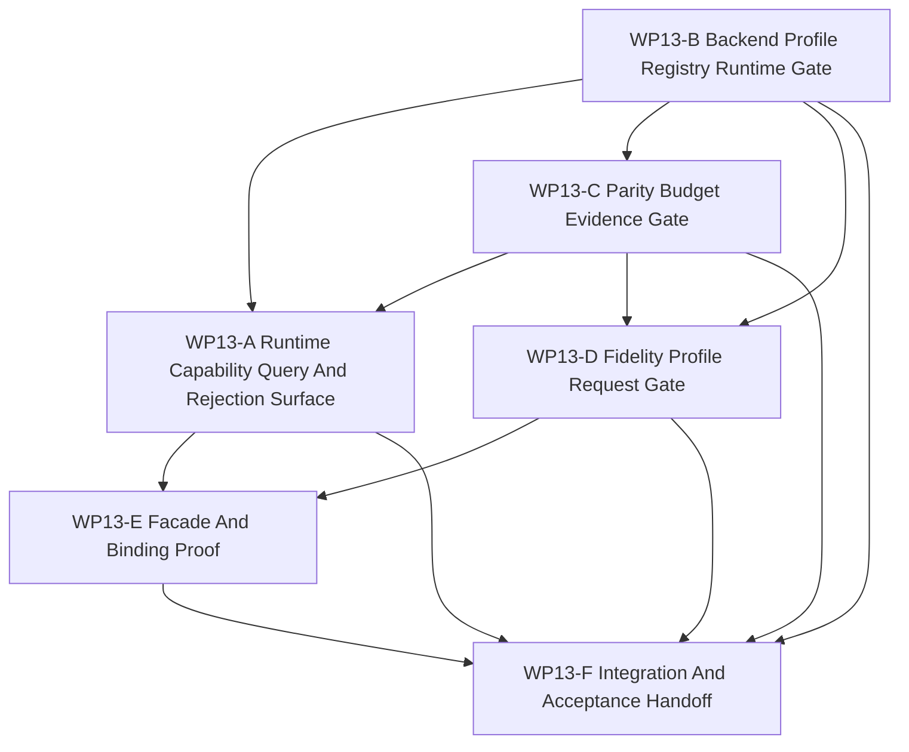

# WP13 Backend Fidelity Expansion

状态：`2026-05-21` accepted / implementation mergeable。

语言版本：

- 英文主文：[backend_fidelity_expansion_wp13_20260520.md](backend_fidelity_expansion_wp13_20260520.md)
- 中文辅文：`backend_fidelity_expansion_wp13_20260520.zh.md`

输入：

- [Post-WP9 architecture route plan](../post_wp9_architecture_route_plan_20260520.zh.md)
- [WP12 information and agency enforcement 验收](../../review/wp12_information_agency_enforcement_acceptance_review_20260520.zh.md)
- [WP6 backend profile policy](../wp6_backend_profile_policy/backend_profile_policy_wp6_20260519.zh.md)
- [WP6 backend profile registry](../wp6_backend_profile_policy/wp6_backend_profile_registry_20260519.zh.md)
- [WP6 parity budget registry](../wp6_backend_profile_policy/wp6_parity_budget_registry_20260519.zh.md)
- [WP6 resident-state boundary rules](../wp6_backend_profile_policy/wp6_resident_state_boundary_rules_20260519.zh.md)
- [WP7 backend capability materialization](../wp7_backend_capability_materialization/backend_capability_materialization_wp7_20260519.zh.md)
- [WP7 runtime capability projection](../wp7_backend_capability_materialization/wp7_runtime_capability_projection_cluster_20260519.zh.md)
- [WP7 multi-fidelity entry conditions](../wp7_backend_capability_materialization/wp7_multifidelity_entry_conditions_cluster_20260519.zh.md)
- [WP10 causal runtime foundation](../wp10_causal_runtime_foundation/causal_runtime_foundation_wp10_20260520.zh.md)
- [WP11 facade vertical slice and provenance](../wp11_facade_vertical_slice_provenance/facade_vertical_slice_provenance_wp11_20260520.zh.md)
- [WP12 information and agency enforcement](../wp12_information_agency_enforcement/information_agency_enforcement_wp12_20260520.zh.md)
- [Simulation system architecture design](../../../plan/architecture/simulation_system_architecture_design.zh.md)
- [Subagent 使用规范](../../../standards/governance/subagent_usage_policy.zh.md)
- [WP Closure Lane Policy](../../../standards/governance/wp_closure_lane_policy.zh.md)

命名与提交信息规则：

- `WP13` 只作为 Phase 4 backend/fidelity expansion 的任务索引与审计标签。
- commit message 不应包含 `WP13` 这类工程内编号；应使用能力/结果语言，例如
  `Add backend fidelity capability gates` 或
  `Expose backend profile rejection evidence`。

## 1. 目的

`WP13` 把已验收的 backend-profile policy 与 WP10-WP12 evidence boundary 转成
维护中的 runtime-facing query / rejection surface。

目标不是启用新的加速执行，而是让 backend 与 fidelity claim 明确到可以被调用方查询、
拒绝和举证：调用方应能看到什么能力是维护中的、为什么请求被拒绝，以及该结果由哪个
profile、budget、validation gate 与 causal evidence 支撑。

目标链路：

```text
WP6 backend profile / parity budget metadata
  -> code-owned queryable profile and budget records
  -> conservative RuntimeCapabilities projection
  -> backend/fidelity request admission and rejection reasons
  -> facade/binding-visible evidence behind the WP10-WP12 causal boundary
```

`WP13` 是 implementation phase。只有规划文档不能通过 gate。

## 2. 范围边界

`WP13` 可以：

1. 添加从 WP6/WP7 文档注册表派生的 code-owned backend profile 与 parity
   budget records。
2. 扩展 `RuntimeCapabilities` 或相邻 DTO，加入 queryable profile id、budget ref、
   maintained-status label 与 rejection/evidence string。
3. 添加 runtime/facade/binding helper，使 unsupported backend、resident-state、
   shadow 或 fidelity request fail closed。
4. 把 fidelity request vocabulary 加成 request/admission data，而不是 support claim。
5. 证明 GPU helper/probe availability 仍与 maintained exact GPU、resident-state、
   device observation、shadow 或 multi-fidelity support 分离。
6. 添加 architecture/runtime/Python tests 覆盖 query、rejection 与 evidence 行为。

`WP13` 不能：

1. 晋级 exact GPU execution 为 maintained support。
2. 晋级 resident-state ownership 或 device observation view 为 maintained support。
3. 晋级 shadow compare 或 shadow fallback 为 maintained support。
4. 实现 adaptive fidelity scheduling 或 learned `ModelProvider` runtime。
5. 在 P0-P10 causal/facade boundary 之外添加第二条 semantic lifecycle。
6. 把 helper/probe availability、candidate registry row 或 diagnostics report 当成
   validation evidence。
7. 绕过 WP10 barrier/snapshot/event evidence、WP11 provenance labels 或 WP12
   maintained decision authority gates。

首选第一实现切片：

```text
RuntimeFacade.capabilities()
  -> profile/budget/evidence query DTOs
  -> Python binding visibility
  -> request rejection helpers for exact_gpu / resident_state / shadow /
     fidelity-profile claims
  -> tests proving all unsupported claims fail closed with evidence
```

## 3. 工作包

| 工作包 | 状态 | 路线项 | 目标 | 产出 |
|--------|------|--------|------|------|
| `WP13-A Runtime Capability Query And Rejection Surface` | complete / accepted | Phase 4 capability query | 让 `RuntimeCapabilities` 暴露保守 profile/evidence metadata 和显式 unsupported-request reason，同时不从 GPU/helper 推断支持。 | [capability query 任务切片](wp13_runtime_capability_query_cluster_20260520.zh.md) |
| `WP13-B Backend Profile Registry Runtime Gate` | complete / accepted | WP6/WP7 registry materialization | 添加 code-owned backend profile records 与 validation helpers，强制 maintained/candidate/diagnostics 边界。 | [backend profile registry gate 任务切片](wp13_backend_profile_registry_gate_cluster_20260520.zh.md) |
| `WP13-C Parity Budget Evidence Gate` | complete / accepted | profile-owned budget evidence | 添加 queryable parity budget records 与 validators，在 capability promotion 前拒绝缺失或非 maintained budget。 | [parity budget evidence 任务切片](wp13_parity_budget_evidence_gate_cluster_20260520.zh.md) |
| `WP13-D Fidelity Profile Request Gate` | complete / accepted | fidelity request admission | 把 fidelity request admission 实现为 fail-closed request grammar，而不是 multi-fidelity support。 | [fidelity request gate 任务切片](wp13_fidelity_profile_request_gate_cluster_20260520.zh.md) |
| `WP13-E Facade And Binding Proof` | complete / accepted | facade-visible evidence | 通过 maintained facade 与 Python binding surface 证明 query/rejection/evidence 行为，不新增 raw backend path。 | [facade proof 任务切片](wp13_facade_binding_proof_cluster_20260520.zh.md) |
| `WP13-F Integration And Acceptance Handoff` | complete / accepted | closure lane | 在 A-E mergeable 后同步 shared validators、validation commands、residuals、acceptance review、route/README 与 bilingual closure。 | [integration handoff 任务切片](wp13_integration_acceptance_cluster_20260520.zh.md) |

## 4. 依赖图



并行规则：

- `WP13-A`、`WP13-B` 与 `WP13-C` 可作为首轮并行启动，但必须保持写入范围分离，
  并在编辑前对少量 shared DTO 名称达成一致。
- `WP13-D` 应等待 B/C 词汇稳定，能引用 profile 与 budget ids 后再启动。
- `WP13-E` 应等待 A/D 暴露可证明的 facade 或 binding surface。
- `WP13-F` 是串行 integration，不应让 README、review、archive 或 bilingual chores
  阻塞代码流。

## 5. 分发计划

| Stream | 主要关注点 | 写入范围规则 | 建议模型 / 思考预算 |
|--------|------------|--------------|---------------------|
| `WP13-A` | Queryable `RuntimeCapabilities` metadata、rejection reason vocabulary 与保守 support defaults。 | 负责 facade DTO/projection helper 与 focused capability tests。与 B/C 协调 shared struct names；除 integration 外不改 B/C registry rows。 | 复杂跨层 surface：`gpt-5.4`，xhigh。 |
| `WP13-B` | Code-owned backend profile records、maintained/candidate/diagnostics validation 与 helper/probe non-promotion。 | 负责 backend profile contract/header 或 registry helper 与 architecture tests。不实现 parity budget details，只引用。 | 复杂 registry gate：`gpt-5.4`，xhigh。 |
| `WP13-C` | Code-owned parity budget records、budget validators、comparison-domain evidence 与 missing-budget rejection。 | 负责 parity budget contract/helper 与 tests。不实现 fidelity request grammar，只提供 consumer-facing refs。 | 中高复杂 evidence gate：`gpt-5.4`，high。 |
| `WP13-D` | Fidelity profile request grammar 与 fail-closed admission，消费 B/C ids 与 budgets。 | 负责 fidelity request DTO/helper/tests。不实现 adaptive scheduling、backend selection 或 learned provider runtime。 | 复杂 request semantics：`gpt-5.4`，xhigh。 |
| `WP13-E` | Facade/binding proof 覆盖 query、rejection、evidence 与 no raw backend bypass。 | A/D 落地后负责 Python binding exposure/tests 与 facade proof tests。 | 中高复杂 integration：`gpt-5.4`，high。 |
| `WP13-F` | Validation、residual register、acceptance review、README/index sync、bilingual closure。 | A-E mergeable 后串行负责。 | 轻量收尾：mini model with xhigh；若存在代码冲突则 `gpt-5.4` medium。 |

Worker 规则：

- 使用项目 [Subagent 使用规范](../../../standards/governance/subagent_usage_policy.zh.md)。
- worker 并非独占代码库；不得回滚无关编辑或其他 worker 的编辑。
- 每个 worker 必须返回 touched files、commands run、blockers、residuals 与 integration notes。
- stream 可以在 code/test evidence 完备后标为 `Mergeable`，README、archive、acceptance
  或 bilingual closure 由 closure lane 处理。

## 6. 必需验收产物

缺少下列 required artifact 时，不得把 `WP13` gate 报告为 accepted。

| Artifact | Required status | Purpose |
|----------|-----------------|---------|
| `docs/task/simulation_architecture/wp13_backend_fidelity_expansion/backend_fidelity_expansion_wp13_20260520.md` | required | WP13 scope、streams 与 gate rules 的英文规范定义。 |
| `docs/task/simulation_architecture/wp13_backend_fidelity_expansion/backend_fidelity_expansion_wp13_20260520.zh.md` | required | 同一规范的中文辅文。 |
| `docs/task/simulation_architecture/wp13_backend_fidelity_expansion/wp13_runtime_capability_query_cluster_20260520.md` | required | 英文 WP13-A capability query 任务切片。 |
| `docs/task/simulation_architecture/wp13_backend_fidelity_expansion/wp13_runtime_capability_query_cluster_20260520.zh.md` | required | 中文 WP13-A 辅文。 |
| `docs/task/simulation_architecture/wp13_backend_fidelity_expansion/wp13_backend_profile_registry_gate_cluster_20260520.md` | required | 英文 WP13-B backend profile registry 任务切片。 |
| `docs/task/simulation_architecture/wp13_backend_fidelity_expansion/wp13_backend_profile_registry_gate_cluster_20260520.zh.md` | required | 中文 WP13-B 辅文。 |
| `docs/task/simulation_architecture/wp13_backend_fidelity_expansion/wp13_parity_budget_evidence_gate_cluster_20260520.md` | required | 英文 WP13-C parity budget 任务切片。 |
| `docs/task/simulation_architecture/wp13_backend_fidelity_expansion/wp13_parity_budget_evidence_gate_cluster_20260520.zh.md` | required | 中文 WP13-C 辅文。 |
| `docs/task/simulation_architecture/wp13_backend_fidelity_expansion/wp13_fidelity_profile_request_gate_cluster_20260520.md` | required | 英文 WP13-D fidelity request 任务切片。 |
| `docs/task/simulation_architecture/wp13_backend_fidelity_expansion/wp13_fidelity_profile_request_gate_cluster_20260520.zh.md` | required | 中文 WP13-D 辅文。 |
| `docs/task/simulation_architecture/wp13_backend_fidelity_expansion/wp13_facade_binding_proof_cluster_20260520.md` | required | 英文 WP13-E facade/binding proof 任务切片。 |
| `docs/task/simulation_architecture/wp13_backend_fidelity_expansion/wp13_facade_binding_proof_cluster_20260520.zh.md` | required | 中文 WP13-E 辅文。 |
| `docs/task/simulation_architecture/wp13_backend_fidelity_expansion/wp13_integration_acceptance_cluster_20260520.md` | required | 英文 WP13-F integration handoff 任务切片。 |
| `docs/task/simulation_architecture/wp13_backend_fidelity_expansion/wp13_integration_acceptance_cluster_20260520.zh.md` | required | 中文 WP13-F 辅文。 |
| `docs/task/review/wp13_backend_fidelity_expansion_acceptance_review_20260520.md` | required before acceptance | 英文最终验收决策记录。 |
| `docs/task/review/wp13_backend_fidelity_expansion_acceptance_review_20260520.zh.md` | required before acceptance | 中文验收辅文。 |

Artifact 规则：

- 缺少任务产物时，WP13 planning 不完整。
- WP13 open 期间缺少 acceptance review 是预期 warning。
- 文档更新本身不能通过 implementation gate。

## 7. 严格 Gate 规则

| Gate | Required evidence | Pass rule | Fail rule |
|------|-------------------|-----------|-----------|
| `WP13-A Runtime Capability Query And Rejection Surface` | DTO/projection helper 与测试，证明 profile/evidence fields 和 fail-closed unsupported reasons。 | 只有 exact GPU、resident-state、device observation、shadow 与 multi-fidelity support 在缺少 maintained profile/budget evidence 时仍为 false 才能通过。 | 若 helper/probe availability、candidate rows 或 diagnostics output 能把 support 翻为 true，则失败。 |
| `WP13-B Backend Profile Registry Runtime Gate` | Code-owned profile rows 或 schema、validators，以及覆盖 maintained、candidate、diagnostics-only records 的测试。 | 只有 maintained profile 强制 class、comparison reference、ownership、sync、parity ref、observability、compatibility、deprecation 与 validation gate 字段时通过。 | 若 unmaintained candidate 被当作 maintained 接受，或 profile metadata 仍只存在于散文中，则失败。 |
| `WP13-C Parity Budget Evidence Gate` | Code-owned budget rows 或 schema、validators，以及 comparison domains、sync barriers、mismatch policy 与 acceptance gates 测试。 | 只有 missing 或 non-maintained budgets 拒绝 promotion 且产出可检查 evidence 时通过。 | 若 parity budget 被当成脱离 backend profile ownership 的单个 tolerance scalar，则失败。 |
| `WP13-D Fidelity Profile Request Gate` | Request DTO/helper 与测试，覆盖 accepted baseline request 和 rejected unsupported fidelity claims。 | 只有 fidelity label 是绑定 profile ids、budget refs、model-family scope、validation gate 与 facade evidence 的 request 时通过。 | 若 `fast_training`、`sensor_heavy` 等 label 暗示 maintained multi-fidelity support，则失败。 |
| `WP13-E Facade And Binding Proof` | Runtime facade 与 Python binding tests，证明 query/rejection/evidence 可见且不需要 raw backend access。 | 只有调用方能通过 maintained surfaces 检查 capability/profile/budget/fidelity rejection 时通过。 | 若 proof 依赖 facade/binding contracts 之外的 raw runtime 或 GPU helper path，则失败。 |
| `WP13-F Integration And Acceptance Handoff` | A-E 状态、精确 validation commands、residual register、acceptance-review draft、route/README sync 与 bilingual closure。 | 只有 implementation gates mergeable 且 residuals 被诚实记录后通过。 | 若 closure 文本声称 exact GPU、resident-state、shadow、adaptive fidelity 或 learned provider runtime support，则失败。 |

## 8. 验证命令

预期 focused validation set：

```bash
git diff --check
cmake --build build-workshop -j4
CMO_BUILD_DIR=build-workshop pytest -q tests/runtime/facade/test_runtime_facade.py tests/test_gpu_runtime_bindings.py
CMO_BUILD_DIR=build-workshop pytest -q tests/runtime/bindings/test_bindings_runtime_dto_surface.py tests/runtime/bindings/test_bindings_policy_surface.py
CMO_BUILD_DIR=build-workshop pytest -q tests/architecture/runtime_facade
python3 tools/maintenance/wp_doc_closure_audit.py --wp WP13
```

每个 worker 应在 handoff 中列出更窄的实际测试目标。最终验收审查必须把精确命令记录为
`passed`、`failed` 或 `blocked`。

## 9. 非目标

- Exact GPU world-step support。
- Resident-state ownership 或 device observation view promotion。
- Shadow compare 或 shadow fallback promotion。
- Adaptive fidelity scheduling。
- Learned `ModelProvider` runtime interfaces。
- Backend selection 或 performance-based automatic promotion。
- Causal/facade boundary 之外的第二条 semantic lifecycle。

## 10. 验收审查

WP13 已由
[WP13 backend fidelity expansion 验收审查](../../review/wp13_backend_fidelity_expansion_acceptance_review_20260520.zh.md)
验收。
