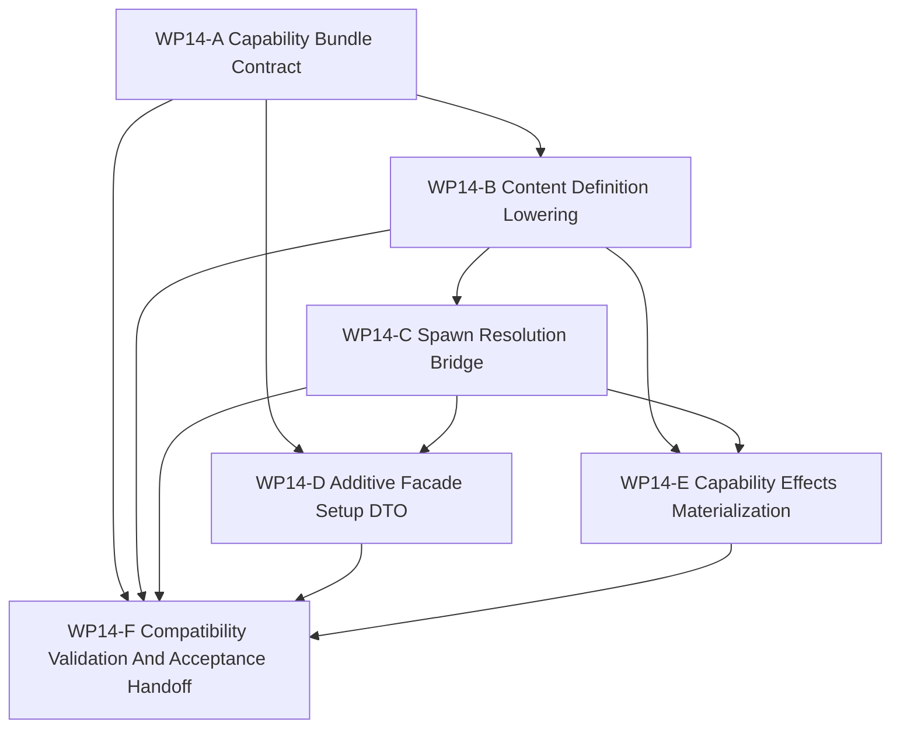

# WP14 Capability Composition

Status: `2026-05-21` complete / accepted implementation phase.

Language:

- English canonical: `capability_composition_wp14_20260521.md`
- Chinese companion:
  [capability_composition_wp14_20260521.zh.md](capability_composition_wp14_20260521.zh.md)

Inputs:

- [Post-WP9 architecture route plan](../post_wp9_architecture_route_plan_20260520.md)
- [WP13 backend fidelity expansion acceptance](../../review/wp13_backend_fidelity_expansion_acceptance_review_20260520.md)
- [WP2 contract freeze](../wp2_contract_freeze/contract_freeze_wp2_20260519.md)
- [WP9 contract and infrastructure closure](../wp9_contract_infrastructure_closure/contract_infrastructure_closure_wp9_20260520.md)
- [WP10 causal runtime foundation](../wp10_causal_runtime_foundation/causal_runtime_foundation_wp10_20260520.md)
- [WP11 facade vertical slice and provenance](../wp11_facade_vertical_slice_provenance/facade_vertical_slice_provenance_wp11_20260520.md)
- [WP12 information and agency enforcement](../wp12_information_agency_enforcement/information_agency_enforcement_wp12_20260520.md)
- [WP13 backend fidelity expansion](../wp13_backend_fidelity_expansion/backend_fidelity_expansion_wp13_20260520.md)
- [Simulation system architecture design](../../../plan/architecture/simulation_system_architecture_design.md)
- [Post-WP9 gap analysis](../../review/post_wp9_gap_analysis_20260520.md)
- [Subagent Usage Policy](../../../standards/governance/subagent_usage_policy.md)
- [WP Closure Lane Policy](../../../standards/governance/wp_closure_lane_policy.md)

Naming and commit-message note:

- `WP14` is only the task-index and audit label for Phase 5 of the post-WP9
  route: capability composition.
- Commit messages should not include internal work-package labels such as
  `WP14`. Use capability/result language, for example
  `Add platform capability bundle contracts` or
  `Bridge type-name spawns through capability plans`.

## 1. Purpose

`WP14` opens the capability-composition phase. It starts moving platform setup
from entity-centric `type_name` templates toward typed `Capability` /
`CapabilityBundle` composition while preserving existing compatibility paths.

The goal is not to replace every spawn call. The goal is to make the implicit
composition already present in content definitions and `DefaultUnitFactory`
queryable, testable, and eventually facade-shaped.

Target chain:

```text
type_name compatibility request
  -> capability bundle template
  -> resolved platform spawn plan
  -> factory/materialization evidence
  -> additive facade/setup DTOs for future spawn_platform({capabilities...})
```

`WP14` is an implementation phase. Planning documents alone do not pass a gate.

## 2. Scope Boundary

`WP14` can:

1. Add platform-semantic `Capability`, `CapabilityBundle`, and
   `ResolvedPlatformSpawnPlan` contract vocabulary.
2. Keep `RuntimeCapabilities` reserved for backend/fidelity capability
   projection; do not reuse that naming domain for platform capabilities.
3. Define `type_name -> CapabilityBundle template -> ResolvedPlatformSpawnPlan`
   lowering rules from existing content/factory evidence.
4. Bridge `spawn_unit(type_name)` through resolution before materialization
   while preserving the public compatibility surface.
5. Add additive facade/setup DTOs for future `spawn_platform({capabilities...})`
   without breaking `WorldSpawnRequest.type_name`.
6. Attach capability-family effects to mobility, sensing, communication,
   launching, survivability, command, and doctrine evidence.
7. Add architecture/runtime/Python tests proving compatibility, resolution, and
   fail-closed invalid capability behavior.

`WP14` cannot:

1. Remove or require broad migration of existing `spawn_unit(type_name)` calls.
2. Require scenario JSON or Python callers to pass `CapabilityBundle` in the
   first slice.
3. Rewrite all setup/content loading paths in one pass.
4. Promote backend/fidelity claims or reuse `RuntimeCapabilities` for platform
   semantics.
5. Add new tactical behavior, new weapon/sensor realism, or new platform
   families as a side effect of composition plumbing.
6. Create a second lifecycle outside the P0-P10 causal/facade boundary.

Preferred first implementation slice:

```text
Capability / CapabilityBundle contracts
  -> type_name capability template resolution
  -> ResolvedPlatformSpawnPlan diagnostics/evidence
  -> unchanged spawn_unit(type_name) behavior
  -> focused tests proving compatibility and no big-bang spawn rewrite
```

## 3. Work Packages

| Work package | Status | Route item | Goal | Output |
|--------------|--------|------------|------|--------|
| `WP14-A Capability Bundle Contract` | accepted | missing DTO closure | Define platform-semantic `Capability`, `CapabilityBundle`, capability-family vocabulary, and resolved-plan evidence without colliding with backend `RuntimeCapabilities`. | [capability bundle contract task slice](wp14_capability_bundle_contract_cluster_20260521.md) |
| `WP14-B Content Definition Lowering` | accepted | type-name lowering | Define and implement `type_name -> capability bundle template -> resolved spawn plan` lowering from existing content and factory semantics. | [content definition lowering task slice](wp14_content_definition_lowering_cluster_20260521.md) |
| `WP14-C Spawn Resolution Bridge` | accepted | compatibility-preserving spawn bridge | Route kernel, world-batch, and facade setup through resolved spawn plans while keeping `spawn_unit(type_name)` and `WorldSpawnRequest.type_name` compatible. | [spawn resolution bridge task slice](wp14_spawn_resolution_bridge_cluster_20260521.md) |
| `WP14-D Additive Facade Setup DTO` | accepted | future spawn_platform surface | Add facade/setup DTO vocabulary for typed platform spawn requests as an additive path, not a replacement for current setup APIs. | [additive facade setup DTO task slice](wp14_additive_facade_setup_dto_cluster_20260521.md) |
| `WP14-E Capability Effects Materialization` | accepted | component/effect binding | Bind capability families to ECS/component materialization, evidence names, and fail-closed unsupported effects without changing platform behavior models. | [capability effects materialization task slice](wp14_capability_effects_materialization_cluster_20260521.md) |
| `WP14-F Compatibility Validation And Acceptance Handoff` | accepted | closure lane | Freeze compatibility, validation commands, residuals, acceptance review, README/route sync, and bilingual closure after A-E are mergeable. | [compatibility validation and acceptance task slice](wp14_compatibility_validation_acceptance_cluster_20260521.md) |

## 4. Dependency Map



Parallel rule:

- `WP14-A` starts first because B-E must share the same capability vocabulary.
- `WP14-B` and `WP14-C` are the highest-risk serial seam and should not be
  split across writers touching the same factory/kernel paths; the main thread
  owns integration/gate, while subagents own only disjoint scopes.
- `WP14-D` may start after A if it stays additive and does not force kernel
  adoption before C.
- `WP14-E` waits for B/C semantics; it may then run beside D if file scopes stay
  disjoint.
- `WP14-F` is serial integration and must not block code streams on README,
  review, archive, or bilingual chores.

## 5. Dispatch Plan

| Stream | Main concern | Write-scope rule | Suggested model / reasoning |
|--------|--------------|------------------|-----------------------------|
| `WP14-A` | Platform capability contract vocabulary and `RuntimeCapabilities` naming separation. | Own contract header/docs and focused architecture tests. Do not edit content/factory lowering beyond names needed by B. | Complex vocabulary/surface: `gpt-5.4`, high. |
| `WP14-B` | Content and factory lowering from `type_name` to capability bundle template and resolved spawn plan. | Own `src/content/*`, `src/core/interfaces/unit_factory.h`, and `src/models/core/default_unit_factory.h` lowering helpers/tests. Do not change public spawn callers. | Complex semantic seam: `gpt-5.4`, xhigh. |
| `WP14-C` | Kernel/world-batch/facade bridge that resolves before materialization while preserving compatibility. | Own `SimulationKernel`, `WorldBatchRuntime`, and facade setup integration tests. Coordinate with B; do not migrate all call sites. | Complex compatibility bridge: `gpt-5.4`, xhigh. |
| `WP14-D` | Additive facade/setup DTOs for future typed platform spawn. | Own runtime contracts/facade DTOs and Python binding exposure. Stay additive; no forced API replacement. | Medium-complex surface: `gpt-5.4`, high. |
| `WP14-E` | Capability family effects, ECS/component materialization evidence, and unsupported-effect rejection. | Own factory/effects materialization tests after B/C. Do not introduce new tactical behavior or new platform families. | Complex materialization seam: `gpt-5.4`, xhigh. |
| `WP14-F` | Compatibility regression, residual register, acceptance review, README/route sync, bilingual closure. | Serial owner after A-E are mergeable; do not parallelize with implementation workers on the same normative table. | Light closure: mini model with high, or `gpt-5.4` medium if code conflicts remain. |

Worker rule:

- Use the project [Subagent Usage Policy](../../../standards/governance/subagent_usage_policy.md).
- Workers are not alone in the codebase; they must not revert unrelated edits or
  edits from other workers.
- Each worker must return touched files, commands run, blockers, residuals, and
  integration notes.
- A stream may be reported `Mergeable` with code/test evidence before README,
  archive, acceptance, or bilingual closure is complete.

## 6. Required Acceptance Artifacts

No `WP14` gate may be reported as accepted unless the acceptance packet includes
all required artifacts below.

| Artifact | Required status | Purpose |
|----------|-----------------|---------|
| `docs/task/simulation_architecture/wp14_capability_composition/capability_composition_wp14_20260521.md` | required | Normative English definition of WP14 scope, streams, and gate rules. |
| `docs/task/simulation_architecture/wp14_capability_composition/capability_composition_wp14_20260521.zh.md` | required | Chinese companion for the same normative rules. |
| `docs/task/simulation_architecture/wp14_capability_composition/wp14_capability_bundle_contract_cluster_20260521.md` | required | English WP14-A capability contract task slice. |
| `docs/task/simulation_architecture/wp14_capability_composition/wp14_capability_bundle_contract_cluster_20260521.zh.md` | required | Chinese WP14-A companion. |
| `docs/task/simulation_architecture/wp14_capability_composition/wp14_content_definition_lowering_cluster_20260521.md` | required | English WP14-B content lowering task slice. |
| `docs/task/simulation_architecture/wp14_capability_composition/wp14_content_definition_lowering_cluster_20260521.zh.md` | required | Chinese WP14-B companion. |
| `docs/task/simulation_architecture/wp14_capability_composition/wp14_spawn_resolution_bridge_cluster_20260521.md` | required | English WP14-C spawn bridge task slice. |
| `docs/task/simulation_architecture/wp14_capability_composition/wp14_spawn_resolution_bridge_cluster_20260521.zh.md` | required | Chinese WP14-C companion. |
| `docs/task/simulation_architecture/wp14_capability_composition/wp14_additive_facade_setup_dto_cluster_20260521.md` | required | English WP14-D additive facade/setup DTO task slice. |
| `docs/task/simulation_architecture/wp14_capability_composition/wp14_additive_facade_setup_dto_cluster_20260521.zh.md` | required | Chinese WP14-D companion. |
| `docs/task/simulation_architecture/wp14_capability_composition/wp14_capability_effects_materialization_cluster_20260521.md` | required | English WP14-E effects materialization task slice. |
| `docs/task/simulation_architecture/wp14_capability_composition/wp14_capability_effects_materialization_cluster_20260521.zh.md` | required | Chinese WP14-E companion. |
| `docs/task/simulation_architecture/wp14_capability_composition/wp14_compatibility_validation_acceptance_cluster_20260521.md` | required | English WP14-F compatibility and acceptance task slice. |
| `docs/task/simulation_architecture/wp14_capability_composition/wp14_compatibility_validation_acceptance_cluster_20260521.zh.md` | required | Chinese WP14-F companion. |
| `docs/task/review/wp14_capability_composition_acceptance_review_20260521.md` | required before acceptance | English final acceptance decision record. |
| `docs/task/review/wp14_capability_composition_acceptance_review_20260521.zh.md` | required before acceptance | Chinese acceptance companion. |

Artifact rule:

- Missing task artifacts keep WP14 planning incomplete.
- Missing acceptance review is expected while WP14 is open.
- Documentation-only updates do not pass an implementation gate.

## 7. Strict Gate Rules

| Gate | Required evidence | Pass rule | Fail rule |
|------|-------------------|-----------|-----------|
| `WP14-A Capability Bundle Contract` | Typed capability DTO/schema, family vocabulary, resolved-plan evidence fields, and naming-separation tests. | Pass only if platform `Capability` / `CapabilityBundle` is distinct from backend `RuntimeCapabilities`. | Fail if platform semantics reuse backend capability projection names or remain prose-only. |
| `WP14-B Content Definition Lowering` | Lowering helper and tests for existing content/factory evidence such as sensor refs, loadouts, mounted sensors, and naval weapon systems. | Pass only if type-name templates can resolve to deterministic capability plans without changing public callers. | Fail if resolution requires scenario JSON or Python caller migration in the first slice. |
| `WP14-C Spawn Resolution Bridge` | Kernel/world-batch/facade tests proving `spawn_unit(type_name)` routes through resolution before materialization while preserving behavior. | Pass only if existing type-name spawns remain compatible and resolved-plan evidence is inspectable. | Fail if the bridge rewrites all call sites, removes type-name compatibility, or bypasses facade/setup contracts. |
| `WP14-D Additive Facade Setup DTO` | Runtime/facade/Python DTO tests proving typed spawn requests are additive and fail closed when incomplete. | Pass only if `WorldSpawnRequest.type_name` and batch setup remain maintained compatibility surfaces. | Fail if new DTOs become a mandatory unvalidated public path. |
| `WP14-E Capability Effects Materialization` | Tests binding capability families to component/factory materialization evidence and unsupported-effect reasons. | Pass only if capability effects describe existing materialization behavior without adding tactical behavior. | Fail if WP14 changes weapon/sensor/mission behavior under the guise of composition. |
| `WP14-F Compatibility Validation And Acceptance Handoff` | A-E status, exact validation commands, residual register, acceptance-review draft, route/README sync, and bilingual closure. | Pass only after implementation gates are mergeable and residuals are recorded honestly. | Fail if closure text claims full spawn-platform migration, backend/fidelity promotion, or scenario-schema replacement. |

`WP14-F` is accepted by the final acceptance review after A-E became mergeable.
Future work must not use this acceptance to claim full public spawn-platform
migration, scenario-schema replacement, backend/fidelity promotion, or new
tactical behavior.

## 8. Validation Commands

Expected focused validation set:

```powershell
git diff --check
cmake --build build-local-win -j4
python -m pytest -q tests\architecture\test_wp14_*.py
python -m pytest -q tests\architecture\test_runtime_facade_layering.py
python -m pytest -q tests\world_batch\test_world_batch_runtime.py -k "spawn or world_setup"
.\tools\maintenance\cmo_env.ps1 python -m pytest -q tests\runtime\facade\test_runtime_facade.py -k "world_setup or capabilities or observation_packet"
.\tools\maintenance\cmo_env.ps1 python -m pytest -q tests\runtime\engagement\test_facade_engagement_export.py
.\tools\maintenance\cmo_env.ps1 python -m pytest -q tests\test_gpu_runtime_bindings.py -k "runtime_capabilities"
python tools\maintenance\wp_doc_closure_audit.py --wp WP14
```

Implementation gate minimums by slice:

- `WP14-A`: `git diff --check`; `python -m pytest -q tests\architecture\test_wp14_platform_capability_contracts.py`; `python -m pytest -q tests\architecture\test_runtime_facade_layering.py`.
- `WP14-B`: `git diff --check`; `python -m pytest -q tests\architecture\test_wp14_content_definition_lowering.py`; `python -m pytest -q tests\architecture\test_wp14_platform_capability_contracts.py`; `python -m pytest -q tests\world_batch\test_world_batch_runtime.py -k "spawn or world_setup"`.
- `WP14-C`: `git diff --check`; `python -m pytest -q tests\world_batch\test_world_batch_runtime.py -k "spawn or world_setup"`; `.\tools\maintenance\cmo_env.ps1 python -m pytest -q tests\runtime\facade\test_runtime_facade.py -k "world_setup or observation_packet"`; `python -m pytest -q tests\architecture\test_runtime_facade_layering.py`.
- `WP14-D`: `git diff --check`; `.\tools\maintenance\cmo_env.ps1 python -m pytest -q tests\runtime\bindings\test_bindings_runtime_dto_surface.py`; `.\tools\maintenance\cmo_env.ps1 python -m pytest -q tests\runtime\bindings\test_typed_platform_spawn_bindings.py`; `python -m pytest -q tests\architecture\test_runtime_facade_layering.py`.
- `WP14-E`: `git diff --check`; `python -m pytest -q tests\architecture\test_wp14_capability_effects_materialization.py`; `.\tools\maintenance\cmo_env.ps1 python -m pytest -q tests\runtime\engagement\test_facade_engagement_export.py`; `python -m pytest -q tests\world_batch\test_world_batch_runtime.py -k "spawn"`.
- `WP14-F`: `git diff --check`; `cmake --build build-local-win -j4`; `python -m pytest -q tests\architecture\test_wp14_*.py`; `python -m pytest -q tests\architecture\test_runtime_facade_layering.py`; `python -m pytest -q tests\world_batch\test_world_batch_runtime.py -k "spawn or world_setup"`; `.\tools\maintenance\cmo_env.ps1 python -m pytest -q tests\runtime\facade\test_runtime_facade.py -k "world_setup or capabilities or observation_packet"`; `.\tools\maintenance\cmo_env.ps1 python -m pytest -q tests\runtime\engagement\test_facade_engagement_export.py`; `.\tools\maintenance\cmo_env.ps1 python -m pytest -q tests\test_gpu_runtime_bindings.py -k "runtime_capabilities"`; `python tools\maintenance\wp_doc_closure_audit.py --wp WP14`.

Worker-specific tests should be narrower and named in each cluster handoff.
The final acceptance review should report exact commands as `passed`, `failed`,
or `blocked`.

## 9. Non-Goals

- Big-bang spawn rewrite.
- Removing `spawn_unit(type_name)` compatibility.
- Requiring scenario JSON or Python users to provide typed capability bundles
  in the first slice.
- Backend/fidelity promotion.
- New tactical behavior, new sensor/weapon realism, or new platform families.
- A second semantic lifecycle outside the causal/facade boundary.
