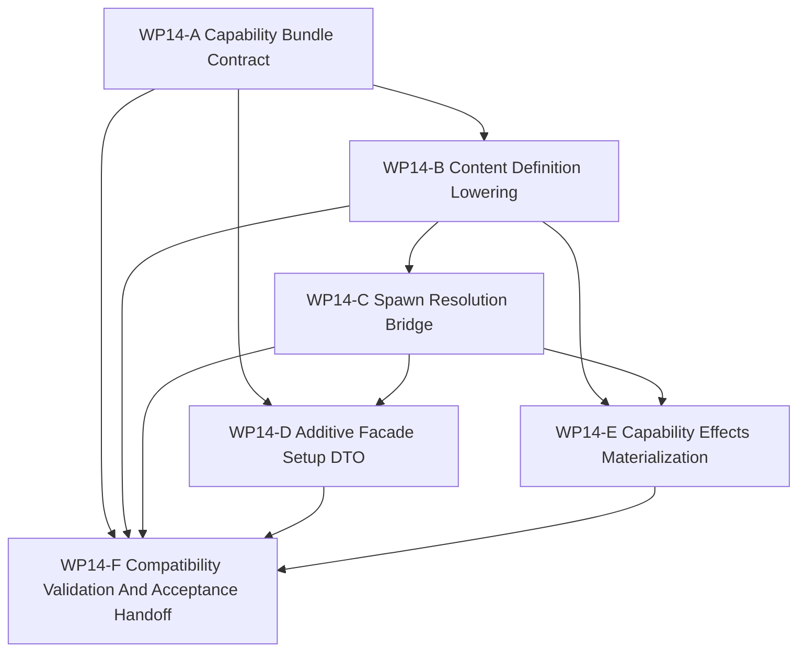

# WP14 Capability Composition

状态：`2026-05-21` complete / accepted implementation phase。

语言版本：

- 英文主文：[capability_composition_wp14_20260521.md](capability_composition_wp14_20260521.md)
- 中文辅文：`capability_composition_wp14_20260521.zh.md`

输入：

- [Post-WP9 architecture route plan](../post_wp9_architecture_route_plan_20260520.zh.md)
- [WP13 backend fidelity expansion 验收](../../review/wp13_backend_fidelity_expansion_acceptance_review_20260520.zh.md)
- [WP2 contract freeze](../wp2_contract_freeze/contract_freeze_wp2_20260519.zh.md)
- [WP9 contract and infrastructure closure](../wp9_contract_infrastructure_closure/contract_infrastructure_closure_wp9_20260520.zh.md)
- [WP10 causal runtime foundation](../wp10_causal_runtime_foundation/causal_runtime_foundation_wp10_20260520.zh.md)
- [WP11 facade vertical slice and provenance](../wp11_facade_vertical_slice_provenance/facade_vertical_slice_provenance_wp11_20260520.zh.md)
- [WP12 information and agency enforcement](../wp12_information_agency_enforcement/information_agency_enforcement_wp12_20260520.zh.md)
- [WP13 backend fidelity expansion](../wp13_backend_fidelity_expansion/backend_fidelity_expansion_wp13_20260520.zh.md)
- [仿真系统架构设计](../../../plan/architecture/simulation_system_architecture_design.zh.md)
- [Post-WP9 gap analysis](../../review/post_wp9_gap_analysis_20260520.zh.md)
- [Subagent 使用规范](../../../standards/governance/subagent_usage_policy.zh.md)
- [WP Closure Lane Policy](../../../standards/governance/wp_closure_lane_policy.zh.md)

命名与提交信息规则：

- `WP14` 只作为 post-WP9 路线 Phase 5 capability composition 的任务索引与审计标签。
- commit message 不应包含 `WP14` 这类工程内编号；应使用能力/结果语言，例如
  `Add platform capability bundle contracts` 或
  `Bridge type-name spawns through capability plans`。

## 1. 目的

`WP14` 开启 capability-composition phase。它把平台 setup 从 entity-centric
`type_name` templates 逐步推向 typed `Capability` / `CapabilityBundle`
composition，同时保持现有兼容入口。

目标不是替换每一个 spawn 调用，而是把 content definitions 与
`DefaultUnitFactory` 中已经存在的隐式组合关系变成可查询、可测试，并最终可通过
facade-shaped surface 承载的显式事实。

目标链路：

```text
type_name compatibility request
  -> capability bundle template
  -> resolved platform spawn plan
  -> factory/materialization evidence
  -> additive facade/setup DTOs for future spawn_platform({capabilities...})
```

`WP14` 是 implementation phase。只有规划文档不能通过 gate。

## 2. 范围边界

`WP14` 可以：

1. 添加 platform-semantic `Capability`、`CapabilityBundle` 与
   `ResolvedPlatformSpawnPlan` contract vocabulary。
2. 让 `RuntimeCapabilities` 继续只属于 backend/fidelity capability projection；
   不把该命名域复用于平台能力。
3. 从现有 content/factory evidence 定义 `type_name -> CapabilityBundle template
   -> ResolvedPlatformSpawnPlan` lowering rules。
4. 在保持 public compatibility surface 的前提下，让 `spawn_unit(type_name)` 先
   resolve 再 materialize。
5. 为未来 `spawn_platform({capabilities...})` 添加 additive facade/setup DTO，
   不破坏 `WorldSpawnRequest.type_name`。
6. 把 capability-family effects 绑定到 mobility、sensing、communication、
   launching、survivability、command 与 doctrine evidence。
7. 添加 architecture/runtime/Python tests，证明 compatibility、resolution 与
   invalid capability fail-closed 行为。

`WP14` 不能：

1. 移除或要求大范围迁移现有 `spawn_unit(type_name)` 调用。
2. 在第一切片要求 scenario JSON 或 Python caller 传入 `CapabilityBundle`。
3. 一次性重写所有 setup/content loading paths。
4. 晋级 backend/fidelity claims，或把 `RuntimeCapabilities` 用于平台语义。
5. 借 composition plumbing 顺手添加新战术行为、新 weapon/sensor realism 或新平台族。
6. 在 P0-P10 causal/facade boundary 之外添加第二条 semantic lifecycle。

首选第一实现切片：

```text
Capability / CapabilityBundle contracts
  -> type_name capability template resolution
  -> ResolvedPlatformSpawnPlan diagnostics/evidence
  -> unchanged spawn_unit(type_name) behavior
  -> focused tests proving compatibility and no big-bang spawn rewrite
```

## 3. 工作包

| 工作包 | 状态 | 路线项 | 目标 | 产出 |
|--------|------|--------|------|------|
| `WP14-A Capability Bundle Contract` | accepted | missing DTO closure | 定义 platform-semantic `Capability`、`CapabilityBundle`、capability-family vocabulary 与 resolved-plan evidence，并与 backend `RuntimeCapabilities` 分域。 | [capability bundle contract 任务切片](wp14_capability_bundle_contract_cluster_20260521.zh.md) |
| `WP14-B Content Definition Lowering` | accepted | type-name lowering | 从现有 content 与 factory semantics 定义并实现 `type_name -> capability bundle template -> resolved spawn plan` lowering。 | [content definition lowering 任务切片](wp14_content_definition_lowering_cluster_20260521.zh.md) |
| `WP14-C Spawn Resolution Bridge` | accepted | compatibility-preserving spawn bridge | 让 kernel、world-batch 与 facade setup 通过 resolved spawn plans，同时保持 `spawn_unit(type_name)` 与 `WorldSpawnRequest.type_name` 兼容。 | [spawn resolution bridge 任务切片](wp14_spawn_resolution_bridge_cluster_20260521.zh.md) |
| `WP14-D Additive Facade Setup DTO` | accepted | future spawn_platform surface | 为 typed platform spawn requests 添加 facade/setup DTO vocabulary，作为 additive path，而不是替换当前 setup APIs。 | [additive facade setup DTO 任务切片](wp14_additive_facade_setup_dto_cluster_20260521.zh.md) |
| `WP14-E Capability Effects Materialization` | accepted | component/effect binding | 把 capability families 绑定到 ECS/component materialization、evidence names 与 unsupported-effect rejection，同时不改变平台行为模型。 | [capability effects materialization 任务切片](wp14_capability_effects_materialization_cluster_20260521.zh.md) |
| `WP14-F Compatibility Validation And Acceptance Handoff` | accepted | closure lane | A-E mergeable 后冻结 compatibility、validation commands、residuals、acceptance review、README/route sync 与 bilingual closure。 | [compatibility validation and acceptance 任务切片](wp14_compatibility_validation_acceptance_cluster_20260521.zh.md) |

## 4. 依赖图



并行规则：

- `WP14-A` 先启动，因为 B-E 必须共享同一套 capability vocabulary。
- `WP14-B` 与 `WP14-C` 是风险最高的串行 seam，不应由多个 writer 同时编辑相同
  factory/kernel 路径；主线程只负责 integration/gate，subagent 只负责彼此
  disjoint 的 ownership。
- `WP14-D` 可在 A 后启动，但必须保持 additive，不能在 C 前强制 kernel 采用。
- `WP14-E` 等待 B/C 语义稳定；随后若写入范围分离，可与 D 并行。
- `WP14-F` 是串行 integration，不应让 README、review、archive 或 bilingual chores
  阻塞代码流。

## 5. 分发计划

| Stream | 主要关注点 | 写入范围规则 | 建议模型 / 思考预算 |
|--------|------------|--------------|---------------------|
| `WP14-A` | Platform capability contract vocabulary 与 `RuntimeCapabilities` 命名分离。 | 负责 contract header/docs 与 focused architecture tests。不编辑 content/factory lowering，除非 B 需要少量共享名称。 | 复杂 vocabulary/surface：`gpt-5.4`，high。 |
| `WP14-B` | 从 `type_name` 到 capability bundle template 与 resolved spawn plan 的 content/factory lowering。 | 负责 `src/content/*`、`src/core/interfaces/unit_factory.h` 与 `src/models/core/default_unit_factory.h` lowering helpers/tests。不改变 public spawn callers。 | 复杂语义 seam：`gpt-5.4`，xhigh。 |
| `WP14-C` | Kernel/world-batch/facade bridge：materialization 前先 resolve，同时保持兼容。 | 负责 `SimulationKernel`、`WorldBatchRuntime` 与 facade setup integration tests。与 B 协调；不迁移所有 call sites。 | 复杂兼容 bridge：`gpt-5.4`，xhigh。 |
| `WP14-D` | 为未来 typed platform spawn 添加 additive facade/setup DTO。 | 负责 runtime contracts/facade DTOs 与 Python binding exposure。保持 additive；不强制 API replacement。 | 中高复杂 surface：`gpt-5.4`，high。 |
| `WP14-E` | Capability family effects、ECS/component materialization evidence 与 unsupported-effect rejection。 | B/C 后负责 factory/effects materialization tests。不引入新战术行为或新平台族。 | 复杂 materialization seam：`gpt-5.4`，xhigh。 |
| `WP14-F` | Compatibility regression、residual register、acceptance review、README/route sync、bilingual closure。 | A-E mergeable 后串行负责。 | 轻量收尾：mini model with high；若存在代码冲突则 `gpt-5.4` medium。 |

Worker 规则：

- 使用项目 [Subagent 使用规范](../../../standards/governance/subagent_usage_policy.zh.md)。
- worker 并非独占代码库；不得回滚无关编辑或其他 worker 的编辑。
- 每个 worker 必须返回 touched files、commands run、blockers、residuals 与
  integration notes。
- stream 可以在 code/test evidence 完备后标为 `Mergeable`，README、archive、
  acceptance 或 bilingual closure 由 closure lane 处理。

## 6. 必需验收产物

缺少下列 required artifact 时，不得把 `WP14` gate 报告为 accepted。

| Artifact | Required status | Purpose |
|----------|-----------------|---------|
| `docs/task/simulation_architecture/wp14_capability_composition/capability_composition_wp14_20260521.md` | required | WP14 scope、streams 与 gate rules 的英文规范定义。 |
| `docs/task/simulation_architecture/wp14_capability_composition/capability_composition_wp14_20260521.zh.md` | required | 同一规范的中文辅文。 |
| `docs/task/simulation_architecture/wp14_capability_composition/wp14_capability_bundle_contract_cluster_20260521.md` | required | 英文 WP14-A capability contract 任务切片。 |
| `docs/task/simulation_architecture/wp14_capability_composition/wp14_capability_bundle_contract_cluster_20260521.zh.md` | required | 中文 WP14-A 辅文。 |
| `docs/task/simulation_architecture/wp14_capability_composition/wp14_content_definition_lowering_cluster_20260521.md` | required | 英文 WP14-B content lowering 任务切片。 |
| `docs/task/simulation_architecture/wp14_capability_composition/wp14_content_definition_lowering_cluster_20260521.zh.md` | required | 中文 WP14-B 辅文。 |
| `docs/task/simulation_architecture/wp14_capability_composition/wp14_spawn_resolution_bridge_cluster_20260521.md` | required | 英文 WP14-C spawn bridge 任务切片。 |
| `docs/task/simulation_architecture/wp14_capability_composition/wp14_spawn_resolution_bridge_cluster_20260521.zh.md` | required | 中文 WP14-C 辅文。 |
| `docs/task/simulation_architecture/wp14_capability_composition/wp14_additive_facade_setup_dto_cluster_20260521.md` | required | 英文 WP14-D additive facade/setup DTO 任务切片。 |
| `docs/task/simulation_architecture/wp14_capability_composition/wp14_additive_facade_setup_dto_cluster_20260521.zh.md` | required | 中文 WP14-D 辅文。 |
| `docs/task/simulation_architecture/wp14_capability_composition/wp14_capability_effects_materialization_cluster_20260521.md` | required | 英文 WP14-E effects materialization 任务切片。 |
| `docs/task/simulation_architecture/wp14_capability_composition/wp14_capability_effects_materialization_cluster_20260521.zh.md` | required | 中文 WP14-E 辅文。 |
| `docs/task/simulation_architecture/wp14_capability_composition/wp14_compatibility_validation_acceptance_cluster_20260521.md` | required | 英文 WP14-F compatibility and acceptance 任务切片。 |
| `docs/task/simulation_architecture/wp14_capability_composition/wp14_compatibility_validation_acceptance_cluster_20260521.zh.md` | required | 中文 WP14-F 辅文。 |
| `docs/task/review/wp14_capability_composition_acceptance_review_20260521.md` | required before acceptance | 英文最终验收决策记录。 |
| `docs/task/review/wp14_capability_composition_acceptance_review_20260521.zh.md` | required before acceptance | 中文验收辅文。 |

Artifact 规则：

- 缺少任务产物时，WP14 planning 不完整。
- WP14 open 期间缺少 acceptance review 是预期 warning。
- 文档更新本身不能通过 implementation gate。

## 7. 严格 Gate 规则

| Gate | Required evidence | Pass rule | Fail rule |
|------|-------------------|-----------|-----------|
| `WP14-A Capability Bundle Contract` | Typed capability DTO/schema、family vocabulary、resolved-plan evidence fields 与 naming-separation tests。 | 只有 platform `Capability` / `CapabilityBundle` 与 backend `RuntimeCapabilities` 分域时通过。 | 若平台语义复用 backend capability projection 名称，或 metadata 仍只存在于散文中，则失败。 |
| `WP14-B Content Definition Lowering` | 覆盖 sensor refs、loadouts、mounted sensors 与 naval weapon systems 等现有 content/factory evidence 的 lowering helper 与测试。 | 只有 type-name templates 能 resolve 成 deterministic capability plans，且不改变 public callers 时通过。 | 若第一切片要求 scenario JSON 或 Python caller 迁移，则失败。 |
| `WP14-C Spawn Resolution Bridge` | Kernel/world-batch/facade tests，证明 `spawn_unit(type_name)` 在 materialization 前走 resolution，同时保持行为。 | 只有既有 type-name spawns 保持兼容且 resolved-plan evidence 可检查时通过。 | 若 bridge 重写所有 call sites、移除 type-name 兼容或绕过 facade/setup contracts，则失败。 |
| `WP14-D Additive Facade Setup DTO` | Runtime/facade/Python DTO tests，证明 typed spawn requests 是 additive，并在 incomplete 时 fail closed。 | 只有 `WorldSpawnRequest.type_name` 与 batch setup 仍为维护中兼容 surface 时通过。 | 若新 DTO 成为强制且未验证的 public path，则失败。 |
| `WP14-E Capability Effects Materialization` | Tests 把 capability families 绑定到 component/factory materialization evidence 与 unsupported-effect reasons。 | 只有 capability effects 描述现有 materialization behavior 且不增加战术行为时通过。 | 若 WP14 借 composition 改变 weapon/sensor/mission behavior，则失败。 |
| `WP14-F Compatibility Validation And Acceptance Handoff` | A-E 状态、精确 validation commands、residual register、acceptance-review draft、route/README sync 与 bilingual closure。 | 只有 implementation gates mergeable 且 residuals 被诚实记录后通过。 | 若 closure 文本声称 full spawn-platform migration、backend/fidelity promotion 或 scenario-schema replacement，则失败。 |

`WP14-F` 已在 A-E 达到 mergeable 后由最终验收审查接受。未来工作不得借本次验收声明
full public spawn-platform migration、scenario-schema replacement、backend/fidelity
promotion 或新战术行为。

## 8. 验证命令

预期 focused validation set：

```powershell
git diff --check
cmake --build build-local-win -j4
python -m pytest -q tests\architecture\test_wp14_*.py
python -m pytest -q tests\architecture\test_runtime_facade_layering.py
python -m pytest -q tests\world_batch\test_world_batch_runtime.py -k "spawn or world_setup"
.\tools\maintenance\cmo_env.ps1 python -m pytest -q tests\runtime\facade\test_runtime_facade.py -k "world_setup or capabilities or observation_packet"
.\tools\maintenance\cmo_env.ps1 python -m pytest -q tests\runtime\engagement\test_facade_engagement_export.py
.\tools\maintenance\cmo_env.ps1 python -m pytest -q tests\test_gpu_runtime_bindings.py -k "runtime_capabilities"
python tools\maintenance\wp_doc_closure_audit.py --wp WP14
```

各 slice 的实现门槛最低应包括：

- `WP14-A`：`git diff --check`；`python -m pytest -q tests\architecture\test_wp14_platform_capability_contracts.py`；`python -m pytest -q tests\architecture\test_runtime_facade_layering.py`。
- `WP14-B`：`git diff --check`；`python -m pytest -q tests\architecture\test_wp14_content_definition_lowering.py`；`python -m pytest -q tests\architecture\test_wp14_platform_capability_contracts.py`；`python -m pytest -q tests\world_batch\test_world_batch_runtime.py -k "spawn or world_setup"`。
- `WP14-C`：`git diff --check`；`python -m pytest -q tests\world_batch\test_world_batch_runtime.py -k "spawn or world_setup"`；`.\tools\maintenance\cmo_env.ps1 python -m pytest -q tests\runtime\facade\test_runtime_facade.py -k "world_setup or observation_packet"`；`python -m pytest -q tests\architecture\test_runtime_facade_layering.py`。
- `WP14-D`：`git diff --check`；`.\tools\maintenance\cmo_env.ps1 python -m pytest -q tests\runtime\bindings\test_bindings_runtime_dto_surface.py`；`.\tools\maintenance\cmo_env.ps1 python -m pytest -q tests\runtime\bindings\test_typed_platform_spawn_bindings.py`；`python -m pytest -q tests\architecture\test_runtime_facade_layering.py`。
- `WP14-E`：`git diff --check`；`python -m pytest -q tests\architecture\test_wp14_capability_effects_materialization.py`；`.\tools\maintenance\cmo_env.ps1 python -m pytest -q tests\runtime\engagement\test_facade_engagement_export.py`；`python -m pytest -q tests\world_batch\test_world_batch_runtime.py -k "spawn"`。
- `WP14-F`：`git diff --check`；`cmake --build build-local-win -j4`；`python -m pytest -q tests\architecture\test_wp14_*.py`；`python -m pytest -q tests\architecture\test_runtime_facade_layering.py`；`python -m pytest -q tests\world_batch\test_world_batch_runtime.py -k "spawn or world_setup"`；`.\tools\maintenance\cmo_env.ps1 python -m pytest -q tests\runtime\facade\test_runtime_facade.py -k "world_setup or capabilities or observation_packet"`；`.\tools\maintenance\cmo_env.ps1 python -m pytest -q tests\runtime\engagement\test_facade_engagement_export.py`；`.\tools\maintenance\cmo_env.ps1 python -m pytest -q tests\test_gpu_runtime_bindings.py -k "runtime_capabilities"`；`python tools\maintenance\wp_doc_closure_audit.py --wp WP14`。

每个 worker 应在 handoff 中列出更窄的实际测试目标。最终验收审查必须把精确命令记录为
`passed`、`failed` 或 `blocked`。

## 9. 非目标

- Big-bang spawn rewrite。
- 移除 `spawn_unit(type_name)` compatibility。
- 在第一切片要求 scenario JSON 或 Python users 提供 typed capability bundles。
- Backend/fidelity promotion。
- 新战术行为、新 sensor/weapon realism 或新平台族。
- Causal/facade boundary 之外的第二条 semantic lifecycle。
