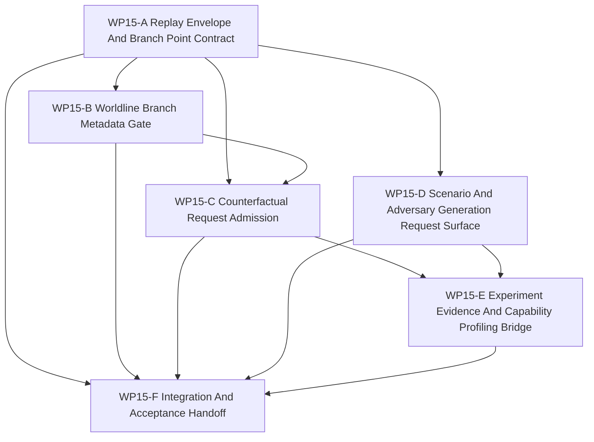

# WP15 Counterfactual Experiment Generation

Status: `2026-05-21` complete / accepted implementation phase.

Language:

- English canonical: `counterfactual_experiment_generation_wp15_20260521.md`
- Chinese companion:
  [counterfactual_experiment_generation_wp15_20260521.zh.md](counterfactual_experiment_generation_wp15_20260521.zh.md)

Inputs:

- [Post-WP9 architecture route plan](../post_wp9_architecture_route_plan_20260520.md)
- [WP8 learning face](../wp8_learning_face/learning_face_wp8_20260520.md)
- [WP10 causal runtime foundation](../wp10_causal_runtime_foundation/causal_runtime_foundation_wp10_20260520.md)
- [WP11 facade vertical slice and provenance](../wp11_facade_vertical_slice_provenance/facade_vertical_slice_provenance_wp11_20260520.md)
- [WP12 information and agency enforcement](../wp12_information_agency_enforcement/information_agency_enforcement_wp12_20260520.md)
- [WP13 backend fidelity expansion](../wp13_backend_fidelity_expansion/backend_fidelity_expansion_wp13_20260520.md)
- [WP14 capability composition](../wp14_capability_composition/capability_composition_wp14_20260521.md)
- [Simulation system architecture design](../../../plan/architecture/simulation_system_architecture_design.md)
- [Post-WP9 gap analysis](../../review/post_wp9_gap_analysis_20260520.md)
- [Subagent Usage Policy](../../../standards/governance/subagent_usage_policy.md)
- [WP Closure Lane Policy](../../../standards/governance/wp_closure_lane_policy.md)

Naming and commit-message note:

- `WP15` is only the task-index and audit label for Phase 6 of the post-WP9
  route: counterfactual and experiment generation.
- Commit messages should not include internal work-package labels such as
  `WP15`. Use capability/result language, for example
  `Add replay envelope admission contracts` or
  `Gate counterfactual requests behind evidence ancestry`.

## 1. Purpose

`WP15` opens the counterfactual and experiment-generation phase. It consumes the
accepted causal, facade, agency, backend/fidelity, and capability evidence from
`WP10` through `WP14`, then creates the first maintained gates for branchable
worldlines, replay envelopes, scenario/adversary generation requests, and
experiment evidence ancestry.

The goal is not to claim full snapshot/restore or autonomous counterfactual
rollouts in the first slice. The goal is to make any future counterfactual
request machine-checkable before it can mutate state, produce evidence, or
inform learning/capability profiles.

Target chain:

```text
deterministic replay envelope
  -> branch point and snapshot/barrier evidence
  -> worldline branch metadata
  -> counterfactual admission result
  -> scenario/adversary generation request
  -> experiment run and comparison evidence ancestry
```

`WP15` is an implementation phase. Planning documents alone do not pass a gate.

## 2. Scope Boundary

`WP15` can:

1. Add typed replay envelope, branch point, worldline, counterfactual request,
   generation request, and experiment evidence contract vocabulary.
2. Validate seed, snapshot, barrier, event-order, facade provenance, backend
   profile, capability bundle, and experiment-evidence ancestry references.
3. Reject counterfactual requests that lack deterministic replay envelopes,
   branch points, baseline worldline ids, intervention intent, authority source,
   or evidence refs.
4. Expose scenario/adversary generation requests as request surfaces with seed,
   version, source, and policy metadata, not as an unrestricted generator
   runtime.
5. Bridge experiment evidence to WP8 capability-profiling vocabulary and WP14
   capability evidence without turning scores into truth claims.
6. Add architecture/runtime/Python tests proving fail-closed admission and
   evidence ancestry behavior.

`WP15` cannot:

1. Claim full snapshot/restore before snapshot boundaries and restore proofs
   exist for the selected slice.
2. Let generated scenarios, adversaries, or interventions mutate authoritative
   simulation state outside facade/request contracts.
3. Treat capability profiles, experiment scores, or generated outcomes as
   support/truth claims.
4. Bypass WP10 barriers, WP11 provenance, WP12 authority, WP13 backend/fidelity
   gates, or WP14 capability evidence.
5. Promote broad generator runtime, public experiment orchestration, or
   maintained worldline branching without replay and snapshot evidence.
6. Create a second semantic lifecycle outside the P0-P10 causal/facade boundary.

Preferred first implementation slice:

```text
ReplayEnvelope / BranchPoint contracts
  -> WorldlineBranchMetadata validation
  -> CounterfactualExperimentRequest admission
  -> scenario/adversary request surface
  -> experiment evidence ancestry fixtures
  -> focused tests proving fail-closed boundaries
```

## 3. Work Packages

| Work package | Status | Route item | Goal | Output |
|--------------|--------|------------|------|--------|
| `WP15-A Replay Envelope And Branch Point Contract` | accepted | deterministic replay envelope | Define replay envelope, branch point, seed, snapshot, barrier, event-order, and facade provenance vocabulary. | [replay envelope and branch point task slice](wp15_replay_envelope_branch_point_cluster_20260521.md) |
| `WP15-B Worldline Branch Metadata Gate` | accepted | branchable worldlines | Define parent/child worldline metadata, mutation intent, provenance refs, and support-state gates without claiming restore support. | [worldline branch metadata task slice](wp15_worldline_branch_metadata_gate_cluster_20260521.md) |
| `WP15-C Counterfactual Request Admission` | accepted | counterfactual admission | Admit or reject counterfactual experiment requests using replay envelope, branch point, intervention, authority, backend, and capability evidence. | [counterfactual admission task slice](wp15_counterfactual_admission_cluster_20260521.md) |
| `WP15-D Scenario And Adversary Generation Request Surface` | accepted | generation request surface | Add request schemas and validation for generated scenarios/adversaries while preserving seed/version/source discipline. | [scenario and adversary generation task slice](wp15_scenario_adversary_generation_surface_cluster_20260521.md) |
| `WP15-E Experiment Evidence And Capability Profiling Bridge` | accepted | experiment evidence ancestry | Link experiment runs, comparisons, generated inputs, capability bundles, backend profiles, and profiling observations without truth-claim promotion. | [experiment evidence bridge task slice](wp15_experiment_evidence_bridge_cluster_20260521.md) |
| `WP15-F Integration And Acceptance Handoff` | accepted | closure lane | Freeze validation commands, residuals, acceptance review, README/route sync, and bilingual closure after A-E are mergeable. | [integration and acceptance task slice](wp15_integration_acceptance_cluster_20260521.md) |

## 4. Dependency Map



Parallel rule:

- `WP15-A` starts first or in the first wave because B, C, and E must share the
  same replay envelope and branch point vocabulary.
- `WP15-B` may start after A if it stays within worldline metadata and does not
  claim restore execution.
- `WP15-C` waits for A/B vocabulary before implementing admission behavior.
- `WP15-D` may run beside A if it owns only scenario/adversary request schemas
  and uses evidence references rather than editing the replay contract.
- `WP15-E` waits for C/D admission and generation surfaces.
- `WP15-F` is serial integration and must not block code streams on README,
  review, archive, or bilingual chores.

## 5. Dispatch Plan

| Stream | Main concern | Write-scope rule | Suggested model / reasoning |
|--------|--------------|------------------|-----------------------------|
| `WP15-A` | Replay envelope, branch point, seed/snapshot/barrier/event-order/provenance vocabulary. | Own the new counterfactual/replay contract surface and focused architecture tests. Do not edit scenario generation. | Complex contract seam: `gpt-5.4`, xhigh. |
| `WP15-B` | Worldline ids, parent/child branch metadata, mutation intent, provenance refs, and unsupported-restore gate. | Own worldline metadata validators/tests after A. Do not modify admission or generation files concurrently. | Complex semantic gate: `gpt-5.4`, xhigh. |
| `WP15-C` | Counterfactual request admission and fail-closed rejection reasons. | Own admission structs/helpers and facade/binding proof if exposed. Wait for A/B vocabulary. | Complex admission surface: `gpt-5.4`, xhigh. |
| `WP15-D` | Scenario/adversary generation request schemas, seed/version/source discipline, and compiler/runtime non-mutation guard. | Own Python scenario generation request files and scenario tests. Do not edit replay contracts. | Medium-complex request surface: `gpt-5.4`, high. |
| `WP15-E` | Experiment run/comparison evidence, capability profile linkage, backend/fidelity/capability refs, and non-truth-claim gate. | Own experiment evidence bridge files/tests after C/D. Do not promote profile scores. | Complex evidence bridge: `gpt-5.4`, high. |
| `WP15-F` | Validation regression, residual register, acceptance review, README/route sync, bilingual closure. | Serial owner after A-E are mergeable; do not parallelize with implementation workers on the same normative table. | Light closure: mini model with xhigh, or `gpt-5.4` medium if code conflicts remain. |

Worker rule:

- Use the project [Subagent Usage Policy](../../../standards/governance/subagent_usage_policy.md).
- Workers are not alone in the codebase; they must not revert unrelated edits or
  edits from other workers.
- Each worker must return touched files, commands run, blockers, residuals, and
  integration notes.
- A stream may be reported `Mergeable` with code/test evidence before README,
  archive, acceptance, or bilingual closure is complete.

## 6. Required Acceptance Artifacts

No `WP15` gate may be reported as accepted unless the acceptance packet includes
all required artifacts below.

| Artifact | Required status | Purpose |
|----------|-----------------|---------|
| `docs/task/simulation_architecture/wp15_counterfactual_experiment_generation/counterfactual_experiment_generation_wp15_20260521.md` | required | Normative English definition of WP15 scope, streams, and gate rules. |
| `docs/task/simulation_architecture/wp15_counterfactual_experiment_generation/counterfactual_experiment_generation_wp15_20260521.zh.md` | required | Chinese companion for the same normative rules. |
| `docs/task/simulation_architecture/wp15_counterfactual_experiment_generation/wp15_replay_envelope_branch_point_cluster_20260521.md` | required | English WP15-A replay envelope and branch point task slice. |
| `docs/task/simulation_architecture/wp15_counterfactual_experiment_generation/wp15_replay_envelope_branch_point_cluster_20260521.zh.md` | required | Chinese WP15-A companion. |
| `docs/task/simulation_architecture/wp15_counterfactual_experiment_generation/wp15_worldline_branch_metadata_gate_cluster_20260521.md` | required | English WP15-B worldline metadata task slice. |
| `docs/task/simulation_architecture/wp15_counterfactual_experiment_generation/wp15_worldline_branch_metadata_gate_cluster_20260521.zh.md` | required | Chinese WP15-B companion. |
| `docs/task/simulation_architecture/wp15_counterfactual_experiment_generation/wp15_counterfactual_admission_cluster_20260521.md` | required | English WP15-C admission task slice. |
| `docs/task/simulation_architecture/wp15_counterfactual_experiment_generation/wp15_counterfactual_admission_cluster_20260521.zh.md` | required | Chinese WP15-C companion. |
| `docs/task/simulation_architecture/wp15_counterfactual_experiment_generation/wp15_scenario_adversary_generation_surface_cluster_20260521.md` | required | English WP15-D generation request task slice. |
| `docs/task/simulation_architecture/wp15_counterfactual_experiment_generation/wp15_scenario_adversary_generation_surface_cluster_20260521.zh.md` | required | Chinese WP15-D companion. |
| `docs/task/simulation_architecture/wp15_counterfactual_experiment_generation/wp15_experiment_evidence_bridge_cluster_20260521.md` | required | English WP15-E experiment evidence task slice. |
| `docs/task/simulation_architecture/wp15_counterfactual_experiment_generation/wp15_experiment_evidence_bridge_cluster_20260521.zh.md` | required | Chinese WP15-E companion. |
| `docs/task/simulation_architecture/wp15_counterfactual_experiment_generation/wp15_integration_acceptance_cluster_20260521.md` | required | English WP15-F integration and acceptance task slice. |
| `docs/task/simulation_architecture/wp15_counterfactual_experiment_generation/wp15_integration_acceptance_cluster_20260521.zh.md` | required | Chinese WP15-F companion. |
| `docs/task/review/wp15_counterfactual_experiment_generation_acceptance_review_20260521.md` | required before acceptance | English final acceptance decision record. |
| `docs/task/review/wp15_counterfactual_experiment_generation_acceptance_review_20260521.zh.md` | required before acceptance | Chinese acceptance companion. |

Artifact rule:

- Missing task artifacts keep WP15 planning incomplete.
- The acceptance review is present and should remain aligned with the packet.
- Documentation-only updates do not pass an implementation gate.

## 7. Strict Gate Rules

| Gate | Required evidence | Pass rule | Fail rule |
|------|-------------------|-----------|-----------|
| `WP15-A Replay Envelope And Branch Point Contract` | Typed replay envelope, branch point, seed, snapshot, barrier, event-order, facade provenance, and validation tests. | Pass only if replay/branch references are code-owned, deterministic, and fail closed when required ancestry is missing. | Fail if replay envelope remains prose-only or implies snapshot/restore support without evidence. |
| `WP15-B Worldline Branch Metadata Gate` | Parent/child worldline ids, branch reason, mutation intent, provenance refs, support state, and unsupported-restore rejection tests. | Pass only if metadata can name a branch without claiming executable restore. | Fail if branch metadata allows raw state mutation or hides unsupported restore behind diagnostics. |
| `WP15-C Counterfactual Request Admission` | Request/admission DTOs, allowed intervention/source vocabulary, evidence refs, rejection reasons, and focused facade/binding proof when exposed. | Pass only if missing envelope, branch point, authority, evidence, or unsupported intervention fails closed. | Fail if counterfactual requests bypass facade authority, backend/fidelity gates, or capability evidence. |
| `WP15-D Scenario And Adversary Generation Request Surface` | Generation request schema, seed/version/source fields, scenario compiler/runtime non-mutation guard, and deterministic fixtures. | Pass only if generated inputs are requests/evidence, not direct authoritative state writes. | Fail if generator output mutates runtime state outside maintained setup/admission contracts. |
| `WP15-E Experiment Evidence And Capability Profiling Bridge` | Experiment run, comparison, generated-input, capability, backend/fidelity, and profiling evidence refs with non-truth-claim guard. | Pass only if profiles and scores remain evidence observations, not support claims. | Fail if experiment results promote backend/fidelity/capability support without accepted gates. |
| `WP15-F Integration And Acceptance Handoff` | A-E status, exact validation commands, residual register, acceptance-review draft, route/README sync, and bilingual closure. | Pass only after implementation gates are mergeable and residuals are recorded honestly. | Fail if closure text claims full counterfactual rollout, full snapshot/restore, broad generator runtime, or truth promotion. |

## 8. Validation Commands

Expected focused validation set:

```bash
git diff --check
python -m pytest -q tests/architecture/test_wp15_*.py
python -m pytest -q tests/scenario/test_wp15_*.py
python -m pytest -q tests/runtime/facade/test_runtime_facade.py -k "counterfactual or replay or experiment"
python tools/maintenance/wp_doc_closure_audit.py --wp WP15
```

Implementation gate minimums by slice:

- `WP15-A`: `git diff --check`; `python -m pytest -q tests/architecture/causal_runtime/test_replay_envelope_contracts.py`.
- `WP15-B`: `git diff --check`; `python -m pytest -q tests/architecture/causal_runtime/test_worldline_branch_metadata.py`.
- `WP15-C`: `git diff --check`; `python -m pytest -q tests/architecture/causal_runtime/test_counterfactual_admission.py`; facade/binding test if a public surface is added.
- `WP15-D`: `git diff --check`; `python -m pytest -q tests/scenario/test_scenario_generation_contracts.py`; `python -m pytest -q tests/scenario/test_scenario_compiler.py -k "branch or runtime"`.
- `WP15-E`: `git diff --check`; `python -m pytest -q tests/architecture/causal_runtime/test_experiment_evidence_bridge.py`; relevant WP8/WP14 focused tests if touched.
- `WP15-F`: `git diff --check`; `python -m pytest -q tests/architecture/test_wp15_*.py`; `python -m pytest -q tests/scenario/test_wp15_*.py`; `python tools/maintenance/wp_doc_closure_audit.py --wp WP15`.

Worker-specific tests should be narrower and named in each cluster handoff.
The final acceptance review should report exact commands as `passed`, `failed`,
or `blocked`.

## 9. Non-Goals

- Full snapshot/restore.
- Maintained counterfactual rollout execution before replay/snapshot proof.
- Raw state mutation by generated scenario/adversary/intervention code.
- Broad public experiment orchestration.
- Treating capability profiles, experiment scores, or generated outcomes as
  truth/support claims.
- Backend/fidelity promotion, exact GPU promotion, resident-state promotion, or
  multi-fidelity promotion.
- A second semantic lifecycle outside the causal/facade boundary.
