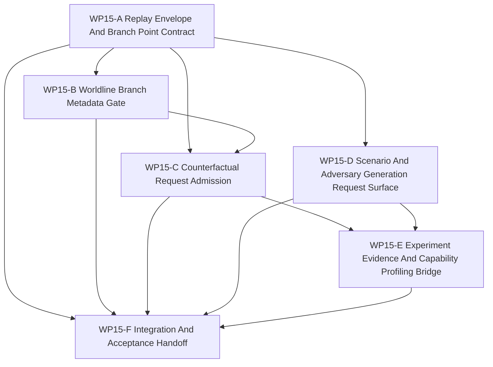

# WP15 Counterfactual Experiment Generation

状态：`2026-05-21` complete / accepted implementation phase。

语言版本：

- 英文主文：[counterfactual_experiment_generation_wp15_20260521.md](counterfactual_experiment_generation_wp15_20260521.md)
- 中文辅文：`counterfactual_experiment_generation_wp15_20260521.zh.md`

输入：

- [Post-WP9 architecture route plan](../post_wp9_architecture_route_plan_20260520.zh.md)
- [WP8 learning face](../wp8_learning_face/learning_face_wp8_20260520.zh.md)
- [WP10 causal runtime foundation](../wp10_causal_runtime_foundation/causal_runtime_foundation_wp10_20260520.zh.md)
- [WP11 facade vertical slice and provenance](../wp11_facade_vertical_slice_provenance/facade_vertical_slice_provenance_wp11_20260520.zh.md)
- [WP12 information and agency enforcement](../wp12_information_agency_enforcement/information_agency_enforcement_wp12_20260520.zh.md)
- [WP13 backend fidelity expansion](../wp13_backend_fidelity_expansion/backend_fidelity_expansion_wp13_20260520.zh.md)
- [WP14 capability composition](../wp14_capability_composition/capability_composition_wp14_20260521.zh.md)
- [仿真系统架构设计](../../../plan/architecture/simulation_system_architecture_design.zh.md)
- [Post-WP9 gap analysis](../../review/post_wp9_gap_analysis_20260520.zh.md)
- [Subagent 使用规范](../../../standards/governance/subagent_usage_policy.zh.md)
- [WP Closure Lane Policy](../../../standards/governance/wp_closure_lane_policy.zh.md)

命名与提交信息规则：

- `WP15` 只是 post-WP9 路线 Phase 6 counterfactual and experiment generation
  的任务索引与审计标签。
- commit message 不应包含 `WP15` 这类工程内编号；应使用能力/结果语言，例如
  `Add replay envelope admission contracts` 或
  `Gate counterfactual requests behind evidence ancestry`。

## 1. 目的

`WP15` 开启 counterfactual and experiment-generation phase。它消费 `WP10` 到
`WP14` 已验收的 causal、facade、agency、backend/fidelity 与 capability evidence，
并为 branchable worldlines、replay envelopes、scenario/adversary generation
requests 与 experiment evidence ancestry 建立第一批维护中 gate。

第一切片的目标不是声明完整 snapshot/restore，也不是声明 autonomous
counterfactual rollout。目标是让未来任何 counterfactual request 在能够改变状态、
产出 evidence 或影响 learning/capability profile 之前，先变成可机器检查的请求。

目标链路：

```text
deterministic replay envelope
  -> branch point and snapshot/barrier evidence
  -> worldline branch metadata
  -> counterfactual admission result
  -> scenario/adversary generation request
  -> experiment run and comparison evidence ancestry
```

`WP15` 是 implementation phase。只有规划文档不能通过 gate。

## 2. 范围边界

`WP15` 可以：

1. 添加 replay envelope、branch point、worldline、counterfactual request、
   generation request 与 experiment evidence 的 typed contract vocabulary。
2. 校验 seed、snapshot、barrier、event-order、facade provenance、backend
   profile、capability bundle 与 experiment-evidence ancestry references。
3. 拒绝缺少 deterministic replay envelope、branch point、baseline worldline id、
   intervention intent、authority source 或 evidence refs 的 counterfactual request。
4. 把 scenario/adversary generation 暴露为带 seed、version、source 与 policy
   metadata 的 request surface，而不是无限制 generator runtime。
5. 把 experiment evidence 桥接到 WP8 capability-profiling vocabulary 与 WP14
   capability evidence，但不把 score 变成 truth/support claim。
6. 添加 architecture/runtime/Python tests，证明 fail-closed admission 与 evidence
   ancestry 行为。

`WP15` 不能：

1. 在 selected slice 存在 snapshot boundary 与 restore proof 之前声明完整
   snapshot/restore。
2. 让生成的 scenario、adversary 或 intervention 绕过 facade/request contracts 去修改
   authoritative simulation state。
3. 把 capability profile、experiment score 或 generated outcome 当作 support/truth
   claim。
4. 绕过 WP10 barriers、WP11 provenance、WP12 authority、WP13 backend/fidelity gates
   或 WP14 capability evidence。
5. 在 replay/snapshot evidence 之前晋级 broad generator runtime、public experiment
   orchestration 或 maintained worldline branching。
6. 在 P0-P10 causal/facade boundary 之外创建第二条 semantic lifecycle。

首选第一实现切片：

```text
ReplayEnvelope / BranchPoint contracts
  -> WorldlineBranchMetadata validation
  -> CounterfactualExperimentRequest admission
  -> scenario/adversary request surface
  -> experiment evidence ancestry fixtures
  -> focused tests proving fail-closed boundaries
```

## 3. 工作包

| 工作包 | 状态 | 路线项 | 目标 | 产出 |
|--------|------|--------|------|------|
| `WP15-A Replay Envelope And Branch Point Contract` | mergeable / first slice complete | deterministic replay envelope | 定义 replay envelope、branch point、seed、snapshot、barrier、event-order 与 facade provenance vocabulary。 | [replay envelope and branch point 任务切片](wp15_replay_envelope_branch_point_cluster_20260521.zh.md) |
| `WP15-B Worldline Branch Metadata Gate` | mergeable / first slice complete | branchable worldlines | 定义 parent/child worldline metadata、mutation intent、provenance refs 与 support-state gates，同时不声明 restore support。 | [worldline branch metadata 任务切片](wp15_worldline_branch_metadata_gate_cluster_20260521.zh.md) |
| `WP15-C Counterfactual Request Admission` | mergeable / first slice complete | counterfactual admission | 使用 replay envelope、branch point、intervention、authority、backend 与 capability evidence 来接受或拒绝 counterfactual experiment requests。 | [counterfactual admission 任务切片](wp15_counterfactual_admission_cluster_20260521.zh.md) |
| `WP15-D Scenario And Adversary Generation Request Surface` | mergeable / first slice complete | generation request surface | 添加 generated scenarios/adversaries 的 request schemas 与 validation，同时保持 seed/version/source discipline。 | [scenario and adversary generation 任务切片](wp15_scenario_adversary_generation_surface_cluster_20260521.zh.md) |
| `WP15-E Experiment Evidence And Capability Profiling Bridge` | mergeable / first slice complete | experiment evidence ancestry | 连接 experiment runs、comparisons、generated inputs、capability bundles、backend profiles 与 profiling observations，同时不晋级 truth claim。 | [experiment evidence bridge 任务切片](wp15_experiment_evidence_bridge_cluster_20260521.zh.md) |
| `WP15-F Integration And Acceptance Handoff` | accepted | closure lane | A-E mergeable 后冻结 validation commands、residuals、acceptance review、README/route sync 与 bilingual closure。 | [integration and acceptance 任务切片](wp15_integration_acceptance_cluster_20260521.zh.md) |

## 4. 依赖图



并行规则：

- `WP15-A` 应最先启动或进入第一波，因为 B、C 与 E 共享 replay envelope 与 branch
  point vocabulary。
- `WP15-B` 可在 A 后启动，但必须只负责 worldline metadata，不得声明 restore execution。
- `WP15-C` 等待 A/B vocabulary 后再实现 admission behavior。
- `WP15-D` 可与 A 并行，只要它只负责 scenario/adversary request schemas，并通过
  evidence refs 接入，而不编辑 replay contract。
- `WP15-E` 等待 C/D admission 与 generation surfaces。
- `WP15-F` 是串行 integration，不应让 README、review、archive 或 bilingual chores
  阻塞代码流。

## 5. 分发计划

| Stream | 主要关注点 | 写入范围规则 | 建议模型 / 思考预算 |
|--------|------------|--------------|---------------------|
| `WP15-A` | Replay envelope、branch point、seed/snapshot/barrier/event-order/provenance vocabulary。 | 负责新的 counterfactual/replay contract surface 与 focused architecture tests。不编辑 scenario generation。 | 复杂 contract seam：`gpt-5.4`，xhigh。 |
| `WP15-B` | Worldline ids、parent/child branch metadata、mutation intent、provenance refs 与 unsupported-restore gate。 | A 后负责 worldline metadata validators/tests。不与 admission 或 generation 文件并发修改。 | 复杂语义 gate：`gpt-5.4`，xhigh。 |
| `WP15-C` | Counterfactual request admission 与 fail-closed rejection reasons。 | 负责 admission structs/helpers；若暴露 public surface，则负责 facade/binding proof。等待 A/B vocabulary。 | 复杂 admission surface：`gpt-5.4`，xhigh。 |
| `WP15-D` | Scenario/adversary generation request schemas、seed/version/source discipline 与 compiler/runtime non-mutation guard。 | 负责 Python scenario generation request files 与 scenario tests。不编辑 replay contracts。 | 中高复杂 request surface：`gpt-5.4`，high。 |
| `WP15-E` | Experiment run/comparison evidence、capability profile linkage、backend/fidelity/capability refs 与 non-truth-claim gate。 | C/D 后负责 experiment evidence bridge files/tests。不晋级 profile scores。 | 复杂 evidence bridge：`gpt-5.4`，high。 |
| `WP15-F` | Validation regression、residual register、acceptance review、README/route sync、bilingual closure。 | A-E mergeable 后串行负责。 | 轻量收尾：mini model with xhigh；若存在代码冲突则 `gpt-5.4` medium。 |

Worker 规则：

- 使用项目 [Subagent 使用规范](../../../standards/governance/subagent_usage_policy.zh.md)。
- worker 并非独占代码库；不得回滚无关编辑或其他 worker 的编辑。
- 每个 worker 必须返回 touched files、commands run、blockers、residuals 与
  integration notes。
- stream 可以在 code/test evidence 完备后标为 `Mergeable`，README、archive、
  acceptance 或 bilingual closure 由 closure lane 处理。

## 6. 必需验收产物

缺少下列 required artifact 时，不得把 `WP15` gate 报告为 accepted。

| Artifact | Required status | Purpose |
|----------|-----------------|---------|
| `docs/task/simulation_architecture/wp15_counterfactual_experiment_generation/counterfactual_experiment_generation_wp15_20260521.md` | required | WP15 scope、streams 与 gate rules 的英文规范定义。 |
| `docs/task/simulation_architecture/wp15_counterfactual_experiment_generation/counterfactual_experiment_generation_wp15_20260521.zh.md` | required | 同一规范的中文辅文。 |
| `docs/task/simulation_architecture/wp15_counterfactual_experiment_generation/wp15_replay_envelope_branch_point_cluster_20260521.md` | required | 英文 WP15-A replay envelope and branch point 任务切片。 |
| `docs/task/simulation_architecture/wp15_counterfactual_experiment_generation/wp15_replay_envelope_branch_point_cluster_20260521.zh.md` | required | 中文 WP15-A 辅文。 |
| `docs/task/simulation_architecture/wp15_counterfactual_experiment_generation/wp15_worldline_branch_metadata_gate_cluster_20260521.md` | required | 英文 WP15-B worldline metadata 任务切片。 |
| `docs/task/simulation_architecture/wp15_counterfactual_experiment_generation/wp15_worldline_branch_metadata_gate_cluster_20260521.zh.md` | required | 中文 WP15-B 辅文。 |
| `docs/task/simulation_architecture/wp15_counterfactual_experiment_generation/wp15_counterfactual_admission_cluster_20260521.md` | required | 英文 WP15-C admission 任务切片。 |
| `docs/task/simulation_architecture/wp15_counterfactual_experiment_generation/wp15_counterfactual_admission_cluster_20260521.zh.md` | required | 中文 WP15-C 辅文。 |
| `docs/task/simulation_architecture/wp15_counterfactual_experiment_generation/wp15_scenario_adversary_generation_surface_cluster_20260521.md` | required | 英文 WP15-D generation request 任务切片。 |
| `docs/task/simulation_architecture/wp15_counterfactual_experiment_generation/wp15_scenario_adversary_generation_surface_cluster_20260521.zh.md` | required | 中文 WP15-D 辅文。 |
| `docs/task/simulation_architecture/wp15_counterfactual_experiment_generation/wp15_experiment_evidence_bridge_cluster_20260521.md` | required | 英文 WP15-E experiment evidence 任务切片。 |
| `docs/task/simulation_architecture/wp15_counterfactual_experiment_generation/wp15_experiment_evidence_bridge_cluster_20260521.zh.md` | required | 中文 WP15-E 辅文。 |
| `docs/task/simulation_architecture/wp15_counterfactual_experiment_generation/wp15_integration_acceptance_cluster_20260521.md` | required | 英文 WP15-F integration and acceptance 任务切片。 |
| `docs/task/simulation_architecture/wp15_counterfactual_experiment_generation/wp15_integration_acceptance_cluster_20260521.zh.md` | required | 中文 WP15-F 辅文。 |
| `docs/task/review/wp15_counterfactual_experiment_generation_acceptance_review_20260521.md` | required before acceptance | 英文最终验收决策记录。 |
| `docs/task/review/wp15_counterfactual_experiment_generation_acceptance_review_20260521.zh.md` | required before acceptance | 中文验收辅文。 |

Artifact 规则：

- 缺少任务产物时，WP15 planning 不完整。
- 验收审查现已存在，并应保持与 packet 对齐。
- 文档更新本身不能通过 implementation gate。

## 7. 严格 Gate 规则

| Gate | Required evidence | Pass rule | Fail rule |
|------|-------------------|-----------|-----------|
| `WP15-A Replay Envelope And Branch Point Contract` | Typed replay envelope、branch point、seed、snapshot、barrier、event-order、facade provenance 与 validation tests。 | 只有 replay/branch references 是 code-owned、deterministic，并在缺失 ancestry 时 fail closed，才通过。 | 若 replay envelope 仍只存在于散文中，或暗示无证据的 snapshot/restore support，则失败。 |
| `WP15-B Worldline Branch Metadata Gate` | Parent/child worldline ids、branch reason、mutation intent、provenance refs、support state 与 unsupported-restore rejection tests。 | 只有 metadata 能命名 branch 但不声明 executable restore，才通过。 | 若 branch metadata 允许 raw state mutation，或把 unsupported restore 藏在 diagnostics 后，则失败。 |
| `WP15-C Counterfactual Request Admission` | Request/admission DTOs、allowed intervention/source vocabulary、evidence refs、rejection reasons；若暴露则需 focused facade/binding proof。 | 只有缺少 envelope、branch point、authority、evidence 或 unsupported intervention 时 fail closed，才通过。 | 若 counterfactual requests 绕过 facade authority、backend/fidelity gates 或 capability evidence，则失败。 |
| `WP15-D Scenario And Adversary Generation Request Surface` | Generation request schema、seed/version/source fields、scenario compiler/runtime non-mutation guard 与 deterministic fixtures。 | 只有 generated inputs 是 requests/evidence，而非 direct authoritative state writes，才通过。 | 若 generator output 绕过 maintained setup/admission contracts 直接修改 runtime state，则失败。 |
| `WP15-E Experiment Evidence And Capability Profiling Bridge` | Experiment run、comparison、generated-input、capability、backend/fidelity 与 profiling evidence refs，以及 non-truth-claim guard。 | 只有 profiles 与 scores 仍为 evidence observations 而非 support claims，才通过。 | 若 experiment results 无 accepted gate 即晋级 backend/fidelity/capability support，则失败。 |
| `WP15-F Integration And Acceptance Handoff` | A-E 状态、精确 validation commands、residual register、acceptance-review draft、route/README sync 与 bilingual closure。 | 只有 implementation gates mergeable 且 residuals 被诚实记录后通过。 | 若 closure 文本声称 full counterfactual rollout、full snapshot/restore、broad generator runtime 或 truth promotion，则失败。 |

## 8. 验证命令

预期 focused validation set：

```bash
git diff --check
python -m pytest -q tests/architecture/test_wp15_*.py
python -m pytest -q tests/scenario/test_wp15_*.py
python -m pytest -q tests/runtime/facade/test_runtime_facade.py -k "counterfactual or replay or experiment"
python tools/maintenance/wp_doc_closure_audit.py --wp WP15
```

各 slice 的实现门槛最低应包括：

- `WP15-A`：`git diff --check`；`python -m pytest -q tests/architecture/causal_runtime/test_replay_envelope_contracts.py`。
- `WP15-B`：`git diff --check`；`python -m pytest -q tests/architecture/causal_runtime/test_worldline_branch_metadata.py`。
- `WP15-C`：`git diff --check`；`python -m pytest -q tests/architecture/causal_runtime/test_counterfactual_admission.py`；若添加 public surface，补 facade/binding test。
- `WP15-D`：`git diff --check`；`python -m pytest -q tests/scenario/test_wp15_generation_request_surface.py`；`python -m pytest -q tests/scenario/test_scenario_compiler.py -k "branch or runtime"`。
- `WP15-E`：`git diff --check`；`python -m pytest -q tests/architecture/causal_runtime/test_experiment_evidence_bridge.py`；若触及 WP8/WP14 表面，补相关 focused tests。
- `WP15-F`：`git diff --check`；`python -m pytest -q tests/architecture/test_wp15_*.py`；`python -m pytest -q tests/scenario/test_wp15_*.py`；`python tools/maintenance/wp_doc_closure_audit.py --wp WP15`。

每个 worker 应在 handoff 中列出更窄的实际测试目标。最终验收审查必须把精确命令记录为
`passed`、`failed` 或 `blocked`。

## 9. 非目标

- Full snapshot/restore。
- 在 replay/snapshot proof 前声明 maintained counterfactual rollout execution。
- Generated scenario/adversary/intervention code 直接修改 raw state。
- Broad public experiment orchestration。
- 把 capability profiles、experiment scores 或 generated outcomes 当作 truth/support
  claims。
- Backend/fidelity promotion、exact GPU promotion、resident-state promotion 或
  multi-fidelity promotion。
- Causal/facade boundary 之外的第二条 semantic lifecycle。
