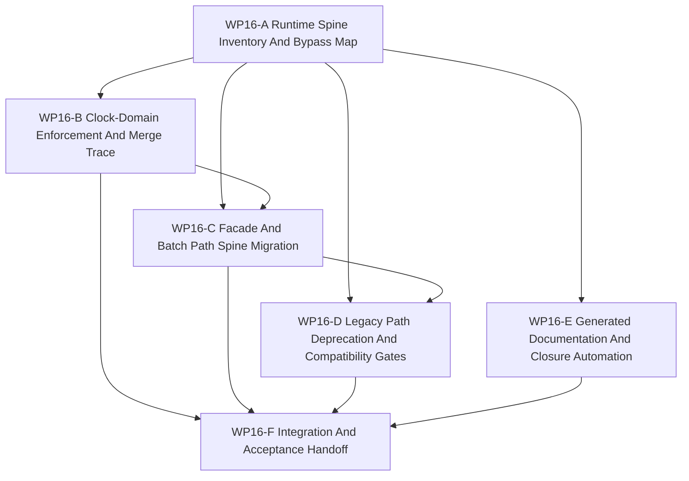

# WP16 Runtime Spine Consolidation

Status: `2026-05-21` complete / accepted runtime-spine consolidation.

Language:

- English canonical: `runtime_spine_consolidation_wp16_20260521.md`
- Chinese companion:
  [runtime_spine_consolidation_wp16_20260521.zh.md](runtime_spine_consolidation_wp16_20260521.zh.md)

Inputs:

- [Post-WP9 architecture route plan](../post_wp9_architecture_route_plan_20260520.md)
- [WP10 causal runtime foundation](../wp10_causal_runtime_foundation/causal_runtime_foundation_wp10_20260520.md)
- [WP11 facade vertical slice and provenance](../wp11_facade_vertical_slice_provenance/facade_vertical_slice_provenance_wp11_20260520.md)
- [WP12 information and agency enforcement](../wp12_information_agency_enforcement/information_agency_enforcement_wp12_20260520.md)
- [WP13 backend fidelity expansion](../wp13_backend_fidelity_expansion/backend_fidelity_expansion_wp13_20260520.md)
- [WP14 capability composition](../wp14_capability_composition/capability_composition_wp14_20260521.md)
- [WP15 counterfactual experiment generation](../wp15_counterfactual_experiment_generation/counterfactual_experiment_generation_wp15_20260521.md)
- [Post-WP9 gap analysis](../../review/post_wp9_gap_analysis_20260520.md)
- [Simulation system architecture design](../../../plan/architecture/simulation_system_architecture_design.md)
- [Subagent Usage Policy](../../../standards/governance/subagent_usage_policy.md)
- [WP Closure Lane Policy](../../../standards/governance/wp_closure_lane_policy.md)

Naming and commit-message note:

- `WP16` is only the task-index and audit label for the runtime-spine
  consolidation phase.
- Commit messages should use capability/result language, for example
  `Enforce runtime clock-domain cadence` or
  `Route batch consumers through facade evidence`, not internal labels.

## 1. Purpose

`WP10` through `WP15` established the post-WP9 causal, facade, agency,
backend/fidelity, capability, and counterfactual evidence boundaries. `WP16`
starts the next kind of work: turning those accepted boundaries into the
maintained default runtime path.

The phase should not create another vocabulary layer. It should inventory
remaining bypasses, choose the maintained runtime spine, enforce the first
strict clock-domain cadence required by `GAP-9`, migrate facade/batch consumers
toward the spine, and classify legacy paths as preserved, wrapped, deprecated,
or removed.

Target spine:

```text
setup/admission request
  -> scheduling-window input injection
  -> clock-domain trigger and skip decision
  -> manifest-derived node execution
  -> barrier and event evidence
  -> observation/facade export
  -> training, scenario, and experiment consumer
```

`WP16` is an implementation-planning and implementation-dispatch phase.
The closure packet now exists in `docs/task/review/` and records the accepted
boundary; planning documents alone still do not pass a gate.

## 2. GAP-9 Position

`GAP-9` says that scheduler-visible clock domains must stop being decorative:
nodes whose clock domain has not fired in the current window must be skipped,
deferred, or rejected with evidence. The post-WP9 route intentionally deferred
strict enforcement until the window-loop skeleton was working. That condition is
now satisfied by the accepted `WP10` window loop and the follow-on evidence
tracks.

`WP16` therefore promotes `GAP-9` into the mainline:

- nested clock domains must declare a trigger multiple, slot, event predicate,
  or export cadence before a maintained node can execute;
- skipped nodes must appear in execution evidence with stable reason codes;
- independent clock-domain inputs must be rejected or diagnostics-only unless a
  deterministic `clock_merge_policy`, source time, source snapshot, target
  window, and barrier ordering record exist;
- `ActionHoldPolicy` may be consumed as cadence metadata, but policy/control/
  physics multi-rate behavior is accepted only for the selected spine slice.

This is not a full scheduler rewrite. It is the first maintained cadence gate
for the default runtime spine.

## 3. Scope Boundary

`WP16` can:

1. Inventory runtime/facade/batch/scenario/training/experiment paths that still
   bypass accepted WP10-WP15 boundaries.
2. Define the maintained runtime spine and required evidence carried across its
   setup, scheduling, barrier, facade, and consumer steps.
3. Implement strict clock-domain trigger/skip/merge evidence for the selected
   spine slice, including `GAP-9` nested-trigger enforcement.
4. Migrate maintained facade and batch consumers toward the spine without
   forcing all callers through a breaking API change.
5. Add compatibility gates and deprecation records for raw runtime, direct ECS,
   legacy spawn, and diagnostics-only paths.
6. Add generated or machine-readable closure summaries so README/review sync no
   longer blocks the main implementation path.

`WP16` cannot:

1. Rewrite the whole scheduler or claim global multi-rate scheduling.
2. Remove legacy APIs before compatibility and diagnostics boundaries are
   explicit.
3. Promote independent clock domains without deterministic merge policy,
   source-time, snapshot, and barrier-order evidence.
4. Treat clock-domain skips as silent no-ops; skips must be visible in evidence.
5. Reopen WP10-WP15 accepted scope or weaken their authority, provenance,
   backend/fidelity, capability, or replay gates.
6. Replace human acceptance decisions with generated documentation.

## 4. Work Packages

| Work package | Status | Main concern | Goal | Output |
|--------------|--------|--------------|------|--------|
| `WP16-A Runtime Spine Inventory And Bypass Map` | complete | bypass audit | Inventory maintained, compatibility, diagnostics-only, and raw-bypass paths touching runtime/facade/batch/scenario/training/experiment consumers. | [runtime spine inventory task slice](wp16_runtime_spine_inventory_cluster_20260521.md) |
| `WP16-B Clock-Domain Enforcement And Merge Trace` | complete | `GAP-9` enforcement | Add the first strict trigger/skip/merge evidence gate for clock-domain cadence on the selected spine slice. | [clock-domain enforcement task slice](wp16_clock_domain_enforcement_cluster_20260521.md) |
| `WP16-C Facade And Batch Path Spine Migration` | complete | default path migration | Route maintained facade, batch, and training-facing consumers through the accepted runtime window/evidence spine where possible. | [facade and batch migration task slice](wp16_facade_batch_spine_migration_cluster_20260521.md) |
| `WP16-D Legacy Path Deprecation And Compatibility Gates` | complete | compatibility boundary | Classify legacy paths as preserved, wrapped, deprecated, removed, or diagnostics-only with guard tests. | [legacy compatibility task slice](wp16_legacy_deprecation_compatibility_cluster_20260521.md) |
| `WP16-E Generated Documentation And Closure Automation` | complete | documentation drag reduction | Produce machine-readable status and generated closure summaries from code/tests/docs rather than hand-syncing every index first. | [documentation automation task slice](wp16_generated_documentation_automation_cluster_20260521.md) |
| `WP16-F Integration And Acceptance Handoff` | complete / accepted | closure lane | Validate A-E, record residuals, sync indexes/routes, and create acceptance review only after implementation gates are mergeable. | [integration and acceptance task slice](wp16_integration_acceptance_cluster_20260521.md) |

## 5. Dependency Map



Parallel rule:

- `WP16-A` starts first because other streams need the same bypass map and spine
  definition.
- `WP16-B` may start once the selected clock-domain slice and manifest nodes are
  named by A.
- `WP16-C` waits for at least the A spine definition and should integrate B's
  trigger/skip evidence when available.
- `WP16-D` can begin from A's inventory but must not delete or deprecate paths
  before C identifies maintained replacements.
- `WP16-E` can run in parallel after A defines status vocabulary, but it must
  not rewrite normative task scope while implementation workers are active.
- `WP16-F` is serial closure after A-E are mergeable.

## 6. Dispatch Plan

| Stream | Main concern | Write-scope rule | Suggested model / reasoning |
|--------|--------------|------------------|-----------------------------|
| `WP16-A` | Runtime spine inventory, bypass map, maintained/compat/diagnostics classification. | Own inventory docs/tests or audit fixtures only. Do not edit scheduler or facade runtime code. | Medium analysis: `gpt-5.4`, high. |
| `WP16-B` | Clock-domain trigger/skip/merge enforcement and evidence for `GAP-9`. | Own scheduler/window coordinator cadence helpers and focused tests. Do not migrate batch consumers. | Complex scheduler seam: `gpt-5.4`, xhigh. |
| `WP16-C` | Facade, world-batch, training, scenario, and experiment consumer migration to the spine. | Own runtime facade/batch adapter paths and integration tests. Coordinate with B before depending on cadence evidence. | Complex integration seam: `gpt-5.4`, xhigh. |
| `WP16-D` | Legacy path deprecation, compatibility wrappers, diagnostics-only gates, and guard allowlists. | Own compatibility/deprecation guard tests and path classification; do not remove public APIs without C replacement evidence. | Medium refactor: `gpt-5.4`, high. |
| `WP16-E` | Generated status summaries, closure audit extensions, and doc-sync reduction. | Own maintenance tooling and generated-status artifacts; do not hand-edit acceptance decisions. | Light tooling: mini model, xhigh. |
| `WP16-F` | Validation, residual register, acceptance review, README/route sync, bilingual closure. | Serial owner after A-E; do not parallelize with implementation workers on the same normative table. | Light closure: mini model, xhigh; use `gpt-5.4` medium if code conflicts remain. |

Worker rule:

- Use the project [Subagent Usage Policy](../../../standards/governance/subagent_usage_policy.md).
- Workers are not alone in the codebase; they must not revert unrelated edits or
  edits from other workers.
- Each worker must return touched files, commands run, blockers, residuals, and
  integration notes.
- A stream may be reported `Mergeable` with code/test evidence before README,
  route, archive, acceptance, or bilingual closure is complete.

## 7. Required Acceptance Artifacts

No `WP16` gate may be reported as accepted unless the acceptance packet includes
all required task artifacts below.

| Artifact | Required status | Purpose |
|----------|-----------------|---------|
| `docs/task/simulation_architecture/wp16_runtime_spine_consolidation/runtime_spine_consolidation_wp16_20260521.md` | required | Normative English definition of WP16 scope, streams, and gate rules. |
| `docs/task/simulation_architecture/wp16_runtime_spine_consolidation/runtime_spine_consolidation_wp16_20260521.zh.md` | required | Chinese companion for the same normative rules. |
| `docs/task/simulation_architecture/wp16_runtime_spine_consolidation/wp16_runtime_spine_inventory_cluster_20260521.md` | required | English WP16-A inventory and bypass-map task slice. |
| `docs/task/simulation_architecture/wp16_runtime_spine_consolidation/wp16_runtime_spine_inventory_cluster_20260521.zh.md` | required | Chinese WP16-A companion. |
| `docs/task/simulation_architecture/wp16_runtime_spine_consolidation/wp16_clock_domain_enforcement_cluster_20260521.md` | required | English WP16-B clock-domain enforcement task slice. |
| `docs/task/simulation_architecture/wp16_runtime_spine_consolidation/wp16_clock_domain_enforcement_cluster_20260521.zh.md` | required | Chinese WP16-B companion. |
| `docs/task/simulation_architecture/wp16_runtime_spine_consolidation/wp16_facade_batch_spine_migration_cluster_20260521.md` | required | English WP16-C facade/batch migration task slice. |
| `docs/task/simulation_architecture/wp16_runtime_spine_consolidation/wp16_facade_batch_spine_migration_cluster_20260521.zh.md` | required | Chinese WP16-C companion. |
| `docs/task/simulation_architecture/wp16_runtime_spine_consolidation/wp16_legacy_deprecation_compatibility_cluster_20260521.md` | required | English WP16-D legacy compatibility task slice. |
| `docs/task/simulation_architecture/wp16_runtime_spine_consolidation/wp16_legacy_deprecation_compatibility_cluster_20260521.zh.md` | required | Chinese WP16-D companion. |
| `docs/task/simulation_architecture/wp16_runtime_spine_consolidation/wp16_generated_documentation_automation_cluster_20260521.md` | required | English WP16-E documentation automation task slice. |
| `docs/task/simulation_architecture/wp16_runtime_spine_consolidation/wp16_generated_documentation_automation_cluster_20260521.zh.md` | required | Chinese WP16-E companion. |
| `docs/task/simulation_architecture/wp16_runtime_spine_consolidation/wp16_integration_acceptance_cluster_20260521.md` | required | English WP16-F integration and acceptance task slice. |
| `docs/task/simulation_architecture/wp16_runtime_spine_consolidation/wp16_integration_acceptance_cluster_20260521.zh.md` | required | Chinese WP16-F companion. |
| `docs/task/review/wp16_runtime_spine_consolidation_acceptance_review_20260521.md` | required before acceptance | English final acceptance decision record. |
| `docs/task/review/wp16_runtime_spine_consolidation_acceptance_review_20260521.zh.md` | required before acceptance | Chinese acceptance companion. |

Artifact rule:

- Missing task artifacts keep WP16 planning incomplete.
- The acceptance review now exists and records the closure boundary for the
  accepted WP16 increment.
- Documentation-only updates do not pass an implementation gate.

## 8. Strict Gate Rules

| Gate | Required evidence | Pass rule | Fail rule |
|------|-------------------|-----------|-----------|
| `WP16-A Runtime Spine Inventory And Bypass Map` | Inventory of raw runtime, direct ECS/state, facade, batch, scenario, training, experiment, spawn, replay, and diagnostics paths with classification. | Pass only if each named path is classified as maintained, compatibility, diagnostics-only, deprecated, or blocked with owner and next gate. | Fail if inventory hides bypasses or treats unknown paths as maintained. |
| `WP16-B Clock-Domain Enforcement And Merge Trace` | Trigger/skip/merge helpers, execution evidence, and tests for nested and independent clock domains on the selected slice. | Pass only if non-triggered maintained nodes are skipped/deferred/rejected with evidence and independent domains fail closed without deterministic merge metadata. | Fail if clock domains remain advisory or skips are silent. |
| `WP16-C Facade And Batch Path Spine Migration` | Maintained facade/batch/training consumer path uses runtime window/evidence spine or records explicit compatibility fallback. | Pass only if migrated paths carry barrier, event, provenance, authority, capability, and cadence evidence required by their consumer. | Fail if consumers regain raw runtime or direct state ownership. |
| `WP16-D Legacy Path Deprecation And Compatibility Gates` | Guard tests and deprecation records for legacy bypasses, compatibility wrappers, diagnostics-only escape hatches, and public API residuals. | Pass only if every legacy path has a bounded status and replacement or reason for retention. | Fail if APIs are removed without replacement evidence or if diagnostics paths become maintained silently. |
| `WP16-E Generated Documentation And Closure Automation` | Machine-readable status source, generated summary or audit extension, and tests/fixtures proving stable output. | Pass only if documentation sync burden is reduced without changing normative acceptance authority. | Fail if generated docs replace acceptance decisions or rewrite canonical task scope unexpectedly. |
| `WP16-F Integration And Acceptance Handoff` | A-E status, exact validation commands, residual register, acceptance review draft, README/route sync, and bilingual closure. | Pass only after implementation gates are mergeable and residuals are recorded honestly. | Fail if closure text claims global scheduler rewrite, full multi-rate support, or deletion of legacy paths without gates. |

## 9. Validation Commands

Expected focused validation set:

```bash
git diff --check
python3 tools/maintenance/wp_doc_closure_audit.py --wp WP16
python -m pytest -q tests/architecture/test_wp16_*.py
python -m pytest -q tests/runtime/facade/test_runtime_facade_window_loop_injection.py -k "clock or window or barrier or evidence"
python -m pytest -q tests/world_batch/test_world_batch_runtime.py tests/runtime/execution/test_execution_episode_batch_prepare.py -k "facade or window or evidence or batch"
```

Implementation gate minimums by slice:

- `WP16-A`: `git diff --check`; inventory/audit test or generated fixture proving bypass classification.
- `WP16-B`: `git diff --check`; focused clock-domain enforcement tests for trigger, skip, defer/reject, and independent merge metadata.
- `WP16-C`: `git diff --check`; facade/batch migration regression plus maintained consumer evidence checks.
- `WP16-D`: `git diff --check`; legacy guard/deprecation tests and allowlist updates if needed.
- `WP16-E`: `git diff --check`; maintenance tooling tests and stable generated-output fixtures.
- `WP16-F`: `git diff --check`; all focused WP16 tests; relevant facade/batch regressions; `python3 tools/maintenance/wp_doc_closure_audit.py --wp WP16`.

Worker-specific tests should be narrower and named in each cluster handoff.
The final acceptance review should report exact commands as `passed`, `failed`,
or `blocked`.

## 10. Non-Goals

- Global scheduler rewrite.
- Full hard-real-time or wall-clock scheduler semantics.
- Full multi-rate policy/control/physics support beyond the selected spine
  slice.
- Removing legacy public APIs before compatibility wrappers and replacement
  evidence exist.
- Independent clock-domain promotion without deterministic merge policy and
  barrier-order evidence.
- Reopening accepted WP10-WP15 scope or weakening accepted guards.
- Treating generated documentation as acceptance authority.
