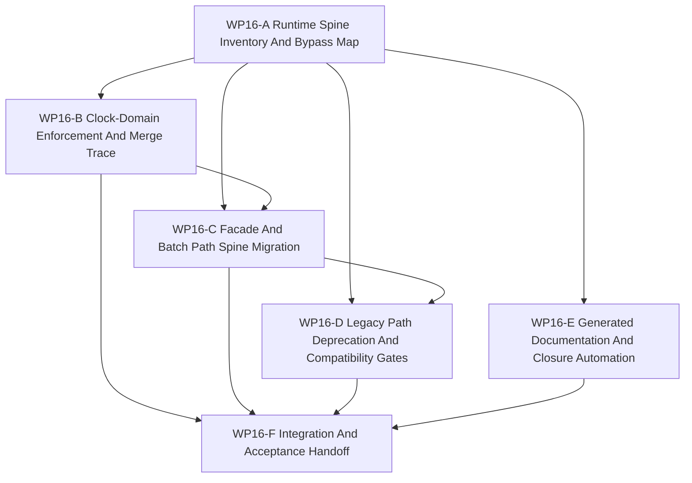

# WP16 Runtime Spine Consolidation

状态：`2026-05-21` complete / accepted runtime-spine consolidation。

语言版本：

- 英文主文：[runtime_spine_consolidation_wp16_20260521.md](runtime_spine_consolidation_wp16_20260521.md)
- 中文辅文：`runtime_spine_consolidation_wp16_20260521.zh.md`

输入：

- [post-WP9 architecture route plan](../post_wp9_architecture_route_plan_20260520.zh.md)
- [WP10 causal runtime foundation](../wp10_causal_runtime_foundation/causal_runtime_foundation_wp10_20260520.zh.md)
- [WP11 facade vertical slice and provenance](../wp11_facade_vertical_slice_provenance/facade_vertical_slice_provenance_wp11_20260520.zh.md)
- [WP12 information and agency enforcement](../wp12_information_agency_enforcement/information_agency_enforcement_wp12_20260520.zh.md)
- [WP13 backend fidelity expansion](../wp13_backend_fidelity_expansion/backend_fidelity_expansion_wp13_20260520.zh.md)
- [WP14 capability composition](../wp14_capability_composition/capability_composition_wp14_20260521.zh.md)
- [WP15 counterfactual experiment generation](../wp15_counterfactual_experiment_generation/counterfactual_experiment_generation_wp15_20260521.zh.md)
- [post-WP9 gap analysis](../../review/post_wp9_gap_analysis_20260520.zh.md)
- [simulation system architecture design](../../../plan/architecture/simulation_system_architecture_design.zh.md)
- [Subagent 使用规范](../../../standards/governance/subagent_usage_policy.zh.md)
- [WP Closure Lane Policy](../../../standards/governance/wp_closure_lane_policy.md)

命名与提交信息说明：

- `WP16` 只是 runtime-spine consolidation 阶段的 task-index 与 audit label。
- commit message 应使用 capability/result language，例如
  `Enforce runtime clock-domain cadence` 或
  `Route batch consumers through facade evidence`，而不是 internal label。

## 1. 目标

`WP10` 到 `WP15` 已经建立 post-WP9 的 causal、facade、agency、
backend/fidelity、capability 与 counterfactual evidence boundaries。`WP16`
进入另一类工作：把这些已验收边界变成维护中的默认运行路径。

本阶段不再制造另一层词汇，而是盘点 remaining bypasses、选择 maintained runtime
spine、执行 `GAP-9` 要求的第一组 strict clock-domain cadence、把 facade/batch
consumer 迁向 spine，并把 legacy path 分级为 preserved、wrapped、deprecated、
removed 或 diagnostics-only。

目标主干：

```text
setup/admission request
  -> scheduling-window input injection
  -> clock-domain trigger and skip decision
  -> manifest-derived node execution
  -> barrier and event evidence
  -> observation/facade export
  -> training, scenario, and experiment consumer
```

`WP16` 是实现规划与实现派发阶段。WP16 的 closure packet 现已存在于
`docs/task/review/` 并记录了已验收边界；只有规划文档仍不能通过 gate。

## 2. GAP-9 定位

`GAP-9` 要求 scheduler-visible clock domains 不再只是装饰字段：当前 window
未触发的 clock domain 对应节点必须被 skip、defer 或 reject，并且留下 evidence。
post-WP9 路线曾有意把 strict enforcement 延后到 window-loop skeleton 可工作之后。
现在 WP10 window loop 与后续 evidence track 已验收，所以这个条件已经满足。

因此 `WP16` 将 `GAP-9` 晋升为主线：

- nested clock domains 必须声明 trigger multiple、slot、event predicate 或
  export cadence，维护中节点才可执行；
- skipped nodes 必须以稳定 reason codes 出现在 execution evidence 中；
- independent clock-domain inputs 若缺少 deterministic `clock_merge_policy`、
  source time、source snapshot、target window 与 barrier ordering record，就必须
  rejected 或 diagnostics-only；
- `ActionHoldPolicy` 可作为 cadence metadata 被消费，但 policy/control/physics
  multi-rate 行为只在选定 spine slice 中验收。

这不是完整 scheduler rewrite，而是默认 runtime spine 的第一道 maintained cadence gate。

## 3. 范围边界

`WP16` 可以：

1. 盘点仍绕过 WP10-WP15 边界的 runtime/facade/batch/scenario/training/experiment 路径。
2. 定义 maintained runtime spine，以及 setup、scheduling、barrier、facade 与 consumer
   步骤必须携带的 evidence。
3. 为选定 spine slice 实现 strict clock-domain trigger/skip/merge evidence，包括
   `GAP-9` 的 nested-trigger enforcement。
4. 在不破坏所有 caller 的前提下，把 maintained facade 与 batch consumers 迁向 spine。
5. 为 raw runtime、direct ECS、legacy spawn 与 diagnostics-only paths 添加 compatibility
   gates 和 deprecation records。
6. 添加 generated 或 machine-readable closure summaries，减少 README/review 人工同步对主实现的阻塞。

`WP16` 不能：

1. 重写整个 scheduler 或声明 global multi-rate scheduling。
2. 在 compatibility 与 diagnostics boundary 明确前移除 legacy APIs。
3. 在缺少 deterministic merge policy、source-time、snapshot 与 barrier-order evidence
   时晋升 independent clock domain。
4. 把 clock-domain skip 当作 silent no-op；skip 必须可见。
5. 重新打开 WP10-WP15 已验收范围，或削弱它们的 authority、provenance、
   backend/fidelity、capability 或 replay gates。
6. 用 generated documentation 替代人工验收决策。

## 4. 工作包

| 工作包 | 状态 | 关注点 | 目标 | 产出 |
|--------|------|--------|------|------|
| `WP16-A Runtime Spine Inventory And Bypass Map` | complete | bypass audit | 盘点 touching runtime/facade/batch/scenario/training/experiment consumers 的 maintained、compatibility、diagnostics-only 与 raw-bypass paths。 | [runtime spine inventory task slice](wp16_runtime_spine_inventory_cluster_20260521.zh.md) |
| `WP16-B Clock-Domain Enforcement And Merge Trace` | complete | `GAP-9` enforcement | 为选定 spine slice 添加第一组 strict trigger/skip/merge evidence gate。 | [clock-domain enforcement task slice](wp16_clock_domain_enforcement_cluster_20260521.zh.md) |
| `WP16-C Facade And Batch Path Spine Migration` | complete | default path migration | 尽可能让 maintained facade、batch 与 training-facing consumers 经过已验收 runtime window/evidence spine。 | [facade and batch migration task slice](wp16_facade_batch_spine_migration_cluster_20260521.zh.md) |
| `WP16-D Legacy Path Deprecation And Compatibility Gates` | complete | compatibility boundary | 把 legacy paths 分类为 preserved、wrapped、deprecated、removed 或 diagnostics-only，并加 guard tests。 | [legacy compatibility task slice](wp16_legacy_deprecation_compatibility_cluster_20260521.zh.md) |
| `WP16-E Generated Documentation And Closure Automation` | complete | documentation drag reduction | 从 code/tests/docs 生成 machine-readable status 与 closure summary，减少人工同步每个 index 的负担。 | [documentation automation task slice](wp16_generated_documentation_automation_cluster_20260521.zh.md) |
| `WP16-F Integration And Acceptance Handoff` | complete / accepted | closure lane | 验证 A-E、记录 residuals、同步 indexes/routes，并仅在 implementation gates mergeable 后创建 acceptance review。 | [integration and acceptance task slice](wp16_integration_acceptance_cluster_20260521.zh.md) |

## 5. 依赖图



并行规则：

- `WP16-A` 先启动，因为其他 stream 需要同一份 bypass map 与 spine definition。
- `WP16-B` 在 A 命名 selected clock-domain slice 与 manifest nodes 后启动。
- `WP16-C` 至少等待 A 的 spine definition，并在可用时集成 B 的 trigger/skip evidence。
- `WP16-D` 可基于 A inventory 启动，但不能在 C 证明 maintained replacement 前删除或弃用路径。
- `WP16-E` 可在 A 定义 status vocabulary 后并行，但不能在 implementation workers 活跃时重写规范性任务范围。
- `WP16-F` 是 A-E mergeable 后的串行 closure。

## 6. 派发计划

| Stream | 关注点 | 写入范围规则 | 建议模型 / 思考预算 |
|--------|--------|--------------|---------------------|
| `WP16-A` | Runtime spine inventory、bypass map、maintained/compat/diagnostics classification。 | 只负责 inventory docs/tests 或 audit fixtures，不编辑 scheduler 或 facade runtime code。 | Medium analysis：`gpt-5.4`，high。 |
| `WP16-B` | `GAP-9` clock-domain trigger/skip/merge enforcement 与 evidence。 | 负责 scheduler/window coordinator cadence helpers 与 focused tests，不迁移 batch consumers。 | Complex scheduler seam：`gpt-5.4`，xhigh。 |
| `WP16-C` | Facade、world-batch、training、scenario 与 experiment consumer 迁向 spine。 | 负责 runtime facade/batch adapter paths 与 integration tests，依赖 cadence evidence 前与 B 协调。 | Complex integration seam：`gpt-5.4`，xhigh。 |
| `WP16-D` | Legacy path deprecation、compatibility wrappers、diagnostics-only gates 与 guard allowlists。 | 负责 compatibility/deprecation guard tests 与 path classification；没有 C 的 replacement evidence 不移除 public APIs。 | Medium refactor：`gpt-5.4`，high。 |
| `WP16-E` | Generated status summaries、closure audit extensions 与 doc-sync reduction。 | 负责 maintenance tooling 与 generated-status artifacts；不手工改写 acceptance decisions。 | Light tooling：mini model，xhigh。 |
| `WP16-F` | Validation、residual register、acceptance review、README/route sync、bilingual closure。 | A-E 后的串行 owner；不要和实现 worker 并行改同一张规范表。 | Light closure：mini model，xhigh；若有代码冲突用 `gpt-5.4` medium。 |

## 7. 必需验收制品

任何 `WP16` gate 被报告为 accepted 前，acceptance packet 必须包含以下必需任务制品。

| Artifact | Required status | Purpose |
|----------|-----------------|---------|
| `docs/task/simulation_architecture/wp16_runtime_spine_consolidation/runtime_spine_consolidation_wp16_20260521.md` | required | WP16 范围、streams 与 gate rules 的英文规范定义。 |
| `docs/task/simulation_architecture/wp16_runtime_spine_consolidation/runtime_spine_consolidation_wp16_20260521.zh.md` | required | 同一规范规则的中文辅文。 |
| `docs/task/simulation_architecture/wp16_runtime_spine_consolidation/wp16_runtime_spine_inventory_cluster_20260521.md` | required | 英文 WP16-A inventory / bypass-map 任务切片。 |
| `docs/task/simulation_architecture/wp16_runtime_spine_consolidation/wp16_runtime_spine_inventory_cluster_20260521.zh.md` | required | 中文 WP16-A 辅文。 |
| `docs/task/simulation_architecture/wp16_runtime_spine_consolidation/wp16_clock_domain_enforcement_cluster_20260521.md` | required | 英文 WP16-B clock-domain enforcement 任务切片。 |
| `docs/task/simulation_architecture/wp16_runtime_spine_consolidation/wp16_clock_domain_enforcement_cluster_20260521.zh.md` | required | 中文 WP16-B 辅文。 |
| `docs/task/simulation_architecture/wp16_runtime_spine_consolidation/wp16_facade_batch_spine_migration_cluster_20260521.md` | required | 英文 WP16-C facade/batch migration 任务切片。 |
| `docs/task/simulation_architecture/wp16_runtime_spine_consolidation/wp16_facade_batch_spine_migration_cluster_20260521.zh.md` | required | 中文 WP16-C 辅文。 |
| `docs/task/simulation_architecture/wp16_runtime_spine_consolidation/wp16_legacy_deprecation_compatibility_cluster_20260521.md` | required | 英文 WP16-D legacy compatibility 任务切片。 |
| `docs/task/simulation_architecture/wp16_runtime_spine_consolidation/wp16_legacy_deprecation_compatibility_cluster_20260521.zh.md` | required | 中文 WP16-D 辅文。 |
| `docs/task/simulation_architecture/wp16_runtime_spine_consolidation/wp16_generated_documentation_automation_cluster_20260521.md` | required | 英文 WP16-E documentation automation 任务切片。 |
| `docs/task/simulation_architecture/wp16_runtime_spine_consolidation/wp16_generated_documentation_automation_cluster_20260521.zh.md` | required | 中文 WP16-E 辅文。 |
| `docs/task/simulation_architecture/wp16_runtime_spine_consolidation/wp16_integration_acceptance_cluster_20260521.md` | required | 英文 WP16-F integration / acceptance 任务切片。 |
| `docs/task/simulation_architecture/wp16_runtime_spine_consolidation/wp16_integration_acceptance_cluster_20260521.zh.md` | required | 中文 WP16-F 辅文。 |
| `docs/task/review/wp16_runtime_spine_consolidation_acceptance_review_20260521.md` | required before acceptance | 英文最终验收决策记录。 |
| `docs/task/review/wp16_runtime_spine_consolidation_acceptance_review_20260521.zh.md` | required before acceptance | 中文验收辅文。 |

制品规则：

- 缺少任务制品时 WP16 planning 不完整。
- acceptance review 现已存在，并记录了已验收 WP16 增量的 closure boundary。
- documentation-only updates 不能通过 implementation gate。

## 8. 严格 Gate 规则

| Gate | Required evidence | Pass rule | Fail rule |
|------|-------------------|-----------|-----------|
| `WP16-A Runtime Spine Inventory And Bypass Map` | raw runtime、direct ECS/state、facade、batch、scenario、training、experiment、spawn、replay 与 diagnostics paths 的分类清单。 | 只有每条路径都带 maintained、compatibility、diagnostics-only、deprecated 或 blocked 分类、owner 与 next gate 时通过。 | 若隐藏 bypass，或把 unknown path 当作 maintained，则失败。 |
| `WP16-B Clock-Domain Enforcement And Merge Trace` | selected slice 的 nested / independent clock domain trigger/skip/merge helpers、execution evidence 与测试。 | 未触发 maintained node 必须 skip/defer/reject 并留下 evidence；independent domain 缺 deterministic merge metadata 时必须 fail closed。 | 若 clock domain 仍是 advisory，或 skip 是 silent，则失败。 |
| `WP16-C Facade And Batch Path Spine Migration` | maintained facade/batch/training consumer path 使用 runtime window/evidence spine，或记录显式 compatibility fallback。 | 迁移路径必须携带 consumer 所需 barrier、event、provenance、authority、capability 与 cadence evidence。 | 若 consumer 重新获得 raw runtime 或 direct state ownership，则失败。 |
| `WP16-D Legacy Path Deprecation And Compatibility Gates` | legacy bypass、compatibility wrappers、diagnostics-only escape hatches 与 public API residuals 的 guard tests 和 deprecation records。 | 每条 legacy path 都有 bounded status 以及 replacement 或保留原因。 | 若无 replacement evidence 就移除 API，或 diagnostics path 静默成为 maintained，则失败。 |
| `WP16-E Generated Documentation And Closure Automation` | machine-readable status source、generated summary 或 audit extension，以及稳定输出测试/fixtures。 | 只有减少文档同步负担且不替代规范验收权威时通过。 | 若 generated docs 替代 acceptance decisions 或意外改写 canonical scope，则失败。 |
| `WP16-F Integration And Acceptance Handoff` | A-E 状态、精确验证命令、residual register、acceptance review draft、README/route sync 与 bilingual closure。 | implementation gates mergeable 且 residuals 如实记录后才通过。 | 若 closure text 声明 global scheduler rewrite、full multi-rate support 或无 gate 删除 legacy paths，则失败。 |

## 9. 验证命令

预期 focused validation set：

```bash
git diff --check
python3 tools/maintenance/wp_doc_closure_audit.py --wp WP16
python -m pytest -q tests/architecture/test_wp16_*.py
python -m pytest -q tests/runtime/facade/test_runtime_facade_window_loop_injection.py -k "clock or window or barrier or evidence"
python -m pytest -q tests/world_batch/test_world_batch_runtime.py tests/runtime/execution/test_execution_episode_batch_prepare.py -k "facade or window or evidence or batch"
```

按切片的最低实现 gate：

- `WP16-A`：`git diff --check`；inventory/audit test 或 generated fixture 证明 bypass classification。
- `WP16-B`：`git diff --check`；trigger、skip、defer/reject 与 independent merge metadata 的 focused clock-domain enforcement tests。
- `WP16-C`：`git diff --check`；facade/batch migration regression 与 maintained consumer evidence checks。
- `WP16-D`：`git diff --check`；legacy guard/deprecation tests，必要时更新 allowlist。
- `WP16-E`：`git diff --check`；maintenance tooling tests 与 stable generated-output fixtures。
- `WP16-F`：`git diff --check`；全部 focused WP16 tests；相关 facade/batch regression；`python3 tools/maintenance/wp_doc_closure_audit.py --wp WP16`。

worker-specific tests 应更窄，并写入各 cluster handoff。最终 acceptance review 应记录
exact commands 为 `passed`、`failed` 或 `blocked`。

## 10. 非目标

- 全局 scheduler rewrite。
- 完整 hard-real-time 或 wall-clock scheduler 语义。
- 超出 selected spine slice 的完整 multi-rate policy/control/physics support。
- 在 compatibility wrappers 与 replacement evidence 前移除 legacy public APIs。
- 缺少 deterministic merge policy 与 barrier-order evidence 时晋升 independent clock domain。
- 重新打开 WP10-WP15 已验收范围或削弱已验收 guards。
- 把 generated documentation 视为 acceptance authority。
