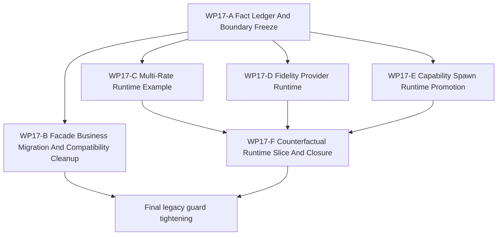

# WP17 Stage 3 Runtime Materialization And Cleanup

Status: `2026-05-21` complete / accepted selected-slice
runtime-materialization closure; full counterfactual/worldline orchestration
remains out of scope.

Language:

- English canonical: `stage3_runtime_materialization_cleanup_wp17_20260521.md`
- Chinese companion:
  [stage3_runtime_materialization_cleanup_wp17_20260521.zh.md](stage3_runtime_materialization_cleanup_wp17_20260521.zh.md)

Inputs:

- [Stage 3 platform expansion mainline plan](../../review/stage3_platform_expansion_mainline_plan_20260521.md)
- [WP16 runtime spine consolidation](../wp16_runtime_spine_consolidation/runtime_spine_consolidation_wp16_20260521.md)
- [WP16 acceptance review](../../review/wp16_runtime_spine_consolidation_acceptance_review_20260521.md)
- [WP17 acceptance review](../../review/wp17_stage3_runtime_materialization_cleanup_acceptance_review_20260521.md)
- [WP13 backend fidelity expansion](../wp13_backend_fidelity_expansion/backend_fidelity_expansion_wp13_20260520.md)
- [WP14 capability composition](../wp14_capability_composition/capability_composition_wp14_20260521.md)
- [WP15 counterfactual experiment generation](../wp15_counterfactual_experiment_generation/counterfactual_experiment_generation_wp15_20260521.md)
- [Simulation system architecture design](../../../plan/architecture/simulation_system_architecture_design.md)
- [Subagent Usage Policy](../../../standards/governance/subagent_usage_policy.md)
- [WP Closure Lane Policy](../../../standards/governance/wp_closure_lane_policy.md)

Naming and commit-message note:

- `WP17` is the task-index label for the Stage 3 runtime-materialization and
  cleanup phase.
- Implementation commits should use capability/result language such as
  `Route training reads through facade adapters` or
  `Materialize scheduler cadence example`, not internal labels.

## 1. Purpose

`WP16` accepted a selected runtime-spine slice. `WP17` is the final refactor
phase that turns the remaining Stage 3 contract surfaces into runtime behavior
and cleans up old business entry points.

The phase is intentionally implementation-facing. It should not create another
contract-only wave. Each stream must either migrate a maintained consumer,
materialize a runtime path, tighten a legacy boundary, or record an honest
blocked residual with a named missing prerequisite.

## 2. Current Code Facts

These facts override older wording in the Stage 3 plan when planning work:

| Area | Current code fact | Planning implication |
|------|-------------------|----------------------|
| Runtime capabilities | `RuntimeFacade::capabilities()` now returns conservative baseline/candidate fields from `src/runtime/facade/runtime_facade.cpp`, and bindings expose them. | Stage 3 must not plan from "empty capabilities"; the gap is now profile request/admission and provider dispatch, not basic query shape. |
| Model providers | There is no `ModelProvider` dispatch abstraction and no stage node consumes a fidelity profile to select a provider. | Multi-fidelity work starts with one provider family and one stage-node slice, not a global model rewrite. |
| Capability composition | `CapabilityBundle` exists, bindings exist, and `DefaultUnitFactory` has internal bundle template/resolved-plan helpers. Public `spawn_platform` is still absent and guarded; `spawn_unit(type_name)` remains canonical. | Capability work should promote the existing internal resolution chain before changing public setup schema. |
| Counterfactual runtime | `ReplayEnvelope`, `BranchPoint`, and request gates remain metadata/fail-closed for full restore, while `RuntimeFacade::run_counterfactual_branch()` now supports one explicit-setup selected-entity branch/compare slice. | Counterfactual work can cite the selected-slice facade runtime evidence, but must still not claim arbitrary live-world clone, full restore, or full worldline orchestration. |
| Multi-rate scheduler | `ActionHoldPolicy` exists as a DTO and WP16 added selected-slice cadence evidence, but `kWp10ClockDomainAdvisoryOnly = true` remains true. | The first scheduler target is the runnable architecture §8 example, not a global scheduler rewrite. |
| Training/batch business path | `RuntimeFacadeAdapter` exposes facade-shaped methods, while `batch_runtime` remains a compatibility view and some tests/business callers still read through it. | The first cleanup slice should migrate maintained reads to facade-shaped adapter/env methods while preserving compatibility tests. |

## 3. Final-Phase Route

`WP17` was divided into six streams. Streams B through F now have selected-slice
runtime evidence. The remaining closure concern is not another broad
implementation wave, but preserving the narrow capability language and keeping
legacy compatibility boundaries guarded.

| Stream | Status | Main concern | Output |
|--------|--------|--------------|--------|
| `WP17-A Fact Ledger And Boundary Freeze` | recovered / pass | current code facts, residuals, and non-goals were locked before runtime edits | [fact ledger task slice](wp17_fact_ledger_and_boundary_freeze_cluster_20260521.md) |
| `WP17-B Facade Business Migration And Compatibility Cleanup` | implemented / focused pass | maintained batch/training reads expose facade-shaped adapter/env methods while `batch_runtime` remains compatibility-only | [business migration task slice](wp17_facade_business_migration_cleanup_cluster_20260521.md) |
| `WP17-C Multi-Rate Runtime Example` | implemented / focused pass | selected §8 policy/control/physics cadence emits runnable hold/expiry/barrier evidence | [multi-rate runtime task slice](wp17_multirate_runtime_example_cluster_20260521.md) |
| `WP17-D Fidelity Provider Runtime` | implemented / focused pass | facade-owned request/admission/provider selection accepts the reference CPU baseline and fails closed for unmaintained providers | [fidelity provider task slice](wp17_fidelity_provider_runtime_cluster_20260521.md) |
| `WP17-E Capability Spawn Runtime Promotion` | implemented / focused pass | internal capability resolution gates maintained spawn materialization while preserving type-name compatibility | [capability spawn task slice](wp17_capability_spawn_runtime_cluster_20260521.md) |
| `WP17-F Counterfactual Runtime Slice And Closure` | narrowed selected-slice implemented / focused pass | explicit baseline setup can produce parent/branch snapshots and causal deltas for one selected entity | [counterfactual runtime task slice](wp17_counterfactual_runtime_closure_cluster_20260521.md) |

## 4. Dependency Map



Parallel rule:

- `WP17-A` starts first and is small but authoritative.
- `WP17-B` may start once A confirms the compatibility boundary, because it is
  the direct business-migration cleanup that unblocks later consumers.
- `WP17-C`, `WP17-D`, and `WP17-E` can run in parallel after A, with disjoint
  scheduler, backend/fidelity, and spawn write scopes.
- `WP17-F` was released only after C proved deterministic cadence evidence and D
  named the reference CPU fidelity/provider scope. Its accepted runtime scope is
  explicit-setup selected-entity branch/compare, not arbitrary live-world clone.

## 5. Dispatch Plan

| Stream | Write-scope rule | Suggested model / reasoning |
|--------|------------------|-----------------------------|
| `WP17-A` | Own fact ledger docs, architecture guard inventory, and dispatch board only. Do not edit runtime behavior. | Light task: mini model, xhigh. |
| `WP17-B` | Own `python/rl/runtime/world_batch*`, maintained training/batch tests, and narrow architecture guards around `batch_runtime`. Do not delete public compatibility APIs. | Medium integration refactor: `gpt-5.4`, high. |
| `WP17-C` | Own scheduler/window coordinator cadence helpers, `ActionHoldPolicy` runtime consumption, and §8 example tests. Do not edit fidelity/provider or spawn logic. | Complex scheduler seam: `gpt-5.4`, xhigh. |
| `WP17-D` | Own runtime capability request/admission/provider-selection code and focused tests. Do not change platform capability composition. | Complex backend/fidelity seam: `gpt-5.4`, high or xhigh. |
| `WP17-E` | Own capability resolution/spawn promotion code and tests. Do not change backend `RuntimeCapabilities`. | Complex spawn/content seam: `gpt-5.4`, high. |
| `WP17-F` | Own explicit-setup selected-entity snapshot/branch/compare runtime, experiment evidence, and final cleanup handoff. Do not broaden into arbitrary worldline clone. | Complex replay/runtime seam: `gpt-5.4`, xhigh. |

Worker rule:

- Workers are not alone in the codebase; they must not revert unrelated edits or
  edits made by other workers.
- Each worker must return touched files, commands run, blockers, residuals, and
  integration notes.
- Any stream may stop at `Mergeable`; final acceptance, README/review sync,
  archive decisions, and bilingual closure are closure-lane work.

## 6. Gate Rules

| Gate | Required evidence | Fail condition |
|------|-------------------|----------------|
| `WP17-A` | Current code fact table, direct links to source/test facts, residual register, and first-wave dispatch board. | Claims old Stage 3 facts without reconciling code drift. |
| `WP17-B` | Maintained batch/training reads use facade-shaped methods; `batch_runtime` is compatibility-only and guarded. | Maintained business tests or consumers still require direct `vec_env.batch_runtime` state reads except in explicit compatibility tests. |
| `WP17-C` | Runnable §8-style fixture: policy 10Hz, control 20Hz, physics 60Hz, observation at policy boundary, skip/hold evidence visible. | Clock domains remain advisory for the claimed maintained slice or skips are silent. |
| `WP17-D` | Fidelity request accepted/rejected through facade; provider family selected for one stage node with conservative fallback. | GPU/helper availability is treated as maintained fidelity support without profile/budget evidence. |
| `WP17-E` | One air and one naval platform can be materialized through the capability resolution chain while `spawn_unit(type_name)` stays compatible. | Public schema is broken or `RuntimeCapabilities` is mixed with platform capabilities. |
| `WP17-F` | One explicit-setup selected-entity branch can produce parent/branch snapshots and causal deltas; final legacy cleanup gates pass. | Full counterfactual orchestration or arbitrary live-world restore is claimed without broader clone/replay evidence. |

## 7. Suggested Validation

Focused first-wave validation:

```bash
git diff --check
python -m pytest -q tests/architecture/runtime_facade/test_layering.py
python -m pytest -q tests/architecture/runtime_spine/test_runtime_spine_inventory_gates.py
python -m pytest -q tests/world_batch/test_world_batch_vec_env.py -k "execution_episode_controller_mainline or compatibility_view"
```

Later stream validation should add focused tests from each task slice before
running broader smoke or closure audits.

Focused implementation validation reported on `2026-05-21`:

```bash
git diff --check
cmake --build build-workshop --target ef_py -j4
python -m pytest -q tests/runtime/facade/test_runtime_facade.py -k "counterfactual or replay or fidelity or provider"
python -m pytest -q tests/architecture/test_wp15_replay_envelope_contracts.py tests/architecture/test_wp15_worldline_branch_metadata.py tests/architecture/test_wp15_counterfactual_admission.py
python -m pytest -q tests/architecture/runtime_facade/test_layering.py tests/architecture/runtime_spine/test_runtime_spine_inventory_gates.py
python -m pytest -q tests/runtime/facade/test_runtime_facade_window_loop_injection.py -k "cadence or hold or barrier or clock or window"
python -m pytest -q tests/world_batch/test_single_world_batch_runtime.py -k "runtime_window_evidence or cadence_reason or single"
python -m pytest -q tests/test_gpu_runtime_bindings.py -k "capabilities or fidelity or provider"
python -m pytest -q tests/world_batch/test_world_batch_runtime.py -k "spawn or world_setup"
python -m pytest -q tests/runtime/engagement/test_air_launch_adapter.py -k accepted_legacy_fire_missile_outcome_fits_launch_request_and_event_shape
python -m pytest -q tests/runtime/naval/test_naval_ship_database.py -k "ddg or spawn"
python -m pytest -q tests/world_batch/test_world_batch_vec_env.py -k "execution_episode_controller_mainline or shadow_compare or compatibility_view"
```

## 8. Non-Goals

- Deleting `WorldBatchRuntime` or `RuntimeFacade.runtime()` in the first cleanup
  slice.
- Global scheduler rewrite.
- Full exact-GPU, resident-state, or adaptive multi-fidelity promotion.
- Mandatory public `spawn_platform` schema before compatibility and content
  migration evidence exists.
- Full counterfactual rollout orchestration, arbitrary worldline branching, or
  generated scenario mutation of authoritative runtime state.
- Arbitrary live-world reflection/clone as a counterfactual branch baseline.
- Treating documentation closure as implementation evidence.
