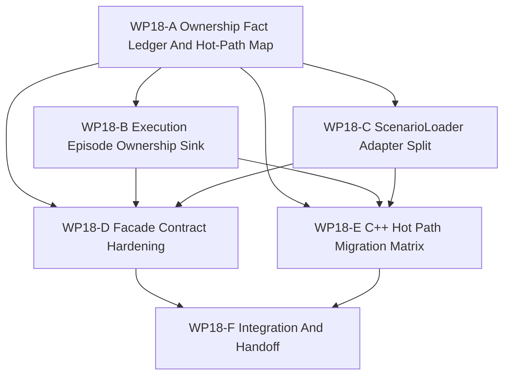

# WP18 Runtime Ownership And C++ Hot Path Consolidation

Status: `2026-05-21` complete / accepted.

Language:

- English canonical:
  `runtime_ownership_cxx_hot_path_consolidation_wp18_20260521.md`
- Chinese companion:
  [runtime_ownership_cxx_hot_path_consolidation_wp18_20260521.zh.md](runtime_ownership_cxx_hot_path_consolidation_wp18_20260521.zh.md)

Inputs:

- [WP17 Stage 3 runtime materialization and cleanup](../wp17_stage3_runtime_materialization_cleanup/stage3_runtime_materialization_cleanup_wp17_20260521.md)
- [WP17 acceptance review](../../review/wp17_stage3_runtime_materialization_cleanup_acceptance_review_20260521.md)
- [Architecture and performance follow-up](../../../plan/architecture/architecture_and_performance_research_followup.md)
- [Simulation system architecture design](../../../plan/architecture/simulation_system_architecture_design.md)
- [System layering and engine encapsulation plan](../../../plan/architecture/system_layering_and_engine_encapsulation_plan.md)
- [Subagent Usage Policy](../../../standards/governance/subagent_usage_policy.md)
- [WP Closure Lane Policy](../../../standards/governance/wp_closure_lane_policy.md)

Naming and commit-message note:

- `WP18` is the task-index label for the runtime-ownership and C++ hot-path
  consolidation phase.
- Implementation commits should use capability/result language such as
  `Move episode state ownership behind facade exports` or
  `Split scenario loader runtime adapters`, not internal labels.

## 1. Purpose

WP17 closed Stage 3 as a selected-slice runtime materialization increment. The
next frozen stage is not a new conceptual architecture track. It is an ownership
and hot-path consolidation pass that prepares the codebase for later CUDA,
public platform composition, and full counterfactual runtime work.

WP18 therefore focuses on one question: which maintained execution truths still
live in Python wrappers or compatibility views, and how do we move them behind
C++ runtime/facade surfaces without breaking existing training and scenario
callers?

## 2. Frozen Remaining Stage Boundary

WP18 is the first of four remaining top-level stages:

| Stage | Theme | Boundary |
|-------|-------|----------|
| `WP18` | Runtime ownership and C++ hot-path consolidation | Move maintained execution ownership and high-frequency Python logic toward C++/facade surfaces. |
| `WP19` | CUDA / resident-state mainline alignment | Align existing GPU helpers, device-resident outputs, and sync contracts without promoting exact GPU by default. |
| `WP20` | Capability platform publicization | Promote public `spawn_platform({capabilities...})` only after content/schema and compatibility gates are ready. |
| `WP21` | Full counterfactual / experiment runtime | Expand beyond WP17 selected-entity branch/compare into snapshot/restore, worldline, and experiment orchestration. |

No separate near-term stages are opened for Rust, global scheduler rewrite, or
exact GPU promotion. Those remain residual topics unless a later stage's entry
conditions explicitly promote them.

## 3. Current Code Facts

These facts should drive worker planning:

| Area | Current code fact | Planning implication |
|------|-------------------|----------------------|
| Runtime facade bridge | `python/rl/runtime/world_batch/adapter.py` centralizes `RuntimeFacadeAdapter`, but still creates `ScenarioLoader` from compatibility world handles and exposes a compatibility runtime. | WP18 must not delete compatibility handles first; it should move maintained ownership reads behind facade-shaped methods and guard raw world access. |
| Batch training wrapper | `python/rl/runtime/world_batch_vec_env.py` uses facade-shaped execution-episode reads, but still builds/consumes requests, observations, reward info, and loader mirrors in Python. | First implementation slices should target maintained request build/consume and state export seams rather than a wholesale VecEnv rewrite. |
| ScenarioLoader role | `gym_envs.scenario_loader.ScenarioLoader` remains both a scenario adapter and runtime state mirror for execution episode state, route/approach fields, and shadow comparisons. | Split planning must distinguish static scenario/content adaptation from maintained runtime state ownership. |
| C++ runtime assets | `src/core/mission/runtime/*` and `src/core/mission/episode/*` already own compiled reward, termination, route/approach, execution-step, and episode-state helpers. | WP18 should reuse existing C++ runtime assets before inventing new DTO layers. |
| Compatibility surfaces | `WorldBatchRuntime`, `batch_runtime`, and `RuntimeFacade.runtime()` remain compatibility surfaces after WP17. | WP18 can tighten guards and migrate maintained callers, but public deletion is out of scope. |
| Later-stage prerequisites | WP19 resident-state and WP21 full counterfactual work need stable ownership, facade exports, and host-visible state boundaries. | WP18 acceptance must include a residual map that names what still blocks WP19/WP21 entry. |

## 4. Work Packages

| Work package | Status | Main concern | Goal | Output |
|--------------|--------|--------------|------|--------|
| `WP18-A Ownership Fact Ledger And Hot-Path Map` | planned | facts and route control | Inventory Python-owned execution truths, compatibility world reads, existing C++ assets, and migration risks. | [ownership fact ledger](wp18_ownership_fact_ledger_hot_path_map_cluster_20260521.md) |
| `WP18-B Execution Episode Ownership Sink` | planned | episode state ownership | Move one maintained execution-episode state/export/consume slice behind C++/facade-owned results. | [execution episode ownership sink](wp18_execution_episode_ownership_sink_cluster_20260521.md) |
| `WP18-C ScenarioLoader Adapter Split` | planned | loader boundary | Split or pre-gate `ScenarioLoader` into scenario/content adapter, runtime state adapter, and frontend helper responsibilities. | [ScenarioLoader adapter split](wp18_scenario_loader_adapter_split_cluster_20260521.md) |
| `WP18-D Facade Contract Hardening` | planned | frontend contract | Harden facade-shaped methods and compatibility gates so maintained callers do not regress to raw runtime/world handles. | [facade contract hardening](wp18_facade_contract_hardening_cluster_20260521.md) |
| `WP18-E C++ Hot Path Migration Matrix` | planned | migration prioritization | Produce and implement the first safe hot-path migration slice for reward/termination, route/approach, or request build/consume. | [C++ hot path matrix](wp18_cxx_hot_path_migration_matrix_cluster_20260521.md) |
| `WP18-F Integration And Handoff` | planned | closure lane | Integrate A-E, record residuals for WP19/WP20/WP21, sync indexes, and create acceptance only after implementation gates pass. | [integration handoff](wp18_integration_handoff_cluster_20260521.md) |

## 5. Dependency Map



Parallel rule:

- `WP18-A` starts first and should be short but authoritative.
- `WP18-B` and `WP18-C` can run in parallel after A if their write scopes stay
  disjoint.
- `WP18-D` may start guard prework after A, but final hardening must account for
  B/C replacement surfaces.
- `WP18-E` starts after A and should coordinate with B/C before implementing a
  migration slice that changes request/state ownership.
- `WP18-F` is serial closure after A-E report mergeable evidence.

## 6. Dispatch Plan

| Stream | Write-scope rule | Suggested model / reasoning |
|--------|------------------|-----------------------------|
| `WP18-A` | Own docs/fixtures/tests that inventory ownership and hot paths. Do not edit runtime behavior. | Light but high-precision task: `gpt-5.4-mini`, xhigh. |
| `WP18-B` | Own execution episode facade/runtime seams and focused tests. Do not split `ScenarioLoader` structure. | Complex integration seam: `gpt-5.4`, xhigh. |
| `WP18-C` | Own `ScenarioLoader` boundary planning or narrow adapter split files/tests. Do not change C++ runtime logic. | Complex Python/runtime boundary: `gpt-5.4`, high. |
| `WP18-D` | Own facade contract guards, architecture tests, and compatibility allowlists. Do not remove public APIs. | Medium guard/refactor task: `gpt-5.4`, high. |
| `WP18-E` | Own migration matrix and one implementation slice in C++ runtime or Python request build/consume code. Coordinate with B/C. | Complex hot-path migration: `gpt-5.4`, xhigh. |
| `WP18-F` | Own integration notes, validation rollup, residual register, README/review sync, and bilingual closure. | Light closure: `gpt-5.4-mini`, xhigh. |

Worker rule:

- Workers are not alone in the codebase; they must not revert unrelated edits or
  edits made by other workers.
- Each worker must return touched files, commands run, blockers, residuals, and
  integration notes.
- A stream may stop at `Mergeable`; final acceptance belongs to the serial
  closure lane.

## 7. Gate Rules

| Gate | Required evidence | Fail condition |
|------|-------------------|----------------|
| `WP18-A` | Ownership map with direct source/test links, Python hot-path inventory, C++ asset inventory, and residual IDs for WP19/WP21 prerequisites. | Work proceeds from stale assumptions or treats all Python wrapper logic as removable without compatibility evidence. |
| `WP18-B` | One maintained execution-episode ownership slice exports state/results through C++/facade-owned evidence and keeps compatibility tests passing. | Python remains the authoritative source for the claimed slice or maintained callers still require direct compatibility world reads. |
| `WP18-C` | `ScenarioLoader` responsibilities are split, wrapped, or pre-gated with tests that distinguish scenario/content adaptation from runtime state ownership. | The loader continues to be described as both authoritative runtime owner and frontend helper for the same maintained field. |
| `WP18-D` | Architecture guards prevent new maintained raw runtime/world-handle reads while preserving named compatibility surfaces. | Public API deletion replaces migration evidence, or compatibility tests become the only proof of maintained behavior. |
| `WP18-E` | Migration matrix names owners, complexity, tests, and one implemented first slice with focused regression evidence. | The matrix becomes documentation-only or attempts a broad rewrite of reward/termination/route/request paths in one step. |
| `WP18-F` | Validation rollup, residual map, README/index sync, bilingual docs, and acceptance review only after implementation evidence exists. | Acceptance is created from planned docs alone. |

## 8. Suggested Validation

Initial planning validation:

```bash
git diff --check
python3 tools/maintenance/wp_doc_closure_audit.py --wp WP18 --summary
python -m pytest -q tests/architecture/runtime_facade/test_layering.py
python -m pytest -q tests/world_batch/test_world_batch_vec_env.py -k "execution_episode_controller_mainline or compatibility_view"
```

Implementation waves should add focused tests from the touched runtime,
ScenarioLoader, facade, and C++ hot-path files before running broader smoke.

## 9. Non-Goals

- Deleting `WorldBatchRuntime`, `batch_runtime`, or `RuntimeFacade.runtime()`.
- Rewriting the full Gymnasium/VecEnv frontend.
- Promoting CUDA, resident-state, exact GPU, or shadow execution.
- Publicizing `spawn_platform({capabilities...})`; that belongs to WP20.
- Claiming full snapshot/restore or arbitrary worldline orchestration; that
  belongs to WP21.
- Opening a separate Rust implementation stage.
