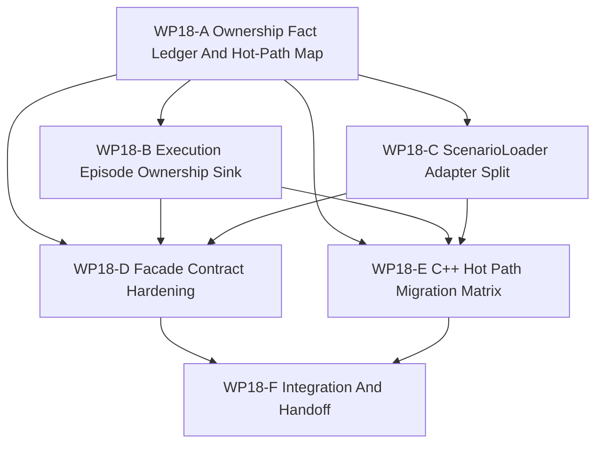

# WP18 Runtime Ownership And C++ Hot Path Consolidation

状态：`2026-05-21` complete / accepted。

语言版本：

- 英文主文：[runtime_ownership_cxx_hot_path_consolidation_wp18_20260521.md](runtime_ownership_cxx_hot_path_consolidation_wp18_20260521.md)
- 中文辅文：`runtime_ownership_cxx_hot_path_consolidation_wp18_20260521.zh.md`

输入：

- [WP17 Stage 3 runtime materialization and cleanup](../wp17_stage3_runtime_materialization_cleanup/stage3_runtime_materialization_cleanup_wp17_20260521.zh.md)
- [WP17 验收审查](../../review/wp17_stage3_runtime_materialization_cleanup_acceptance_review_20260521.zh.md)
- [架构与性能路线进一步调研](../../../plan/architecture/architecture_and_performance_research_followup.zh.md)
- [仿真系统架构设计](../../../plan/architecture/simulation_system_architecture_design.zh.md)
- [系统分层与引擎封装方案](../../../plan/architecture/system_layering_and_engine_encapsulation_plan.md)
- [Subagent 使用规范](../../../standards/governance/subagent_usage_policy.zh.md)
- [WP Closure Lane Policy](../../../standards/governance/wp_closure_lane_policy.md)

命名与提交信息说明：

- `WP18` 只是 runtime-ownership 与 C++ hot-path consolidation 阶段的 task-index。
- 实现提交应使用 capability/result language，例如
  `Move episode state ownership behind facade exports` 或
  `Split scenario loader runtime adapters`，不要使用内部编号作为主要信息。

## 1. 目标

WP17 已经把 Stage 3 收束为 selected-slice runtime materialization。下一阶段不是
再开一条概念架构线，而是一次 ownership 与 hot-path consolidation：为后续 CUDA、
public platform composition 与 full counterfactual runtime 清理运行时所有权前提。

WP18 的核心问题是：哪些维护中的 execution truth 仍停留在 Python wrapper 或
compatibility view 里，以及如何在不破坏 training / scenario caller 的前提下，把
这些 truth 迁到 C++ runtime / facade surfaces 后面。

## 2. 剩余阶段冻结边界

WP18 是剩余四个顶层阶段中的第一个：

| Stage | 主题 | 边界 |
|-------|------|------|
| `WP18` | Runtime ownership 与 C++ hot-path consolidation | 把维护中的 execution ownership 和高频 Python 逻辑推向 C++/facade surfaces。 |
| `WP19` | CUDA / resident-state mainline alignment | 对齐既有 GPU helpers、device-resident outputs 与 sync contracts，但不默认晋级 exact GPU。 |
| `WP20` | Capability platform publicization | 仅在 content/schema 与 compatibility gates 就绪后，推进 public `spawn_platform({capabilities...})`。 |
| `WP21` | Full counterfactual / experiment runtime | 从 WP17 selected-entity branch/compare 扩展到 snapshot/restore、worldline 与 experiment orchestration。 |

Rust、global scheduler rewrite、exact GPU promotion 都不作为独立近线阶段开启；
除非后续阶段的 entry conditions 明确提升它们。

## 3. 当前代码事实

这些事实应约束 worker planning：

| 方向 | 当前代码事实 | 对计划的影响 |
|------|--------------|--------------|
| Runtime facade bridge | `python/rl/runtime/world_batch/adapter.py` 集中 `RuntimeFacadeAdapter`，但仍从 compatibility world handles 创建 `ScenarioLoader`，并暴露 compatibility runtime。 | WP18 不能先删除 compatibility handles；应先把维护中的 ownership reads 迁到 facade-shaped methods，并守住 raw world access。 |
| Batch training wrapper | `python/rl/runtime/world_batch_vec_env.py` 已有 facade-shaped execution-episode reads，但 request build/consume、observation、reward info 与 loader mirrors 仍主要由 Python 拼装。 | 第一批实现应打 maintained request build/consume 与 state export seam，而不是重写整个 VecEnv。 |
| ScenarioLoader role | `gym_envs.scenario_loader.ScenarioLoader` 仍同时承担 scenario adapter 与 runtime state mirror，包括 execution episode state、route/approach 字段和 shadow comparisons。 | 拆分规划必须区分 static scenario/content adaptation 与 maintained runtime state ownership。 |
| C++ runtime assets | `src/core/mission/runtime/*` 与 `src/core/mission/episode/*` 已有 compiled reward、termination、route/approach、execution-step 和 episode-state helpers。 | WP18 应优先复用现有 C++ runtime assets，而不是发明新 DTO 层。 |
| Compatibility surfaces | WP17 后 `WorldBatchRuntime`、`batch_runtime` 与 `RuntimeFacade.runtime()` 仍然是 compatibility surfaces。 | WP18 可以收紧 guards 并迁移 maintained callers，但 public deletion 不在范围内。 |
| 后续阶段前提 | WP19 resident-state 与 WP21 full counterfactual 需要稳定 ownership、facade exports 与 host-visible state boundaries。 | WP18 验收必须包含 residual map，说明 WP19/WP21 仍被哪些项目阻塞。 |

## 4. 工作包

| 工作包 | 状态 | 关注点 | 目标 | 产出 |
|--------|------|--------|------|------|
| `WP18-A Ownership Fact Ledger And Hot-Path Map` | planned | facts and route control | 盘点 Python-owned execution truths、compatibility world reads、既有 C++ assets 与迁移风险。 | [ownership fact ledger](wp18_ownership_fact_ledger_hot_path_map_cluster_20260521.zh.md) |
| `WP18-B Execution Episode Ownership Sink` | planned | episode state ownership | 把一个维护中的 execution-episode state/export/consume slice 收到 C++/facade-owned results 后面。 | [execution episode ownership sink](wp18_execution_episode_ownership_sink_cluster_20260521.zh.md) |
| `WP18-C ScenarioLoader Adapter Split` | planned | loader boundary | 将 `ScenarioLoader` 拆分或预加 gate，区分 scenario/content adapter、runtime state adapter 与 frontend helper。 | [ScenarioLoader adapter split](wp18_scenario_loader_adapter_split_cluster_20260521.zh.md) |
| `WP18-D Facade Contract Hardening` | planned | frontend contract | 强化 facade-shaped methods 与 compatibility gates，防止 maintained callers 退回 raw runtime/world handles。 | [facade contract hardening](wp18_facade_contract_hardening_cluster_20260521.zh.md) |
| `WP18-E C++ Hot Path Migration Matrix` | planned | migration prioritization | 产出并实现第一条安全的 reward/termination、route/approach 或 request build/consume hot-path slice。 | [C++ hot path matrix](wp18_cxx_hot_path_migration_matrix_cluster_20260521.zh.md) |
| `WP18-F Integration And Handoff` | planned | closure lane | 集成 A-E，记录 WP19/WP20/WP21 residuals，同步索引，并仅在实现 gate 通过后创建验收。 | [integration handoff](wp18_integration_handoff_cluster_20260521.zh.md) |

## 5. 依赖图



并行规则：

- `WP18-A` 先启动，任务短但作为事实权威。
- `WP18-B` 与 `WP18-C` 可在 A 后并行，只要写入范围互不重叠。
- `WP18-D` 可在 A 后先做 guard prework，但最终 hardening 必须吸收 B/C 的替代面。
- `WP18-E` 在 A 后启动，若实现会改变 request/state ownership，需与 B/C 协调。
- `WP18-F` 是 A-E mergeable 后的串行 closure。

## 6. 派发计划

| Stream | 写入范围规则 | 建议模型 / 思考预算 |
|--------|--------------|---------------------|
| `WP18-A` | 只拥有 ownership 与 hot-path inventory docs/fixtures/tests，不改 runtime behavior。 | 轻量高精度任务：`gpt-5.4-mini`, xhigh。 |
| `WP18-B` | 拥有 execution episode facade/runtime seams 与聚焦测试，不拆 `ScenarioLoader` 结构。 | 复杂集成 seam：`gpt-5.4`, xhigh。 |
| `WP18-C` | 拥有 `ScenarioLoader` boundary planning 或窄 adapter split files/tests，不改 C++ runtime logic。 | 复杂 Python/runtime 边界：`gpt-5.4`, high。 |
| `WP18-D` | 拥有 facade contract guards、architecture tests 与 compatibility allowlists，不删除 public APIs。 | 中等 guard/refactor 任务：`gpt-5.4`, high。 |
| `WP18-E` | 拥有 migration matrix 与一条 C++ runtime 或 Python request build/consume 实现 slice，需与 B/C 协调。 | 复杂 hot-path migration：`gpt-5.4`, xhigh。 |
| `WP18-F` | 拥有 integration notes、validation rollup、residual register、README/review sync 与 bilingual closure。 | 轻量 closure：`gpt-5.4-mini`, xhigh。 |

Worker 规则：

- Workers 不是独自工作；不得回滚无关改动或其他 worker 的改动。
- 每个 worker 必须返回 touched files、commands run、blockers、residuals 与 integration notes。
- 单个 stream 可以停在 `Mergeable`；最终验收属于串行 closure lane。

## 7. Gate 规则

| Gate | 必需证据 | 失败条件 |
|------|----------|----------|
| `WP18-A` | 带 source/test 链接的 ownership map、Python hot-path inventory、C++ asset inventory，以及 WP19/WP21 prerequisite residual IDs。 | 从过时假设出发，或在无兼容证据时把所有 Python wrapper logic 都当成可删除。 |
| `WP18-B` | 一个 maintained execution-episode ownership slice 通过 C++/facade-owned evidence 导出 state/results，并保持兼容测试通过。 | Python 仍是声称 slice 的 authoritative source，或 maintained callers 仍必须直接读 compatibility world。 |
| `WP18-C` | `ScenarioLoader` responsibility 被拆分、包裹或预加 gate，测试区分 scenario/content adaptation 与 runtime state ownership。 | loader 对同一 maintained field 继续同时被描述为 authoritative runtime owner 与 frontend helper。 |
| `WP18-D` | Architecture guards 阻止新增 maintained raw runtime/world-handle reads，同时保留命名 compatibility surfaces。 | 用 public API 删除替代迁移证据，或 compatibility tests 成为 maintained behavior 的唯一证明。 |
| `WP18-E` | Migration matrix 命名 owners、复杂度、测试，并实现一条第一 slice 且有聚焦回归证据。 | matrix 变成纯文档，或试图一次性重写 reward/termination/route/request paths。 |
| `WP18-F` | Validation rollup、residual map、README/index sync、双语文档，并且只有实现证据存在后才创建 acceptance review。 | 仅凭 planned docs 创建验收。 |

## 8. 建议验证

初始规划验证：

```bash
git diff --check
python3 tools/maintenance/wp_doc_closure_audit.py --wp WP18 --summary
python -m pytest -q tests/architecture/runtime_facade/test_layering.py
python -m pytest -q tests/world_batch/test_world_batch_vec_env.py -k "execution_episode_controller_mainline or compatibility_view"
```

实现波次应在 touched runtime、ScenarioLoader、facade 与 C++ hot-path 文件上追加聚焦测试，
再运行更广 smoke。

## 9. 非目标

- 删除 `WorldBatchRuntime`、`batch_runtime` 或 `RuntimeFacade.runtime()`。
- 重写完整 Gymnasium/VecEnv frontend。
- 晋级 CUDA、resident-state、exact GPU 或 shadow execution。
- 公布 `spawn_platform({capabilities...})`；这属于 WP20。
- 声明 full snapshot/restore 或 arbitrary worldline orchestration；这属于 WP21。
- 开启独立 Rust 实现阶段。
