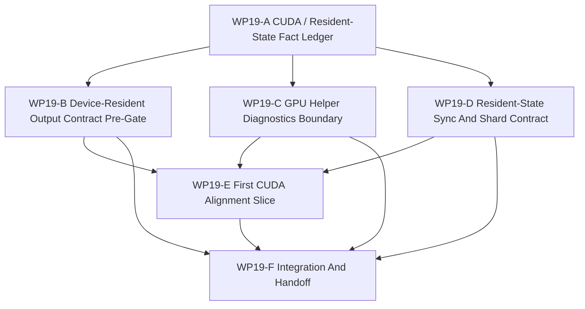

# WP19 CUDA And Resident-State Mainline Alignment

Status: `2026-05-21` complete / accepted.

Language:

- English canonical: `cuda_resident_state_alignment_wp19_20260521.md`
- Chinese companion:
  [cuda_resident_state_alignment_wp19_20260521.zh.md](cuda_resident_state_alignment_wp19_20260521.zh.md)

Inputs:

- [WP18 runtime ownership and C++ hot-path consolidation](../wp18_runtime_ownership_cxx_hot_path_consolidation/runtime_ownership_cxx_hot_path_consolidation_wp18_20260521.md)
- [WP18 acceptance review](../../review/wp18_runtime_ownership_cxx_hot_path_consolidation_acceptance_review_20260521.md)
- [Architecture and performance follow-up](../../../plan/architecture/architecture_and_performance_research_followup.md)
- [Simulation system architecture design](../../../plan/architecture/simulation_system_architecture_design.md)
- [WP6 resident-state boundary rules](../wp6_backend_profile_policy/wp6_resident_state_boundary_rules_20260519.md)
- [WP13 backend fidelity expansion](../wp13_backend_fidelity_expansion/backend_fidelity_expansion_wp13_20260520.md)
- [Subagent Usage Policy](../../../standards/governance/subagent_usage_policy.md)
- [WP Closure Lane Policy](../../../standards/governance/wp_closure_lane_policy.md)

Naming and commit-message note:

- `WP19` is the task-index label for CUDA / resident-state mainline alignment.
- Implementation commits should use capability/result language such as
  `Add device-resident output contract gates` or
  `Keep GPU helpers diagnostics-only until promoted`, not internal labels.

## 1. Purpose

WP18 made runtime ownership and selected C++ hot paths more stable. WP19 uses
that stability to align existing CUDA helpers, device-resident outputs, and
resident-state sync language with the maintained facade/backend profile model.

The goal is not to promote exact GPU world-step support. The goal is to make
the existing GPU assets legible to the runtime: what is a helper, what can be a
device-resident export, what remains diagnostics-only, and what evidence would
be required before resident-state or exact GPU claims become maintained.

Target chain:

```text
existing CUDA helpers and probes
  -> source-backed fact ledger
  -> device-resident output contract and DTO pre-gates
  -> sync/shard ownership vocabulary
  -> one safe helper alignment slice
  -> residual handoff for WP20/WP21 or later exact GPU promotion
```

## 2. Scope Boundary

WP19 can:

1. Inventory existing CUDA helpers, probes, build flags, runtime call sites, and
   tests.
2. Add or harden contracts that distinguish device-resident output from
   maintained resident-state ownership.
3. Add facade/backend DTO pre-gates for device output metadata, availability,
   shape, sync barrier, and diagnostics labels.
4. Harden tests so helper/probe availability cannot flip exact GPU,
   resident-state, device observation, shadow, or multi-fidelity support true.
5. Define state-shard and sync-barrier requirements needed by any future
   maintained resident-state profile.
6. Implement one safe alignment slice for an existing helper path when it stays
   behind host-owned or diagnostics/export-only semantics.

WP19 cannot:

1. Promote exact GPU world-step execution as maintained support.
2. Promote resident-state ownership without a maintained backend profile,
   maintained parity budget, sync contract, and replay/validation evidence.
3. Treat benchmark speedups, probe availability, CUDA build success, or device
   pointers as maintained semantic parity.
4. Add a second public truth path outside the runtime facade/backend packet
   boundary.
5. Publicize capability-platform composition; that belongs to WP20.
6. Implement full counterfactual/experiment runtime; that belongs to WP21.

## 3. Current Code Facts To Verify

| Area | Current fact | WP19 implication |
|------|--------------|------------------|
| CUDA helper assets | `src/gpu/*` and `src/tools/experimental/gpu_phase0/*` already contain visual, observation, flight-shaping, broadphase, and probe code. | WP19 should align real assets, not invent a future CUDA track from scratch. |
| Device-resident value | The performance follow-up records that host readback is the main wall and device-resident consumers are required for the largest speedups. | WP19 must define consumer/output contracts before claiming runtime-level benefit. |
| Backend profile projection | `src/runtime/contracts/backend_profile_contracts.h` and facade capability projection keep exact GPU and resident-state support conservative. | WP19 must preserve fail-closed support flags unless maintained evidence exists. |
| Runtime ownership | WP18 moved selected execution-episode state and reward/termination metadata toward facade/C++ ownership. | WP19 can rely on a more stable host-visible state boundary, but request build/consume residuals remain. |
| Existing GPU use | `WorldBatchRuntime` can use GPU broadphase helper paths under explicit flags, while helper/probe tests keep support claims separate. | WP19 should make the diagnostics/export boundary harder to misuse. |

## 4. Work Packages

| Work package | Status | Main concern | Goal | Output |
|--------------|--------|--------------|------|--------|
| `WP19-A CUDA / Resident-State Fact Ledger` | verified / authoritative | facts and entry gate | Freeze source/test facts for CUDA helpers, device outputs, capability flags, probes, and current runtime call sites. | [fact ledger](wp19_cuda_resident_state_fact_ledger_cluster_20260521.md) |
| `WP19-B Device-Resident Output Contract Pre-Gate` | pass | facade/backend DTO shape | Define and implement the additive export-only descriptor seam for device-resident outputs without promoting resident-state ownership. | [device output contract](wp19_device_resident_output_contract_cluster_20260521.md) |
| `WP19-C GPU Helper Diagnostics Boundary` | pass | helper/probe non-promotion | Harden the boundary between CUDA helper availability, diagnostics/probe output, and maintained capability projection. | [diagnostics boundary](wp19_gpu_helper_diagnostics_boundary_cluster_20260521.md) |
| `WP19-D Resident-State Sync And Shard Contract` | preflight-only / pass | ownership/sync vocabulary | Align state-shard, sync-barrier, stale-read, export, and observation-only rules with runtime/facade evidence. | [sync and shard contract](wp19_resident_state_sync_shard_contract_cluster_20260521.md) |
| `WP19-E First CUDA Alignment Slice` | evidence-only pass | safe implementation | Verify one bounded host-owned broadphase helper slice while keeping runtime semantics and support flags fail-closed. | [first alignment slice](wp19_first_cuda_alignment_slice_cluster_20260521.md) |
| `WP19-F Integration And Handoff` | complete / accepted | closure lane | Integrate worker results, validate fail-closed support, record residuals, sync indexes, and prepare acceptance only after evidence exists. | [integration handoff](wp19_integration_handoff_cluster_20260521.md), [acceptance review](../../review/wp19_cuda_resident_state_alignment_acceptance_review_20260521.md) |

## 5. Dependency Map



Parallel rule:

- `WP19-A` starts first as a lightweight fact authority.
- `WP19-B`, `WP19-C`, and `WP19-D` may run as first-wave preflight streams if
  they keep write scopes disjoint and do not promote capability flags.
- `WP19-E` waits for A-D return packets before changing runtime behavior.
- `WP19-F` is serial closure after evidence streams return.

## 6. Dispatch Plan

| Stream | Write-scope rule | Suggested model / reasoning |
|--------|------------------|-----------------------------|
| `WP19-A` | Own fact-ledger docs and read-only source/test inventory. Do not edit runtime behavior. | Light but precision-sensitive: `gpt-5.4-mini`, xhigh. |
| `WP19-B` | Own contract/DTO preflight and focused tests around device output metadata. Do not claim maintained resident-state. | Complex contract seam: `gpt-5.4`, high. |
| `WP19-C` | Own helper/probe diagnostics boundary tests and capability non-promotion checks. Do not edit resident-state sync semantics. | Medium-complex guard task: `gpt-5.4`, high. |
| `WP19-D` | Own sync/shard contract preflight and architecture tests. Do not edit CUDA helper implementations. | Complex design/contract task: `gpt-5.4`, xhigh. |
| `WP19-E` | Own one selected helper alignment slice after A-D. Keep changes bounded to one helper/output path and focused tests. | Complex implementation: `gpt-5.4`, xhigh. |
| `WP19-F` | Own validation rollup, residual register, README/review sync, bilingual closure, and acceptance review. | Light closure: `gpt-5.4-mini`, xhigh. |

Worker rule:

- Workers are not alone in the codebase; they must not revert unrelated edits or
  edits made by other workers.
- Each worker must return touched files, commands run, blockers, residuals, and
  integration notes.
- A stream may stop at `preflight-only` if a safe implementation slice is not
  yet justified.

## 7. Gate Rules

| Gate | Required evidence | Fail condition |
|------|-------------------|----------------|
| `WP19-A` | Source/test ledger with exact helper/probe/capability call sites and current support flags. | Work proceeds from stale CUDA assumptions or treats probe availability as maintained support. |
| `WP19-B` | Device output contract proposal or tests covering output shape, sync/export barrier, host visibility, diagnostics label, and fail-closed projection. | Device pointer, benchmark result, or output buffer shape implies maintained resident-state. |
| `WP19-C` | Tests or guards proving GPU helper/probe availability remains diagnostics/export-only unless profile evidence exists. | Enabling CUDA experiments or probe availability flips exact GPU/resident-state/device-observation support true. |
| `WP19-D` | Sync/shard contract with ownership, cadence, stale-read, barrier, reconstruction/export, and observation-only semantics mapped to existing runtime evidence. | Unsynced backend-local state can affect committed host state or satisfy parity by itself. |
| `WP19-E` | One bounded helper alignment slice with focused tests and no support-flag promotion. | A broad exact GPU rewrite starts or runtime semantics depend on unsynced device state. |
| `WP19-F` | Validation rollup, residual map, README/index sync, bilingual docs, and acceptance review only after implementation evidence exists. | Acceptance is created from planned docs alone. |

## 8. Suggested Validation

Initial planning validation:

```bash
git diff --check
python3 tools/maintenance/wp_doc_closure_audit.py --wp WP19 --summary
python -m pytest -q tests/architecture/runtime_facade
python -m pytest -q tests/test_gpu_runtime_bindings.py
```

Implementation waves should add focused tests from the touched runtime,
facade/binding, GPU helper, or architecture guard files.

## 9. Non-Goals

- Exact GPU world-step promotion.
- Maintained resident-state ownership promotion.
- Shadow execution promotion.
- Public capability-platform composition.
- Full counterfactual/experiment runtime.
- A global scheduler rewrite or second semantic lifecycle.

## 10. Acceptance Review

- [WP19 CUDA And Resident-State Mainline Alignment Acceptance Review 2026-05-21](../../review/wp19_cuda_resident_state_alignment_acceptance_review_20260521.md)
