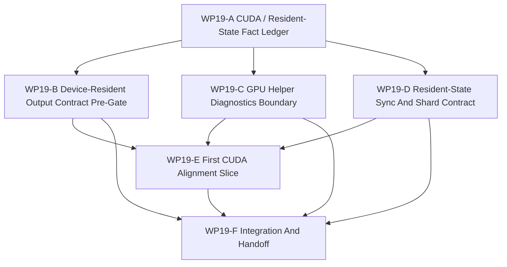

# WP19 CUDA 与 Resident-State 主线对齐

状态：`2026-05-21` complete / accepted。

语言版本：

- 英文主文：[cuda_resident_state_alignment_wp19_20260521.md](cuda_resident_state_alignment_wp19_20260521.md)
- 中文辅文：`cuda_resident_state_alignment_wp19_20260521.zh.md`

输入：

- [WP18 runtime ownership and C++ hot-path consolidation](../wp18_runtime_ownership_cxx_hot_path_consolidation/runtime_ownership_cxx_hot_path_consolidation_wp18_20260521.zh.md)
- [WP18 验收审查](../../review/wp18_runtime_ownership_cxx_hot_path_consolidation_acceptance_review_20260521.zh.md)
- [架构与性能路线进一步调研](../../../plan/architecture/architecture_and_performance_research_followup.zh.md)
- [仿真系统架构设计](../../../plan/architecture/simulation_system_architecture_design.zh.md)
- [WP6 resident-state 边界规则](../wp6_backend_profile_policy/wp6_resident_state_boundary_rules_20260519.zh.md)
- [WP13 backend fidelity expansion](../wp13_backend_fidelity_expansion/backend_fidelity_expansion_wp13_20260520.zh.md)
- [Subagent 使用规范](../../../standards/governance/subagent_usage_policy.zh.md)
- [WP Closure Lane Policy](../../../standards/governance/wp_closure_lane_policy.md)

命名与 commit-message 说明：

- `WP19` 只是 CUDA / resident-state mainline alignment 的任务索引标签。
- 实现提交应使用能力/结果语言，例如 `Add device-resident output contract gates`
  或 `Keep GPU helpers diagnostics-only until promoted`，而不是内部标签。

## 1. 目的

WP18 已经让 runtime ownership 和部分 C++ hot paths 更稳定。WP19 消费这个稳定边界，
把现有 CUDA helpers、device-resident outputs 与 resident-state sync 语言对齐到
maintained facade/backend profile model。

本阶段目标不是晋级 exact GPU world-step support。目标是让既有 GPU 资产对 runtime
变得清晰：什么是 helper，什么可以作为 device-resident export，什么仍是
diagnostics-only，以及 resident-state 或 exact GPU claim 进入维护态前需要哪些证据。

目标链路：

```text
existing CUDA helpers and probes
  -> source-backed fact ledger
  -> device-resident output contract and DTO pre-gates
  -> sync/shard ownership vocabulary
  -> one safe helper alignment slice
  -> residual handoff for WP20/WP21 or later exact GPU promotion
```

## 2. 范围边界

WP19 可以：

1. 盘点现有 CUDA helpers、probes、build flags、runtime call sites 与 tests。
2. 增补或收紧区分 device-resident output 与 maintained resident-state ownership
   的契约。
3. 为 device output metadata、availability、shape、sync barrier 与 diagnostics labels
   增加 facade/backend DTO pre-gates。
4. 收紧测试，确保 helper/probe availability 不能把 exact GPU、resident-state、
   device observation、shadow 或 multi-fidelity support 翻成 true。
5. 定义未来 maintained resident-state profile 所需的 state-shard 与 sync-barrier 要求。
6. 在保持 host-owned 或 diagnostics/export-only 语义的前提下，实现一条安全 helper
   alignment slice。

WP19 不可以：

1. 把 exact GPU world-step execution 晋级为 maintained support。
2. 在没有 maintained backend profile、maintained parity budget、sync contract 与
   replay/validation evidence 时晋级 resident-state ownership。
3. 把 benchmark speedups、probe availability、CUDA build success 或 device pointers
   当成 maintained semantic parity。
4. 在 runtime facade/backend packet boundary 外增加第二条公开 truth path。
5. 公开 capability-platform composition；这属于 WP20。
6. 实现 full counterfactual/experiment runtime；这属于 WP21。

## 3. 需要核验的当前代码事实

| 区域 | 当前事实 | WP19 含义 |
|------|----------|-----------|
| CUDA helper 资产 | `src/gpu/*` 与 `src/tools/experimental/gpu_phase0/*` 已有 visual、observation、flight-shaping、broadphase 与 probe code。 | WP19 应对齐真实资产，而不是重新虚构一条未来 CUDA 线。 |
| Device-resident 价值 | 性能 follow-up 记录 host readback 是主要墙，最大加速需要 device-resident consumers。 | WP19 必须先定义 consumer/output contracts，再声明 runtime-level benefit。 |
| Backend profile projection | `src/runtime/contracts/backend_profile_contracts.h` 与 facade capability projection 对 exact GPU 和 resident-state support 保持保守。 | 除非已有 maintained evidence，WP19 必须保持 fail-closed support flags。 |
| Runtime ownership | WP18 已将部分 execution-episode state 与 reward/termination metadata 推向 facade/C++ ownership。 | WP19 可以依赖更稳定的 host-visible state boundary，但 request build/consume residual 仍存在。 |
| 现有 GPU use | `WorldBatchRuntime` 可在显式 flags 下使用 GPU broadphase helper paths，helper/probe tests 仍把 support claims 分离。 | WP19 应让 diagnostics/export boundary 更难被误用。 |

## 4. 工作包

| 工作包 | 状态 | 关注点 | 目标 | 产出 |
|--------|------|--------|------|------|
| `WP19-A CUDA / Resident-State Fact Ledger` | verified / authoritative | facts and entry gate | 冻结 CUDA helpers、device outputs、capability flags、probes 与 runtime call sites 的 source/test facts。 | [fact ledger](wp19_cuda_resident_state_fact_ledger_cluster_20260521.zh.md) |
| `WP19-B Device-Resident Output Contract Pre-Gate` | pass | facade/backend DTO shape | 定义并实现 device-resident outputs 的 additive export-only descriptor seam，但不晋级 resident-state ownership。 | [device output contract](wp19_device_resident_output_contract_cluster_20260521.zh.md) |
| `WP19-C GPU Helper Diagnostics Boundary` | pass | helper/probe non-promotion | 收紧 CUDA helper availability、diagnostics/probe output 与 maintained capability projection 的边界。 | [diagnostics boundary](wp19_gpu_helper_diagnostics_boundary_cluster_20260521.zh.md) |
| `WP19-D Resident-State Sync And Shard Contract` | preflight-only / pass | ownership/sync vocabulary | 将 state-shard、sync-barrier、stale-read、export 与 observation-only rules 对齐到 runtime/facade evidence。 | [sync and shard contract](wp19_resident_state_sync_shard_contract_cluster_20260521.zh.md) |
| `WP19-E First CUDA Alignment Slice` | evidence-only pass | safe implementation | 验证一条 bounded host-owned broadphase helper slice，同时保持 runtime semantics 与 support flags fail-closed。 | [first alignment slice](wp19_first_cuda_alignment_slice_cluster_20260521.zh.md) |
| `WP19-F Integration And Handoff` | complete / accepted | closure lane | 集成 worker 结果，验证 fail-closed support，记录 residuals，同步索引，并且只在证据存在后准备验收。 | [integration handoff](wp19_integration_handoff_cluster_20260521.zh.md)、[验收审查](../../review/wp19_cuda_resident_state_alignment_acceptance_review_20260521.zh.md) |

## 5. 依赖图



并行规则：

- `WP19-A` 先启动，作为轻量事实权威。
- `WP19-B`、`WP19-C` 与 `WP19-D` 可以作为第一轮 preflight 并行启动，但必须保持写入范围互不重叠，并且不能晋级 capability flags。
- `WP19-E` 等待 A-D 返回后再改 runtime 行为。
- `WP19-F` 是证据流返回后的串行 closure。

## 6. 派发计划

| Stream | 写入范围规则 | 建议模型 / 思考预算 |
|--------|--------------|---------------------|
| `WP19-A` | 只负责 fact-ledger docs 与 read-only source/test inventory；不改 runtime behavior。 | 轻量但要求精确：`gpt-5.4-mini`, xhigh。 |
| `WP19-B` | 负责 device output metadata 的 contract/DTO preflight 与聚焦测试；不声明 maintained resident-state。 | 复杂契约边界：`gpt-5.4`, high。 |
| `WP19-C` | 负责 helper/probe diagnostics boundary tests 与 capability non-promotion checks；不编辑 resident-state sync semantics。 | 中等复杂 guard 任务：`gpt-5.4`, high。 |
| `WP19-D` | 负责 sync/shard contract preflight 与 architecture tests；不编辑 CUDA helper implementation。 | 复杂设计/契约任务：`gpt-5.4`, xhigh。 |
| `WP19-E` | A-D 后负责一个 selected helper alignment slice；改动限制在一条 helper/output path 与聚焦测试内。 | 复杂实现：`gpt-5.4`, xhigh。 |
| `WP19-F` | 负责 validation rollup、residual register、README/review sync、bilingual closure 与 acceptance review。 | 轻量 closure：`gpt-5.4-mini`, xhigh。 |

Worker 规则：

- Workers 不是独自在代码库中工作；不得 revert unrelated edits 或其他 worker 的 edits。
- 每个 worker 必须返回 touched files、commands run、blockers、residuals 与 integration notes。
- 如果尚无安全实现切片，stream 可以停在 `preflight-only`。

## 7. Gate Rules

| Gate | 必需证据 | 失败条件 |
|------|----------|----------|
| `WP19-A` | 带精确 helper/probe/capability call sites 与当前 support flags 的 source/test ledger。 | 基于过时 CUDA 假设推进，或把 probe availability 当成 maintained support。 |
| `WP19-B` | 覆盖 output shape、sync/export barrier、host visibility、diagnostics label 与 fail-closed projection 的 device output contract proposal 或测试。 | Device pointer、benchmark result 或 output buffer shape 暗示 maintained resident-state。 |
| `WP19-C` | 测试或 guard 证明 GPU helper/probe availability 除非有 profile evidence，否则保持 diagnostics/export-only。 | 启用 CUDA experiments 或 probe availability 会把 exact GPU/resident-state/device-observation support 翻成 true。 |
| `WP19-D` | 将 ownership、cadence、stale-read、barrier、reconstruction/export 与 observation-only semantics 映射到现有 runtime evidence 的 sync/shard contract。 | Unsynced backend-local state 能影响 committed host state 或单独满足 parity。 |
| `WP19-E` | 一条 bounded helper alignment slice，带聚焦测试且不晋级 support flags。 | 开启 broad exact GPU rewrite，或 runtime semantics 依赖 unsynced device state。 |
| `WP19-F` | Validation rollup、residual map、README/index sync、bilingual docs，且只在 implementation evidence 存在后创建 acceptance review。 | 用 planned docs 直接验收。 |

## 8. 建议验证

初始规划验证：

```bash
git diff --check
python3 tools/maintenance/wp_doc_closure_audit.py --wp WP19 --summary
python -m pytest -q tests/architecture/runtime_facade/test_layering.py
python -m pytest -q tests/test_gpu_runtime_bindings.py
```

实现轮次应根据触及的 runtime、facade/binding、GPU helper 或 architecture guard 文件增加聚焦测试。

## 9. 非目标

- exact GPU world-step promotion。
- maintained resident-state ownership promotion。
- shadow execution promotion。
- public capability-platform composition。
- full counterfactual/experiment runtime。
- global scheduler rewrite 或第二条 semantic lifecycle。

## 10. 验收审查

- [WP19 CUDA 与 Resident-State 主线对齐 验收审查 2026-05-21](../../review/wp19_cuda_resident_state_alignment_acceptance_review_20260521.zh.md)
