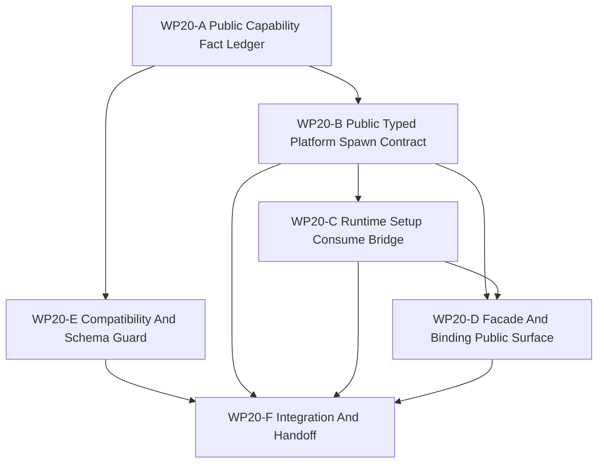

# WP20 Public Capability-Platform Composition

Status: `2026-05-21` complete / accepted.

Language:

- English canonical: `public_capability_platform_composition_wp20_20260521.md`
- Chinese companion:
  [public_capability_platform_composition_wp20_20260521.zh.md](public_capability_platform_composition_wp20_20260521.zh.md)

Inputs:

- [WP14 capability composition](../wp14_capability_composition/capability_composition_wp14_20260521.md)
- [WP14 acceptance review](../../review/wp14_capability_composition_acceptance_review_20260521.md)
- [WP17 capability spawn runtime promotion](../wp17_stage3_runtime_materialization_cleanup/wp17_capability_spawn_runtime_cluster_20260521.md)
- [WP18 runtime ownership and C++ hot-path consolidation](../wp18_runtime_ownership_cxx_hot_path_consolidation/runtime_ownership_cxx_hot_path_consolidation_wp18_20260521.md)
- [WP19 CUDA and resident-state alignment](../wp19_cuda_resident_state_alignment/cuda_resident_state_alignment_wp19_20260521.md)
- [Simulation system architecture design](../../../plan/architecture/simulation_system_architecture_design.md)
- [Subagent Usage Policy](../../../standards/governance/subagent_usage_policy.md)
- [WP Closure Lane Policy](../../../standards/governance/wp_closure_lane_policy.md)

Naming and commit-message note:

- `WP20` is the task-index label for public capability-platform composition.
- Implementation commits should use result language such as
  `Promote typed platform spawn admission` or
  `Consume typed platform setup requests through validated plans`, not internal
  work-package labels.

## 1. Purpose

WP14 created the platform capability vocabulary and additive typed setup DTOs.
WP17 moved the internal `DefaultUnitFactory::spawn()` path through
`ResolvedPlatformSpawnPlan` evidence while preserving type-name compatibility.
WP20 publicizes that path as a maintained, validated setup entry without
forcing a scenario-schema migration or removing `spawn_unit(type_name)`.

Target chain:

```text
typed platform spawn request
  -> validated CapabilityBundle and ResolvedPlatformSpawnPlan
  -> compatibility-preserving type_name materialization bridge
  -> facade/world-batch setup result evidence
  -> public contract and binding guards
```

WP20 is an implementation stage. Planning documents alone do not pass a gate.

## 2. Scope Boundary

WP20 can:

1. Freeze the current code facts for platform capability contracts, additive
   typed setup DTOs, internal resolved spawn plans, and public gaps.
2. Add a public admission/result contract for typed platform spawn requests,
   including request ids, entity ids, admission state, rejection reasons, and
   evidence refs.
3. Consume `BatchWorldSetupRequest.typed_platform_spawn_requests` only after
   validation and only through the compatibility-preserving resolved-plan
   bridge.
4. Expose the public setup/admission surface through facade and Python bindings.
5. Replace WP14's "not auto-materialized" guard with WP20 guards that require
   validation, preserved type-name compatibility, and platform/backend naming
   separation.
6. Preserve `spawn_unit(type_name)`, `WorldSpawnRequest.type_name`, existing
   scenario setup, and existing world-batch setup behavior.

WP20 cannot:

1. Remove or deprecate type-name spawning.
2. Force scenario JSON, examples, or Python callers to migrate to typed
   platform spawn requests.
3. Materialize arbitrary capability bundles without a preserved compatibility
   `source_type_name` and admitted resolved plan.
4. Reuse backend `RuntimeCapabilities` for platform composition semantics.
5. Add new tactical behavior, weapon/sensor realism, platform families, or
   backend/fidelity claims.
6. Open full counterfactual / experiment runtime; that remains WP21.

## 3. Current Code Facts To Verify

| Area | Current fact | WP20 implication |
|------|--------------|------------------|
| Platform capability contracts | `src/runtime/contracts/platform_capability_contracts.h` defines `Capability`, `CapabilityBundle`, `ResolvedPlatformSpawnPlan`, validation helpers, family vocabulary, and type-name/typed request kinds. | WP20 should reuse this vocabulary, not create a parallel platform capability schema. |
| Typed setup DTO | `src/runtime/contracts/world_batch_contracts.h` defines `TypedPlatformSpawnRequest`, validation helpers, and `BatchWorldSetupRequest.typed_platform_spawn_requests`. | The missing public step is admitted consumption and result evidence, not another additive DTO-only slice. |
| Internal spawn path | `DefaultUnitFactory::spawn()` resolves `type_name` to a resolved spawn plan before materialization. | WP20 can publicize typed requests by preserving the compatibility type-name bridge. |
| Runtime/facade gap | `RuntimeFacade::apply_world_setup()` normalizes typed request world indices, but current setup execution still materializes only `WorldSpawnRequest` entries. | WP20 must choose an explicit consume path and result ordering instead of silently ignoring typed requests. |
| WP14 guard state | WP14 guards intentionally forbid typed request auto-materialization. | WP20 must replace those guards with validation-first publicization guards. |
| Backend/fidelity boundary | `RuntimeCapabilities` remains backend/fidelity projection. | Platform composition must stay in platform/setup contracts. |

## 4. Work Packages

| Work package | Status | Main concern | Goal | Output |
|--------------|--------|--------------|------|--------|
| `WP20-A Public Capability Fact Ledger` | pass | source facts and entry gate | Freeze exact code/test facts for public capability-platform composition and identify the minimal safe publicization seam. | [fact ledger](wp20_public_capability_fact_ledger_cluster_20260521.md) |
| `WP20-B Public Typed Platform Spawn Contract` | focused pass | request/admission/result DTOs | Define and implement the public admission/result contract for typed platform spawn requests without making them mandatory. | [public spawn contract](wp20_public_typed_platform_spawn_contract_cluster_20260521.md) |
| `WP20-C Runtime Setup Consume Bridge` | accepted / focused pass | runtime materialization bridge | Consume validated typed requests through the existing compatibility-preserving resolved-plan bridge and return stable result evidence. | [runtime setup consume bridge](wp20_runtime_setup_consume_bridge_cluster_20260521.md) |
| `WP20-D Facade And Binding Public Surface` | accepted / focused pass | public API exposure | Expose the admitted typed setup path through facade and Python bindings while keeping legacy setup surfaces intact. | [facade and binding surface](wp20_facade_binding_public_surface_cluster_20260521.md) |
| `WP20-E Compatibility And Schema Guard` | pass | anti-regression guard | Replace WP14 "not materialized" guards with WP20 validation-first guards and block schema migration, backend naming drift, and behavior changes. | [compatibility/schema guard](wp20_compatibility_schema_guard_cluster_20260521.md) |
| `WP20-F Integration And Handoff` | complete / accepted | closure lane | Integrate worker results, run validation, record residuals, sync indexes, and prepare acceptance only after implementation evidence exists. | [integration handoff](wp20_integration_handoff_cluster_20260521.md) |

## 5. Dependency Map



Parallel rule:

- `WP20-A`, `WP20-B`, and `WP20-E` may run as first-wave streams if their write
  scopes stay disjoint.
- `WP20-C` has returned and passed focused validation after the B contract.
- `WP20-D` has returned and passed focused validation.
- `WP20-F` has closed as the serial closure lane.

## 6. Dispatch Plan

| Stream | Write-scope rule | Suggested model / reasoning |
|--------|------------------|-----------------------------|
| `WP20-A` | Own the fact-ledger doc and read-only source/test inventory. Do not edit runtime behavior. | Light but precision-sensitive: `gpt-5.4-mini`, xhigh. |
| `WP20-B` | Own public contract DTO/result shape and focused contract tests in runtime/facade types. Do not edit runtime materialization. | Complex public contract seam: `gpt-5.4`, xhigh. |
| `WP20-C` | Own runtime consume bridge in `WorldBatchRuntime` / `RuntimeFacade` setup execution after B. Do not edit bindings. | Complex compatibility bridge: `gpt-5.4`, xhigh. |
| `WP20-D` | Own Python/facade binding exposure and binding tests after B/C. Do not change materialization semantics. | Medium-complex public surface: `gpt-5.4`, high. |
| `WP20-E` | Own architecture/schema/compatibility guards. Do not edit runtime behavior. | Medium-complex guard task: `gpt-5.4`, high. |
| `WP20-F` | Own validation rollup, residual register, README/review sync, bilingual closure, and acceptance review. | Light closure: `gpt-5.4-mini`, xhigh. |

Worker rule:

- Workers are not alone in the codebase; they must not revert unrelated edits or
  edits made by other workers.
- Each worker must return touched files, commands run, blockers, residuals, and
  integration notes.
- A stream may stop at `preflight-only` if safe publicization is not yet
  justified by current code evidence.

## 7. Gate Rules

| Gate | Required evidence | Fail condition |
|------|-------------------|----------------|
| `WP20-A` | Source/test ledger for platform capability contracts, typed setup DTOs, internal resolution, public gaps, and WP14/WP17/WP18/WP19 residuals. | Work proceeds from stale assumptions or reopens WP14 vocabulary. |
| `WP20-B` | Additive public admission/result contract with fail-closed rejection reasons and stable result ordering. | Typed requests become mandatory or lack request/result evidence. |
| `WP20-C` | Runtime setup consumes only validated/admitted typed requests through preserved `source_type_name` compatibility materialization. | Arbitrary capability bundles materialize without type-name compatibility or validation. |
| `WP20-D` | Facade/binding tests prove public visibility and fail-closed behavior while preserving legacy setup calls. | Public API silently ignores typed requests or bypasses validation. |
| `WP20-E` | Guards prevent scenario-schema migration, backend `RuntimeCapabilities` mixing, behavior changes, and removal of type-name compatibility. | WP20 changes tactical behavior or forces callers to migrate. |
| `WP20-F` | Validation rollup, residual map, README/index sync, bilingual docs, and acceptance review only after implementation evidence exists. | Acceptance is created from planned docs alone. |

## 8. Suggested Validation

```bash
git diff --check
bash tools/maintenance/cmo_env.sh python -m pytest -q tests/architecture/test_wp14_*.py
bash tools/maintenance/cmo_env.sh python -m pytest -q tests/world_batch/test_world_batch_runtime.py -k "spawn or world_setup"
bash tools/maintenance/cmo_env.sh python -m pytest -q tests/runtime/facade/test_runtime_facade.py -k "world_setup or capability or spawn"
bash tools/maintenance/cmo_env.sh python -m pytest -q tests/runtime/bindings/test_bindings_runtime_dto_surface.py tests/runtime/bindings/test_typed_platform_spawn_bindings.py
```

Implementation waves should add focused `test_wp20_*` coverage for the touched
runtime, facade/binding, or architecture guard files.

## 9. Non-Goals

- Big-bang spawn rewrite.
- Removing type-name compatibility.
- Mandatory public `spawn_platform` schema migration.
- Backend/fidelity capability promotion.
- New tactical behavior, new platform families, or new sensor/weapon realism.
- Full counterfactual / experiment runtime.
