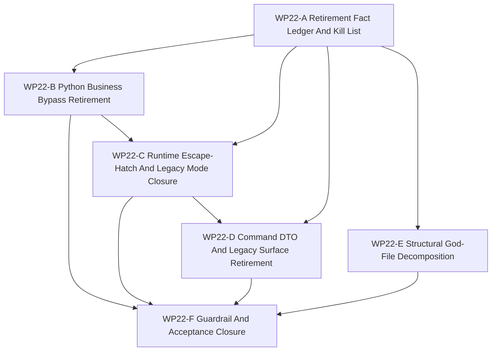

# WP22 Legacy Compatibility Retirement And Architecture Hardening

Status: frozen / owner-rejected on `2026-05-23`; superseded by
[`WP23 Legacy Retirement Recovery And Reset`](../wp23_legacy_retirement_recovery/legacy_retirement_recovery_wp23_20260523.md).
This document is historical provenance only. Its queues, "next dispatch"
sections, partial packets, and quarantine evidence must not be used to launch
new work unless rewritten into a WP23 cluster and accepted by the WP23
delete-or-block gate.

Historical pre-freeze status: `2026-05-22` WP21 owner-rejected; WP22 remediation active. The latest
implementation waves were locally accepted for their scoped packets:
production `loader.sim` usage is now cleared, `RTE-007` setup/type/schema
ownership passed focused terrain/setup validation, `A-001` maintained typed
setup promotion landed, runtime legacy-mode and batch-runtime compatibility are
explicit opt-in quarantine surfaces, and weapon-release ordering uses named
helper systems. The latest implementation round also quarantined direct GPU
visual-binding raw-world access behind a named `WorldBatchRuntime` helper and
extracted default-factory legacy seed ownership into
`default_factory_legacy_spawn_compat.h`. The latest guard-and-quarantine round
also marked aggregate DTOs as compatibility transport shells, split
`bindings_core.cpp` registration into maintained/diagnostics/legacy helper
surfaces, and hardened the repo-level `batch_runtime` consumer guard.
	`WP22 overall complete? no`: compatibility escape hatches,
	default-factory typed control-state replacement, aggregate DTO retirement,
	fat world-batch services, broad public bindings, and remaining structural debt
	still block `WP22-F`. The newest implementation round reduced two structural
	surfaces and exposed one command blocker: maintained `bindings_core.cpp`
	entity reads now route through kernel-owned query methods, visual-binding scene
	assembly is extracted from `WorldBatchRuntime`, and default-factory spawn seeding
	now derives remaining compatibility seeds from `MissionCommandCore` and seeds
	`MissionCommandControlState`, but still depends on `MovementCommand` /
	`LaggedCommand` compatibility mirrors. Meitner returned a partial typed-control
	implementation; the main thread repaired its `CommandLag` target overwrite risk
	and validated focused guards/build. Descartes then confirmed command ingress and
	command-link delivery still bypassed typed-state ownership; Averroes and Parfit
	closed that ingress/link sync gap and hardened the guards in the tenth wave.
	Copernicus, Gauss, and Dalton then clarified the next command-control state:
	Gauss narrowed default-factory seed ownership around `MissionCommandControlState`,
	Dalton provided only a partial consumer migration, and Copernicus confirmed
	`WP22-F` remains ineligible.
	This is still not closure because legacy transport shells, debug surfaces,
	downstream mirror consumers, default-factory compatibility projection, DTO
	shells, runtime escape hatches, and structural debt remain open.

Language:

- English canonical: `legacy_compatibility_retirement_wp22_20260522.md`
- Chinese companion:
  [legacy_compatibility_retirement_wp22_20260522.zh.md](legacy_compatibility_retirement_wp22_20260522.zh.md)

Inputs:

- [Architecture refactoring audit](../../../review/architecture_refactoring_audit_20260522.md)
- [WP21 full counterfactual experiment runtime](../wp21_full_counterfactual_experiment_runtime/full_counterfactual_experiment_runtime_wp21_20260521.md)
- [Disputed WP21 acceptance record](../../../review/archive/wp-acceptance/wp21_full_counterfactual_experiment_runtime_acceptance_review_20260522.md)
- [WP16 runtime spine consolidation](../wp16_runtime_spine_consolidation/runtime_spine_consolidation_wp16_20260521.md)
- [WP18 runtime ownership and C++ hot-path consolidation](../wp18_runtime_ownership_cxx_hot_path_consolidation/runtime_ownership_cxx_hot_path_consolidation_wp18_20260521.md)
- [WP20 public capability-platform composition](../wp20_public_capability_platform_composition/public_capability_platform_composition_wp20_20260521.md)
- [Simulation system architecture design](../../../../plan/architecture/simulation_system_architecture_design.md)
- [Subagent Usage Policy](../../../../standards/governance/subagent_usage_policy.md)
- [WP Closure Lane Policy](../../../../standards/governance/wp_closure_lane_policy.md)

Naming and commit-message note:

- `WP22` is the task-index label for the forced legacy-retirement phase.
- Implementation commits should use result language such as
  `Route tasking writes through facade bridge` or
  `Gate legacy runtime mode behind explicit opt-in`, not internal work-package
  labels.

## 1. Purpose

WP21 claimed a bounded counterfactual / experiment runtime path, but the owner
rejected WP21 closure on `2026-05-22`. The rejection and the post-WP21 audit
show that too many compatibility layers and old implementation surfaces remain
first-class. WP22 is therefore a remediation phase, not a routine follow-on:
compatibility residuals are no longer sufficient evidence of architecture
completion.

WP22 exists to force retirement of legacy compatibility surfaces that still
serve as default production paths, maintained business paths, or unguarded raw
runtime access. A remaining legacy path must be migrated, deleted, or
quarantined behind an explicit opt-in and a guard that prevents new maintained
callers.

Target posture:

```text
verified legacy/compatibility kill list
  -> replacement facade / typed DTO / explicit bridge
  -> caller migration
  -> opt-in quarantine or deletion
  -> architecture guard
  -> closure only if no unowned default legacy path remains
```

This is an implementation stage. Planning documents alone do not pass a gate.

## 2. Audit Triage Baseline

The audit is directionally valid but must be corrected before implementation
workers use it as a source of truth.

| Area | Verified state | WP22 implication |
|------|----------------|------------------|
| God files | `counterfactual_replay_contracts.h`, `runtime_facade.cpp`, `runtime_window_coordinator.h`, and `default_unit_factory.h` line counts match the audit. | Treat these as structural debt requiring staged decomposition, not as acceptable closure residue. |
| Contract headers | Current count is 11 contract headers, with 9 over 300 lines, not "7 of 9". Many mix constants, DTOs, and inline validation. | Correct the ledger before splitting contracts. |
| Python tasking bypasses | `leader_tasking.py` still reads raw truth, writes `loader.sim.*`, and hardcodes the air profile. | First implementation wave should remove these maintained-business bypasses. |
| Mission command shape | `loader.mission_cmd` remains raw-dict based in loader/runtime-state paths. | Introduce a typed DTO/adapter and migrate consumers progressively within WP22 gates. |
| Runtime escape hatches | `RuntimeFacade.runtime()` and related `batch_runtime` views remain; some main batch calls now prefer facade, so "default path" is overstated. | Do not accept escape hatches as default maintained surfaces; quarantine and guard them. |
| Legacy runtime mode | `legacy` remains a valid first-class runtime mode; terrain source/binding defaults now verify `flat`, but setup/type/schema closure is still required. | Gate legacy mode behind explicit opt-in and reject silent default legacy selection or setup fallback. |
| Command surface | `legacy_command.h` still has active C++ consumers; some per-system fallback was centralized by `control_input_resolution.h`. | Finish the central bridge and retire maintained legacy fallbacks. |
| ECS / DTO shape | Flat aggregate shells and implicit ECS ordering remain true structural issues. | Retire default flat-shell assumptions through typed/domain gates and explicit ordering guards. |
| Python profile layer | Profile duplication, adapter triplication, air-specific common logic, and runtime `ef_py` injection remain partially true. | Collapse profile dispatch through bridge-owned helpers and remove air/default coupling. |

## 2.1 Subagent Closure Correction

WP22 inherits a stricter closure rule from the rejected WP21 finish:

- A subagent task is not closed merely because the thread was closed.
- A timeout is a blocker unless a complete return packet exists.
- A partial source pass must be recorded as partial and cannot unlock
  acceptance.
- Integration must name every missing return packet before continuing a
  downstream gate.

Current WP22-A evidence is partial: Lagrange, Laplace, and Raman returned usable
runtime/C++/structural findings; the Python source-pass worker timed out and
was closed without a complete return packet. That gap no longer blocks
`WP22-B` maintained-business retirement, which is now pass; the remaining
import-time `ef_py.TaskOrder` follow-up in `command_chain_cache` is a validation
unlock for the C/F compatibility guard lane, not a blocker.

The latest fact-verification and documentation-hardening batch returned packets:
`TaskOrder`/`ObjectiveShapingConfig` import unlock passed, the terrain build and
binding blocker passed, the bounded `RTE-003` runtime seam slice returned
partial, and documentation required this correction. This is progress evidence,
not closure evidence.

## 3. Scope Boundary

WP22 can:

1. Produce a source-backed kill list for every legacy/compatibility surface
   that still acts as a default or maintained business path.
2. Replace production `loader.sim.*`, raw-truth, and hardcoded-profile access
   in tasking code with facade or bridge-owned surfaces.
3. Introduce typed mission-command adapters and migrate raw-dict consumers
   where they affect maintained runtime/tasking behavior.
4. Quarantine `RuntimeFacade.runtime()`, `batch_runtime`, `loader.sim`, and
   `legacy` runtime mode behind explicit opt-in paths and architecture guards.
5. Finish command-input centralization so maintained systems do not implement
   independent legacy fallback behavior.
6. Split or pre-split the largest old implementation files where the split can
   be validated without behavior change.
7. Add tests that fail on new default legacy access, direct raw runtime writes,
   silent legacy runtime mode, and unowned compatibility residuals.

WP22 cannot:

1. Mark a legacy path "accepted" merely because it is compatibility-preserving.
2. Leave a default maintained caller on a legacy path without an owner,
   replacement, explicit opt-in, and removal gate.
3. Hide a blocker by renaming it as a residual.
4. Break public scenarios or tests silently; callers must be migrated or
   deliberately quarantined with evidence.
5. Reopen exact GPU, resident-state, experiment truth-claim, or unsupported
   backend promotion scope.
6. Claim closure from documentation-only work.

## 4. Work Packages

| Work package | Status | Main concern | Goal | Output |
|--------------|--------|--------------|------|--------|
| `WP22-A Retirement Fact Ledger And Kill List` | source-backed | source facts and no-excuse scope | Verify audit claims, classify every old path as `delete`, `migrate`, `quarantine`, or `blocker`, and assign owner/gate. | [fact ledger and kill list](wp22_retirement_fact_ledger_cluster_20260522.md) |
| `WP22-B Python Business Bypass Retirement` | pass / validation unlock pass | tasking and profile callers | Remove maintained Python tasking/profile bypasses: hardcoded air dispatch, `loader.sim.*` writes, raw truth reads, profile triplication, and raw mission-cmd consumers; the remaining import-time `TaskOrder` unlock is a validation-only C/F follow-up. | [Python business bypass retirement](wp22_python_business_bypass_retirement_cluster_20260522.md) |
| `WP22-C Runtime Escape-Hatch And Legacy Mode Closure` | partial / public escape-hatch quarantine remains | runtime facade boundary | Make raw runtime/batch access and `legacy` runtime mode opt-in compatibility only, with maintained callers routed through facade-owned methods. Direct GPU binding raw-world drilling and repo-level `batch_runtime` consumer drift are now guard-covered, but public escape hatches remain live. | [runtime escape-hatch closure](wp22_runtime_escape_hatch_closure_cluster_20260522.md) |
| `WP22-D Command DTO And Legacy Surface Retirement` | scoped passes / transport shells guarded | C++ command/DTO/spawn legacy | Finish retiring maintained legacy command fallbacks, raw DTO shells, and type-name compatibility as first-class implementation surfaces. Default-factory seed is helper-owned but still awaits typed control-state replacement; aggregate DTOs are guarded as compatibility transport shells, not retired. | [command DTO legacy retirement](wp22_command_dto_legacy_surface_retirement_cluster_20260522.md) |
| `WP22-E Structural God-File Decomposition` | partial / binding quarantine accepted | old implementation mass | Split the largest legacy implementation files behind behavior-preserving seams and move validation out of monolithic headers. GPU binding raw-world, default-factory helper extraction, and `bindings_core.cpp` maintained/diagnostics/legacy registration split are scoped passes; broad service/factory structure remains open. | [structural decomposition](wp22_structural_god_file_decomposition_cluster_20260522.md) |
| `WP22-F Guardrail And Acceptance Closure` | not eligible | closure gate | Integrate B-E, install hard guards, run validation drift cleanup, sync indexes and documentation, and prepare acceptance only if no unowned default legacy path remains. | [guardrail and closure](wp22_guard_acceptance_closure_cluster_20260522.md) |

## 5. Dependency Map



Parallel rule:

- `WP22-A` starts first and is the only source of the kill-list vocabulary.
- `WP22-B` has completed the maintained-business retirement lane; the
  remaining import-time `TaskOrder` validation is a C/F compatibility-guard
  follow-up, while C owns runtime facade/batch/environment files.
- `WP22-D` waits for A and should account for C's facade boundary decisions.
- `WP22-E` may start after A as behavior-preserving extraction, but must not
  edit the same runtime facade lines as C in parallel.
- `WP22-F` is serial closure and has authority to fail the WP if any default
  legacy path remains unowned.

## 6. Dispatch Plan

| Stream | Write-scope rule | Suggested model / reasoning |
|--------|------------------|-----------------------------|
| `WP22-A` | Own source-backed kill-list docs and guard inventory. Read-only code inventory unless a broken planning link blocks progress. | Light but precision-sensitive: `gpt-5.4-mini`, xhigh. |
| `WP22-B` | Own Python tasking/profile/mission-command migration files and focused tests. Do not edit runtime facade C++ internals. | Medium cross-file business migration: `gpt-5.4`, high. |
| `WP22-C` | Own runtime facade/batch escape-hatch gating, legacy-mode opt-in, and facade tests. Do not edit tasking profile logic except call-site adaptation. | Complex runtime boundary: `gpt-5.4`, xhigh. |
| `WP22-D` | Own C++ command resolution, DTO compatibility gates, typed spawn first-class transition tests. Coordinate with C before changing public runtime setup behavior. | Complex architecture seam: `gpt-5.4`, xhigh. |
| `WP22-E` | Own structural extraction of contracts/facade/window/factory files, with behavior-preserving tests and no business semantic changes. | Complex refactor: `gpt-5.4`, xhigh. |
| `WP22-F` | Own architecture guards, validation rollup, residual rejection, README/review sync, bilingual closure, and acceptance draft. | Light closure but strict gatekeeping: `gpt-5.4-mini`, xhigh. |

Worker rule:

- Use the project [Subagent Usage Policy](../../../../standards/governance/subagent_usage_policy.md).
- Workers are not alone in the codebase; they must not revert unrelated edits
  or edits from other workers.
- Every worker must return touched files, commands run, remaining legacy paths,
  blockers, and integration notes.
- A worker may stop at `blocked`, but the blocker must name the replacement,
  owner, and failing guard. "Compatibility residual" is not a pass state.

## 6.1 First-Wave Implementation Snapshot

| Stream | Local result | Evidence and notes |
|--------|--------------|--------------------|
| `WP22-B` | `pass` | `leader_tasking` maintained path has cleared the maintained-business retirement lane; the remaining import-time `ef_py.TaskOrder` unlock in `command_chain_cache` is validation-only, and the raw sim seam now belongs to C/F compatibility guard ownership. Focused tests: `34` passed, `24` deselected. |
| `WP22-C` | `partial` | Runtime opt-in/quarantine tests pass; import-time binding blockers are cleared; maintained reward/info routes through named loader-backed seams; terrain source verifies `flat`; direct GPU binding raw-world access now routes through a named `WorldBatchRuntime` compatibility helper. Public `RuntimeFacade::runtime()` / `WorldBatchRuntime::world()` escape hatches remain quarantined. |
| `WP22-D` | `scoped passes / open` | Air-control bridge and A-001 maintained typed setup have landed. Default factory no longer direct-includes `legacy_command.h`; seed ownership is isolated in `default_factory_legacy_spawn_compat.h`. Typed control-state replacement and aggregate DTO/domain shell retirement remain open. |
| `WP22-E` | `partial` | Constants/helper split, entry-header splits, validation-family split, helper-system ordering, GPU binding raw-world quarantine, and default-factory helper extraction landed, but broad bindings, runtime-facade/factory structural debt, and fat world-batch services remain. Structural guard evidence remains scoped, not closure. |
| `WP22-F` | `not eligible` | Not eligible for closure; it can only consume a locked-down B-E evidence set. |

## 6.2 Second-Wave Implementation Snapshot

| Stream | Local result | Evidence and notes |
|--------|--------------|--------------------|
| `WP22-B` | `pass` | Policy-read seam landed, `common_core_profile` and `loading.py` are now compatibility-only guard surfaces, the raw sim seam has moved to C/F compatibility guard ownership, and the remaining import-time `ef_py.TaskOrder` unlock in `command_chain_cache` is validation-only. WP22-specific tests pass. |
| `WP22-D` | `pass` | Legacy command consumers have been migrated or quarantined behind the bridge; the direct-include allowlist is now limited to the specific bridge/default-factory seams. |
| `Validation sweep` | `pass` | WP22-specific tests pass, and the aggregate sweep now passes after WP16/WP20 drift cleanup. Current focused validation also covers TaskOrder/objective-shaping import unlock, terrain binding rebuild, and the bounded runtime seam slice. |

Documentation sync now runs as the fourth round because drift cleanup stabilized the validation sweep and the remaining follow-up is now a validation lane.

## 6.3 Local Validation Summary

| Command | Outcome |
|---------|---------|
| `tests/architecture/command_tasking/test_tasking_bridge_retirement.py ...` | focused combined `34` passed, `24` deselected |
| `tests/architecture -k "tasking or facade or legacy"` | `59` passed, `147` deselected |
| `tests/architecture/structural_boundaries/test_structural_guardrails.py tests/architecture/compatibility_quarantine/test_guard_enforcement.py` | `16` passed |
| `git diff --check` | pass |
| `python3 tools/maintenance/wp_doc_closure_audit.py --wp WP22` | completed; task docs `16`, acceptance reviews `0`; `missing-acceptance-review` warning remains open. |

## 6.4 Third-Wave Dispatch

| Stream | Write-scope rule | Suggested model / reasoning |
|--------|------------------|-----------------------------|
| `TaskOrder import unlock` | Complete; keep the lazy binding/import-order guard as validation evidence under C/F guard ownership. | `gpt-5.4-mini`, high. |
| `RTE-003/RTE-007 next slice` | Complete for production raw-loader cleanup and setup/type/schema ownership. Continue only as guard follow-up; public `L-002` raw facade/world access remains quarantined while direct GPU binding raw-world access is scoped-pass closed. | `gpt-5.4`, xhigh. |
| `WP22-E/D residual gates` | Tighten the remaining residual gates across structural decomposition and command DTO retirement without converting open work into completion evidence. | `gpt-5.4-mini`, xhigh. |
| `Documentation fourth sync` | Re-align the ledger, queue, and companion docs to the current pass/block state after the next slice lands. | `gpt-5.4-mini`, xhigh. |

## 6.5 Current Round Packet

| Stream | Status | Packet | Evidence |
|--------|--------|--------|---------|
| `Schrodinger` | `pass` | complete packet | `command_chain_cache.py` now lazily parses `MissionCommand` / `TaskOrder` / `LeaderIntent` / `PilotReport` fields; `reward_metadata.py`, `service.py`, and the loader reward path now use conditional/lazy `ObjectiveShapingConfig`; focused combined tests reported `13 passed, 57/58 deselected`, and diagnostics reported `4 passed`. |
| `Zeno` | `pass` | complete packet | Restored the datalink command cleanup variable, rebuilt `ef_py`, and verified terrain/setup focused tests. The former `data_link_system.h:284` build blocker is closed. |
| `Tesla` | `partial` | complete packet | The maintained runtime reward/info slice now routes through named loader-backed seams, and focused runtime tests pass. Repo-level raw loader seams remain outside the bounded slice. |
| `Arendt` | `pass` | complete packet | The documentation sync packet was complete, but it predated Zeno's build fix and is accepted only after this factual correction. |

Closed thread is transport only, not completion evidence. `WP22 overall complete? no`.

## 6.6 Current Implementation Wave Acceptance

| Worker | Scoped result | Local verification | Remaining blocker |
|--------|---------------|--------------------|-------------------|
| `Locke` | `pass` for the earlier `RTE-003` raw-loader seam slice. Maintained tasking, command-chain, time-step, naval-screen, and scripted-opponent paths now route through named compatibility seams. | Historical packet: `git diff --check`; raw-loader scan then reported `gym_envs/scenario_loader/runtime_state.py:329` and `gym_envs/scenario_loader/loading.py:348`; runtime facade guard `8 passed`; tasking/naval/execution focused suite `34 passed`. Russell later closed those final production anchors. | Superseded by Russell for raw-loader cleanup; broader runtime escape hatches remain separate. |
| `Hubble` | `pass` for `RTE-007` setup/type/schema ownership. Missing terrain defaults resolve to `flat` with `default_mainline`; explicit legacy terrain is named compatibility. | `cmake --build build-workshop --target ef_py -j4`; facade terrain/setup `5 passed`; world-batch terrain/setup `5 passed`; scenario compiler terrain/layout `7 passed`; world setup compat `5 passed`. | Historical explicit `legacy` fixture consumers remain compatibility consumers; A-001 was closed later by the main-thread follow-up. |
| `Carver` | `pass` for the counterfactual contract entry-header split. `counterfactual_replay_contracts.h` is now an umbrella header below the `1500` threshold. | Structural/WP9 guards `16 passed`; build passed. | Later validation-family work split the former follow-up chunk; keep this as provenance. |
| `Noether` | `pass` for the runtime-window entry-header split. `runtime_window_coordinator.h` is now below the `1000` threshold and delegates to named helper headers. | Structural/WP9 guards `16 passed`; build passed. | Broader structural blockers remain: `runtime_facade.cpp`, `default_unit_factory.h`, broad bindings, and fat world-batch services. |

These packets are accepted only for their scoped slices. They do not authorize
`WP22-F` or an acceptance review.

## 6.7 Follow-Up Implementation Wave Acceptance

| Worker | Scoped result | Local verification | Remaining blocker |
|--------|---------------|--------------------|-------------------|
| `Russell` | `pass` for final production raw-loader cleanup. Production `loader.sim.*` / `loader.sim,` scan is now empty. | `git diff --check`; raw-loader scan no matches; runtime facade guard `8 passed`; WP22 tasking bridge guard `7 passed`; focused mission/execution tests `4 + 2 + 1` passed. | Only explicit test/guard strings remain; broader runtime escape hatches are tracked separately. |
| `Bernoulli` | `pass` for the requested Python runtime quarantine slice. Silent env/default legacy selection is removed; `legacy` mode, `batch_runtime`, raw runtime fallback, and fallback cadence are explicit compatibility opt-ins. | `git diff --check`; env config `6 passed`; vec-env runtime/batch tests `3 passed`; single-runtime fallback tests `8 passed`; runtime facade architecture tests `4 passed`. | Later Hooke follow-up removed maintained facade raw drilling; public raw access remains compatibility/diagnostics only. |
| `Parfit` | `pass` for the `PilotWeaponRelease` ordering residual slice. The system now registers through `register_pilot_weapon_release_system(ecs, *this)`. | `git diff --check`; structural/WP9 guards `16 passed`; `ef_py` build passed; focused engagement/facade tests passed. | Naval post-step fire loop, `default_unit_factory.h` legacy command seeding, and typed setup compatibility path remain open. |
| `Raman` | `done` for queue sync only. The queue records scoped passes and keeps `WP22-F` pending next implementation evidence. | `git diff --check`; WP22 doc closure audit advisory summary reports `0` canonical acceptance reviews and `8/8` zh peers. | No acceptance review exists; review/index sync remains deferred. |

These packets still do not authorize `WP22-F`. They narrow WP22 to the
remaining C++/structural retirement lanes.

## 6.8 Sixth-Wave Implementation Acceptance

| Worker | Scoped result | Local verification | Remaining blocker |
|--------|---------------|--------------------|-------------------|
| `Pascal` | `pass` for direct GPU visual binding raw-world quarantine. `bindings_gpu.cpp` no longer directly calls `runtime.world(...)`; visual scene collection now routes through `WorldBatchRuntime::collect_visual_binding_compatibility_scenes_batch(...)`. | `ef_py` build passed; GPU visual-binding architecture guard `2 passed`; focused GPU runtime binding test `1 passed`. | Public `WorldBatchRuntime::world()` remains a compatibility/diagnostics escape hatch, and broad world-batch service decomposition remains open. |
| `Bohr` | `pass after main-thread behavior-preservation fix` for default-factory legacy seed helper extraction. `default_unit_factory.h` no longer direct-includes `legacy_command.h`; default action and flight legacy seeds route through `default_factory_legacy_spawn_compat.h`. | `ef_py` build passed; default-factory/WP9 focused guard `9 passed, 2 deselected`. | `default_factory_legacy_spawn_compat.h` remains compatibility seed ownership until typed control-state/default initialization replaces it. |
| `Poincare` | `timeout/shutdown` for `WP22-F closure preflight`; no complete packet returned. | no accepted packet | Does not unlock `WP22-F`; closure preflight remains pending after remaining implementation blockers are resolved. |

These packets still do not authorize `WP22-F`; they only retire two scoped
implementation residuals and record one closure-preflight timeout.

## 6.9 Seventh-Wave Guard And Quarantine Acceptance

| Worker | Scoped result | Local verification | Remaining blocker |
|--------|---------------|--------------------|-------------------|
| `Pauli` | `pass` for the WP22-D DTO/domain-shell guard slice. `MissionCommand`, `TaskOrder`, `LeaderIntent`, and `PilotReport` remain present, but are now explicitly named compatibility transport shells with owner-slice projection helpers; world-batch assignment wrappers declare the same transport-only ownership. | `python -m pytest -q tests/architecture -k "wp22 and (dto or shell or command or tasking)"` -> `17 passed, 212 deselected`; `ef_py` build passed; combined WP22 guard sweep later passed. | Real aggregate DTO retirement remains open. Air/naval duplicated truth still needs downstream maintained consumers to prefer owner slices over flat shells. |
| `Ramanujan` | `pass` for the WP22-E binding-surface quarantine slice. `bindings_core.cpp` now registers SimulationKernel APIs through explicit maintained, diagnostics-introspection, legacy-compatibility, and diagnostics-override helpers; direct `self.get_world().entity(...)` drilling is absent from the maintained and override helper blocks. | `python -m pytest -q tests/architecture/structural_boundaries/test_structural_guardrails.py -k "bindings"` -> `3 passed, 7 deselected`; `ef_py` build passed; combined WP22 guard sweep later passed. | The broad Python binding surface still exposes `75` SimulationKernel methods, and maintained bindings still use a local raw-entity seam. This is quarantine, not public API reduction. |
| `Beauvoir` | `preflight-only` for WP22-C/F public escape-hatch guard hardening. Repo-level non-test Python `batch_runtime` consumers are now scanned outside the narrow compatibility/diagnostics allowlist, and docs explicitly keep `WP22-F` not eligible. | `python -m pytest -q tests/architecture/runtime_facade/test_layering.py -k "runtime_facade_runtime_consumers or escape_hatch or batch_runtime or world_batch_vec_env"` -> `16 passed, 19 deselected`; `wp_doc_closure_audit --summary` reports `0` canonical acceptance reviews. | Public `RuntimeFacade::runtime()`, `WorldBatchRuntime::world()`, `vec_env.batch_runtime`, explicit `legacy` mode, and fallback cadence remain compatibility/diagnostics surfaces. |

Local integration recheck: `python -m pytest -q tests/architecture/structural_boundaries/test_structural_guardrails.py tests/architecture/runtime_facade/test_layering.py tests/architecture/platform_spawn/test_default_factory_legacy_seed_guard.py tests/architecture/command_tasking/test_dto_domain_shell_guard.py tests/architecture/compatibility_quarantine/test_guard_enforcement.py -k "wp22 or default_factory or dto or shell or bindings or gpu_visual_binding or visual_binding_raw_world_access or runtime_facade_runtime_consumers or escape_hatch or batch_runtime or world_batch_vec_env"` -> `48 passed, 13 deselected`; `cmake --build build-workshop --target ef_py -j4` -> pass; `git diff --check` -> pass; `python3 tools/maintenance/wp_doc_closure_audit.py --wp WP22 --summary` -> advisory summary only, `0` canonical acceptance reviews.

These packets still do not authorize `WP22-F`. They convert open surfaces into
better guarded implementation seams, but they do not remove the remaining
compatibility surfaces.

## 6.10 Eighth-Wave Implementation Acceptance

| Worker | Scoped result | Local verification | Remaining blocker |
|--------|---------------|--------------------|-------------------|
| `Harvey` | `partial` for default-factory typed seed reduction. Default-factory flight-model spawn now materializes a typed `MissionCommand` shell and projects the remaining legacy command seed from `MissionCommandCore`; duplicate flight-model `ActionCommand` seeding was trimmed. | default-factory/WP9 guards `9 passed, 2 deselected`; mission/naval focused tests `5 passed`; `ef_py` build passed; `git diff --check` passed. | `default_factory_legacy_spawn_compat.h` still directly includes `legacy_command.h` and still owns spawn-time `MovementCommand` / `LaggedCommand` projection. A typed replacement for that control path is still missing. |
| `Banach` | `pass` for maintained binding raw-entity seam reduction. Maintained `SimulationKernel` bindings no longer use local `lookup_entity(...)` or direct `self.get_world().entity(...)`; entity reads now bind to kernel-owned query methods. | `python -m pytest -q tests/architecture/structural_boundaries/test_structural_guardrails.py -k "bindings"` -> `3 passed, 7 deselected`; `ef_py` build passed; `git diff --check` passed. | Diagnostics and legacy binding blocks still intentionally drill into raw ECS and remain quarantined; broad public binding count remains `75`. |
| `Planck` | `pass` for a behavior-preserving `WorldBatchRuntime` service split. Visual-binding compatibility scene assembly moved into a private `world_batch_visual_binding_compatibility` helper while the public compatibility method and error semantics stayed unchanged. | runtime facade layering guard `9 passed, 26 deselected`; `ef_py` build passed; `git diff --check` passed. | Public `WorldBatchRuntime::world()` remains a compatibility/diagnostics escape hatch, and broader world-batch service decomposition remains open. |

Local integration recheck: default-factory guards `9 passed, 2 deselected`;
mission/naval focused tests `5 passed`; combined WP22 guard sweep `45 passed,
16 deselected`; `cmake --build build-workshop --target ef_py -j4` -> pass;
`git diff --check` -> pass; `python3 tools/maintenance/wp_doc_closure_audit.py
--wp WP22 --summary` -> advisory summary only, `0` canonical acceptance reviews.

## 6.11 Ninth-Wave Implementation Acceptance

| Worker | Scoped result | Local verification | Remaining blocker |
|--------|---------------|--------------------|-------------------|
| `Maxwell` | `pass` for `WorldBatchRuntime` setup orchestration split. Added `src/core/engine/world_batch_setup_helper.h`; `WorldBatchRuntime::apply_world_setup_batch` now routes setup orchestration and terrain/wind/zone/reset seed resolution through a private helper while leaving `WorldBatchRuntime::world()` unchanged. | runtime facade layering focused guard `10 passed, 26 deselected`; world_batch setup focused tests `3 passed, 21 deselected`; `cmake --build build-workshop --target ef_py -j4` passed; `git diff --check` clean. | Public `WorldBatchRuntime::world()` remains a compatibility/diagnostics escape hatch; broader world-batch service decomposition remains open; `default-factory` typed control-state replacement remains open. |
| `Hooke typed-control inventory` | `pass` read-only inventory with `touched files: none`. It identified `MissionCommandControlState` as the smallest next typed seam and scoped the first implementation to `default_factory_legacy_spawn_compat.h`, `operation_system.h`, and `control_system.h`. | default-factory/WP9/structural architecture guards `21 passed`; mission/naval/link focused tests `18 passed`; no files edited. | Inventory is not retirement; Meitner is now dispatched to land the typed-control implementation slice. |
| `Poincare docs cleanup` | `partial` with `touched files: none`; stopped before applying docs cleanup. | No audit or diff-check in the packet; main thread retains audit responsibility. | No closure evidence. |
| `Meitner typed-control implementation` | `partial / main-thread repaired`: introduced `MissionCommandControlState` and routed operation/control/default-control toward it, but stopped before command ingress/link/default-factory validation completed. Main thread fixed `CommandLag` lagged initialization so fresh targets are not overwritten. | Main-thread recheck: architecture default-factory/WP9/structural guards `21 passed`; mission/naval/link focused tests `18 passed`; `cmake --build build-workshop --target ef_py -j4` passed; `git diff --check` clean. Descartes read-only verification confirmed ingress/link still bypass typed state. | `set_unit_command`, `set_unit_stick_command`, `CommandLinkMovement`, and default-factory compatibility projection remain blockers; Averroes/Parfit tenth-wave tasks are active. |
| `Averroes typed ingress/link sync` | `pass`: non-ship immediate `set_unit_command` and deferred `CommandLinkMovement` now update `MissionCommandControlState` first and refresh legacy mirrors afterward; stick command is explicitly quarantined as legacy-only. | Main-thread recheck: `cmake --build build-workshop --target ef_py -j4`; runtime mission/naval/link focused suite `19 passed`; `git diff --check` clean. | Legacy transport shell, debug surfaces, `ActionCommand` / `PendingActionCommand`, downstream mirror consumers, and default-factory compatibility projection remain open. |
| `Parfit typed-control guard hardening` | `pass`: command ingress and default-factory guards now prevent partial typed-state work from being mistaken for retirement. | Main-thread recheck: architecture default-factory/WP9/structural suite `21 passed`; `git diff --check` clean. | Guard hardening is not WP22-F evidence; it only preserves the current boundary while remaining seams are migrated. |
| `Copernicus / Gauss / Dalton command-control follow-up` | `mixed`: Copernicus is `partial / read-only`, Gauss is a scoped default-factory state-owner pass, and Dalton is a locally buildable `partial` consumer-migration patch. | Main-thread recheck after Gauss/Dalton integration: architecture default-factory/WP9/structural suite `21 passed`; runtime mission/naval/link suite `19 passed`; `cmake --build build-workshop --target ef_py -j4` passed; `git diff --check` clean. | Not closure: typed throttle/brake, embarked-air write-chain, debug/pending transport, operation/link mirrors, and spawn projection residuals remain open. |

These packets still do not authorize `WP22-F`. They make two implementation
surfaces narrower and close the ingress/link typed-state blocker, but they do
not retire the remaining compatibility seed path or broader legacy surfaces.

## 7. Gate Rules

| Gate | Required evidence | Fail condition |
|------|-------------------|----------------|
| `WP22-A` | Verified kill list with source links, corrected audit facts, owner, replacement path, retirement mode, and validation gate for each legacy surface. | Work proceeds from unverified audit numbers or permits open-ended residuals. |
| `WP22-B` | Maintained tasking/profile code no longer hardcodes air, writes through `loader.sim.*`, reads raw truth as policy input, or consumes mission command as an untyped raw dict. | Any production tasking path still depends on raw loader/runtime access without explicit quarantine. |
| `WP22-C` | Maintained batch/facade paths no longer require `RuntimeFacade.runtime()`, `batch_runtime`, `loader.sim`, or silent `legacy` mode; compatibility access is opt-in and guard-tested. | Escape hatches remain default or architecture tests allow new maintained raw runtime callers. |
| `WP22-D` | Maintained command and setup paths resolve through centralized typed/bridge-owned contracts; legacy command/type-name surfaces are quarantined or deleted where safe. | Independent per-system legacy fallback or first-class type-name setup remains the maintained path. |
| `WP22-E` | At least the first structural splits land with behavior-preserving validation, and the remaining god-file debt has owner/gate rather than residual status. | Structural debt is left as documentation-only or split work changes behavior without tests. |
| `WP22-F` | Guards fail on new legacy default access, validation passes, indexes are synced, and acceptance names no unowned default compatibility layer. | Acceptance is created with any unowned old implementation still first-class. |

## 8. Suggested Validation

```bash
git diff --check
python3 tools/maintenance/wp_doc_closure_audit.py --wp WP22 --summary
python -m pytest -q tests/architecture -k "facade or runtime or legacy or tasking"
python -m pytest -q tests/runtime/facade -k "runtime or batch or world_setup"
python -m pytest -q tests/world_batch -k "compatibility or legacy or facade"
python -m pytest -q tests/scenario -k "mission or loader or generation"
```

Workers must add focused tests for the exact retirement surface they touch
before broad smoke is treated as evidence.

## 9. Final Done Definition

WP22 is complete only when:

- every audit-backed compatibility/legacy surface has a verified owner,
  replacement, and guard;
- maintained business code no longer uses raw runtime or loader bypasses;
- legacy runtime mode and escape hatches are opt-in compatibility only;
- typed or bridge-owned DTOs replace raw mission command and command fallback
  surfaces for maintained paths;
- large old implementation files have at least their first behavior-preserving
  splits landed and remaining split work is guarded, not ignored;
- final acceptance contains no unowned default legacy path.
